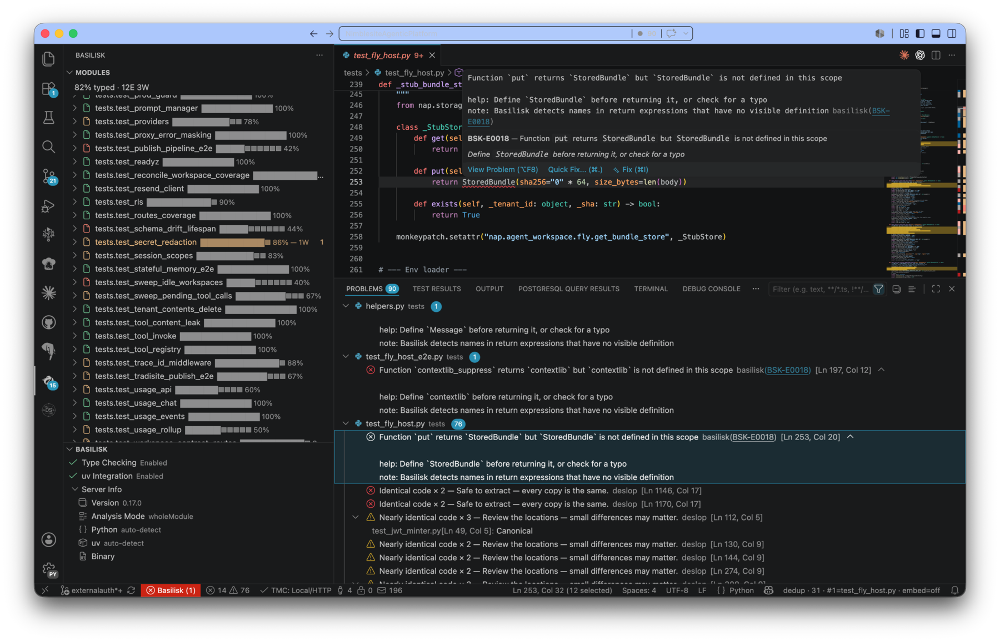

<p align="center">
  
</p>

<h1 align="center">Basilisk</h1>

<p align="center"><strong>English</strong> · <a href="README.zh.md">简体中文</a></p>

<p align="center">
  <strong>The open-source Python language server.</strong><br>
  The only Python type checker with a perfect 100% score on the official <a href="https://github.com/python/typing/blob/main/conformance/results/results.html"><code>python/typing</code> conformance results</a>.<br>
  Complete language server, type checker, debugger, and profiler — strict by default.<br>
  VS Code, Cursor &amp; Windsurf (Open VSX) &bull; Zed &bull; Neovim. Built in <strong>Rust</strong> — single binary, no runtime.
</p>

<p align="center">
  <a href="https://www.basilisk-python.dev">Website</a> &nbsp;&bull;&nbsp;
  <a href="https://www.basilisk-python.dev/docs/installation/">Install</a> &nbsp;&bull;&nbsp;
  <a href="https://www.basilisk-python.dev/docs/quick-start/">Quick Start</a> &nbsp;&bull;&nbsp;
  <a href="https://www.basilisk-python.dev/docs/rules/">Rules</a> &nbsp;&bull;&nbsp;
  <a href="https://www.basilisk-python.dev/docs/refactoring/">Refactoring</a> &nbsp;&bull;&nbsp;
  <a href="https://www.basilisk-python.dev/docs/comparison/">Compare</a>
</p>

<p align="center">
  <a href="https://www.basilisk-python.dev/docs/conformance/"><strong><!--g:score-->100.0%<!--/g:score--> PEP conformance</strong></a> &mdash; <!--g:pass-->141<!--/g:pass--> of <!--g:total-->141<!--/g:total--> tests in the official
  <a href="https://github.com/python/typing/tree/f05162592e5688026cad9f2995050d87485f70db/conformance"><code>python/typing</code></a>
  conformance suite (commit <code><!--g:short-->f051625<!--/g:short--></code>), scored on the wheel-installed CLI in its default config by the real upstream harness.
  We target <code>python/typing@main</code> and ratchet the score up only.
</p>

---

<p align="center">
  
</p>

## Try it

The `examples/` folder has ready-to-go Python files:

```sh
basilisk check examples/bad.py    # everything flagged
basilisk check examples/good.py   # clean
basilisk check examples/mixed.py  # some errors, some clean
basilisk check examples/          # all three at once
```

---

## Quick example

<table>
<tr>
<th>Basilisk rejects this</th>
<th>Fixed</th>
</tr>
<tr>
<td>

```python
def greet(name):
    return "Hello " + name
```

</td>
<td>

```python
def greet(name: str) -> str:
    return "Hello " + name
```

</td>
</tr>
</table>

---

## Rules

All rules are on by default. There is no way to relax them globally.

### Annotation rules (E0001-E0005)

| Code | Triggers when |
|------|---------------|
| `BSK-E0001` | Function parameter has no type annotation |
| `BSK-E0002` | Function is missing a return type annotation |
| `BSK-E0003` | Variable assignment has no type annotation |
| `BSK-E0004` | `*args` or `**kwargs` has no type annotation |
| `BSK-E0005` | Class attribute has no type annotation |

### Type correctness (E0010-E0029)

| Code | Triggers when |
|------|---------------|
| `imports_unresolved` | Import cannot be resolved |
| `returns_compatibility` | Explicit `Any` annotation (emitted as a warning), or a return type mismatch |
| `calls_argument_type` | Argument type does not match parameter type |
| `returns_compatibility_2` | Return type does not match declared return type |
| `assignment_compatibility` | Assignment type does not match declared variable type |
| `callables_annotation` | Wrong number of type arguments (e.g. `list[int, str]`) |
| `classes_override` | Method override has incompatible signature |
| `classes_override_2` | Class variable override has incompatible type |
| `names_undefined` | Reference to an undefined name |
| `names_unbound` | Variable used before it is assigned |
| `overloads_definitions` | `@overload` group has no non-decorated implementation |
| `overloads_consistency` | Two `@overload` signatures overlap |
| `dict_key_hashable` | Dict key type is not hashable |
| `match_exhaustiveness` | `match` statement is not exhaustive |
| `annotations_typeexpr` | Type expression is not valid (e.g. a numeric literal used as a type) |
| `BSK-E0025` | Override method is missing the `@override` decorator |
| `generics_basic` | `TypeVar` declared with a single constraint |
| `generics_base_class` | Duplicate `TypeVar` in a `Generic[...]` base |
| `typeddicts_class_syntax` | Method defined inside a `TypedDict` class |

These are the most common rules. Basilisk ships **148 PEP typing-spec rules** — the set the conformance suite grades — plus **13 opt-in house-style rules** that stay off by default and never count toward that score: **161 diagnostic codes** in total (155 errors, 6 warnings). See the [complete diagnostic reference](https://www.basilisk-python.dev/docs/rules/) (generated from the checker source by `scripts/gen_rules_reference.py`).

---

## Refactoring

Basilisk ships a suite of refactoring code actions — available via the lightbulb (code actions) menu in VS Code, Cursor, and Windsurf (via Open VSX), plus Zed and Neovim. No extra extensions required.

| Action | Kind | What it does |
|--------|------|-------------|
| **Extract variable** | `refactor.extract` | Extract expression into a named variable |
| **Extract variable (replace all)** | `refactor.extract` | Replace all identical occurrences |
| **Extract constant** | `refactor.extract` | Extract to module-level `SCREAMING_SNAKE` constant |
| **Extract function** | `refactor.extract` | Extract selected statements into a new function |
| **Inline variable** | `refactor.inline` | Replace variable with its value, delete assignment |
| **Inline function** | `refactor.inline` | Replace call with function body (single-expression) |
| **Move to new file** | `refactor.move` | Move class/function to a new file, leave import behind |
| **Move to existing file** | `refactor.move` | Move class/function to a chosen file via command |
| **Rename symbol** | — | Scope-aware rename with keyword arg, `self.attr`, docstring, and `__all__` updates |
| **Remove parameter** | `refactor.rewrite` | Remove parameter from function + all call sites |
| **Add parameter** | `refactor.rewrite` | Add `new_param=None` to function signature |
| **Sort parameters** | `refactor.rewrite` | Alphabetically sort parameters (keeps `self`/`cls` first) |
| **Implement abstract methods** | `refactor.rewrite` | Generate method stubs for abstract base class |
| **Convert Union/Optional** | `refactor.rewrite` | `Union[X, Y]` ↔ `X \| Y`, `Optional[X]` ↔ `X \| None` |
| **Convert constructs** | `refactor.rewrite` | f-string ↔ `.format()`, `dict()` ↔ `{}`, `list()` ↔ `[]`, ternary ↔ if/else, NamedTuple class ↔ functional |

Extract function detects async functions, methods (`self`/`cls`), and rejects selections containing `yield`, `break`, or `continue`.

---

## Output format

Diagnostics use rustc-style output:

```
error[BSK-E0001]: Missing parameter type annotation for `data`
  --> src/utils.py:14:13
   |
14 | def process(data):
   |             ^^^^
   |
   = help: Add a type annotation: `data: <type>`
   = note: In Basilisk, all function parameters require explicit types
   = see: https://www.basilisk-python.dev/errors/BSK-E0001
```

| Exit code | Meaning |
|-----------|---------|
| `0` | Clean — no errors |
| `1` | Type errors found |
| `3` | Internal error |

---

## Architecture

Basilisk is a Cargo workspace. Each crate owns one layer of the analysis pipeline.

> **Pipeline:** source text &rarr; parser &rarr; AST &rarr; resolver &rarr; scopes &rarr; checker &rarr; diagnostics
>
> **Incremental:** `basilisk-db` caches ASTs and resolved modules by content hash so only changed files re-run the pipeline.

### Analysis pipeline

| Crate | What it does | Status |
|-------|-------------|--------|
| [basilisk-parser](crates/basilisk-parser/) | Wraps `ruff_python_parser` to parse `.py` source into a typed AST | Done |
| [basilisk-resolver](crates/basilisk-resolver/) | Name resolution and scope analysis — catches undefined names and use-before-assignment | Done |
| [basilisk-checker](crates/basilisk-checker/) | Core type checker — implements all E0001-E0025 rules | Done |
| [basilisk-cli](crates/basilisk-cli/) | The `basilisk` binary — wires the full pipeline together | Done |

### LSP and infrastructure

| Crate | What it does | Status |
|-------|-------------|--------|
| [basilisk-lsp](crates/basilisk-lsp/) | LSP server — diagnostics, hover, go-to-def, code actions, refactoring, debugging | Working |
| [basilisk-db](crates/basilisk-db/) | Salsa-based incremental computation for <10ms latency | Working |
| [basilisk-config](crates/basilisk-config/) | Configuration parsing (`pyproject.toml`, `basilisk.json`) | Done |
| [basilisk-stubs](crates/basilisk-stubs/) | Bundled type stubs (typeshed) — no internet needed | Working |
| [basilisk-uv](crates/basilisk-uv/) | uv package manager integration for the LSP | Working |
| [basilisk-common](crates/basilisk-common/) | Shared constants and types — zero deps, WASM-compatible | Done |
| [basilisk-test-utils](crates/basilisk-test-utils/) | Shared E2E test helpers | Done |

### Future capabilities

| Crate | What it does | Status |
|-------|-------------|--------|
| [basilisk-mojo](crates/basilisk-mojo/) | Mojo-inspired ownership/immutability analysis (`Borrowed`, `InOut`, `Owned`) | Phase 4 |
| [basilisk-compiler](crates/basilisk-compiler/) | Compiles typed Python to native code | Future |
| [basilisk-plugin](crates/basilisk-plugin/) | WASM plugin host for Django, Pydantic, SQLAlchemy type extensions | Phase 5 |

### Editor extensions

| Extension | Editor | Status |
|-----------|--------|--------|
| [vscode-extension](vscode-extension/) | VS Code | Working |
| [basilisk.nvim](basilisk.nvim/) | Neovim 0.10+ | Working |
| [basilisk-zed](basilisk-zed/) | Zed | Phase 2 |

---

## Development

```sh
cargo build          # build all crates
cargo test           # run all tests
cargo clippy         # lint (zero warnings policy)
cargo fmt            # format
```

Rust 1.87+ required.

---

## Contributing

Basilisk is built by a human + AI partnership, with the work split on purpose. See
[CONTRIBUTING.md](CONTRIBUTING.md) — **For Humans** (testing, code-quality review,
conformance/security audits, IDE feature parity, sharpening the AI instructions) and
**For AI** (the technical execution, under the standing rules in [CLAUDE.md](CLAUDE.md)).

---

## Acknowledgments

Basilisk builds on the open-source community — with thanks to:

- **[Astral](https://astral.sh/)** — [Ruff](https://github.com/astral-sh/ruff), whose parser, AST, and formatter crates Basilisk embeds (MIT). The foundation we rely on most.
- **[typeshed](https://github.com/python/typeshed)** — standard-library type stubs (Apache-2.0).
- **[Salsa](https://github.com/salsa-rs/salsa)** — incremental query engine.
- **[Rayon](https://github.com/rayon-rs/rayon)** — data parallelism.
- **[tower-lsp](https://github.com/ebkalderon/tower-lsp)** — LSP scaffolding.
- **[debugpy](https://github.com/microsoft/debugpy)** — debug adapter (bundled in the VS Code extension).
- The [`python/typing`](https://github.com/python/typing) conformance suite.

Full component list and licenses: [NOTICES](NOTICES). All dependencies are permissively licensed.

---

## License

MIT.

Built by [NIMBLESITE PTY LTD](https://www.nimblesite.co).
