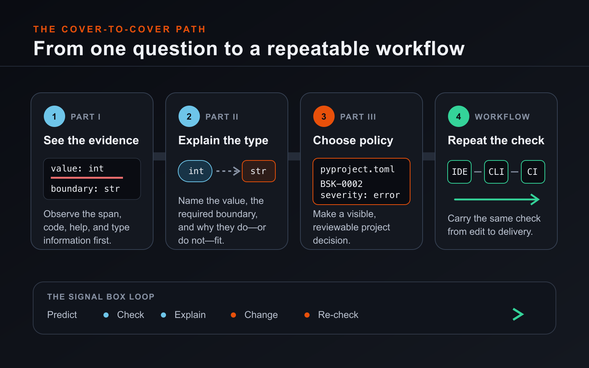

# How to use this book

This book is for Python developers who want to understand Basilisk, not merely
make its messages disappear. If you can write a function, import a module, use
a collection, and run a test, you are ready. You do not need a background in
static typing, type theory, language servers, or compiler design. When the book
needs one of those ideas, it introduces the idea through code first and names it
afterward.

The most useful way to read is cover to cover, with an editor and terminal open.
The chapters form one journey: see what Basilisk is telling you, understand the
Python type relationship underneath it, express your project's choices, and
repeat the same check in everyday work. You can also use the book as a field
guide. Each chapter begins with a reader promise, works through one practical
question, and closes with a compact set of things you should now be able to
predict.

## What you will learn

Part I puts the system in view. You will run a first check, learn the parts of a
diagnostic, and separate evidence from guesswork. Part II builds the Python
typing vocabulary needed to explain that evidence: compatibility, inference,
narrowing, structured data, reusable contracts, imports, and stubs. Part III
turns those ideas into a project workflow through configuration, gradual
adoption, editor assistance, testing, debugging, profiling, and CI.

*Figure 0.1 — The book follows one loop rather than a bag of features. Observe
the evidence, explain it, make a deliberate change, and repeat the check in the
places where the project is built.*

The order matters on a first reading. Configuration is easier to use well after
you can distinguish a Python rule from a project preference. A quick fix is
easier to judge after you can read the type information that motivated it. CI
is useful only after the local command expresses the policy you actually want.
Later, return directly to the chapter that matches the question in front of
you.

## Work alongside Signal Box

The examples grow around **Signal Box**, a small telemetry application. It
receives sensor-shaped data, normalises readings, creates alerts, and passes
results across ordinary Python boundaries. The domain is intentionally plain.
Its job is to make the type relationships visible without requiring you to
learn a framework at the same time.

At each checkpoint, use the same four moves:

1. **Predict.** Before running Basilisk, decide whether the code should be
   accepted and where useful evidence might appear.
2. **Check.** Run the stated command from the stated directory, or inspect the
   same file in the editor.
3. **Explain.** Read the complete diagnostic. Name the value, the destination,
   and the relationship between their types before changing code.
4. **Change and re-check.** Make the smallest honest change, then repeat the
   same check. Run the program or its tests whenever runtime behaviour matters.

Type the short examples when you can. The pause between reading a prediction
and seeing the result is where a mental model becomes testable. If you copy a
finished example, deliberately alter one boundary—a parameter, a return type,
or one possible value—and predict the new result before checking again.

Code blocks begin with a file path when context matters. A line beginning with
`$` is a shell command; enter the text after the prompt, not the prompt itself.
Diagnostic blocks are captured output, not commands. An ellipsis means that
irrelevant surrounding code was left out; it is not an invitation to paste an
incomplete program. Every complete checkpoint belongs in the book's example
workspace and must run against the edition recorded here before publication.

## Know what the evidence can prove

Static type checking studies source without executing every runtime path. It
can expose an incompatible call, a return that breaks a declared contract, or
a branch that still permits an unwanted value. It cannot prove that the
program meets every requirement, that a network service is available, that a
calculation is correct, or that untyped external data is trustworthy.

Python's own documentation states the boundary plainly:

> “The Python runtime does not enforce function and variable type
> annotations.” — [Python `typing` documentation](https://docs.python.org/3/library/typing.html)

An annotation gives a checker information; it does not normally convert or
validate the value at runtime. That is why this book keeps separate lanes for
static evidence and runtime evidence. A clean Basilisk result answers the
static questions covered by the selected rules. Tests, execution, debugging,
and measurement answer different questions. A dependable workflow uses the
right evidence for each decision.

When a diagnostic surprises you, do not begin by suppressing it. First ask:
What type did Basilisk infer? What type did this boundary require? Which fact
in the program would make one of those answers more precise? Sometimes the
right response is a code change. Sometimes it is a better annotation, a more
accurate stub, or a deliberate project-policy choice. Sometimes the checker has
revealed that your own expectation was wrong. The chapters teach you how to
tell these cases apart.

## Read authorities, not folklore

Python typing evolves. For current semantics, this book follows the maintained
[Python typing specification](https://typing.python.org/en/latest/spec/index.html),
the official `python/typing` repository and conformance tests, versioned Python
documentation, CPython, and typeshed. PEPs are used for design history when
that history helps; the maintained specification is the authority for the
current type system. The typing specification itself explains this
[relationship between the specification and historical PEPs](https://typing.python.org/en/latest/spec/meta.html).

Basilisk claims have an additional gate. A feature enters the book only when
the governing Basilisk specification, the implementation in the edition's
named release, and executable evidence from that release agree. If they do not
agree, the topic is left out. The book does not document wishful behaviour or
turn an implementation accident into a promise.

The [Basilisk website](https://www.basilisk-python.dev/) is the live companion
to this fixed edition. Use the website for current installation guidance, the
generated rule reference, and changes made after the book was built. Check the
[release notes](https://www.basilisk-python.dev/docs/releases/) when the screen
or command in front of you differs from the page. Links beside technical claims
lead to the responsible authority; the short source list at the end of a
chapter is a route for further reading, not a substitute for those nearby
citations.

## Read the pictures as evidence

Screenshots and diagrams do different jobs. A screenshot records what the
named Basilisk release displayed in a controlled example workspace. Its caption
identifies the lesson, while the edition record preserves the editor, operating
system, theme, zoom, fixture, and capture method. Counts and wording inside it
belong to that captured moment.

A diagram explains a relationship that may be hard to see in a screen. Blue
marks Python information; orange marks the path currently under discussion.
Labels, shapes, and line styles repeat every colour distinction so the lesson
does not depend on colour alone. Alt text carries the teaching point for
readers who do not see the image, and the prose never requires you to extract
essential instructions from a picture.

## Check the edition before you begin

This book does not declare one Python release to be Basilisk's canonical
target. The maintained typing specification is the authority. When a lesson
uses syntax or runtime behaviour that begins with a particular Python release,
the lesson names that boundary and cites the governing PEP or Python
documentation; otherwise the example follows the reader's project environment.

The exact Basilisk release for this working edition is still marked **TO BE
PINNED BEFORE PUBLICATION** in the edition metadata. Until that field names a
released build, product commands, diagnostics, and screenshots remain
editorial evidence rather than publication claims. The free public edition
will record its Basilisk version, build date, the interpreter used to run the
examples, the typeshed commit the standard-library examples were captured
against, example test result, link-audit result, and screenshot environment.
The interpreter and the typeshed commit are reproducibility facts, not support
boundaries.

That record is your starting point when the live product moves on. Follow the
book with its named release for reproducible results; follow the website when
you want the current product. If the two differ, treat the difference as a
version change to investigate, not as a reason to silently rewrite the example.

You are now ready to begin with the smallest useful distinction: running a
Python program and asking a static question about it are not the same act.
