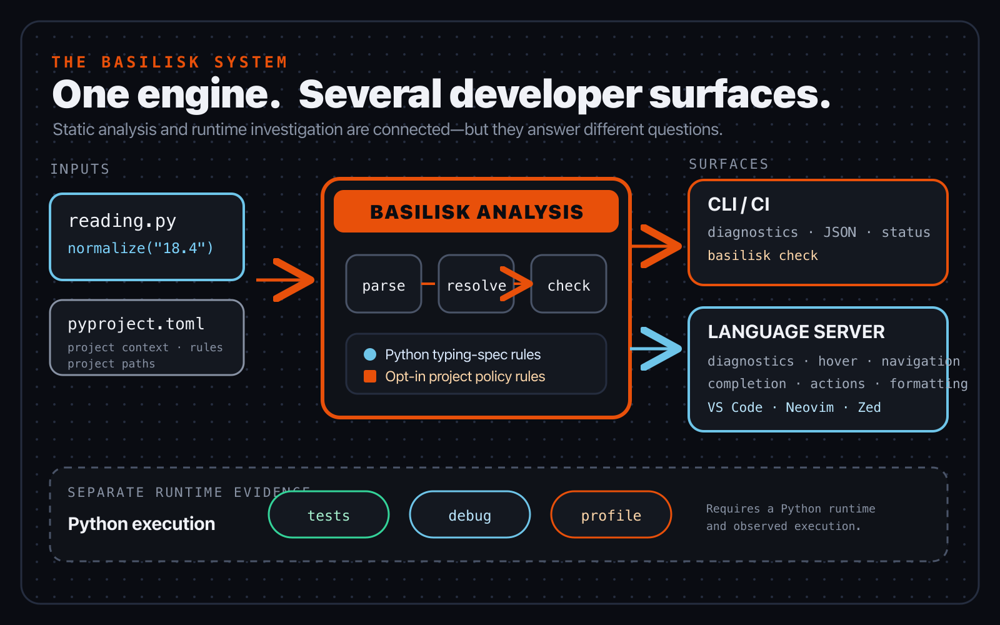

# Chapter 1 — Meet Basilisk

*Part I — See the system*

> **Reader promise:** Explain where Basilisk sits between Python source, project
> policy, an editor, the command line, and a running program.

Suppose a function says it returns nothing, yet its body returns a formatted
temperature. Python can run the function. A static type checker can reject the
relationship. A test can compare the resulting text with an expected value.
Those outcomes do not contradict one another: each tool asked a different
question.

That distinction is the foundation for everything that follows. Before fixing
a diagnostic, you need to know what kind of evidence produced it, what facts
the tool could see, and what the result does not establish.



*Figure 1.1 — Basilisk analyses source and project context, then presents the
result through command-line and editor surfaces. Running Python, testing,
debugging, and profiling remain separate sources of runtime evidence.*

## One program, several questions

Begin with a small mistake:

```python
def format_reading(celsius: float) -> None:
    return f"{celsius:.1f} °C"


print(format_reading(21.5))
```

The annotation promises `None`, but the function returns a `str`. That is a
static compatibility problem: the returned value does not satisfy the declared
return type. The maintained [Python typing specification](https://typing.python.org/en/latest/spec/type-system.html)
defines static analysis as the primary purpose of the type system.

Run the file and Python still prints the string:

```console
$ python reading.py
21.5 °C
```

This is expected. Python's [`typing` documentation](https://docs.python.org/3/library/typing.html)
states that the runtime does not enforce function and variable annotations.
The annotation did not convert the string to `None`, block the call, or insert
a hidden validation step.

A checker instead reads the declaration and the return expression without
needing to execute this call. The smallest honest correction is to make the
declared return agree with the value:

```python
def format_reading(celsius: float) -> str:
    return f"{celsius:.1f} °C"
```

Changing `None` to `str` changes the information available to static tools. It
does not change the function's runtime calculation. If the intended contract
really was `None`, the other honest correction would be to stop returning a
value. The checker can expose the disagreement; it cannot choose the intended
design for you.

When a diagnostic appears, translate it into three facts before editing: the
value the checker found, the type the boundary requires, and the source
expression that connects them. Here the found value is a `str`, the required
type is `None`, and the connecting expression is the `return`. That description
survives changes in message wording, colour, editor theme, and terminal layout.
It also gives you a useful review question: should the implementation change,
or should the declared boundary change? Guessing from the underline alone can
produce a clean check with the wrong contract.

Nor does a clean static result prove that the temperature is correct, that a
sensor is reachable, or that malformed input has been handled. Execution shows
what happened on one run. A test compares an observed result with an expected
one. Debugging exposes state along one path. Profiling measures where a running
program spent resources. Static analysis adds another line of evidence; it does
not replace the others.

## One engine, several surfaces

Basilisk receives Python source and project context, then performs three broad
steps. Parsing identifies the program's syntax. Resolution connects names,
imports, declarations, and inferred information. Checking compares those facts
with the active rules. The diagram keeps these steps deliberately broad because
you do not need Basilisk's Rust internals to use the result.

The command line runs that analysis for a bounded set of files and prints a
result suitable for a person or an automated job. The editor keeps a language
server running so it can reuse knowledge as documents change. The
[Language Server Protocol](https://microsoft.github.io/language-server-protocol/specifications/lsp/3.18/specification/)
standardises messages for features such as diagnostics, hover, completion, and
navigation; the editor renders the response in its own interface.

Two command-line questions are worth naming now:

```console
basilisk check .
basilisk analyze .
```

`check` asks for the rules that implement the maintained Python typing
specification. `analyze` asks for non-PEP Basilisk rules that the project has
explicitly selected. They use the same source-analysis path but select different
rule scopes. The editor normally presents the configured union as one coherent
diagnostic stream, because you should not have to remember which transport
produced a problem before you can understand it.

The presentation can differ without changing the underlying relationship. A
terminal can show a path, source span, explanation, and exit status. An editor
can underline the same span and add hover text or an action. Later chapters will
teach those surfaces in detail. For now, remember that neither surface executes
the function merely to decide whether its return satisfies the annotation.

This shared analysis matters when you move between tools. If the terminal and
editor appear to disagree, do not invent two different meanings for Python
typing. First compare the source revision, project root, configuration, and
Basilisk build each surface is using. A stale editor buffer or a command run
from a different root can change the available evidence even though the type
relationship itself has not changed. Chapter 2 turns those checks into a short
verification routine.

Runtime tools occupy the other lane:

```console
python app.py
python -m unittest
```

Those commands run Python code. A debugger and profiler also need an observed
execution. Basilisk may connect these activities into one developer workflow,
but connecting the controls does not merge the evidence. A squiggle is not a
test failure, and a passing test does not erase an incompatible declared return.

## Python rules and project policy

The Python typing specification owns the meaning of Python's type system. It is
a maintained specification; historical PEPs explain how particular features
were accepted, but the maintained text is the authority for current semantics.
Basilisk follows that standard rather than inventing an edition-wide Python
target for this book.

Python versions still matter when the standard makes them matter. A PEP may
introduce syntax in a particular release, and a `sys.version_info` condition may
make one branch relevant to a project's interpreter. In those cases Basilisk
uses project or environment evidence to apply the stated boundary. That is not
the same as declaring one Python release to be Basilisk's canonical version.

Project policy answers a separate class of question. The typing specification
can define whether a returned value is compatible with a return annotation
without requiring every function to have an annotation. A team may still want
to require annotations at selected boundaries. That additional choice belongs
in visible project configuration and is handled by opt-in Basilisk rules.

Signal Box currently makes two such choices:

```toml
[tool.basilisk]
include = ["src", "tests"]

[tool.basilisk.rules]
"BSK-0001" = "error"
"BSK-0002" = "error"
```

The `include` entry identifies project paths. The two rule entries select
Basilisk policies for missing parameter and return annotations. Removing those
entries changes the opt-in policy; it does not rewrite the Python typing
specification. Conversely, project policy cannot make an incompatible return
become compatible.

Severity is also policy, not semantics. Reporting a selected rule as an error,
warning, or informational item can change whether a command blocks a workflow
and how prominently an editor displays it. It does not change the meaning of
`str`, `None`, or return compatibility. Keeping that separation clear lets a
team adjust adoption pressure without publishing its own private version of
Python's type system.

This is why the book avoids labels such as *basic mode* and *strict mode*.
Those labels hide the decision that matters. Ask instead: is this relationship
defined by the Python typing specification, or is this an additional project
rule? Then identify the exact rule and its configured severity.

## Signal Box checkpoint

Open `book/examples/signal-box` without changing it. The current checkpoint is
small enough to map in one glance:

```text
signal-box/
├── pyproject.toml
├── src/signal_box/
│   ├── __init__.py
│   └── readings.py
└── tests/
    └── test_readings.py
```

Work through the surfaces in this order:

1. Treat the directory containing `pyproject.toml` as the project root. Read
   the `include` paths and the two explicit policy rules. Notice that the file
   does not claim a canonical Python release.
2. Open `src/signal_box/readings.py`. The function declares `-> None` but
   returns a dictionary. Before running anything, predict whether this is a
   static question, a runtime question, or both.
3. Execute the function directly from the project root:

   ```console
   PYTHONPATH=src python - <<'PY'
   from signal_box.readings import normalize_reading

   print(normalize_reading({"sensor_id": "north-7", "celsius": "21.5"}))
   PY
   ```

   Python prints the normalized dictionary. This establishes what that input
   did at runtime; it does not make the `-> None` promise accurate.
4. Run `basilisk check .`. Find the return relationship governed by the typing
   specification. Read the source span before considering a fix.
5. Run `basilisk analyze .`. The configured annotation policy asks a different
   question about the unannotated `raw` parameter.
6. Open the same file in a supported editor with Basilisk connected. Locate the
   corresponding source spans there. The editor client starts and communicates
   with the language server; there is no separate editor copy of the Python
   program.

Do not fix the fixture yet. The checkpoint is complete when you can point to
the source, project policy, static-analysis commands, editor connection, and
runtime command, and explain what evidence each contributes.

## Practice: choose the evidence first

Classify each question before revealing the answers:

1. Can a `str` be returned where `None` was declared?
2. What dictionary does this sensor payload produce on this run?
3. Does normalization preserve the expected sensor identifier across several
   representative inputs?
4. Why did `raw["celsius"]` contain an unexpected value at this breakpoint?
5. Which normalization operation consumes the most CPU under a real workload?

The answers are, in order: static analysis, execution, testing, debugging, and
profiling. Some investigations use more than one source, but naming the first
question prevents you from demanding evidence that a tool cannot provide.

For a guided variation, copy `format_reading` into a scratch file and change
its return annotation back to `None`. Predict the static result and runtime
output separately, check both, then restore `str`. Explain why only one result
changed.

For an independent variation, choose one uncertainty from your own project.
Write it as a single question, name the evidence needed to answer it, and only
then choose a command or editor action. If the question is about a typing
relationship, identify whether it comes from the maintained specification or
an explicit project rule.

## What changed

- Static analysis and Python execution answer different questions about the
  same source.
- An annotation supplies information; it does not normally enforce or convert
  a runtime value.
- Command-line and editor diagnostics are two surfaces over the same analysis
  relationships.
- `check` selects Python typing-spec rules; `analyze` selects configured,
  non-PEP Basilisk policy rules.
- Python-version boundaries belong to the PEP or runtime behaviour that defines
  them, not to a universal Basilisk target.
- Tests, debugging, and profiling remain necessary forms of runtime evidence.

Chapter 2 turns this map into action: you will verify the installed Basilisk
build, run a bounded check, read the first result, and reach a clean static
baseline without copying unexplained configuration.

## Authoritative sources

- [The Python type system](https://typing.python.org/en/latest/spec/type-system.html)
- [Python `typing` documentation](https://docs.python.org/3/library/typing.html)
- [Language Server Protocol 3.18](https://microsoft.github.io/language-server-protocol/specifications/lsp/3.18/specification/)
- Continue at the [Basilisk website](https://www.basilisk-python.dev/).
