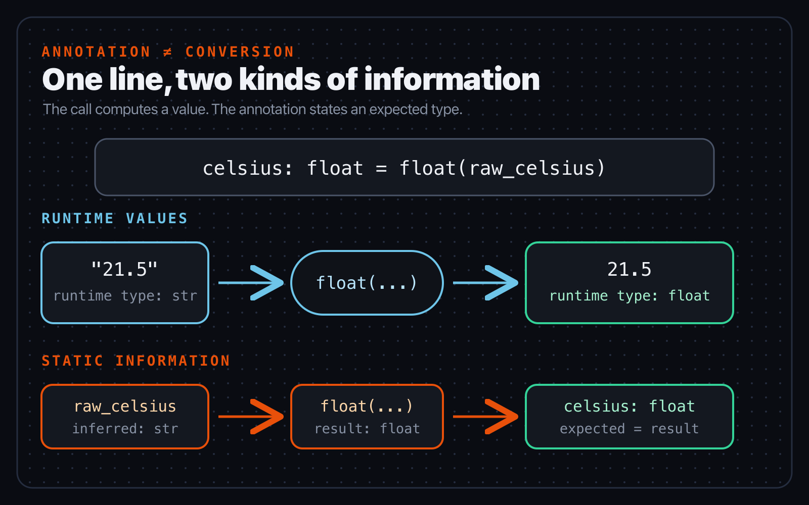
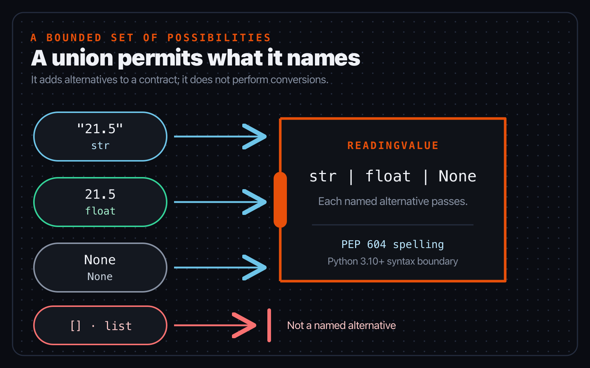
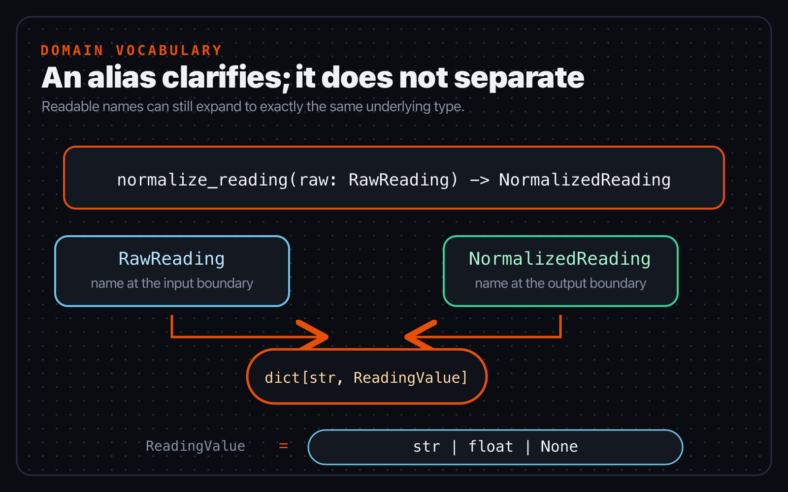

# Chapter 4 — The everyday type vocabulary

*Part II — Think in types*

> **Reader promise:** Read and write the types used at ordinary application
> boundaries without confusing an annotation with runtime conversion.

A sensor sends the text `"21.5"`. Signal Box needs the number `21.5`. Those
values look related to a person, but Python will not convert one merely because
a name is annotated as `float`. The program needs an explicit conversion; the
annotation gives a static checker a fact to verify.

This chapter builds a small working vocabulary from that distinction. You will
use scalar types, parameterized collections, unions with `None`, and aliases.
These features are defined by the maintained Python typing specification. Two
modern spellings used in the examples have precise PEP boundaries, which are
named where they appear rather than treated as Basilisk-wide version targets.

## An annotation describes; an expression computes

Start with a runtime value, the name bound to it, and an annotation:

```python
raw_celsius = "21.5"
celsius: float = float(raw_celsius)
```

At runtime, `raw_celsius` refers to a `str`. The call to `float` computes a new
`float` value. The annotation on `celsius` says that the result expected at that
assignment boundary is a `float`. Each part has one job.

Remove the conversion and the jobs do not quietly swap places:

```python
celsius: float = "21.5"
print(type(celsius).__name__)  # str
```

Python binds the string and prints `str`. A checker has reason to reject the
assignment because the expression's type is not assignable to the annotated
type. The [typing specification's annotation rules](https://typing.python.org/en/latest/spec/annotations.html)
use this same idea for variables, parameters, and returns: an annotation states
the expected type, and a value used there must be assignable to it. Python's
[`typing` documentation](https://docs.python.org/3/library/typing.html) is also
explicit that annotations are not enforced by the runtime.



*Figure 4.1 — The `float(...)` call changes the runtime value. The `: float`
annotation gives static tools an expected type; it performs no conversion.*

Function annotations describe two more boundaries:

```python
def format_temperature(celsius: float) -> str:
    return f"{celsius:.1f} °C"
```

The parameter annotation says what values callers may supply at the
`celsius` boundary. The return annotation says what the function promises to
produce. Neither annotation checks whether a sensor is calibrated or whether
the formatted text is desirable. Those remain runtime and application
questions.

Expected type does not mean “the runtime class name must be spelled exactly
this way.” The typing relation also accounts for compatible subclasses and
other forms of assignability. Chapter 5 gives that relation a full treatment.
For this chapter, the useful reading is simpler: the annotation names the
contract at a boundary, while the value still comes from ordinary Python
evaluation.

Names without written annotations can still carry inferred static information.
In the first example, a checker can infer `str` for `raw_celsius` from the
literal and `float` for the conversion result. Write annotations where they
make a useful boundary or contract visible; do not annotate every local name
merely to repeat an obvious expression.

The everyday scalar names mean what ordinary Python suggests: `str` for text,
`int` for integers, `float` for floating-point numbers, `bool` for truth
values, and `bytes` for byte sequences. An annotation using one of those names
does not call its constructor. If conversion is part of the program, keep the
conversion visible in the expression.

## Collections carry facts about their contents

Knowing only that a value is a list is rarely enough. Signal Box also needs to
know what each element means:

```python
sensor_ids: list[str] = ["north-7", "roof-2"]
latest: dict[str, float] = {"north-7": 21.5}
coordinates: tuple[float, float] = (-37.81, 144.96)
```

Read these from the outside inward. `list[str]` is a list whose elements are
strings. `dict[str, float]` maps string keys to floating-point values. The
two-item tuple records a float in each position. Supplying the element, key,
and value types lets a checker follow useful facts through indexing, iteration,
and calls.

The brackets describe different roles for different collections. A list has
one repeating element type. A dictionary has a key type followed by a value
type. This tuple has two fixed positions, each declared separately. Reading the
roles aloud is a useful habit: “dictionary from sensor identifier strings to
temperatures,” not merely “dictionary of strings and floats.” That phrasing
often exposes a reversed key/value annotation before a tool needs to.

The bracketed types still do not validate a collection at runtime. This code
creates an ordinary list, and Python does not inspect every append against the
annotation:

```python
sensor_ids: list[str] = []
sensor_ids.append("north-7")
```

A static checker can verify the append from source information. Runtime
validation, if a boundary needs it, is separate code. This is especially
important for external JSON: annotating a decoded dictionary does not prove
that an untrusted payload has the promised keys or value shapes.

The built-in parameter spelling in this section—`list[str]`, `dict[str,
float]`, and `tuple[float, float]`—comes from
[PEP 585](https://peps.python.org/pep-0585/) and is available at runtime from
Python 3.9. That is a boundary on this syntax, not a Basilisk support target.
Code running on an earlier interpreter can use the equivalent names from
`typing`:

```python
from typing import Dict, List, Tuple

sensor_ids: List[str] = ["north-7"]
latest: Dict[str, float] = {"north-7": 21.5}
coordinates: Tuple[float, float] = (-37.81, 144.96)
```

The relationship being expressed is the same. The project interpreter decides
which spelling its source can execute. Basilisk should follow that declared
language boundary rather than impose one release on every project.

## A union lists permitted possibilities

Some Signal Box fields genuinely have more than one permitted form. A raw
temperature may arrive as text, may already be a float, or may be absent:

```python
ReadingValue = str | float | None

first: ReadingValue = "21.5"
second: ReadingValue = 21.5
missing: ReadingValue = None
```

A union is not a sequence of conversion attempts. It says that a value from
any listed alternative is permitted at the boundary. A list is not one of
these alternatives, so `[]` does not satisfy `ReadingValue` merely because the
program could invent a way to convert it.

Every listed alternative is a valid part of the contract. `None` is not a
comment saying that the data is probably broken, and `str` is not a temporary
exception that the checker may ignore. Code receiving the union must use only
operations justified for all remaining possibilities or gather evidence that
one possibility is present. This is why a union preserves more information
than abandoning the type of the value altogether.



*Figure 4.2 — A union widens the set of permitted values only to the alternatives
it names. It does not erase the boundary.*

`float | None` deserves to be read literally: either a float or the value
`None`. It is useful when absence is part of the contract:

```python
def normalize_temperature(value: str | float | None) -> float | None:
    if value is None:
        return None
    return float(value)
```

The function handles absence separately and explicitly converts either present
form. The condition also gives a checker evidence that `value` cannot be
`None` on the final line. Chapter 6 develops that control-flow narrowing in
detail; for now, notice that the declared possibilities and the runtime branches
agree.

A default of `None` does not remove the need to declare `None` when it is an
accepted value. The maintained [union rules](https://typing.python.org/en/latest/spec/concepts.html)
recommend making that possibility explicit:

```python
def choose_temperature(
    measured: float | None,
    fallback: float | None = None,
) -> float | None:
    return measured if measured is not None else fallback
```

The `X | Y` and `T | None` spellings were introduced by
[PEP 604](https://peps.python.org/pep-0604/) for Python 3.10. On a project whose
interpreter predates that syntax, the equivalent declarations use `Union` and
`Optional`:

```python
from typing import Optional, Union

ReadingValue = Union[str, float, None]
MaybeTemperature = Optional[float]
```

`Optional[float]` means `Union[float, None]`; it does not mean that a function
parameter has a default value. Syntax changes across PEP boundaries, but the
underlying union relationship remains the lesson.

## Aliases name domain ideas

The earlier `ReadingValue` assignment is a type alias. It lets a program name
a recurring type relationship using the language of its domain. Signal Box can
name both sides of its current normalization boundary:

```python
ReadingValue = str | float | None
RawReading = dict[str, ReadingValue]
NormalizedReading = dict[str, ReadingValue]


def normalize_reading(raw: RawReading) -> NormalizedReading:
    ...
```

This signature is easier to discuss in a review: a raw reading goes in and a
normalized reading comes out. The aliases are still exactly equivalent to
their right-hand types. They create no new runtime classes, perform no
validation, and do not prevent a `RawReading` from being used where the
identical `NormalizedReading` shape is expected.

That equivalence also means that an alias should not be advertised as a safety
barrier. If two aliases expand to the same type, a checker treats their values
according to that shared type relationship. The benefit is communicative: the
function signature records where data is in the application story. A reviewer
can then decide whether readable naming is sufficient or whether the boundary
needs a genuinely different structure.



*Figure 4.3 — An alias improves the vocabulary of a contract. It does not make
an equivalent underlying type distinct.*

That limitation is useful evidence, not a defect to hide. At this checkpoint,
the aliases improve readability while the broad dictionary type treats every
key as having the same union of possible values. Chapter 7 will introduce
structures that can describe required keys and different value types more
precisely.

The maintained [alias specification](https://typing.python.org/en/latest/spec/aliases.html)
also defines an explicit `type` statement, introduced by
[PEP 695](https://peps.python.org/pep-0695/) for Python 3.12. This chapter does
not need that newer syntax, so it does not use it. A simple alias assignment
teaches the concept without adding an irrelevant language floor.

Create an alias when the name clarifies a domain boundary or removes distracting
repetition. Do not create one for every short type. `SensorId = str` can be
useful vocabulary, but it does not stop an arbitrary string from being used as
a sensor identifier. When distinctness is the requirement, an alias is the
wrong tool.

## Signal Box checkpoint

The executable snapshot for this chapter is
`book/examples/ch04-type-vocabulary`:

```text
ch04-type-vocabulary/
├── pyproject.toml
├── src/signal_box/
│   ├── __init__.py
│   └── readings.py
└── tests/
    └── test_readings.py
```

Open `src/signal_box/readings.py` and work from the outside inward:

1. Read `ReadingValue` as the permitted raw field values: text, float, or
   absence.
2. Expand `RawReading` and `NormalizedReading` mentally to their dictionary
   types. Notice what each alias explains and what it cannot distinguish.
3. In `normalize_temperature`, identify the annotation, the branch that handles
   absence, and the expression that actually converts a present value.
4. In `normalize_reading`, identify which local types are written and which are
   inferred from `.get(...)`, the conditional expression, and the helper call.
5. Predict the normalized dictionary for the sample input before executing it.

Write the prediction as two lines: one for runtime values and one for static
facts. The runtime line should say that the text temperature is converted to a
float. The static line should say that the returned dictionary satisfies the
`NormalizedReading` alias. Keeping the two lines separate is the point of the
exercise; neither one can substitute for the other.

Run the runtime tests and the static check as separate evidence:

```console
cd book/examples/ch04-type-vocabulary
PYTHONPATH=src python3 -m unittest discover -s tests
basilisk check src
```

The tests establish what normalization did for their inputs. The Basilisk check
establishes that the source relationships satisfy the maintained typing rules
implemented by the checked build. Neither result proves that an arbitrary
external dictionary has been validated; the checkpoint has not made that claim.

For a partially guided variation, add a `humidity` field whose raw value may be
`str`, `float`, or `None`. Reuse `normalize_temperature` under a clearer helper
name if the conversion contract is genuinely identical, add one runtime test,
and predict whether either alias must change before checking. Then introduce a
deliberate mismatch in a scratch copy—put a list where a `ReadingValue` is
expected—and compare Python's runtime behavior with the static result. Remove
the mismatch rather than weakening the alias.

For an independent variation, choose a boundary in a small module of your own.
Write down the runtime input values first. Then annotate one scalar, one
collection including its contents, and one genuinely absent-or-present value.
If you introduce an alias, explain in one sentence what domain idea it names
and in another what it does *not* enforce. Run the program and the checker
separately. Finally, identify every syntax feature in your annotations that has
a PEP-defined interpreter boundary. Record only those boundaries; do not infer
a project-wide Basilisk target from them.

## What changed

- An annotation states expected static information; an expression performs a
  runtime conversion.
- Parameters and returns expose function boundaries without proving application
  behavior.
- Parameterized collection types preserve facts about elements, keys, values,
  and tuple positions.
- A union permits only its named alternatives, and `T | None` makes absence
  explicit.
- PEP 585 and PEP 604 syntax boundaries belong to those features, not to a
  universal Basilisk target.
- A type alias improves domain vocabulary while remaining equivalent to its
  underlying type.

Chapter 5 will reuse this vocabulary around one recurring question: can this
value be used at that boundary?

## Authoritative sources

- [Type annotations](https://typing.python.org/en/latest/spec/annotations.html)
- [Type system concepts and unions](https://typing.python.org/en/latest/spec/concepts.html)
- [Type aliases](https://typing.python.org/en/latest/spec/aliases.html)
- [PEP 585 — Type Hinting Generics In Standard Collections](https://peps.python.org/pep-0585/)
- [PEP 604 — Allow writing union types as `X | Y`](https://peps.python.org/pep-0604/)
- [PEP 695 — Type Parameter Syntax](https://peps.python.org/pep-0695/)
