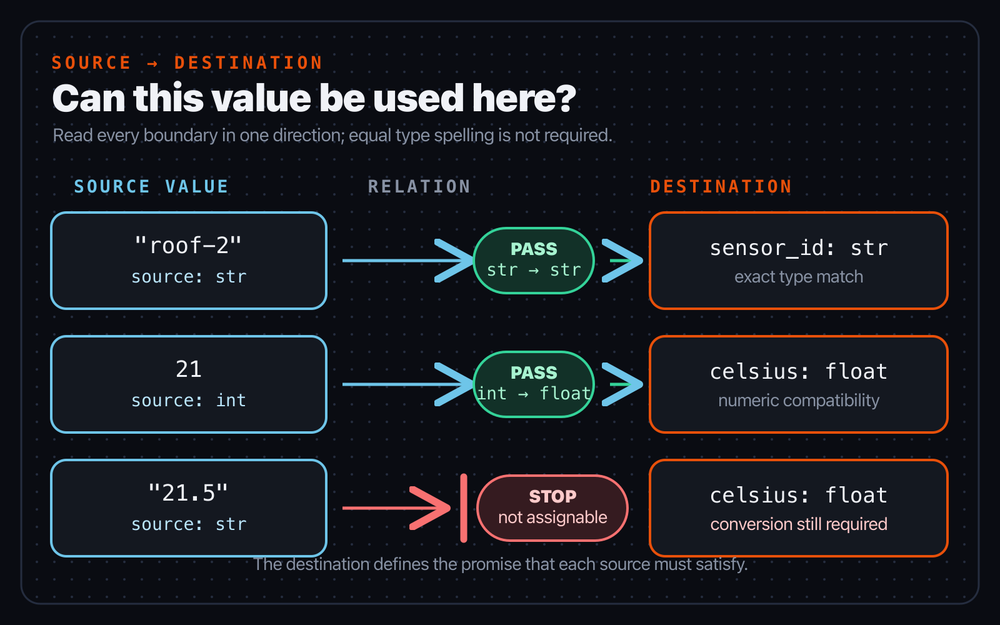
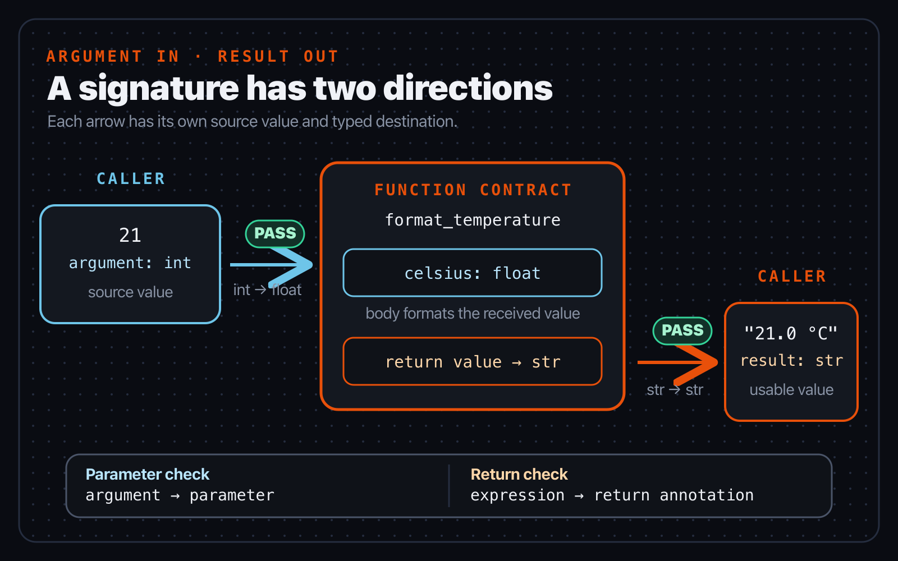
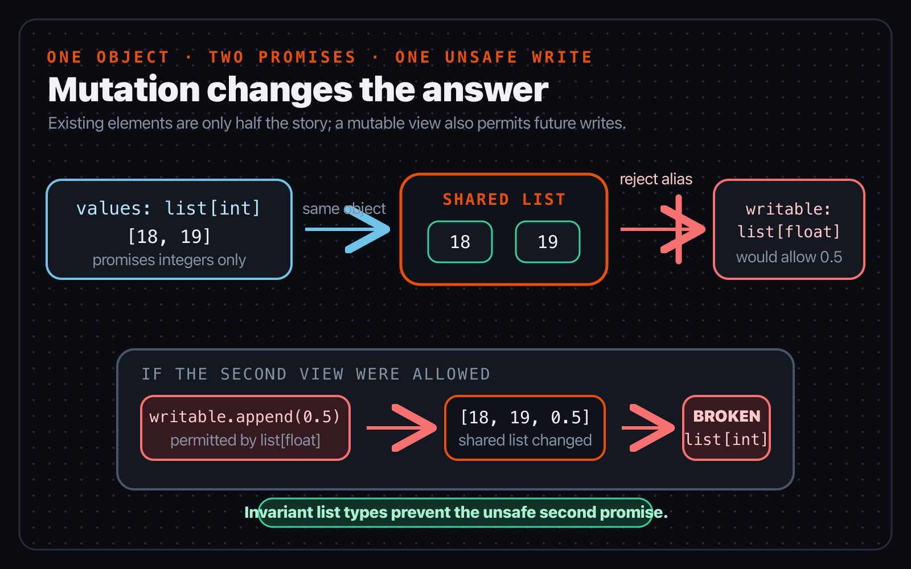

# Chapter 5 — Compatibility is the question

*Part II — Think in types*

> **Reader promise:** Predict the ordinary assignment, call-argument, and return
> errors that appear when a value crosses a typed boundary.

Signal Box has already converted the sensor text `"21.5"` into a number. Now an
alert formatter expects a number, a caller supplies a value, and the formatter
returns text. Three pieces of code are involved, but the static question is the
same at every boundary: can the value from here be used there?

That question is *compatibility*. It is more useful than asking whether two
type names are identical. An integer can be used at some boundaries that expect
a floating-point number. A temperature alert can be used where any alert is
accepted. A list needs more caution because another part of the program may
mutate it. A callback reverses part of the reasoning because the receiver will
call the function later.

This chapter develops one repeatable way to inspect those cases. The governing
relationships come from the maintained Python typing specification. The
verified examples below use Basilisk as evidence at four concrete boundaries:
assignments, calls, returns, and callable values.

The examples reuse `list[...]` and other built-in generic syntax from
[PEP 585](https://peps.python.org/pep-0585/), available at runtime from Python
3.9, plus `T | None` union syntax from
[PEP 604](https://peps.python.org/pep-0604/), available from Python 3.10.
Chapter 4 shows the equivalent earlier spellings. These are syntax boundaries,
not Basilisk-wide version targets.

## Can this value be used here?

Begin by naming two facts. The *source type* describes the value being supplied.
The *destination type* describes what the boundary accepts. A value is
*assignable* when its source type can be used at that destination.

Read each line from right to left:

```python
sensor_id: str = "roof-2"
celsius: float = 21
maybe_celsius: float | None = 21.5
```

The string literal supplies a `str` to a `str` destination. The integer literal
supplies an `int` to a `float` destination. Python's
[special numeric rule](https://typing.python.org/en/latest/spec/special-types.html)
permits an integer where a floating-point argument is expected, and Basilisk
uses the same promotion at this annotated assignment. Compatibility therefore
does not require identical spelling. The last line supplies one member of a
union to a destination that explicitly permits that member.

Now predict which source fails each destination:

```python
sensor_id: str = 21                 # int -> str: incompatible
celsius: float = "21.5"             # str -> float: incompatible

def copy_present(value: float | None) -> None:
    present: float = value          # float | None -> float: incompatible
```

The annotation does not convert any of these values. The text would need an
explicit `float(...)` call. The union needs evidence that the value is not
`None` before it can cross the narrower boundary; Chapter 6 will show how
control flow supplies that evidence.

The maintained [type-system concepts](https://typing.python.org/en/latest/spec/concepts.html)
define assignability as the practical relation checkers use for values moving
between typed locations. This gives you a reliable diagnostic reading method:

1. Find the expression that supplied the value.
2. Write down its source type.
3. Find the parameter, variable, return, or callback destination.
4. Write down the destination type.
5. Ask whether every possibility in the source is permitted there.



*Figure 5.1 — Compatibility has a direction. The source value must satisfy the
destination; resemblance between the two type names is not enough.*

When Basilisk points at the assignment rather than the earlier conversion, do
not immediately change the annotation. First decide which side is dishonest.
If the source really is raw text, convert or validate it. If the destination
genuinely accepts text, broaden its contract. A cast that merely forces the
checker to agree would answer neither question.

## Assignment and subtyping

Class inheritance supplies another common route to compatibility. Suppose
Signal Box has a general alert and a more specific temperature alert:

```python
class Alert:
    message: str = "sensor alert"


class TemperatureAlert(Alert):
    celsius: float = 0.0


temperature = TemperatureAlert()
general: Alert = temperature                 # compatible

def read_temperature(alert: Alert) -> float:
    specific: TemperatureAlert = alert       # incompatible
    return specific.celsius                  # Alert does not promise this
```

`TemperatureAlert` is a *subtype* of `Alert`: every temperature alert is also
an alert. The direction matters. A destination that accepts any `Alert` can
receive the more specific value. A destination that requires a
`TemperatureAlert` cannot receive an arbitrary alert, because the source type
does not promise that specificity. In the example, every `Alert` promises a
`message`, but only `TemperatureAlert` promises `celsius`; the reverse
assignment would make the final attribute access unjustified.

Subtyping and assignability are related but not interchangeable words.
Subtyping describes a relationship between types. Assignability asks whether a
particular source-to-destination use is permitted, including special typing
rules such as the numeric case above. Keeping the words separate prevents a
useful shortcut from becoming an incorrect claim about Python's runtime class
hierarchy.

This chapter uses ordinary declared inheritance, also called nominal
subtyping. Chapter 7 will cover structural subtyping, where a protocol can be
satisfied by having the required members rather than naming a particular base
class. You do not need that larger idea to diagnose the boundary in front of
you: establish the source, establish the destination, then check the direction.

## Functions receive and promise

A function signature creates destinations on both sides of its body. Each
parameter is a destination for callers. The return annotation is a destination
for every value returned by the implementation.

Consider the formatter introduced at the start of the chapter:

```python
def format_temperature(celsius: float) -> str:
    return f"{celsius:.1f} °C"


format_temperature(21)       # int -> float: compatible
format_temperature("21.5")   # str -> float: incompatible
```

At the first call, the argument expression is the source and the `float`
parameter is the destination. At the second call, a string crosses that same
boundary. The fact that `float("21.5")` could convert the text does not make
the unconverted string compatible.

Return reasoning points out of the function:

```python
def alert_count() -> int:
    return "three"            # str -> int: incompatible


def fixed_alert_count() -> int:
    return 3                  # int -> int: compatible
```

The return annotation is a caller-facing promise. Code calling `alert_count`
may use the result as an integer without reading the implementation. Returning
text breaks that promise. The honest repair depends on the API: return an
integer if this is a count, or change the annotation and every caller's
expectation if the function really produces a label.

Parameters should describe all inputs the implementation intentionally
accepts, while returns should preserve the most useful fact the implementation
can promise. A conversion boundary often receives several source forms and
produces one normalized form:

```python
def normalize_celsius(value: int | float) -> float:
    return float(value)
```

The broad parameter is not weaker merely because it contains two alternatives;
it is an honest account of accepted input. The precise return tells callers
that they no longer need to handle both forms. Tests must still establish what
the conversion does at runtime. The annotation records the static contract; it
does not prove calibration, range, or parsing policy.



*Figure 5.2 — Parameters constrain values moving into a function. The return
annotation constrains values moving out, so the source and destination swap
with the direction of data flow.*

The [callable specification](https://typing.python.org/en/latest/spec/callables.html)
defines these parameter and return relationships in detail. For ordinary
diagnostics, the two arrows in Figure 5.2 are enough: argument to parameter,
then return expression to return annotation.

## Mutable collections change the stakes

Element types can be compatible while their mutable lists are not. Predict
what would happen if this assignment were allowed:

```python
def add_fraction(values: list[int]) -> None:
    writable: list[float] = values    # incompatible
    writable.append(0.5)


readings: list[float] = [18, 19]      # compatible fresh literal
readings.append(18.5)                 # still a list[float]
```

Every existing `int` in `values` can be used as a `float`, but `writable` would
provide another reference to the *same list*. Its annotation would permit the
append. The caller would then find `0.5` inside a value still typed as
`list[int]`. Rejecting the assignment protects the promises attached to both
references.

This is why mutable built-in collections such as `list` are *invariant* in
their element type. `list[int]` is not a subtype of `list[float]`, even though
an `int` can be supplied to a plain `float` destination. The maintained
[generic-types specification](https://typing.python.org/en/latest/spec/generics.html)
defines variance; the write above supplies the reason to remember it.

A fresh literal, shown in the last two lines, is different because no earlier
reference has promised a narrower element type. Its elements are checked in
the `list[float]` destination context, and the resulting list can later accept
the fractional value without contradicting another typed view.

If a function only reads values, describe that narrower capability. A
`Sequence` supports indexed, sized, read-only use through the function's
contract and is covariant in its element type:

```python
from collections.abc import Sequence


def average(values: Sequence[float]) -> float:
    return sum(values) / len(values)


integer_readings: list[int] = [18, 19]
average(integer_readings)             # compatible
```

`Sequence` does not freeze the caller's list at runtime. It says this function
does not require mutation through that parameter. When mutation is part of the
job, keep `list[...]` and choose an element type that permits every value the
function may write.



*Figure 5.3 — Reading the original integers looks safe. The permitted write
through a second list view is what makes the proposed substitution invalid.*

## Callbacks are contracts too

A callback is a function passed as a value so another part of the program can
call it later. `Callable[[float, str], str]` describes a callback that accepts a
floating-point value and a string, then returns a string:

```python
from collections.abc import Callable

AlertFormatter = Callable[[float, str], str]


def render_alert(
    celsius: float,
    sensor_id: str,
    formatter: AlertFormatter,
) -> str:
    return formatter(celsius, sensor_id)
```

Read the type from the future call site. `render_alert` is allowed to supply
any values promised by those parameter types, so a formatter must accept all
of them. `render_alert` is also allowed to use the callback result as `str`, so
the callback must return something compatible with `str`.

The direction becomes clearer with the numeric relationship already used in
this chapter:

```python
from collections.abc import Callable


def accepts_float(value: float) -> int:
    return round(value)


usable: Callable[[int], float] = accepts_float     # compatible

def reject_narrow_callback(
    callback: Callable[[int], int],
) -> None:
    unusable: Callable[[float], float] = callback  # incompatible
```

The first assignment is safe. A caller of `usable` promises to pass an `int`,
which `accepts_float` can receive, and the returned `int` can be used as a
`float`. The second assignment is unsafe: the destination promises callers
that any `float` is accepted, but the supplied callback only promises to
accept integers.

The formal names come after the concrete test. When one callable type is
compared with another, parameter types are checked *contravariantly*: the
supplied function must accept at least what the destination may send. Return
types are checked *covariantly*: the supplied result may be more specific than
the destination requires. For an ordinary callback, ask two questions instead
of memorizing arrows: “Can I call it with every promised argument?” and “Can I
use every result it may return?”

## Signal Box checkpoint

The executable snapshot for this chapter is
`book/examples/ch05-compatibility`:

```text
ch05-compatibility/
├── pyproject.toml
├── src/signal_box/
│   ├── __init__.py
│   └── alerts.py
└── tests/
    └── test_alerts.py
```

Open `src/signal_box/alerts.py`, then make a prediction before running either
tool:

1. Read `AlertFormatter` as a future call: two accepted arguments and one
   promised result.
2. Explain why `format_alert(21, "roof-2")` satisfies a `float` parameter even
   though `21` is an integer literal.
3. Explain why `render_alerts` accepts a tuple through `Sequence[float]` and
   does not need a mutable list.
4. In `append_calibration`, identify the write that requires `list[float]`.
5. Trace the test's `compact` callback from its parameter types through the
   formatter destination to the returned string.

Run the runtime tests and the static check as separate evidence:

```console
cd book/examples/ch05-compatibility
PYTHONPATH=src python3 -m unittest discover -s tests
basilisk check .
```

The tests show what formatting, callback selection, and list mutation did for
their inputs. The Basilisk check compares the source relationships with the
typing rules implemented by the checked build. A clean result does not prove
that a sensor is accurate or that every external value has been validated.

For a partially guided variation, add a helper that receives
`values: list[int]`. Inside it, try to assign `values` to a local
`list[float]`, then predict the unsafe value that the wider reference could
append. Check the variation, remove the incompatible assignment, and choose
one honest repair: create a `list[float]` at the original boundary if fractional
mutation is required, or accept `Sequence[float]` if the helper only reads.

For an independent variation, choose one callback in a small module of your
own. Write its source and destination signatures side by side. For each
parameter, prove that the supplied callback accepts every value the receiver
may send. For the return, prove that every supplied result can be used by the
receiver. Add one runtime test and one deliberately incompatible scratch
assignment, predict the static result, run Basilisk, then remove the mismatch
without adding `Any`, a cast, or a suppression.

## What changed

- Compatibility is a directed question from a source type to a destination
  type; equal spelling is not required.
- Subtypes can move to compatible supertype destinations, but the reverse
  direction loses a promise.
- Arguments flow into parameter destinations, while return expressions flow
  into the declared return destination.
- Mutable collections are invariant because another typed reference could
  write a value that breaks the original element promise.
- A read-only `Sequence` contract permits safe covariance without making the
  runtime object immutable.
- Callback compatibility asks what the receiver may pass in and what it may
  use on return.

Chapter 6 will add control-flow evidence. Instead of rejecting a broad union at
a narrow boundary, you will learn how a branch can establish which possibility
is present on each path.

## Authoritative sources

- [Type system concepts](https://typing.python.org/en/latest/spec/concepts.html)
- [Special types in annotations](https://typing.python.org/en/latest/spec/special-types.html)
- [Callables](https://typing.python.org/en/latest/spec/callables.html)
- [Generics](https://typing.python.org/en/latest/spec/generics.html)
- [PEP 585 — Type Hinting Generics In Standard Collections](https://peps.python.org/pep-0585/)
- [PEP 604 — Allow writing union types as `X | Y`](https://peps.python.org/pep-0604/)
- Inspect the current diagnostic families in the
  [Basilisk rule reference](https://www.basilisk-python.dev/docs/rules/).
