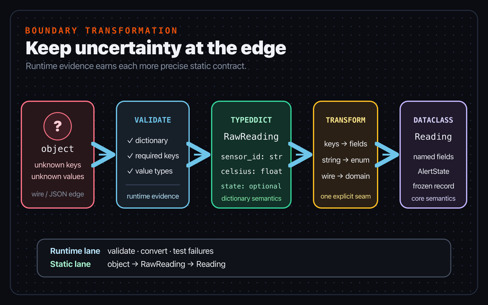
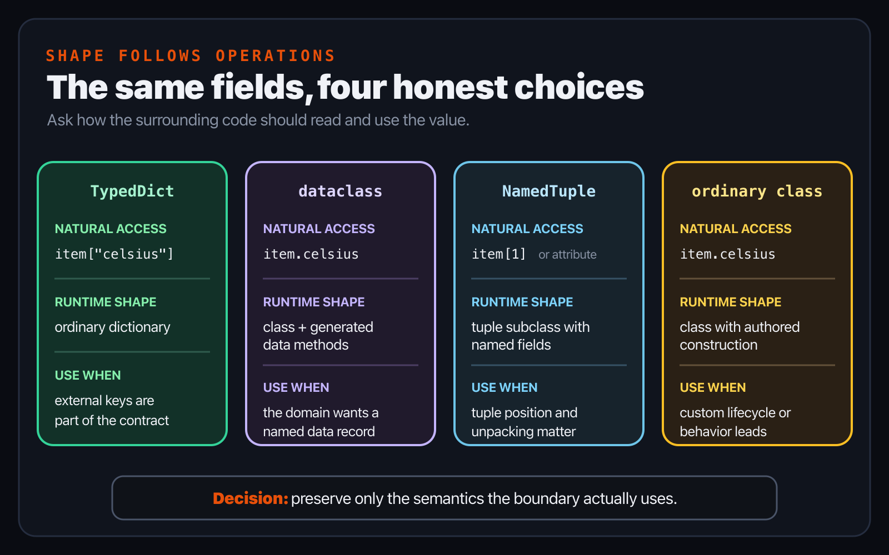
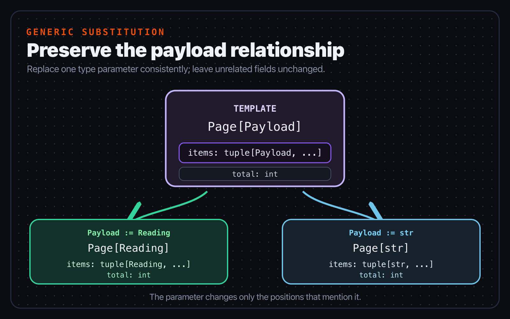
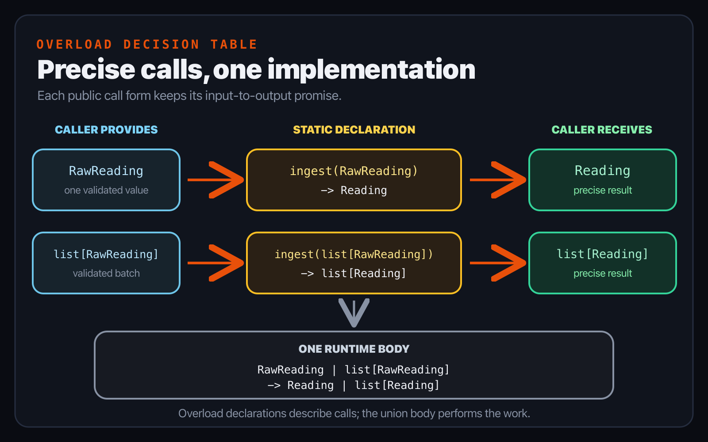

# Chapter 7 — Reusable contracts and structured data

*Part II — Think in types*

> **Reader promise:** Choose a data or behavior contract because it matches a
> boundary, not because it is the most advanced typing feature available.

Chapter 6 validated a dictionary-shaped sensor event before using its keys.
That was enough for one function. Signal Box now needs to retain readings,
report them, and accept either one event or a batch. If the same dictionary is
passed through every layer, each layer must remember which keys exist, which
are optional, and which strings have domain meaning.

The answer is not one elaborate type. It is a small set of contracts, each at
the boundary where it tells the truth. A `TypedDict` describes a validated
dictionary. A dataclass represents internal state with named attributes. An
enum gives the application a closed set of named values. A protocol states the
behavior a workflow consumes. A type parameter preserves the payload inside a
container, and an overload preserves a relationship between distinct call
forms.

These features sit in Python's maintained typing specification and runtime
library rather than in a Basilisk-specific mode. The chapter therefore teaches
their normative contracts and verifies their runtime work. It does not depend
on one release's diagnostic wording or checker-specific inferred types.

## Put each data shape at its boundary

Start with the external shape. A broad `dict[str, object]` says that every key
is a string and every value might be any object. It cannot say that
`"sensor_id"` is required, that its value is a string, or that `"state"` may be
absent. `TypedDict` can describe those per-key facts:

```python
from typing import NotRequired, TypedDict

class RawReading(TypedDict):
    sensor_id: str
    celsius: float
    state: NotRequired[str]
```

The maintained [`TypedDict` specification](https://typing.python.org/en/latest/spec/typeddict.html)
distinguishes required items from non-required items. If a non-required item is
present, its value still has to match the declared type. Predict which of these
values fits `RawReading` before reading the comments:

```python
first: RawReading = {"sensor_id": "roof-2", "celsius": 21.5}
second: RawReading = {
    "sensor_id": "yard-1",
    "celsius": 17.0,
    "state": "warning",
}
broken: RawReading = {"sensor_id": "roof-2"}  # missing celsius
```

The first two have every required item. The third does not. That is a static
relationship; the annotation does not inspect data received over a socket or
loaded from JSON. At runtime, a `TypedDict` value is an ordinary dictionary,
and a `TypedDict` type cannot be used as the second argument to `isinstance`.
The specification states both limits. Validate unknown input before promising
the narrower shape:

```python
def validate_raw(value: object) -> RawReading:
    if not isinstance(value, dict):
        raise ValueError("reading must be a dictionary")
    sensor_id = value.get("sensor_id")
    celsius = value.get("celsius")
    if not isinstance(sensor_id, str):
        raise ValueError("sensor_id must be a string")
    if not isinstance(celsius, (int, float)):
        raise ValueError("celsius must be numeric")
    return {"sensor_id": sensor_id, "celsius": float(celsius)}
```

The complete checkpoint also validates the optional state and rejects Boolean
temperatures. The important move is unchanged: runtime checks establish facts;
the return annotation records the shape available after those checks.

`NotRequired` is local to one item. The `TypedDict` syntax also supports
`total=False`, which makes every item declared in that class non-required.
Use the form that states the real boundary most visibly. A sensor identifier
and temperature are not optional merely because validation code can report
their absence; invalid input is rejected before a `RawReading` exists.
Manufacturing a default identifier would make the static shape easy to satisfy
while losing an important runtime fact.

Once data crosses into the application, string-key access is no longer useful.
Signal Box owns an internal model with named attributes:

```python
from dataclasses import dataclass

@dataclass(frozen=True)
class Reading:
    sensor_id: str
    celsius: float
    state: AlertState
```

Python's [`dataclass` documentation](https://docs.python.org/3/library/dataclasses.html)
describes the generated initializer, representation, and equality behavior.
`frozen=True` also blocks ordinary field reassignment; it does not turn every
object reachable through a field into an immutable value. Here the fields are
already scalar or enum values, so the frozen boundary is easy to understand.

The transformation is also a useful place to change vocabulary. The external
name `"state"` remains a string key in `RawReading`; the internal field holds
an `AlertState`. If a later wire format renames a key or encodes temperature in
a different unit, the change can stop at this boundary. The rest of the
application continues to consume the domain model. Static types make that seam
visible, while runtime tests prove the conversion performed there.



*Figure 7.1 — Keep uncertainty at the edge. Validation earns the `RawReading`
contract; transformation introduces the domain model used by the core.*

Do not choose a structure by counting fields. Choose it by the operations that
should remain natural. A `TypedDict` retains real dictionary keys for a
dictionary-shaped boundary. A dataclass provides named attributes and generated
data-model methods. A [`NamedTuple`](https://docs.python.org/3/library/typing.html)
keeps tuple behavior, including positional access and unpacking. An ordinary
class is appropriate when you want to define construction and behavior
directly. None is a universally “stronger” type than the others.



*Figure 7.2 — Shape is a design decision. Preserve dictionary, tuple, or class
semantics only when the surrounding boundary actually uses them.*

## Give closed choices domain names

The wire format uses strings because external data commonly arrives that way.
Inside Signal Box, the application owns three alert states:

```python
from enum import Enum

class AlertState(Enum):
    NORMAL = "normal"
    WARNING = "warning"
    OFFLINE = "offline"
```

An enum member has both a name and a value, and calling the enum with a value
looks up its member, as documented by the Python
[`enum` module](https://docs.python.org/3/library/enum.html) and the maintained
[typing rules for enums](https://typing.python.org/en/latest/spec/enums.html).
The boundary transformation can therefore convert the string deliberately:

```python
def reading_from_raw(raw: RawReading) -> Reading:
    return Reading(
        sensor_id=raw["sensor_id"],
        celsius=raw["celsius"],
        state=AlertState(raw.get("state", "normal")),
    )
```

An unknown state raises `ValueError` at runtime instead of drifting through the
core as an arbitrary string. Test that failure where you validate external
input. The enum annotation alone does not cause conversion.

A union of string literals can also describe a closed set, as Chapter 6 did.
Keep literals when the strings themselves are the useful API and no domain
object is needed. Prefer an enum when named runtime values make the internal
model clearer. The important distinction is ownership: the input boundary
accepts and validates the wire representation; the domain chooses the values
it will carry.

## Describe consumed behavior, not ancestry

Signal Box needs to save readings and retrieve a snapshot. It does not need to
know whether storage uses a list, a database, or one latest value per sensor.
A protocol describes those consumed members:

```python
from typing import Protocol

class ReadingStore(Protocol):
    def save(self, reading: Reading) -> None: ...
    def readings(self) -> tuple[Reading, ...]: ...
```

The [protocol specification](https://typing.python.org/en/latest/spec/protocol.html)
defines this as structural assignability: a class with compatible members can
satisfy `ReadingStore` without naming it as a base class. Both checkpoint
stores do exactly that:

```python
class MemoryStore:
    def save(self, reading: Reading) -> None: ...
    def readings(self) -> tuple[Reading, ...]: ...

class LatestBySensorStore:
    def save(self, reading: Reading) -> None: ...
    def readings(self) -> tuple[Reading, ...]: ...
```

No inheritance was added solely for the type checker. The consuming function
depends on the smallest behavior it uses:

```python
def count_readings(store: ReadingStore) -> int:
    return len(store.readings())
```

Member names are not enough. A method such as `save(self, reading: str)` does
not satisfy the protocol because its parameter contract is incompatible.
Chapter 5's argument-direction question still applies inside structural
matching.

A protocol also does not state every semantic promise. `MemoryStore` retains
all readings, whereas `LatestBySensorStore` replaces an earlier reading from
the same sensor. Both provide the declared operations. Tests and documentation
must still establish ordering, persistence, replacement, and failure behavior.
Static structure and runtime meaning are two lines of evidence, not rivals.

Notice that `readings` returns a tuple instead of exposing either store's
mutable collection. Callers can iterate and count a snapshot, but cannot append
into a store behind its back. The protocol also avoids mentioning the list used
by one implementation or the dictionary used by the other. Good protocols are
often small because they describe what the caller needs, not everything the
provider can do.

The checkpoint does not use `@runtime_checkable` or an `isinstance` test. The
workflow already receives a value and calls its declared members; adding a
runtime protocol check would not verify the deeper storage semantics.

## Preserve relationships across calls

A report page always has items and a total, but its item type should not be
erased. Write the two concrete substitutions first:

```python
reading_page: Page[Reading]
message_page: Page[str]
```

Both have the same container shape. The first page's items are readings; the
second page's items are strings. A type parameter captures that one changing
position:

```python
from typing import Generic, TypeVar

Payload = TypeVar("Payload")

@dataclass(frozen=True)
class Page(Generic[Payload]):
    items: tuple[Payload, ...]
    total: int
```

The [generics specification](https://typing.python.org/en/latest/spec/generics.html)
defines `Generic[Payload]` as giving the class one type parameter and making
that parameter available in its body. The checkpoint uses this established
syntax instead of adding the newer Python 3.12 generic-class syntax to an
example that does not need it.

Substitution is the useful mental operation. Replace `Payload` with `Reading`
everywhere inside `Page`, and `items` becomes `tuple[Reading, ...]`. Replace it
with `str`, and the same field becomes `tuple[str, ...]`. `total` remains an
integer because it never mentioned the parameter. The annotation preserves
that relation for static analysis; it does not inspect or convert the tuple's
contents at runtime.



*Figure 7.3 — A type parameter preserves a relationship. It does not make the
container abstract for its own sake.*

Type parameters work best when the same unknown type appears in related
positions. Overloads solve a different problem: a callable has a small number
of distinct input forms, and each form determines a distinct result. Signal
Box accepts one validated reading or a batch:

```python
from typing import overload

@overload
def ingest(payload: RawReading) -> Reading: ...

@overload
def ingest(payload: list[RawReading]) -> list[Reading]: ...

def ingest(
    payload: RawReading | list[RawReading],
) -> Reading | list[Reading]:
    if isinstance(payload, list):
        return [reading_from_raw(item) for item in payload]
    return reading_from_raw(payload)
```

The maintained [overload specification](https://typing.python.org/en/latest/spec/overload.html)
requires overload declarations in a regular module to be followed by one
runtime implementation. Callers use the precise declared relationship; Python
executes the single implementation. Do not duplicate the function body behind
each declaration.



*Figure 7.4 — Use overloads when the call forms genuinely differ. The
implementation still handles their union once.*

If every input leads to the same result type, use an ordinary union parameter.
If one type flows through several positions, first ask whether a type parameter
expresses the relationship. Overloads are valuable when callers would
otherwise receive a broad union that forgets what their chosen call form
guarantees.

## Signal Box checkpoint

The executable snapshot is `book/examples/ch07-structured-contracts`:

```text
ch07-structured-contracts/
├── pyproject.toml
├── src/signal_box/
│   ├── __init__.py
│   └── contracts.py
└── tests/
    └── test_contracts.py
```

Trace one reading through the checkpoint before running it:

1. `validate_raw` receives `object` and performs the runtime checks needed to
   return `RawReading` honestly.
2. `reading_from_raw` converts boundary keys and a state string into a frozen
   `Reading` with an `AlertState` member.
3. `ingest` keeps the result for one input distinct from the result for a
   batch while sharing one implementation.
4. `MemoryStore` and `LatestBySensorStore` satisfy the same consumed protocol
   without a shared application base class.
5. `page_readings` returns `Page[Reading]`, preserving the payload type while
   exposing only the storage behavior it needs.

Run the runtime evidence:

```console
cd book/examples/ch07-structured-contracts
PYTHONPATH=src python3 -m unittest discover -s tests
```

The four tests exercise required and optional input, invalid boundary values,
enum conversion, single and batch ingestion, both protocol implementations,
and the generic page. Then run the static check with the Basilisk binary named
by your book edition:

```console
basilisk check --color never .
```

The checkpoint pins its typeshed input in `pyproject.toml` so the standard
library annotations used by the check do not drift between runs. Chapter 8
will explain where those imported types come from. If your result differs from
the edition's recorded evidence, verify the binary version and the checkpoint
before changing the source.

Read a clean result narrowly. It establishes that the documented static
contracts agree for this checkpoint under that binary and stub input. The
runtime suite establishes the particular behaviors its assertions execute.
Neither result proves that a real sensor is trustworthy, that a database write
will survive a crash, or that untested input is valid. Each claim stays attached
to the evidence capable of supporting it.

For a partially guided variation, add an optional `battery` percentage at the
external boundary. Predict every place that must change. Add
`battery: NotRequired[float]` to `RawReading`, validate the runtime value, and
decide whether the domain model needs `battery: float | None`. Add tests for an
absent value, a valid value, and a wrong value. Do not add the field to
`Reading` merely because the wire format contains it; make the domain decision
explicit.

For an independent variation, choose one structured value from your own code.
Mark where it enters, where validation occurs, which operations the core uses,
and whether a container must preserve a payload type. Select one contract per
boundary. If you choose a protocol, test the same consumer with two honest
implementations. If you choose an overload, explain why a union or type
parameter would lose a useful input-to-output relationship.

## What changed

- `TypedDict` describes required and non-required keys after runtime validation;
  it does not validate unknown input itself.
- A dataclass gives internal state named attributes and generated data-model
  behavior, while an enum gives owned choices named runtime values.
- The boundary transformation is explicit, so external strings do not leak
  into every internal contract.
- A protocol describes compatible consumed members without forcing unrelated
  implementations into an inheritance hierarchy.
- A generic container preserves one payload type across its fields and uses.
- Overloads are justified when distinct call forms promise distinct results;
  one implementation still performs the runtime work.
- Runtime tests remain responsible for validation and behavioral semantics that
  static structure does not express.

Chapter 8 follows these contracts across an import. You will trace whether a
signature came from source, a stub package, a local override, or typeshed, and
decide what to do when imported information is absent or incomplete.

## Authoritative sources

- [Typed dictionaries](https://typing.python.org/en/latest/spec/typeddict.html)
- [Dataclasses in the typing specification](https://typing.python.org/en/latest/spec/dataclasses.html)
- [Python dataclasses](https://docs.python.org/3/library/dataclasses.html)
- [Enumerations in the typing specification](https://typing.python.org/en/latest/spec/enums.html)
- [Python enum](https://docs.python.org/3/library/enum.html)
- [Protocols](https://typing.python.org/en/latest/spec/protocol.html)
- [Generics](https://typing.python.org/en/latest/spec/generics.html)
- [Overloads](https://typing.python.org/en/latest/spec/overload.html)
- Browse related diagnostics in the
  [Basilisk rule reference](https://www.basilisk-python.dev/docs/rules/).
