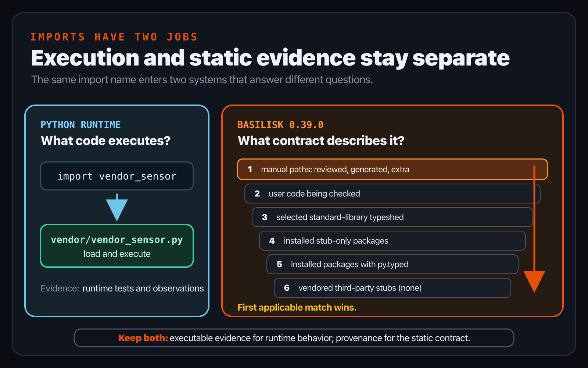
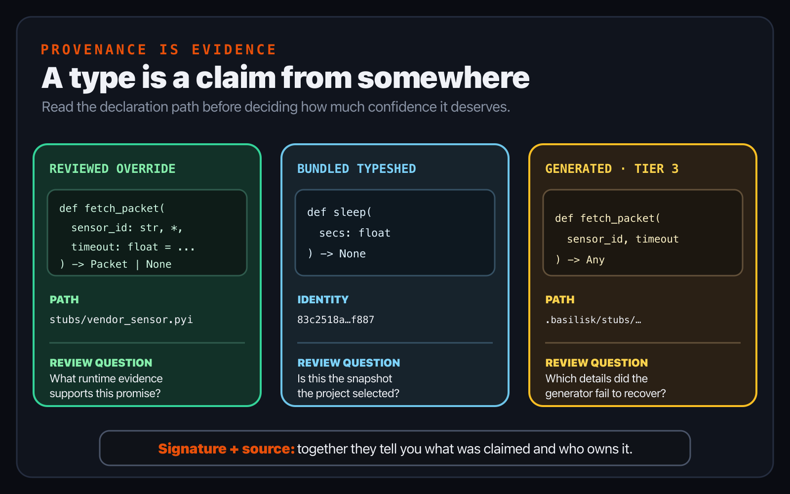
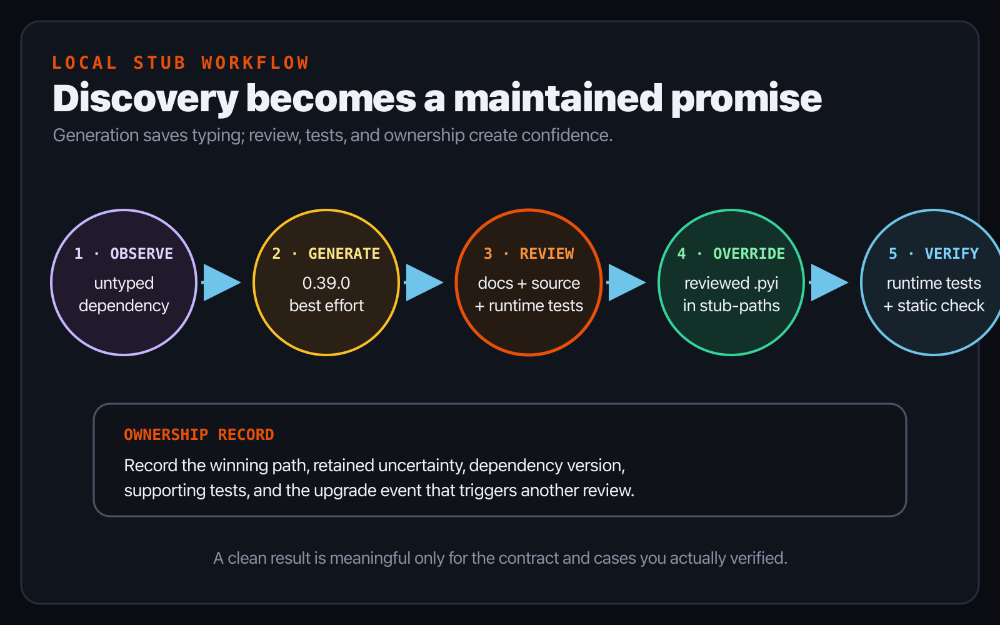

# Chapter 8 — Imports, packages, and the world of stubs

*Part II — Think in types*

> **Reader promise:** Explain where imported type information came from and
> choose an honest response when a dependency has none.

Chapter 7 ended with contracts that Signal Box owns. A `Reading` dataclass and
a `ReadingStore` protocol live beside the code they describe. The next reading
arrives through `vendor_sensor`, a simulated third-party package with no inline
annotations. Python can import it and return a useful object. That does not yet
tell a static checker what the object promises.

An import therefore raises two different questions. What module will Python
load when the program runs? What source of type information will a checker use
while analysing the import? Sometimes one `.py` file answers both. Sometimes a
separate `.pyi` file describes the public interface. The standard library is
usually described by typeshed, and an installed distribution can advertise
inline typing with `py.typed`. When no usable information exists, the honest
answer is to install, write, or review a stub—not to pretend that an unknown API
is precise.

This chapter's Basilisk behavior was verified against the release named in the
edition record. The [versioned stub-resolution specification](https://github.com/Nimblesite/Basilisk/blob/b8ae454cfabc54d26d7e4efc029f2f01bd083bc8/docs/specs/CHECKER-STUB-RESOLUTION-SPEC.md)
and the release binary agree for the commands and search order shown here.

## One import, two searches

The simulated vendor package contains ordinary executable Python. Its public
function has no annotations:

```python
# vendor/vendor_sensor.py
def fetch_packet(sensor_id, *, timeout=1.0):
    if timeout <= 0:
        raise ValueError("timeout must be positive")
    if sensor_id == "offline":
        return None
    return Packet(sensor_id, 21.5, "normal")
```

With `vendor` on `PYTHONPATH`, Python imports that file and executes
`fetch_packet`. The keyword-only separator, timeout check, offline case, and
constructed `Packet` are runtime facts. Tests can call the function and observe
those paths.

Signal Box consumes the same import in application code:

```python
# src/signal_box/vendor_readings.py
from vendor_sensor import fetch_packet


def read_sensor(sensor_id: str) -> Reading | None:
    packet = fetch_packet(sensor_id, timeout=0.5)
    if packet is None:
        return None
    return Reading(packet.sensor_id, packet.celsius, packet.state)
```

During a check, Basilisk 0.39.0 performs a static filesystem search. It does not
import and execute `vendor_sensor` merely to discover its types. That separation
matters: importing arbitrary packages during every check could run setup code,
depend on unavailable services, or produce a different API from one machine to
another. Static resolution instead looks for source and stub files in a defined
order.



*Figure 8.1 — One import participates in two systems. The runtime loader chooses
code to execute; static resolution chooses information with which to judge the
call.*

Do not infer one result from the other. A successful runtime import does not
prove that type information exists. A resolved stub does not prove that the
runtime package is installed, that its service is reachable, or even that the
stub describes the installed implementation accurately. Those facts need
separate evidence.

## A stub is a public contract

A stub is a syntactically valid Python file with a `.pyi` suffix. The maintained
[distribution specification](https://typing.python.org/en/latest/spec/distributing.html)
defines stubs as type information for a corresponding implementation. When a
checker finds a stub for a module, it uses that interface instead of reading the
corresponding implementation for types.

Stub bodies normally use `...` because the declaration is the point:

```python
# stubs/vendor_sensor.pyi
from typing import Literal

class Packet:
    sensor_id: str
    celsius: float
    state: Literal["normal", "warning"]

def fetch_packet(
    sensor_id: str,
    *,
    timeout: float = ...,
) -> Packet | None: ...
```

This contract records facts the runtime source leaves implicit. The first
argument is a string. `timeout` is keyword-only and accepts a float. The result
is either a `Packet` with three typed attributes or `None`. The ellipsis used as
the default means that a default exists without copying an irrelevant runtime
value into the interface.

Nothing in the `.pyi` validates those promises. A checker trusts the selected
stub, so an inaccurate stub can accept a bad call or reject a valid one. The
official [stub-writing guide](https://typing.python.org/en/latest/guides/writing_stubs.html)
therefore treats generated stubs as starting points and recommends checking the
stub itself and checking code that uses the package. Signal Box adds runtime
tests for the normal, warning, offline, keyword-only, and invalid-timeout cases.

The useful review question is not “Does the stub look typed?” It is “What
evidence supports each public declaration?” Package documentation can establish
the intended interface. Tests can exercise representative runtime behavior.
Source inspection can clarify a stable public API when its licence and
maintenance model allow that. If the evidence only supports `object` or an
incomplete declaration, keep the uncertainty visible rather than guessing a
narrow type.

Treat a reviewed stub as a dependency you now maintain. Record which package
version its evidence describes, and re-run its runtime cases whenever that
package changes. Review the public signature before refreshing generated
output: an upstream parameter can become keyword-only, a default can change,
or a result can acquire a new absence case without adding a new public name.
If the package later publishes trustworthy inline types or a maintained stub
package, compare that contract with the local override before removing it.
Deleting the override first would silently change which source wins the next
check; comparison makes that change a deliberate migration.

## Packages advertise type information

The typing specification recognizes more than one way to publish a contract.
A package maintainer can place annotations in `.py` files or ship `.pyi` files
beside them. A distribution that provides typing in its runtime package adds a
marker named `py.typed`; the marker applies recursively to that package. The
marker is packaging metadata for static tools. Importing the package does not
execute `py.typed` or turn annotations into runtime validation.

Type information can also arrive in a separate stub-only package. For import
package `foopkg`, the installed stub package directory follows the
`foopkg-stubs` naming scheme. A stub-only package does not need a `py.typed`
marker because its name already identifies its purpose. A partial stub package
uses a `py.typed` file containing `partial` so a checker can continue searching
for modules the stub package does not cover. These are current rules in the
[maintained distribution specification](https://typing.python.org/en/latest/spec/distributing.html);
[PEP 561](https://peps.python.org/pep-0561/) remains useful history, but it is
not the maintained authority.

The standard library is a special case because CPython's runtime modules are not
themselves a complete static interface. The official
[typeshed project](https://github.com/python/typeshed) maintains standard-library
stubs and also develops third-party stubs that are typically distributed as
separate packages. A checker selects standard-library declarations appropriate
to the target version and platform from a particular typeshed snapshot.

In Basilisk 0.39.0, the static search follows the typing specification's six
positions:

1. manually supplied stubs or source, including `stub-paths`, generated local
   stubs, and `extra-paths`;
2. the user code being checked;
3. the selected typeshed source for the standard library;
4. installed stub-only packages;
5. installed packages that opt in with `py.typed`; and
6. any checker-vendored third-party stubs—of which 0.39.0 vendors none for
   resolution.

The first match wins, with the specification's rules for partial and namespace
stub packages. That is why a reviewed step-1 stub can deliberately patch an
inaccurate package contract. It is also why a forgotten local override can mask
an improved upstream stub. Search order is not housekeeping; it is part of the
meaning of the check.

## Standard-library sources and provenance

For step 3, Basilisk 0.39.0 selects one standard-library source. With no explicit
source setting, it uses the complete snapshot bundled into the release and
reports that the project has not explicitly pinned a commit. A project can name
the bundle's exact commit—or another commit already present in Basilisk's local
verified store—with `typeshed-commit`:

```toml
[tool.basilisk]
typeshed-commit = "83c2518a9e6abbda0c44592c3483de459198f887"
```

Checking remains offline. If an explicitly pinned commit is neither the bundled
identity nor available in the verified local store, 0.39.0 fails with `NO
SOURCE` instead of downloading or silently substituting another snapshot. The
separate, user-invoked `basilisk typeshed download` command acquires and pins the
latest commit; `basilisk typeshed download --commit <sha>` materialises an
already chosen pin. A project that needs a modified or alternative standard
library can instead set `typeshed-path`; that custom tree becomes the sole
step-3 source.

Provenance answers “where did this declaration come from?” The 0.39.0 hover
card includes the declaration path. It also labels typeshed, custom typeshed,
generated best-effort stubs, and unavailable type information distinctly. A
reviewed user stub is identified by its actionable `.pyi` path rather than a
special suffix. Inspect the path as well as the signature: a precise-looking
type from an unexpected override is evidence worth investigating.



*Figure 8.2 — This schematic comparison is not an editor capture. It shows why
a signature is only half the answer: its path and provenance tell you which
contract won the static search.*

## Generate, inspect, and own the result

Basilisk 0.39.0 can generate a best-effort local stub. From the Chapter 8
checkpoint, run the released binary with the simulated package importable by
the chosen interpreter:

```console
PYTHONPATH=vendor basilisk stubs generate vendor_sensor --python python3
```

The default hybrid mode produced the following declaration in the verified
0.39.0 run:

```python
# .basilisk/stubs/vendor_sensor.pyi
# Auto-generated stub for `vendor_sensor` (runtime introspection)
# Tier 3: best-effort, may be inaccurate

from typing import Any

class Packet: ...
def fetch_packet(sensor_id, timeout) -> Any: ...
```

The cache-specific hash line is omitted here. The output found the public class
and function, but it did not recover the packet attributes, parameter types,
keyword-only separator, default, or return alternatives. A clean check using
that `Any` return would say very little about Signal Box's attribute access.

Review changes the status of the file, not just its amount of syntax. The
checkpoint keeps the generated snapshot under `generated/`, then places the
human-reviewed contract under `stubs/`. Its `pyproject.toml` makes that decision
visible:

```toml
[tool.basilisk]
include = ["src", "tests"]
extra-paths = ["vendor"]
stub-paths = ["stubs"]
typeshed-commit = "83c2518a9e6abbda0c44592c3483de459198f887"
```

The reviewed `stub-paths` entry is searched before the generated cache and the
vendor source. It contains no generated Tier 3 header, so Basilisk treats it as
a user-maintained contract. Version control review can now show exactly when
that local promise changes.



*Figure 8.3 — Generation discovers names; review establishes a contract. Keep
the runtime and static evidence beside the override you now maintain.*

## Signal Box checkpoint

The complete checkpoint is `book/examples/ch08-imports-and-stubs`:

```text
ch08-imports-and-stubs/
├── pyproject.toml
├── generated/vendor_sensor.pyi
├── stubs/vendor_sensor.pyi
├── vendor/vendor_sensor.py
├── src/signal_box/vendor_readings.py
└── tests/test_vendor_readings.py
```

Read the generated and reviewed stubs side by side. For every added type, point
to the runtime path or test that supports it. Then run both evidence lanes:

```console
PYTHONDONTWRITEBYTECODE=1 PYTHONPATH=src:vendor \
  python3 -m unittest discover -s tests -v

basilisk check --color never .
```

The recorded checkpoint has four passing runtime tests and no 0.39.0 check
diagnostics. Read those results narrowly. The tests exercised the cases they
name. The static result says that the selected declarations and uses produced
no diagnostics under that release. Neither proves that an arbitrary future
vendor version still matches the local stub.

For a partially guided variation, add `battery` to `Packet` at runtime. Decide
whether it is always present and whether its unit is part of the public
contract. Add runtime tests first, update the reviewed stub, use the field in
Signal Box, and re-run both lanes. Do not copy the field merely because a
generator happened to observe it once.

For an independent variation, choose one untyped dependency from a disposable
project. Identify whether a maintained stub package already exists before
creating a local override. If you generate a stub, review one public function
against documentation and runtime evidence. Record the winning path, the
uncertainty you retained, and the event—such as a dependency upgrade—that must
trigger another review.

## What changed

- A runtime import and a static type-information search answer different
  questions and can succeed independently.
- A `.pyi` file describes a public interface; it does not execute validation or
  prove that its declarations match the runtime package.
- Inline-typed distributions use `py.typed`, while separate stub packages
  follow the `foopkg-stubs` layout and may declare themselves partial.
- Typeshed supplies standard-library contracts from a specific snapshot; an
  explicit Basilisk pin verifies local bytes and fails closed when unavailable.
- Resolution order explains why a local override wins and why its provenance
  and path matter.
- Generated stubs are best-effort discovery output. Review, runtime tests, and
  maintenance ownership turn that output into an honest local contract.

Part III now moves from type relationships to project practice. Chapter 9 makes
rule policy explicit in `pyproject.toml` and previews bounded changes before
writing them.

## Authoritative sources

- [Distributing type information](https://typing.python.org/en/latest/spec/distributing.html)
- [Writing and maintaining stub files](https://typing.python.org/en/latest/guides/writing_stubs.html)
- [Typeshed](https://github.com/python/typeshed)
- [PEP 561 — Distributing and Packaging Type Information](https://peps.python.org/pep-0561/)
- [Basilisk 0.39.0 stub-resolution specification](https://github.com/Nimblesite/Basilisk/blob/b8ae454cfabc54d26d7e4efc029f2f01bd083bc8/docs/specs/CHECKER-STUB-RESOLUTION-SPEC.md)
- Continue with the live [Basilisk configuration guide](https://www.basilisk-python.dev/docs/configuration/).
