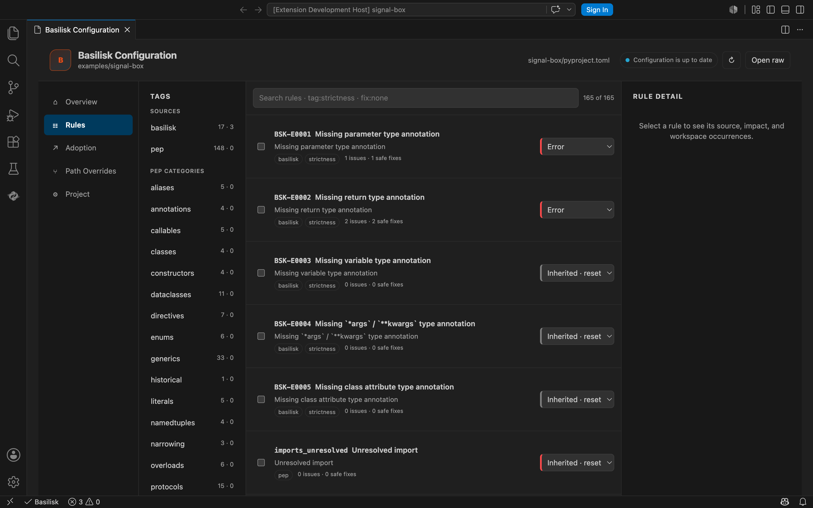
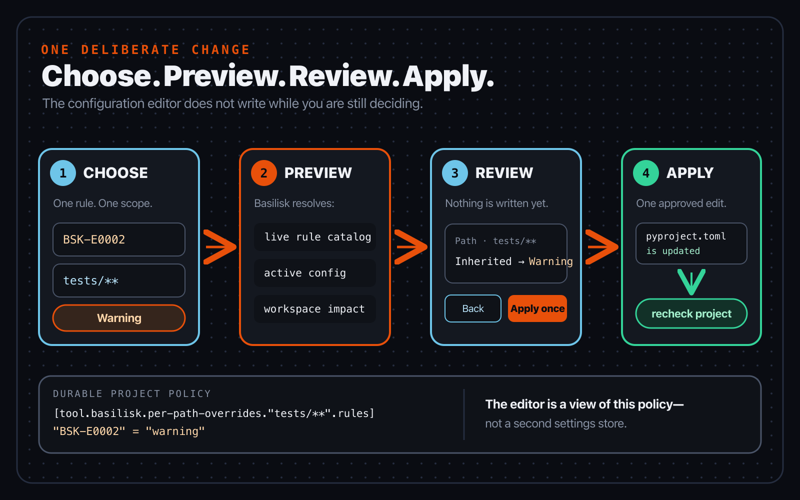
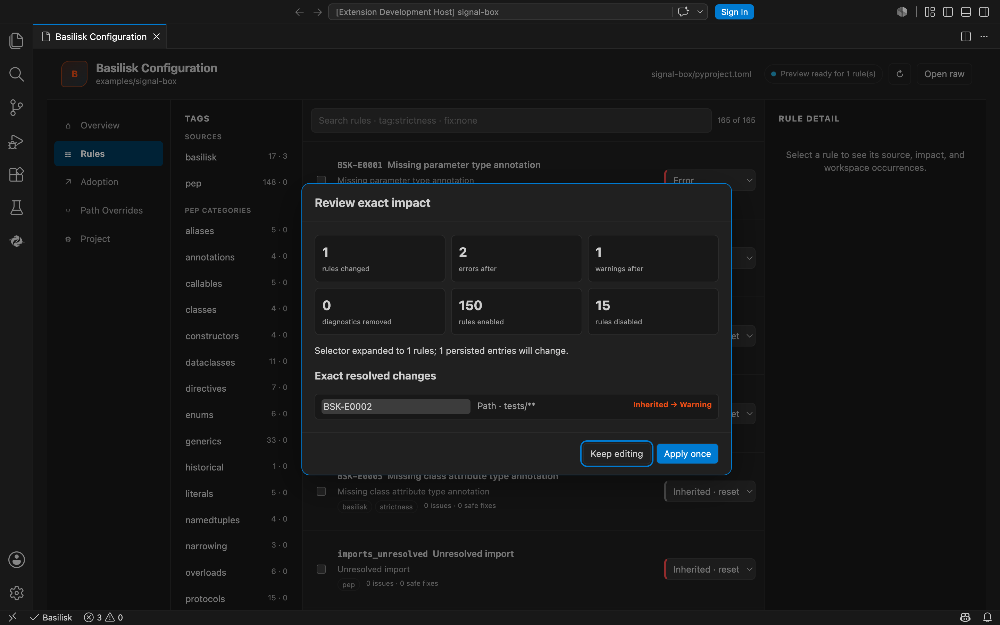

# Chapter 9 — Configure the project, not a mood

*Part III — Make it your workflow*

> **Reader promise:** Turn a typing preference into visible, reviewable project
> policy; use the Basilisk configuration editor to choose rules, preview their
> effect, and apply a bounded change.

Two people can agree about what a function means and still disagree about
whether every function must spell out its parameter and return types. That
second question is policy. If the answer lives only in somebody's memory—or in
an editor setting on one laptop—the project does not really have an answer.

This chapter puts the answer in the repository. We will enable two annotation
rules for Signal Box, inspect them in the real configuration editor, and
preview a narrower severity for tests. The important habit is not “turn on as
much as possible.” It is: make one deliberate choice, see exactly what it will
change, and leave a configuration another reader can understand.

## Python semantics and project policy are different layers

Python's authorities draw a useful boundary around this discussion. The
versioned Python documentation says:

> “The Python runtime does not enforce function and variable type
> annotations.” — [Python 3.12 `typing` documentation](https://docs.python.org/3.12/library/typing.html)

Changing a Basilisk severity therefore changes static feedback. It does not
insert a runtime check, convert a value, or change what Python executes. Your
tests still need to run; your program still needs to handle real input.

The maintained typing specification also says:

> “It is recommended but not required that checked functions have annotations
> for all arguments and the return type.” — [Python typing specification: annotations](https://typing.python.org/en/latest/spec/annotations.html)

That sentence is why this chapter treats required annotations as an explicit
Basilisk choice. `BSK-E0001` reports a missing parameter annotation and
`BSK-E0002` reports a missing return annotation, but both are opt-in Basilisk
rules. They are not requirements that the Python typing specification silently
forgot to mention.

There are consequently two useful rule sources in the editor:

- Core rules are selected by Basilisk's unconfigured default and implement the
  Python typing baseline used by the checker.
- Basilisk rules add project policy beyond that baseline and remain off until
  the project selects them.

This distinction is more precise than a “strictness level.” A project may want
required annotations but not another house rule, or may want an opt-in rule at
warning rather than error. A single label such as *strict* cannot express that
decision; a rule entry can.

## Keep one active policy source

The Python Packaging Authority provides the standard home for tool-owned
project data:

> “The `[tool]` table is where any tool related to your Python project … can
> have users specify configuration data.” — [`pyproject.toml` specification](https://packaging.python.org/en/latest/specifications/pyproject-toml/)

For a new Basilisk project, put policy under `[tool.basilisk]` in the
root-level `pyproject.toml`. The rule table is a child of that namespace:

```toml
[tool.basilisk.rules]
"BSK-E0001" = "error"
"BSK-E0002" = "error"
```

The quotes around these two keys are valid TOML and make the diagnostic codes
easy to recognize. This configuration makes both opt-in rules active at error
severity across the project.

Basilisk also understands a root-level `basilisk.json` compatibility file. If
both files exist, that JSON file is the active source; the two files are not
merged. The configuration editor shows the active source in its header and
shows any lower-priority source in the Project view. Check that label before
you edit. Changing a shadowed `pyproject.toml` and expecting it to win is a
particularly quiet way to waste an afternoon.

The editor itself is not a second policy store. It asks the Basilisk language
server for the live catalog and active configuration, then asks the server to
prepare and apply changes to that file. **Open raw** takes you back to the
durable source of truth.

## Read the Rules view

In VS Code, open the Command Palette and run **Basilisk: Open Configuration
Editor**. The command appears when the running Basilisk server advertises the
configuration-editor capability. It opens a full editor tab, leaving enough
room for the rule list and its evidence.



*Figure 9.1 — The capture uses the book's Signal Box workspace and a real
Basilisk language server. The totals belong to this captured source snapshot;
the stable lesson is the structure of the view, not a frozen rule count.*

Read the screen from left to right:

1. **Sections** separate the overview, rules, adoption work, path overrides,
   and project source. We are staying in Rules for now.
2. **Tags** filter the server's live catalog. Sources distinguish core and
   opt-in rules; PEP categories organize typing topics; policy tags group
   concerns such as `strictness`. A tag is a way to find rules, not a hidden
   switch.
3. **Search** accepts ordinary rule text and focused terms. Try
   `tag:strictness`, `severity:error`, `status:inherited`, or
   `has:diagnostics`. Combine terms to narrow the list.
4. **Rule rows** show the stable code, title, short explanation, tags, current
   issue/fix counts, and a severity control. Select the rule title to open its
   detail and occurrences.
5. **The source badge** tells you which root file will receive an approved
   edit. In the capture it is Signal Box's `pyproject.toml`.

Do not turn a moving total from this screen into team policy. “We enable
`BSK-E0002` at error” is reviewable. “We enable all 165 rules” will become stale
as the catalog changes and does not explain why any one rule belongs.

## Six editor choices, four stored severities

Each rule control offers six choices. Two are editing intentions; four are
values that can be stored.

| Editor choice | What it means | Stored result |
|---|---|---|
| **Inherited · reset** | Remove this explicit entry and return to the rule's default selection | No entry |
| **Native severity** | Use the concrete severity declared by this rule | `error`, `warning`, `info`, or `disabled` |
| **Error** | Select the rule and report its diagnostics as errors | `error` |
| **Warning** | Select the rule and report its diagnostics as warnings | `warning` |
| **Info** | Select the rule and report its diagnostics as information | `info` |
| **Disabled** | Keep an explicit record that the rule is off | `disabled` |

The subtle choice is **Inherited**. It does not mean “native.” It means “remove
my decision.” A default-on core rule then returns to its default severity. An
opt-in Basilisk rule returns to being off unless a more specific path entry
selects it.

**Native severity** does make a decision. Basilisk resolves the rule's declared
severity and writes that concrete value; the word `native` does not appear in
the TOML. For an opt-in rule, Error, Warning, Info, and Native all select the
rule. Disabled does not.

This separation also keeps two authorities in their proper places. The Python
typing specification owns the typing relationship. Basilisk's verified
implementation owns its stable code, message, configured severity, and editor
control.

## Preview before the file changes

Changing a rule control does not immediately edit the project. It asks the
language server to calculate a preview from the active configuration, the live
rule catalog, and the current workspace diagnostics. The preview expands a tag
or rule selection into concrete rule codes and shows both the persisted change
and its hypothetical diagnostic impact.



*Figure 9.2 — Configuration is a short transaction: choose, preview, review,
then apply once. Until the last step, `pyproject.toml` is unchanged.*

Signal Box has one missing-return diagnostic in its test helper. The project
policy reports `BSK-E0002` as an error, but we can preview a warning for the
bounded `tests/**` path. The exact intended result is:

```toml
[tool.basilisk.rules]
"BSK-E0001" = "error"
"BSK-E0002" = "error"

[tool.basilisk.per-path-overrides."tests/**".rules]
"BSK-E0002" = "warning"
```

The path pattern is relative to the project root and uses forward slashes. For
a matching test file, the path entry wins over the project entry for this one
rule. Source files elsewhere still receive the project-level error.



*Figure 9.3 — The captured preview is deliberately left unapplied. It proves
what would be written and how the current Signal Box diagnostics would be
reclassified without mutating the fixture used to reproduce the image.*

Read the lower line first: it names `BSK-E0002`, the `tests/**` path, and the
change from inherited path behaviour to Warning. Then read the impact cards.
Those numbers are a forecast for the current workspace, not a promise about
future files. **Keep editing** closes the preview. **Apply once** approves this
specific preview, writes the active project file through a VS Code workspace
edit, and asks Basilisk to recheck the root.

If the configuration changes after the preview was calculated, Basilisk
rejects the stale revision instead of overwriting the newer text. Refresh,
read the new source, and preview again. That interruption is useful: the facts
on which you based the decision have changed.

Path entries are best when they express a real boundary—tests, generated code,
or a deliberately isolated compatibility area. Keep patterns simple and avoid
overlap where possible. If patterns overlap, an exact non-wildcard path wins
over a wildcard; deeper and more literal patterns then outrank broader ones.
You should not need that rule to understand an ordinary configuration.

## Presets are recipes, not modes

The editor can advertise presets such as **Strict**, **Maximum**, and
**Suppression audit**. Treat them as reviewable batch recipes:

- Strict previews every live rule at its own native severity.
- Maximum previews every live rule at error severity.
- Suppression audit previews the suppression-policy tag at native severity.

Applying one expands it into ordinary per-rule entries. Basilisk does not store
`mode = "strict"`, and the preset does not hover in the background changing
meaning later. This is valuable, but it is also a large policy decision. Read
the preview and prefer selecting the rules whose purpose you can explain.

## Signal Box checkpoint

Open `book/examples/signal-box` as the VS Code workspace, then work through one
complete decision:

1. Run `basilisk check` from the Signal Box root. Identify the missing
   parameter annotation in `src/signal_box/readings.py` and the two missing
   return annotations. They are errors because the project explicitly selects
   `BSK-E0001` and `BSK-E0002` at error.
2. Open **Basilisk: Open Configuration Editor**. Confirm that the source badge
   names `signal-box/pyproject.toml`.
3. In Rules, select `BSK-E0002`. Open Path Overrides, enter `tests/**`, choose
   Warning, and request a preview.
4. Before applying, predict the result: the helper in
   `tests/test_readings.py` becomes a warning; the missing return in
   `src/signal_box/readings.py` remains an error; the missing parameter remains
   an error because this change names only `BSK-E0002`.
5. Compare your prediction with the impact preview. Apply once, open the raw
   configuration, and find the new path table.
6. Run the check again. Then use **Inherited · reset** at that path and confirm
   that the explicit test entry disappears and project-level error behaviour
   returns.

For a guided variation, keep the same path and preview Info rather than
Warning. Which diagnostics change category, and which remain untouched?

For an independent variation, choose one real directory in your own project
and one rule whose purpose you understand. Write down the expected affected
files before opening the preview. If the preview surprises you, keep editing;
the surprise is evidence that the proposed policy was not yet clear enough.

Project and path settings answer broad, durable questions. An inline
`# type: ignore` answers a different question about one source line; the
[official specification](https://typing.python.org/en/latest/spec/directives.html)
defines that comment as a way to silence type-checker errors. Use the narrowest
scope that honestly represents the reason, and do not scatter inline exceptions
when the repository is actually making a project choice.

## What changed

- Python typing semantics and Basilisk project policy now occupy separate
  layers in your mental model.
- Opt-in rules become active through an explicit non-disabled severity.
- Inherited removes a decision; Native writes a concrete decision.
- The configuration editor renders server-owned rules and edits the active
  project file rather than keeping a private settings copy.
- Preview makes the exact scope, persisted entry, and current diagnostic impact
  visible before Apply once.
- A path override changes one named rule in one bounded area without weakening
  unrelated checks.
- Presets expand into ordinary rule entries; they are recipes, not modes.

The live [Basilisk configuration guide](https://www.basilisk-python.dev/docs/configuration/)
is the companion reference for syntax, and the generated
[rule reference](https://www.basilisk-python.dev/docs/rules/) explains the
current catalog. Check both against the Basilisk release used by your project.

## Authoritative sources

- [The Python type system](https://typing.python.org/en/latest/spec/type-system.html)
- [Python typing specification: annotations](https://typing.python.org/en/latest/spec/annotations.html)
- [Python typing specification: type-checker directives](https://typing.python.org/en/latest/spec/directives.html)
- [Python 3.12 `typing` documentation](https://docs.python.org/3.12/library/typing.html)
- [`pyproject.toml` specification](https://packaging.python.org/en/latest/specifications/pyproject-toml/)
- [Basilisk configuration guide](https://www.basilisk-python.dev/docs/configuration/)
- [Basilisk rule reference](https://www.basilisk-python.dev/docs/rules/)
