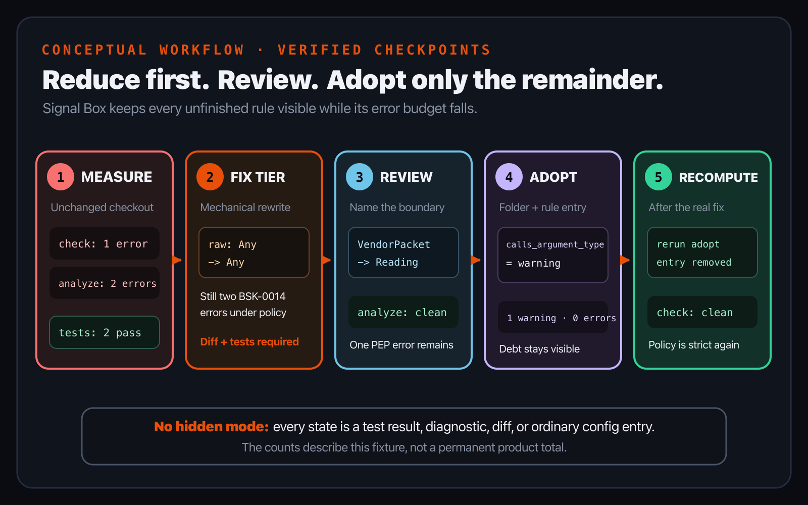
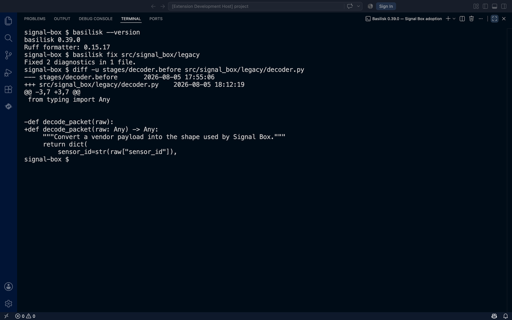
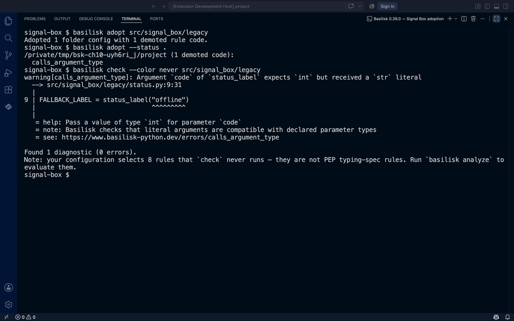

# Chapter 10 — Adopt a codebase without hiding it

*Part III — Make it your workflow*

> **Reader promise:** Reduce the mechanical part of an existing codebase's
> type debt, replace placeholders with reviewed contracts, and keep the honest
> remainder visible while new work follows the chosen policy.

A strict policy is easy to state on an empty project. An existing project is
different: it already has users, behavior, tests, awkward boundaries, and code
that cannot all stop while annotations catch up. Turning every diagnostic into
an error at once may block useful work. Turning the checker off makes the work
disappear. Neither choice is a migration plan.

Basilisk 0.39.0 offers smaller operations. `fix` applies a selected set of
source edits immediately. `adopt` records currently firing error rule codes as
warning entries in the nearest governing `pyproject.toml`. The two commands are
separate. Between them sits the important part: run the program, inspect the
diff, and decide what the types actually mean.

This chapter stays inside the official 0.39.0 release. Its
[mass-autofix and adoption specification](https://github.com/Nimblesite/Basilisk/blob/b8ae454cfabc54d26d7e4efc029f2f01bd083bc8/docs/specs/LSP-MASS-AUTOFIX-SPEC.md)
defines the intended model; the commands and results below were also checked
against the published release binary. That executable evidence matters most
where a label such as *safe* could otherwise sound stronger than the edit it
describes.

## Inventory before editing

Begin from an unchanged checkout. Run the runtime suite first, then both
analysis lanes selected in Chapter 9:

```console
PYTHONDONTWRITEBYTECODE=1 PYTHONPATH=src \
  python3 -m unittest discover -s tests -v
basilisk check --color never
basilisk analyze --color never
```

The tests preserve what the program does. `check` reports Python typing-spec
problems. `analyze` reports the opt-in Basilisk rules selected by project
policy. Keep those outcomes separate: three diagnostics across two commands
are not a mysterious “score,” and Basilisk 0.39.0 has no migration percentage
or coverage command.

Group the inventory by two things:

1. **Boundary.** Start with data entering the system, public functions, and
   module interfaces. A contract there removes repeated guessing downstream.
2. **Rule code.** One mechanical rule repeated fifty times is different work
   from fifty incompatible calls that each need a domain decision.

Signal Box begins with two missing-annotation errors in its legacy decoder and
one incompatible call in its status adapter. Its two runtime tests pass. That
is a useful baseline: current behavior is known, and all three static problems
are still visible.



*Figure 10.1 — Adoption is a sequence of evidence-preserving checkpoints, not
a mode. These counts belong to the Chapter 10 fixture; they are not a product
metric.*

## Make a checkpoint before `fix`

`basilisk fix` is a writer. Version 0.39.0 has no dry-run flag, review list, or
automatic backup. Run it only where you can inspect and reverse its file
changes: a clean working copy, a short-lived branch, or a disposable copy of
the target folder.

With no flags, the release selects its default fix tier. `--rules` narrows the
operation to comma-separated codes; `--rules all` and `--unsafe` widen it to
the complete fixable set. Explicit scope is valuable even for the default
tier:

```console
basilisk fix src/signal_box/legacy
```

The command walks directories recursively and writes accepted edits in one
pass. If candidate edits overlap, a later overlap is skipped; a normal recheck
is how you discover what remains. “Fixed 2 diagnostics” therefore means two
edits were applied. It does not mean the project, the file, or even the
relevant policy is now clean.



*Figure 10.2 — This is an actual 0.39.0 run in VS Code's integrated terminal.
The command edits the file immediately; the separate `diff` is the review
surface.*

The diff is deliberately modest:

```diff
-def decode_packet(raw):
+def decode_packet(raw: Any) -> Any:
```

That is useful mechanical work, but it is not domain inference. Under Signal
Box's `strictness = "error"` policy, re-running `analyze` replaces the two
missing-annotation errors with two `BSK-0014` explicit-`Any` errors. The work
has been located, not completed.

There is also a runtime edge worth making explicit. The 0.39.0 fixes insert
bare `Any` text but do not add `from typing import Any`. On Python versions
that evaluate annotations eagerly, a missing import can fail when the module
is imported. The staged Signal Box input already imports `Any`, which is why
its tests remain green after the generated edit. In other code, add the import
or—preferably—replace the placeholder before trusting the result. The Python
typing specification describes [`Any` as a special type](https://typing.python.org/en/latest/spec/special-types.html),
not as evidence that every value is valid for the domain.

This is the right reading of the release's *safe* tier: it is a static
rule-code allowlist that excludes the wider `--unsafe` set. It is not a
per-edit proof of runtime safety, completeness, or design quality.

## Replace the placeholder at the boundary

The decoder receives a mapping from a vendor and returns the shape used by the
rest of Signal Box. Annotating both sides as `Any` erases precisely the
relationship we need. Review the caller, the returned keys, and the runtime
test, then name the contract:

```python
from typing import TypedDict


class VendorPacket(TypedDict):
    sensor_id: str
    celsius: float


class Reading(TypedDict):
    sensor_id: str
    celsius: float


def decode_packet(raw: VendorPacket) -> Reading:
    return {
        "sensor_id": raw["sensor_id"],
        "celsius": raw["celsius"],
    }
```

The [typing specification for `TypedDict`](https://typing.python.org/en/latest/spec/typeddict.html)
defines a structural type for dictionaries with a specific set of string keys.
That makes it a good boundary description here: the function still consumes
and returns ordinary dictionaries at runtime, while static analysis can check
the required fields and their value types.

Run the two runtime tests again, then `analyze`. The tests still pass and the
two annotation-policy errors are gone. Only the incompatible status call from
the `check` lane remains. This order—mechanical edit, runtime evidence, domain
review, both analysis lanes—prevents a large rewrite from being mistaken for
one trustworthy decision.

## Adopt the honest remainder

Suppose the vendor really can send the string `"offline"`, but the team has
not yet decided whether the adapter should accept both strings and integers or
normalize the value earlier. That is real debt. It should not block every
unrelated change, and it should not vanish.

From the reviewed checkpoint, run:

```console
basilisk adopt src/signal_box/legacy
basilisk adopt --status .
basilisk check --color never src/signal_box/legacy
```

The first command checks the selected scope, finds the remaining error code,
and writes an ordinary warning entry in the nearest configuration governing
the affected file:

```toml
[tool.basilisk.rules]
calls_argument_type = "warning"
```

There is no adoption database, exact-file marker, or hidden mode. The second
command reads warning entries from governing configurations and prints the
folder plus its demoted rule codes. It does not list files, occurrences,
percentages, or an estimate of work remaining.



*Figure 10.3 — Adoption changes severity, not truth. The incompatible call is
still printed with its source span, help, note, and documentation link; the
summary is one diagnostic and zero errors.*

Warnings do not make the command fail with exit status 1, so a team can hold
new work to an error budget while paying down known debt. But the entry is
folder-and-rule policy. In this small fixture the nearest configuration is the
project root. A new `calls_argument_type` violation governed by that same file
will also be a warning, even if it is in a different source file. Passing one
file to `adopt` does **not** create a file exception. If a legacy subsystem
needs a narrower boundary, give that folder its own `[tool.basilisk]` table and
review the resulting configuration diff.

## Warning entries have no ownership label

The simple representation has one sharp edge in 0.39.0: `adopt --status`
treats every rule entry whose value is `warning` as adopted debt. It cannot
distinguish an entry written by `adopt` from an intentional warning policy a
person wrote earlier. For the same reason, `unadopt` deletes every warning
rule entry in the governing configuration it targets.

Use `unadopt` narrowly and inspect the diff:

```console
basilisk unadopt src/signal_box/legacy
```

That path selects governing folder configurations; it does not restore only
one file. Nor can it reconstruct a same-level error entry that adoption
overwrote. Keep the durable strict policy in an ancestor or tag entry, with
warning overrides below it, so deleting the override reveals a known strict
fallback. Signal Box uses:

```toml
[tool.basilisk.rule-tags]
strictness = "error"
```

Its adopted `calls_argument_type` is a Python typing-spec rule whose missing
entry already resolves to error. Removing this fixture's only warning entry is
therefore an honest round trip: the visible diagnostic becomes an error again.
Do not generalize that result to arbitrary configurations without reading
their parent and tag policy first.

## Graduation is an explicit rerun

Adoption is not a background process. After the team settles the vendor
contract—perhaps by accepting a reviewed union or by normalizing the vendor
sentinel—run the tests and both analysis commands. Then run `basilisk adopt`
over the same scope again.

The 0.39.0 CLI recomputes current debt. If an adopted rule no longer fires in
that governing folder, it removes the stale warning entry. `adopt --status`
then stops listing it, and the strict fallback applies to future occurrences.
No daemon watches a percentage, no save event silently graduates a file, and
no clean result changes configuration until that explicit recomputation.

This gives code review four concrete things to examine:

- the behavior-preserving test result;
- the source diff produced or completed by the developer;
- the diagnostics that remain after both command lanes; and
- the exact warning entries added to or removed from `pyproject.toml`.

That is enough state. A separate migration dashboard would merely duplicate
facts already versioned with the code.

## Signal Box checkpoint

The complete example lives in `book/examples/ch10-adoption`. Its checked-in
state contains the reviewed `TypedDict` decoder and the one visible adopted
warning. To replay the journey without changing that checkpoint, copy the
directory elsewhere and restore the staged baseline files:

```console
cp -R book/examples/ch10-adoption /tmp/signal-box-adoption
cd /tmp/signal-box-adoption
cp stages/decoder.before src/signal_box/legacy/decoder.py
cp stages/pyproject.before pyproject.toml
```

Run tests, `check`, and `analyze`; expect two passing tests, one PEP error, and
two Basilisk annotation errors. Apply `basilisk fix
src/signal_box/legacy`, inspect the diff, rerun the tests, and confirm that
strict analysis now reports the two explicit-`Any` placeholders. Then apply
the reviewed boundary and adopt only the remainder:

```console
cp stages/decoder.reviewed src/signal_box/legacy/decoder.py
basilisk analyze --color never
basilisk adopt src/signal_box/legacy
basilisk adopt --status .
basilisk check --color never src/signal_box/legacy
```

The recorded result is `All checked. No issues found.` from `analyze`, one
demoted `calls_argument_type` code in adoption status, and the same source
diagnostic as a warning with `Found 1 diagnostic (0 errors).` The runtime tests
still pass.

For practice, resolve the meaning of `"offline"` without changing the runtime
test's expected value. Re-run the evidence sequence, then re-run `adopt` and
confirm that the warning entry disappears. Finally, restore the checked-in
checkpoint or discard the disposable copy.

## What changed

- Adoption is now a reviewable severity entry, not a checker mode or a way to
  suppress the evidence.
- `fix` writes immediately and has no preview; a clean checkpoint and a diff
  provide the review surface.
- The default fix tier is a static allowlist. Its `Any` placeholders and imports
  still require runtime testing and human design.
- Boundary contracts come before local detail because they remove uncertainty
  for every caller downstream.
- `adopt --status` reports governing folders and warning rule codes, not files
  or migration coverage.
- Adoption applies at folder-and-rule granularity, so new violations under the
  same configuration inherit the warning.
- Warning entries carry no ownership marker; inspect `unadopt` diffs and keep a
  durable strict fallback.
- Graduation happens when the CLI explicitly recomputes adoption after the
  underlying diagnostic is fixed.

The live [Basilisk migration guide](https://www.basilisk-python.dev/docs/migration/)
is the companion reference for the current release. Because migration commands
write source and configuration, verify its examples against the version pinned
by your project before applying them to a codebase.

## Authoritative sources

- [Python typing specification: special types](https://typing.python.org/en/latest/spec/special-types.html)
- [Python typing specification: typed dictionaries](https://typing.python.org/en/latest/spec/typeddict.html)
- [Basilisk migration guide](https://www.basilisk-python.dev/docs/migration/)
- [Basilisk 0.39.0 release](https://github.com/Nimblesite/Basilisk/releases/tag/v0.39.0)
- [Basilisk 0.39.0 mass-autofix and adoption specification](https://github.com/Nimblesite/Basilisk/blob/b8ae454cfabc54d26d7e4efc029f2f01bd083bc8/docs/specs/LSP-MASS-AUTOFIX-SPEC.md)
