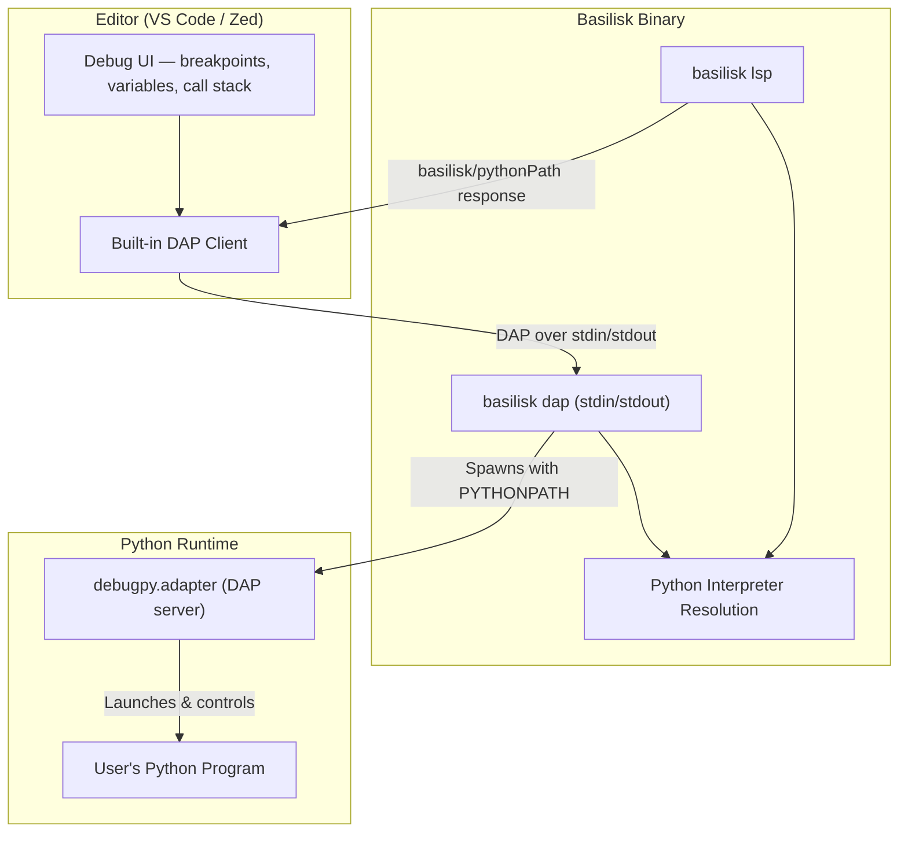
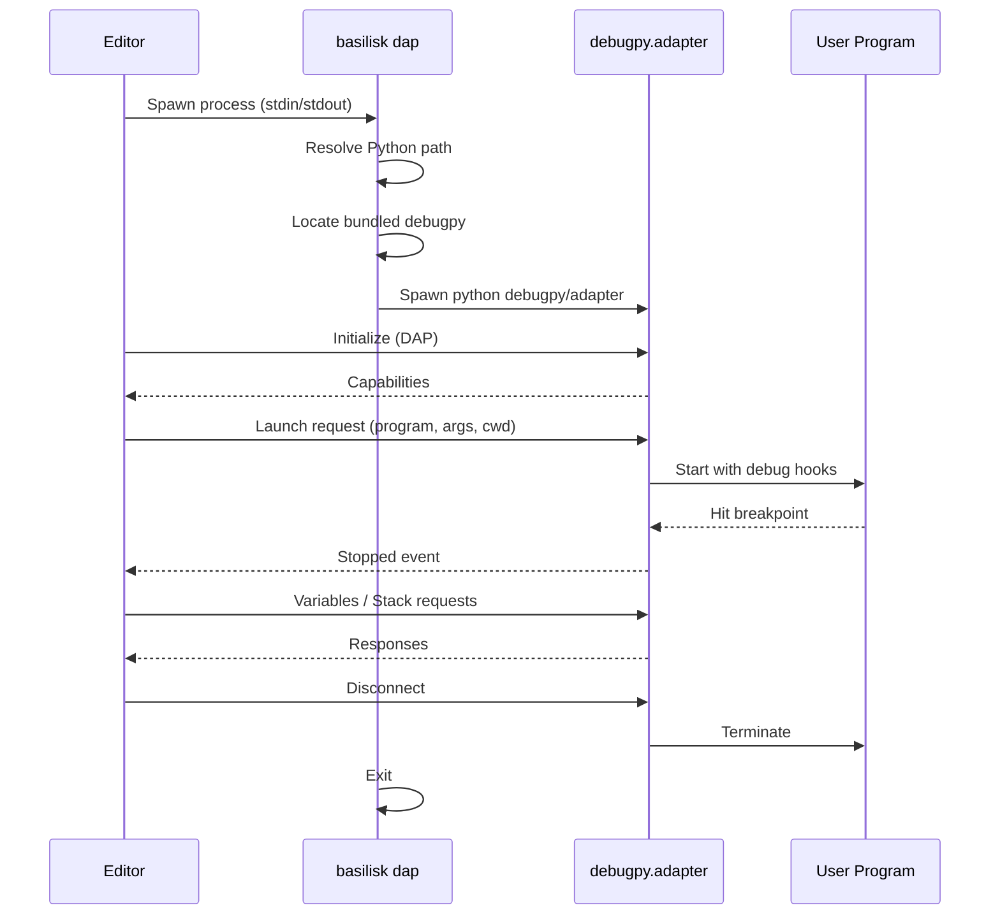
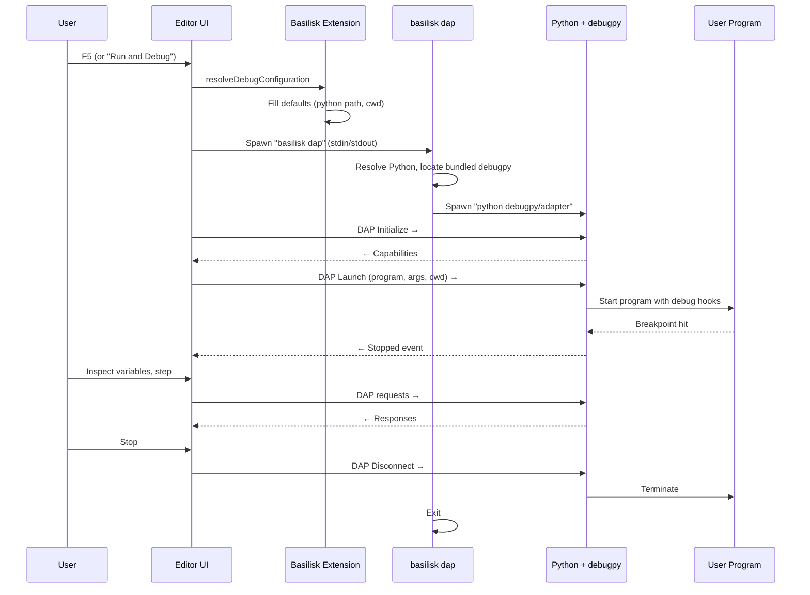
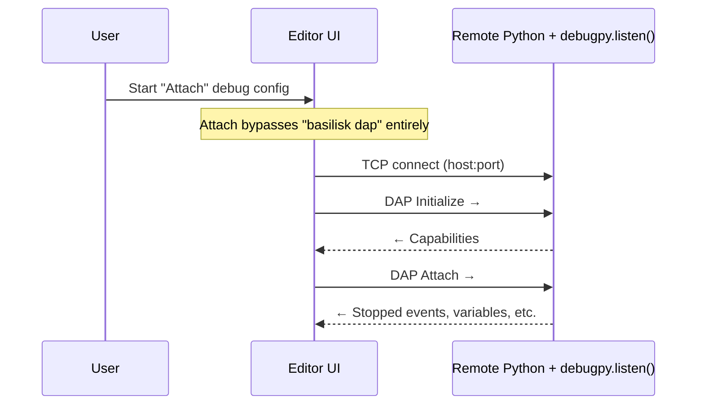
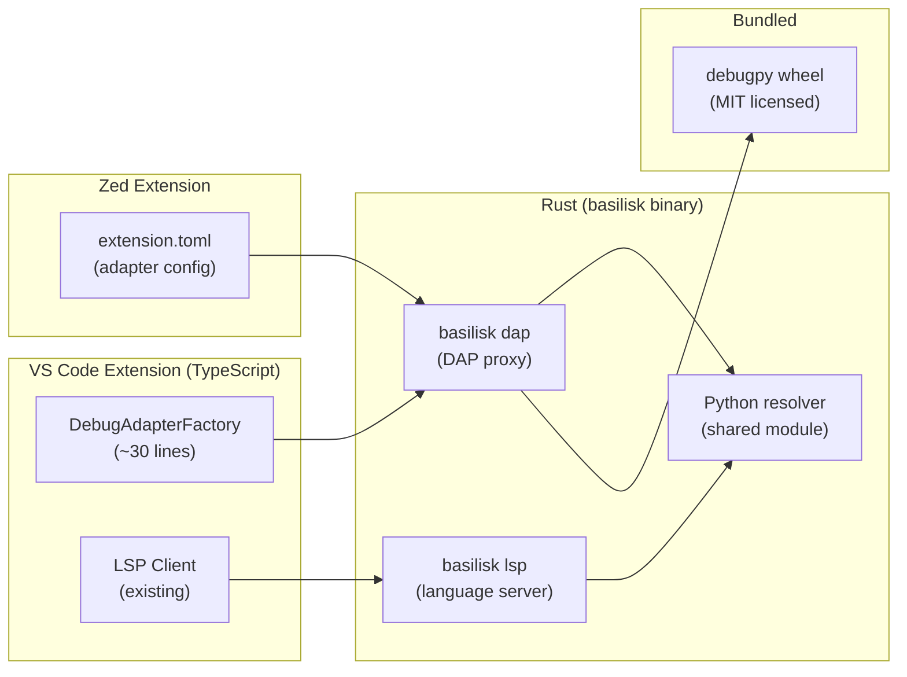

# Basilisk Debug Integration via debugpy

## Goal

One `basilisk` binary serves both VS Code and Zed. When a user installs the Basilisk extension in either editor, they get Python debugging out of the box — no Microsoft Python extension, no separate debugpy extension. The `basilisk dap` subcommand acts as the debug adapter, wrapping debugpy behind a standard DAP interface.

## Architecture Overview



The `basilisk dap` command is a transparent DAP proxy. It:

1. Resolves the Python interpreter (same logic the LSP uses)
2. Locates the bundled debugpy
3. Spawns `python <bundled-debugpy/adapter>` with `PYTHONPATH` set
4. Pipes DAP messages between the editor and debugpy over stdin/stdout

The editor handles all debugging UI. Basilisk just sets up the plumbing.

## How Editors Connect



Both VS Code and Zed follow this exact flow. The only difference is how each editor registers the debug adapter — VS Code uses `package.json` contributions, Zed uses its extension API.

## Part 1: Bundling debugpy

At build time, download the pure Python debugpy wheel from PyPI and extract it into the extension:

```
basilisk/
├── bundled/
│   └── libs/
│       └── debugpy/
│           ├── __init__.py
│           ├── adapter/
│           │   ├── __main__.py
│           │   └── ...
│           ├── launcher/
│           ├── server/
│           └── _vendored/
│               └── pydevd/
├── crates/
│   ├── basilisk-cli/
│   └── basilisk-lsp/
├── vscode-extension/
│   ├── package.json
│   └── src/extension.ts
└── ...
```

A wheel is just a zip file. Use the pure Python wheel (`debugpy-X.Y.Z-py2.py3-none-any.whl`) for a universal build. Platform-specific wheels add Cython speedups but aren't required for correctness.

Build script (add to `scripts/bundle-debugpy.sh`):

```bash
#!/usr/bin/env bash
set -euo pipefail

DEBUGPY_VERSION="1.8.20"
BUNDLE_DIR="bundled/libs"

mkdir -p "$BUNDLE_DIR"
pip download "debugpy==$DEBUGPY_VERSION" \
    --no-deps --only-binary=:none: -d /tmp/debugpy-wheels
unzip -o /tmp/debugpy-wheels/debugpy-*.whl -d "$BUNDLE_DIR"
rm -rf /tmp/debugpy-wheels
echo "Bundled debugpy $DEBUGPY_VERSION into $BUNDLE_DIR"
```

## Part 2: `basilisk dap` Subcommand (Rust)

Add a `Dap` variant to the CLI. This is the core of the integration — a thin Rust process that spawns debugpy and proxies stdin/stdout.

### CLI addition in `basilisk-cli/src/main.rs`

```rust
#[derive(Subcommand)]
enum Command {
    Check { /* ... */ },
    Lsp { /* ... */ },
    /// Start the Debug Adapter Protocol proxy (wraps debugpy).
    Dap {
        /// Path to Python interpreter. Auto-detected if omitted.
        #[arg(long)]
        python: Option<String>,
        /// Path to bundled debugpy libs directory.
        #[arg(long)]
        debugpy_path: Option<String>,
        /// Enable debugpy internal logging to this directory.
        #[arg(long)]
        log_dir: Option<String>,
    },
}
```

### DAP proxy implementation

The proxy is intentionally minimal — no DAP parsing needed. It spawns debugpy's adapter and copies bytes between the editor and the subprocess.

```rust
fn run_dap(
    python: Option<String>,
    debugpy_path: Option<String>,
    log_dir: Option<String>,
) -> i32 {
    let python_bin = python
        .unwrap_or_else(|| resolve_python_interpreter());

    let bundled = debugpy_path
        .unwrap_or_else(|| default_bundled_path());

    let adapter_path = PathBuf::from(&bundled)
        .join("debugpy")
        .join("adapter");

    let mut args = vec![adapter_path.to_string_lossy().into_owned()];
    if let Some(dir) = log_dir {
        args.push("--log-dir".to_owned());
        args.push(dir);
    }

    let mut child = match std::process::Command::new(&python_bin)
        .args(&args)
        .env("PYTHONPATH", &bundled)
        .stdin(std::process::Stdio::piped())
        .stdout(std::process::Stdio::piped())
        .stderr(std::process::Stdio::inherit())
        .spawn()
    {
        Ok(c) => c,
        Err(err) => {
            eprintln!("basilisk dap: failed to spawn debugpy: {err}");
            eprintln!("  python: {python_bin}");
            eprintln!("  adapter: {}", adapter_path.display());
            return 1;
        }
    };

    // Pipe stdin → child stdin and child stdout → stdout.
    // Two threads, blocking I/O. Simple and correct.
    let mut child_stdin = child.stdin.take().expect("piped stdin");
    let mut child_stdout = child.stdout.take().expect("piped stdout");

    let stdin_thread = std::thread::spawn(move || {
        let _ = std::io::copy(&mut std::io::stdin().lock(), &mut child_stdin);
    });

    let stdout_thread = std::thread::spawn(move || {
        let _ = std::io::copy(&mut child_stdout, &mut std::io::stdout().lock());
    });

    let status = child.wait().unwrap_or_else(|e| {
        eprintln!("basilisk dap: wait failed: {e}");
        std::process::exit(1);
    });

    let _ = stdin_thread.join();
    let _ = stdout_thread.join();

    status.code().unwrap_or(1)
}
```

### Python interpreter resolution

Reuse the same logic the LSP uses. Fallback chain:

```rust
fn resolve_python_interpreter() -> String {
    // 1. BASILISK_PYTHON env var (explicit override)
    if let Ok(p) = std::env::var("BASILISK_PYTHON") {
        return p;
    }

    // 2. Workspace venv: .venv/bin/python, venv/bin/python
    for venv in &[".venv", "venv"] {
        let bin = if cfg!(windows) {
            PathBuf::from(venv).join("Scripts").join("python.exe")
        } else {
            PathBuf::from(venv).join("bin").join("python")
        };
        if bin.exists() {
            return bin.to_string_lossy().into_owned();
        }
    }

    // 3. System Python
    if cfg!(windows) { "python".into() } else { "python3".into() }
}

fn default_bundled_path() -> String {
    // Relative to the basilisk binary
    let exe = std::env::current_exe().unwrap_or_default();
    let exe_dir = exe.parent().unwrap_or(Path::new("."));
    exe_dir.join("bundled").join("libs")
        .to_string_lossy().into_owned()
}
```

## Part 3: LSP Custom Request — `basilisk/pythonPath`

The LSP already knows the workspace. Expose the resolved Python path so editor extensions can use it in debug configurations.

Add to `basilisk-lsp/src/server.rs`:

```rust
// In the LanguageServer impl, handle custom request:
// Method: "basilisk/pythonPath"
// Params: { "workspaceFolder": "file:///path/to/project" }  (optional)
// Result: { "pythonPath": "/path/to/.venv/bin/python" }
```

This is a `workspace/executeCommand` with command `basilisk.pythonPath`, or a custom request. The extension calls it when building debug configurations.

## Part 4: VS Code Extension

Minimal additions to the existing extension. No `DebugAdapterDescriptorFactory` class needed — VS Code can invoke `basilisk dap` directly as an executable debug adapter.

### package.json additions

```json
{
  "contributes": {
    "debuggers": [
      {
        "type": "basilisk-debug",
        "label": "Python (Basilisk)",
        "languages": ["python"],
        "configurationAttributes": {
          "launch": {
            "required": ["program"],
            "properties": {
              "program": {
                "type": "string",
                "description": "Absolute path to the Python file to debug.",
                "default": "${file}"
              },
              "args": {
                "type": "array",
                "description": "Command-line arguments passed to the program.",
                "items": { "type": "string" },
                "default": []
              },
              "cwd": {
                "type": "string",
                "description": "Working directory for the program.",
                "default": "${workspaceFolder}"
              },
              "console": {
                "type": "string",
                "enum": ["integratedTerminal", "internalConsole", "externalTerminal"],
                "default": "integratedTerminal"
              },
              "justMyCode": {
                "type": "boolean",
                "default": true
              },
              "stopOnEntry": {
                "type": "boolean",
                "default": false
              },
              "python": {
                "type": "string",
                "description": "Path to the Python interpreter."
              }
            }
          },
          "attach": {
            "properties": {
              "connect": {
                "type": "object",
                "properties": {
                  "host": { "type": "string", "default": "localhost" },
                  "port": { "type": "number" }
                },
                "required": ["port"]
              }
            }
          }
        },
        "configurationSnippets": [
          {
            "label": "Basilisk: Launch Current File",
            "description": "Debug the currently open Python file",
            "body": {
              "name": "Python: Current File (Basilisk)",
              "type": "basilisk-debug",
              "request": "launch",
              "program": "^\"\\${file}\"",
              "console": "integratedTerminal",
              "justMyCode": true
            }
          }
        ],
        "initialConfigurations": [
          {
            "name": "Python: Current File (Basilisk)",
            "type": "basilisk-debug",
            "request": "launch",
            "program": "${file}",
            "console": "integratedTerminal",
            "justMyCode": true
          }
        ]
      }
    ]
  }
}
```

### extension.ts additions

Add a `DebugAdapterDescriptorFactory` that points to `basilisk dap`. This goes in the existing `activate()` function:

```typescript
// In activate(), after LSP client setup:

class BasiliskDebugAdapterFactory implements vscode.DebugAdapterDescriptorFactory {
  constructor(private executablePath: string) {}

  createDebugAdapterDescriptor(
    session: vscode.DebugSession,
  ): vscode.ProviderResult<vscode.DebugAdapterDescriptor> {
    const config = session.configuration;

    // Attach mode: connect directly to an already-running debugpy server
    if (config.request === 'attach' && config.connect) {
      return new vscode.DebugAdapterServer(
        config.connect.port,
        config.connect.host || 'localhost'
      );
    }

    // Launch mode: use `basilisk dap` as the debug adapter executable
    const args = ['dap'];
    if (config.python) {
      args.push('--python', config.python);
    }
    return new vscode.DebugAdapterExecutable(this.executablePath, args);
  }
}

// Register
context.subscriptions.push(
  vscode.debug.registerDebugAdapterDescriptorFactory(
    'basilisk-debug',
    new BasiliskDebugAdapterFactory(executablePath)
  )
);
```

That's it for VS Code. The existing `resolveExecutablePath()` already handles finding the `basilisk` binary. The same binary that runs `basilisk lsp` now also runs `basilisk dap`.

## Part 5: Zed Extension

Zed's debug adapter support uses a similar model. The Zed extension declares the adapter in its `extension.toml` and provides the binary path:

```toml
[debug_adapters.basilisk-debug]
name = "Python (Basilisk)"
languages = ["Python"]
adapter_type = "executable"
command = "basilisk"
args = ["dap"]
```

Zed handles DAP communication identically to VS Code — stdin/stdout with the spawned process. No additional code needed beyond the extension manifest.

## Data Flow: Launch Session



## Data Flow: Attach Session



For attach, the editor connects directly over TCP to the remote debugpy server. The `basilisk dap` proxy is not involved.

## Component Ownership



## Implementation Plan (Priority Order)

### Day 1: `basilisk dap` subcommand
- Add `Dap` variant to CLI
- Implement the stdin/stdout proxy (spawn debugpy, copy bytes)
- Implement `resolve_python_interpreter()` and `default_bundled_path()`
- Test manually: `echo '...' | basilisk dap` and verify debugpy spawns

### Day 2: Bundle debugpy + VS Code integration
- Write `scripts/bundle-debugpy.sh`, run it
- Add `debuggers` contribution to `vscode-extension/package.json`
- Add `BasiliskDebugAdapterFactory` to `extension.ts` (~30 lines)
- Test: open a `.py` file, F5, verify breakpoints work

### Day 3: Polish + Zed
- Add `basilisk/pythonPath` custom LSP request
- Add Zed extension manifest for debug adapter
- Error handling: missing Python, missing debugpy, spawn failures
- Test attach mode

## Key Design Decisions

**`basilisk dap` as a transparent proxy, not a DAP implementation.** The Rust binary doesn't parse or understand DAP messages. It just spawns debugpy and copies bytes. This means zero DAP maintenance burden — debugpy handles all protocol evolution.

**Same binary for LSP and DAP.** Users install one thing. The extension already knows where the binary is. No second executable to find or configure.

**Shared Python resolution.** Both `basilisk lsp` and `basilisk dap` use the same interpreter discovery logic. The interpreter the LSP type-checks against is the same one the debugger runs.

**Editor-agnostic core.** All debugger logic lives in Rust. Editor-specific code is minimal — ~30 lines of TypeScript for VS Code, ~5 lines of TOML for Zed.

**Use `basilisk-debug` as the debug type.** Avoids conflicts with Microsoft's `debugpy` and `python` types. Users can have both extensions installed.

## Licensing

debugpy is MIT-licensed. It vendors pydevd (EPL-2.0). Both are OSI-approved. Bundling is permitted. Include license texts in `THIRD_PARTY_LICENSES`.

Basilisk invokes debugpy as a subprocess and communicates via standard DAP — no copyleft obligations on Basilisk's code from the EPL.
