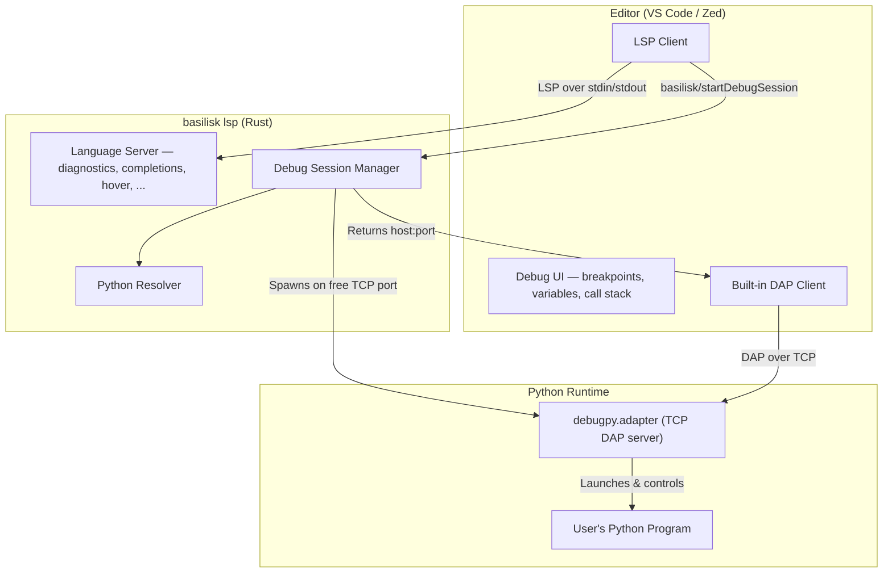
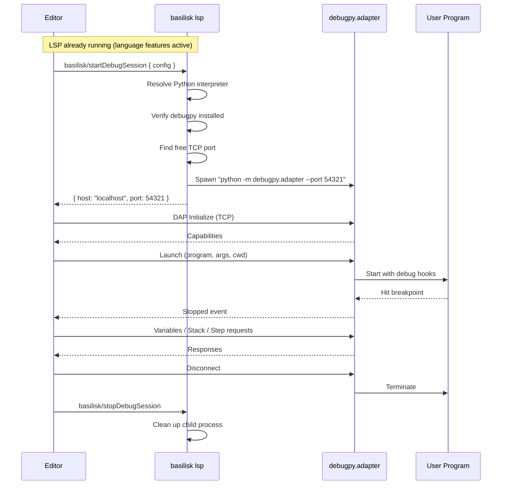
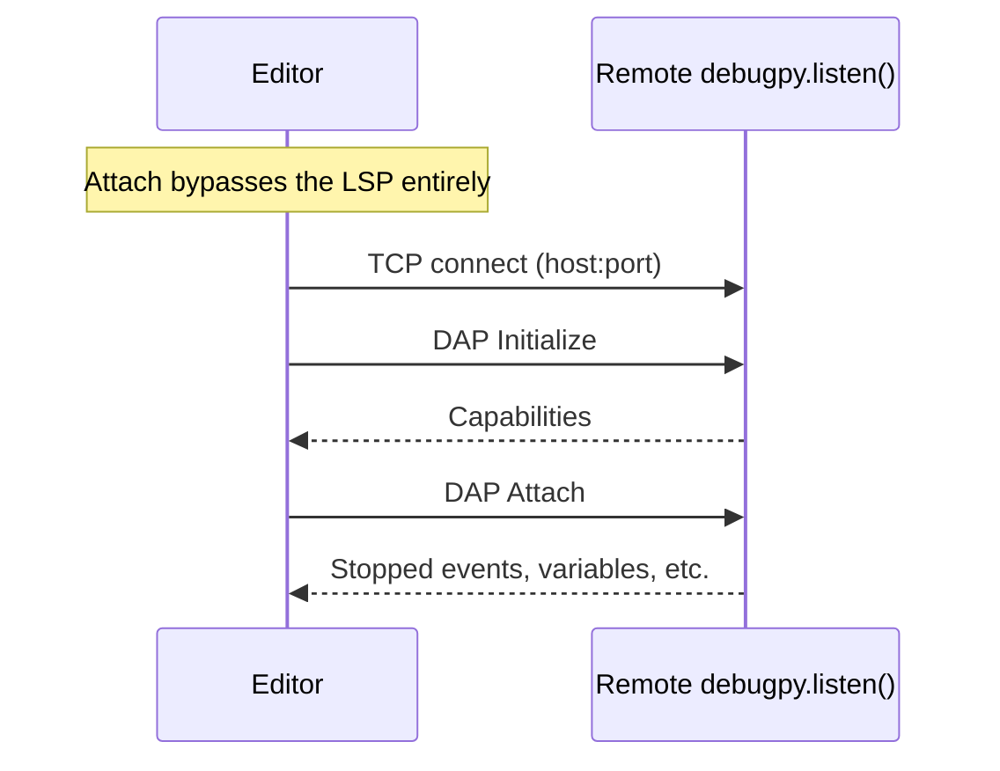
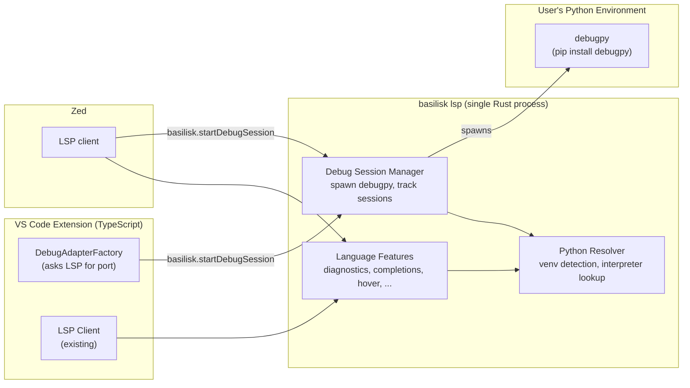

# Basilisk Debug Integration via debugpy

## Goal

The Basilisk LSP **is** the debug adapter. When the editor needs to debug Python, it sends a custom LSP request. The LSP spawns debugpy on a TCP port and tells the editor where to connect. No separate binary, no separate process, no bundling. One LSP, both editors.

## Architecture



The LSP already runs as a long-lived process. It already knows the workspace roots and can resolve the Python interpreter. Adding debug session management is a natural extension — not a separate system.

## How It Works



The editor's DAP client connects directly to debugpy over TCP. The LSP just brokers the connection — it doesn't proxy any DAP traffic.

## Part 1: LSP Custom Requests (Rust)

Add two custom requests to the LSP server and a Python resolver module.

### `basilisk/startDebugSession`

**Request:**
```json
{
    "program": "/path/to/script.py",
    "args": ["--verbose"],
    "cwd": "/path/to/project",
    "python": null,
    "justMyCode": true,
    "stopOnEntry": false
}
```

**Response:**
```json
{
    "host": "localhost",
    "port": 54321,
    "sessionId": "a1b2c3"
}
```

### `basilisk/stopDebugSession`

**Request:**
```json
{
    "sessionId": "a1b2c3"
}
```

**Response:**
```json
{
    "stopped": true
}
```

### Rust implementation sketch

Add a `debug.rs` module to `basilisk-lsp`:

```rust
use std::collections::HashMap;
use std::net::TcpListener;
use std::process::{Child, Command};
use tokio::sync::Mutex;

/// Tracks active debug sessions spawned by the LSP.
pub struct DebugSessionManager {
    sessions: Mutex<HashMap<String, Child>>,
}

impl DebugSessionManager {
    pub fn new() -> Self {
        Self {
            sessions: Mutex::new(HashMap::new()),
        }
    }

    /// Spawn debugpy on a free TCP port. Returns (host, port, session_id).
    pub async fn start_session(
        &self,
        python_path: &str,
        config: &DebugConfig,
    ) -> Result<(String, u16, String), DebugError> {
        // Find a free port by binding to :0 and reading the assigned port.
        let port = find_free_port()?;
        let session_id = generate_session_id();

        let child = Command::new(python_path)
            .args(["-m", "debugpy.adapter", "--port", &port.to_string()])
            .spawn()
            .map_err(DebugError::SpawnFailed)?;

        self.sessions
            .lock()
            .await
            .insert(session_id.clone(), child);

        Ok(("localhost".to_owned(), port, session_id))
    }

    /// Kill a debug session and clean up.
    pub async fn stop_session(&self, session_id: &str) -> bool {
        let mut sessions = self.sessions.lock().await;
        if let Some(mut child) = sessions.remove(session_id) {
            let _ = child.kill();
            let _ = child.wait();
            return true;
        }
        false
    }
}

fn find_free_port() -> Result<u16, DebugError> {
    let listener = TcpListener::bind("127.0.0.1:0")
        .map_err(DebugError::PortAllocation)?;
    let port = listener.local_addr()
        .map_err(DebugError::PortAllocation)?
        .port();
    // Dropping listener frees the port for debugpy to bind.
    Ok(port)
}
```

### Python resolver

The LSP already has workspace roots. The resolver checks them:

```rust
/// Resolve the Python interpreter for a workspace.
pub fn resolve_python(workspace_root: &Path) -> String {
    // 1. BASILISK_PYTHON env var
    if let Ok(p) = std::env::var("BASILISK_PYTHON") {
        return p;
    }

    // 2. Workspace venv
    for venv_dir in &[".venv", "venv"] {
        let bin = if cfg!(windows) {
            workspace_root.join(venv_dir).join("Scripts").join("python.exe")
        } else {
            workspace_root.join(venv_dir).join("bin").join("python")
        };
        if bin.exists() {
            return bin.to_string_lossy().into_owned();
        }
    }

    // 3. System fallback
    if cfg!(windows) { "python".into() } else { "python3".into() }
}

/// Check if debugpy is importable by the given interpreter.
pub fn check_debugpy(python: &str) -> Result<(), DebugError> {
    let output = Command::new(python)
        .args(["-c", "import debugpy; print(debugpy.__version__)"])
        .output()
        .map_err(DebugError::SpawnFailed)?;

    if output.status.success() {
        Ok(())
    } else {
        Err(DebugError::DebugpyNotFound(python.to_owned()))
    }
}
```

### Wire into the LSP server

In `server.rs`, add the `DebugSessionManager` to `LspServer` and handle the custom requests via `execute_command`:

```rust
pub struct LspServer {
    client: Client,
    documents: DashMap<Url, DocumentState>,
    workspace_roots: tokio::sync::RwLock<Vec<std::path::PathBuf>>,
    debug_manager: DebugSessionManager,  // NEW
}

// In execute_command handler, add:
"basilisk.startDebugSession" => {
    let config: DebugConfig = serde_json::from_value(args)?;
    let workspace = self.workspace_roots.read().await;
    let root = workspace.first().map(|p| p.as_path()).unwrap_or(Path::new("."));
    let python = config.python.unwrap_or_else(|| resolve_python(root));

    check_debugpy(&python)?;

    let (host, port, session_id) = self.debug_manager
        .start_session(&python, &config)
        .await?;

    Ok(Some(serde_json::json!({
        "host": host,
        "port": port,
        "sessionId": session_id
    })))
}

"basilisk.stopDebugSession" => {
    let session_id = args.first()
        .and_then(|v| v.as_str())
        .unwrap_or_default();
    let stopped = self.debug_manager.stop_session(session_id).await;
    Ok(Some(serde_json::json!({ "stopped": stopped })))
}
```

Register the commands in `initialize`:

```rust
execute_command_provider: Some(ExecuteCommandOptions {
    commands: vec![
        "basilisk.organizeImports".to_owned(),
        "basilisk.startDebugSession".to_owned(),  // NEW
        "basilisk.stopDebugSession".to_owned(),    // NEW
    ],
    ..Default::default()
}),
```

## Part 2: VS Code Extension

The extension registers a debug type and a factory. When VS Code starts a debug session, the factory asks the LSP to spawn debugpy and returns the TCP port.

### package.json additions

```json
{
  "contributes": {
    "debuggers": [
      {
        "type": "basilisk-debug",
        "label": "Python (Basilisk)",
        "languages": ["python"],
        "configurationAttributes": {
          "launch": {
            "required": ["program"],
            "properties": {
              "program": {
                "type": "string",
                "description": "Absolute path to the Python file to debug.",
                "default": "${file}"
              },
              "args": {
                "type": "array",
                "description": "Command-line arguments passed to the program.",
                "items": { "type": "string" },
                "default": []
              },
              "cwd": {
                "type": "string",
                "description": "Working directory for the program.",
                "default": "${workspaceFolder}"
              },
              "console": {
                "type": "string",
                "enum": ["integratedTerminal", "internalConsole", "externalTerminal"],
                "default": "integratedTerminal"
              },
              "justMyCode": {
                "type": "boolean",
                "default": true
              },
              "stopOnEntry": {
                "type": "boolean",
                "default": false
              },
              "python": {
                "type": "string",
                "description": "Path to the Python interpreter."
              }
            }
          },
          "attach": {
            "properties": {
              "connect": {
                "type": "object",
                "properties": {
                  "host": { "type": "string", "default": "localhost" },
                  "port": { "type": "number" }
                },
                "required": ["port"]
              }
            }
          }
        },
        "configurationSnippets": [
          {
            "label": "Basilisk: Launch Current File",
            "description": "Debug the currently open Python file",
            "body": {
              "name": "Python: Current File (Basilisk)",
              "type": "basilisk-debug",
              "request": "launch",
              "program": "^\"\\${file}\"",
              "console": "integratedTerminal",
              "justMyCode": true
            }
          }
        ],
        "initialConfigurations": [
          {
            "name": "Python: Current File (Basilisk)",
            "type": "basilisk-debug",
            "request": "launch",
            "program": "${file}",
            "console": "integratedTerminal",
            "justMyCode": true
          }
        ]
      }
    ]
  }
}
```

### extension.ts additions

```typescript
// In activate(), after LSP client starts:

class BasiliskDebugAdapterFactory implements vscode.DebugAdapterDescriptorFactory {
  constructor(private lspClient: LanguageClient) {}

  async createDebugAdapterDescriptor(
    session: vscode.DebugSession,
  ): Promise<vscode.DebugAdapterDescriptor> {
    const config = session.configuration;

    // Attach mode: connect directly to user-specified host:port
    if (config.request === 'attach' && config.connect) {
      return new vscode.DebugAdapterServer(
        config.connect.port,
        config.connect.host || 'localhost'
      );
    }

    // Launch mode: ask the LSP to spawn debugpy
    const result = await this.lspClient.sendRequest(
      'workspace/executeCommand',
      {
        command: 'basilisk.startDebugSession',
        arguments: [config],
      }
    ) as { host: string; port: number; sessionId: string };

    return new vscode.DebugAdapterServer(result.port, result.host);
  }
}

context.subscriptions.push(
  vscode.debug.registerDebugAdapterDescriptorFactory(
    'basilisk-debug',
    new BasiliskDebugAdapterFactory(client!)
  )
);
```

That's it. The factory sends one LSP request and gets back a port. No process spawning in TypeScript.

## Part 3: Zed

Zed connects to `basilisk lsp` for language features. For debugging, the same LSP handles the `basilisk.startDebugSession` command. Zed's DAP client connects to the returned TCP port.

```json
// ~/.config/zed/settings.json
{
  "lsp": {
    "basilisk": {
      "binary": { "path": "basilisk", "arguments": ["lsp"] }
    }
  }
}
```

Debug sessions are initiated through the LSP — no separate debug adapter binary or configuration needed.

## Data Flow: Attach Session



For attach, the editor connects directly to the remote debugpy server. The LSP is not involved.

## Component Diagram



## Error Handling

When debugpy is not installed, the LSP returns a clear error:

```json
{
    "error": {
        "code": -32001,
        "message": "debugpy not found. Install it: pip install debugpy"
    }
}
```

The editor extension surfaces this as a notification with an action button to run `pip install debugpy` in the terminal.

When the Python interpreter can't be found, the error tells the user exactly what was tried:

```json
{
    "error": {
        "code": -32002,
        "message": "No Python interpreter found. Checked: .venv/bin/python, venv/bin/python, python3. Set BASILISK_PYTHON or create a virtualenv."
    }
}
```

## Implementation Plan

### Day 1: LSP debug module
- Add `debug.rs` to `basilisk-lsp` with `DebugSessionManager`
- Add `resolve_python()` and `check_debugpy()`
- Wire `basilisk.startDebugSession` and `basilisk.stopDebugSession` into `execute_command`
- Register the new commands in `initialize` capabilities
- Test: send raw LSP request, verify debugpy spawns on the returned port

### Day 2: VS Code integration
- Add `debuggers` contribution to `vscode-extension/package.json`
- Add `BasiliskDebugAdapterFactory` to `extension.ts` (~20 lines)
- Test: open a `.py` file, F5, verify breakpoints work

### Day 3: Polish
- Error handling: missing debugpy, missing Python, port conflicts
- Session cleanup: kill debugpy when debug session ends or LSP shuts down
- Test attach mode
- Verify Zed can use the same LSP command

## Key Design Decisions

**The LSP is the debug adapter.** No separate `basilisk dap` subcommand. No proxy process. The LSP spawns debugpy and tells the editor where to connect. One process does everything.

**TCP, not stdin/stdout.** The LSP already owns stdin/stdout for LSP traffic. debugpy listens on a TCP port. The editor's DAP client connects directly — zero proxying overhead.

**debugpy from the user's environment.** No bundling. The user's Python has debugpy installed (`pip install debugpy`). If it's missing, the LSP returns a clear error. This avoids platform-specific wheel builds entirely.

**Session lifecycle managed by the LSP.** The LSP tracks spawned debugpy processes and cleans them up on stop requests or shutdown. No orphaned processes.

## Prerequisite

Users need debugpy installed in their Python environment:

```bash
pip install debugpy
```

The LSP checks for this on the first debug request and returns an actionable error if it's missing.

## Licensing

debugpy is MIT-licensed. Basilisk invokes it as a subprocess — no bundling, no licensing concerns.
