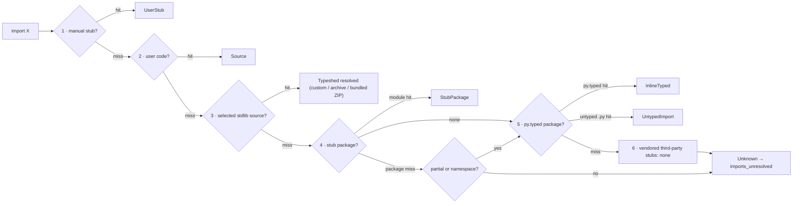

# Stub Resolution & Type Provenance — Specification {#STUBRES-OVERVIEW}

> **Crate**: `basilisk-stubs` (resolution, the downloaded `python/typeshed` archive + on-disk cache, and the bundled full-snapshot ZIP), `basilisk-config` (overrides)
> **Related**: [LSP-UV-INTEGRATION-SPEC.md §LSPUV-LOCK-REGISTRY](LSP-UV-INTEGRATION-SPEC.md#LSPUV-LOCK-REGISTRY) — `PackageRegistry` accelerates stub discovery

---

## Static Resolution Model {#STUBRES-STATIC-MODEL}

Resolution is a static filesystem search in the pinned six-step order; it never
executes Python or models runtime import hooks
([`python/typing@6ef9f77`](https://github.com/python/typing/blob/6ef9f7719ecfff09dad8724ef42b621fd994fb5e/docs/spec/distributing.rst)).
Computed module names and `sys.meta_path`/custom-loader results are therefore not
guessed. Their typed solution is a `.pyi` at step 1, 4, or 5.

After every step misses, `ImportResolution::Unresolved` binds implicit `Any` and
emits `imports_unresolved`; only an explicit stub `__getattr__(name: str) -> Any`
opts out ([§STUBRES-CREATE-LOCAL](#STUBRES-CREATE-LOCAL),
[CHKARCH-STRICTNESS-ANY](CHECKER-ARCHITECTURE-SPEC.md#CHKARCH-STRICTNESS-ANY)).

---

## Import Resolution Order {#STUBRES-PEP561}

Basilisk adopts the typing specification's upstream **SHOULD** order as an
internal **MUST** —
[Distributing type information → Import resolution ordering](https://typing.python.org/en/latest/spec/distributing.html#import-resolution-ordering)
(the normative successor to [PEP 561](https://peps.python.org/pep-0561/)).
The table maps that upstream order to Basilisk; the linked typing specification
is authoritative for the general rule. Its full normative text is reproduced
verbatim in [§STUBRES-PEP561-NORMATIVE](#STUBRES-PEP561-NORMATIVE) so the mapping
can be checked against the source directly, not paraphrased.

### Normative text, verbatim {#STUBRES-PEP561-NORMATIVE}

Quoted in full (no elision of any step) so Basilisk's behaviour can be audited
against the letter of the specification. Source pinned to
[`python/typing@6ef9f77` · `docs/spec/distributing.rst`](https://github.com/python/typing/blob/6ef9f7719ecfff09dad8724ef42b621fd994fb5e/docs/spec/distributing.rst)
(rendered: [Distributing type information → Import resolution ordering](https://typing.python.org/en/latest/spec/distributing.html#import-resolution-ordering)).
Verify the pin before relying on it: the SHA is a fixed point in history, and
`main` may have advanced.

**Import resolution ordering** — the complete ordered list, verbatim:

> The following is the order in which type checkers supporting this specification
> SHOULD resolve modules containing type information:
>
> 1. Stubs or Python source manually put in the beginning of the path. Type
>    checkers SHOULD provide this to allow the user complete control of which
>    stubs to use, and to patch broken stubs or inline types from packages. In
>    mypy the `$MYPYPATH` environment variable can be used for this.
> 2. User code - the files the type checker is running on.
> 3. Typeshed stubs for the standard library. These will usually be vendored by
>    type checkers, but type checkers SHOULD provide an option for users to
>    provide a path to a directory containing a custom or modified version of
>    typeshed; if this option is provided, type checkers SHOULD use this as the
>    canonical source for standard-library types in this step.
> 4. Stub packages - these packages SHOULD supersede any installed inline
>    package. They can be found in directories named `foopkg-stubs` for package
>    `foopkg`.
> 5. Packages with a `py.typed` marker file - if there is nothing overriding the
>    installed package, *and* it opts into type checking, the types bundled with
>    the package SHOULD be used (be they in `.pyi` type stub files or inline in
>    `.py` files).
> 6. If the type checker chooses to additionally vendor any third-party stubs
>    (from typeshed or elsewhere), these SHOULD come last in the module
>    resolution order.

The two immediately following clauses are also part of this contract, verbatim:

> If typecheckers identify a stub-only namespace package without the desired
> module in step 4, they should continue to step 5/6. Typecheckers should identify
> namespace packages by the absence of `__init__.pyi`. This allows different
> subpackages to independently opt for inline vs stub-only.

> Type checkers that check a different Python version than the version they run
> on MUST find the type information in the `site-packages`/`dist-packages` of that
> Python version. This can be queried e.g. `pythonX.Y -c 'import site;
> print(site.getsitepackages())'`. It is also recommended that the type checker
> allow for the user to point to a particular Python binary, in case it is not in
> the path.

**Stub files, `py.typed`, the `-stubs` naming scheme, partial stubs, and `.pyi`
precedence** — the applicable normative clauses, in source order, from the same
pinned document (linked examples and packaging guidance are not restated):

> Package maintainers who wish to support type checking of their code MUST add a
> marker file named `py.typed` to their package supporting typing. This marker
> applies recursively: if a top-level package includes it, all its sub-packages
> MUST support type checking as well.

> The name of the stub package MUST follow the scheme `foopkg-stubs` for type
> stubs for the package named `foopkg`. […] For stub-only packages adding a
> `py.typed` marker is not needed since the name `*-stubs` is enough to indicate
> it is a source of typing information.

> For the benefit of type checking and code editors, packages can be "partial".
> This means modules not found in the stub package SHOULD be searched for in
> parts five and six of the module resolution order below, namely inline
> packages and any third-party stubs the type checker chooses to vendor. Type
> checkers should merge the stub package and runtime package directories.
>
> This can be thought of as the functional equivalent of copying the stub
> package into the same directory as the corresponding runtime package and type
> checking the combined directory structure. Thus type checkers MUST maintain
> the normal resolution order of checking `*.pyi` before `*.py` files. If a stub
> package distribution is partial it MUST include `partial\n` in a `py.typed`
> file.
>
> For stub-packages distributing within a namespace package, the `py.typed` file
> should be in the submodules of the namespace. Type checkers should treat
> namespace packages within stub-packages as incomplete since multiple
> distributions may populate them. Regular packages within namespace packages
> in stub-package distributions are considered complete unless a `py.typed`
> with `partial\n` is included.

Every row below applies the complete pinned quotation above from
[`python/typing@6ef9f77`](https://github.com/python/typing/blob/6ef9f7719ecfff09dad8724ef42b621fd994fb5e/docs/spec/distributing.rst).
Runtime acquisition only chooses the data used at step 3; it does not add or
reorder a resolution step.

### Basilisk mapping {#STUBRES-PEP561-MAPPING}

| Spec step | Basilisk mechanism | Config key |
|---|---|---|
| 1 — manual path head | User `.pyi` in `stub-paths`, generated `.basilisk/stubs/`, and `.pyi` or Python source in manual `extra-paths`; `.pyi` precedes `.py` at each location. These MAY shadow every later step. | `stub-paths`, `extra-paths` |
| 2 — user code | Workspace `.pyi`/`.py` under roots / `include`, with `.pyi` first. | roots, `include` |
| 3 — stdlib typeshed | One selected source: a custom `typeshed-path`; otherwise the pinned or latest commit downloaded as an archive; otherwise the bundled full-snapshot ZIP ([§STUBRES-TYPESHED](#STUBRES-TYPESHED)). | `typeshed-path`, `typeshed-commit`, `typeshed-cache-path` |
| 4 — stub-only packages | Installed `foopkg-stubs` / typeshed `types-foopkg` distributions, discovered in site-packages. They supersede an inline-typed install of the same package. | (auto) |
| 5 — `py.typed` packages | Installed packages shipping a `py.typed` marker (stubs in `.pyi` or inline in `.py`). | (auto) |
| 6 — vendored third-party stubs | Basilisk vendors none for resolution. The typeshed distribution map drives only the "install stubs" quick fix ([§STUBRES-CODEACTIONS](#STUBRES-CODEACTIONS)). | — |

A complete step-4 package stops on a miss; a partial package or stub-only
namespace miss continues to steps 5–6. Steps 4–5 use the target interpreter's
`site-packages`/`dist-packages`, not the process running Basilisk. This is the
pinned specification's only Python-version-to-storage relationship; it never
selects a typeshed commit.

A module that matches no step resolves to `Unknown` and `imports_unresolved`
fires ([§STUBRES-PROVENANCE-DIAG](#STUBRES-PROVENANCE-DIAG)).

> **uv fast path**: In uv projects, steps 4–5 are accelerated by the `PackageRegistry` parsed from `uv.lock`. The registry knows every installed package and whether a companion stub package exists — no site-packages directory walk needed. See [LSP-UV-INTEGRATION-SPEC.md §LSPUV-LOCK-REGISTRY](LSP-UV-INTEGRATION-SPEC.md#LSPUV-LOCK-REGISTRY).

### Custom typeshed override {#STUBRES-CUSTOM-TYPESHED}

The pinned typing specification says a configured custom typeshed should be the
"canonical source for standard-library types in this step" ([step 3,
`python/typing@6ef9f77`](https://github.com/python/typing/blob/6ef9f7719ecfff09dad8724ef42b621fd994fb5e/docs/spec/distributing.rst)).
Basilisk exposes that source as `typeshed-path`:

```toml
[tool.basilisk]
typeshed-path = "typeshed-micropython"
```

That directory is the sole step-3 source and disables archive download and the
bundled ZIP. A missing module continues at step 4; it never falls back
to another typeshed. Relative paths resolve from the workspace root and stdlib
stubs live at `<typeshed-path>/stdlib/<module>.pyi`. `stub-paths` remains the
separate step-1 override; `typeshed-cache-path` only relocates cached downloads.

### Resolution flow {#STUBRES-RESOLUTION-FLOW}

The flow is the six-step order quoted verbatim above and pinned to
[`python/typing@6ef9f77`](https://github.com/python/typing/blob/6ef9f7719ecfff09dad8724ef42b621fd994fb5e/docs/spec/distributing.rst).
Step 3 receives one preselected source; acquisition details never branch the
import order.



---

## Stub Discovery Engine {#STUBRES-ENGINE}

`basilisk-stubs` provides stub resolution.

### Type model {#STUBRES-TYPE-MODEL}

[`models/stub_resolution.td`](../../models/stub_resolution.td) defines
`StubResolution`, `StubSource`, and `StubTier`. Its variants record steps 1,
3–5; Custom typeshed is Tier1 and never reported as CPython.

### Standard-library typeshed source {#STUBRES-TYPESHED}

The pinned typing specification names "Typeshed stubs for the standard library",
says they are "usually" vendored, and makes a configured custom tree canonical
([step 3, `python/typing@6ef9f77`](https://github.com/python/typing/blob/6ef9f7719ecfff09dad8724ef42b621fd994fb5e/docs/spec/distributing.rst)).
The specification does not prescribe transport, caching, commits, or freshness.
Independent precedent is bundle plus whole-source override: ty uses stubs
“bundled as a zip file in the binary” ([`astral-sh/ruff@035ebc3`](https://github.com/astral-sh/ruff/blob/035ebc332af34b7e301606dcc74d997092be2316/crates/ty_project/src/metadata/options.rs#L842-L844));
mypy uses a custom directory “instead of the typeshed that ships with mypy”
([`python/mypy@d091daa`](https://github.com/python/mypy/blob/d091daa83f95ad0b505cc4f783a5273c0dced5d1/docs/source/config_file.rst#L1067-L1070));
Pyright “ships with a bundled copy of typeshed type stubs”
([`microsoft/pyright@1bec65c`](https://github.com/microsoft/pyright/blob/1bec65c15fba26016281d44d977bf667b89b9d30/docs/configuration.md#L23)).
Basilisk likewise never mixes a source's names, bodies, `VERSIONS`, or indexes.

| Mode | Active source | Failure rule |
|---|---|---|
| Custom folder | `typeshed-path` verbatim | miss continues to step 4; no other step-3 source |
| Exact commit | selected archive (content-attested unless waived), or bundle only at that SHA | otherwise fail closed |
| Latest (default) | current `python/typeshed@main`, once per run/session | never reuse old unpinned data; warn and use bundled ZIP |

Latest defaults to freshness and is one **Pin current** action from determinism.
Custom and bundled are also reported unpinned
([§STUBRES-TYPESHED-WARN](#STUBRES-TYPESHED-WARN)).

#### Archive acquisition {#STUBRES-TYPESHED-ACQUIRE}

Basilisk never clones. It resolves official commit → root-tree metadata over
authenticated HTTPS, then downloads that SHA from GitHub codeload or a
`typeshed-url` `{sha}` archive mirror. A mirror cannot resolve Latest; if official
metadata is unavailable and no pin exists, Latest warns and uses the bundled ZIP.
URLs are redacted in logs.

**Security boundary.** A pin is not an archive checksum or provenance proof:
Git defines a commit from a tree object ([Git `commit-tree`](https://git-scm.com/docs/git-commit-tree)),
and GitHub reports commit and tree SHAs separately ([GitHub Git-commit API](https://docs.github.com/en/rest/git/commits)).
Initial verification therefore authenticates GitHub commit→tree metadata and
reconstructs that tree from the consumed bytes. Cache rehashing proves only
local consistency; a hostile cache can replace ZIP and metadata, and typeshed
has no signed release. Custom or verification-disabled sources are `UNVERIFIED`,
never represented as official.

Decompression enforces entry and size caps before four activation gates run.
Accepted bytes are cached as an immutable ZIP and read through an archive VFS:

| Gate | Rule |
|---|---|
| Safety | reject absolute/`..` paths, escaping links, duplicate entries, and entry/decompressed-size limits |
| Shape | require one coherent stdlib tree, `VERSIONS`, and license metadata |
| License | path+SHA-256 manifest for relevant root/nested `LICENSE*`/`NOTICE*` must match a build-approved identity; drift blocks activation for review |
| Content | reconstruct Git trees and match the trusted root-tree SHA; only this gate may be waived |

First acquisition records the accepted ZIP's SHA-256. Reuse hashes the cached
ZIP, detecting mutation without extraction; `.pyi` is read from that same ZIP.
Cache metadata records whether content verification ran; enabling it later MUST
rerun the content gate before the archive can be reported as verified.
The exact commit identity never expires. Downloaded cached ZIP bytes expire
after 24 hours and are re-hashed on every reuse. Expiry, explicit eviction, or
`typeshed-cache = false` reacquires the same selected SHA and reruns all gates. Disabling verification reports
`UNVERIFIED` and never disables safety, shape, or license review. A fresh
unpinned download is not hermetic.

#### Bundled ZIP snapshot {#STUBRES-TYPESHED-BASELINE}

Basilisk ships a release-pinned ZIP containing every `stdlib/` `.pyi`,
`stdlib/VERSIONS`, the composite root `LICENSE`, root `NOTICE` iff present, and
pertinent nested license/notice files. It is a complete offline step-3 source,
not a names-only baseline; it supplies the bodies and snapshot-derived indexes
needed by #289/#288 offline.

#### License and attribution {#STUBRES-TYPESHED-LICENSE}

The reviewed typeshed `LICENSE`
([`python/typeshed@83c2518`](https://github.com/python/typeshed/blob/83c2518a9e6abbda0c44592c3483de459198f887/LICENSE))
is composite: typeshed says the project uses Apache-2.0 and that parts use other
licenses such as MIT. Basilisk MUST NOT call the selected files Apache-only or
MIT-only.

For every bundled artifact, [Apache-2.0 §4](https://www.apache.org/licenses/LICENSE-2.0.html#redistribution)
requires license delivery, pertinent-notice retention, readable `NOTICE`
attribution when present, and marks on modified upstream files; the composite
also carries the MIT copyright and permission notice. Basilisk policy requires
this with exact copies, SHA comparison, human review on drift, and
`THIRD-PARTY-LICENSES`/`NOTICES` records for source URL, SHA, and repackaging.
Basilisk retains legal files in cached ZIPs and attributes derived indexes with
their source SHA. CLI/MCP expose source, SHA, and license reference; the UI adds
View License. These are provenance policy, not extra Apache mandates. A
custom path is user-managed and MUST NOT be assigned typeshed's terms. Direct
runtime downloads are not Basilisk release artifacts.

#### Source reporting {#STUBRES-TYPESHED-WARN}

The pinned typing specification defines resolution order, not transport status
([`python/typing@6ef9f77`](https://github.com/python/typing/blob/6ef9f7719ecfff09dad8724ef42b621fd994fb5e/docs/spec/distributing.rst)).
Basilisk reports `active_source` plus an ordered `warnings[]`; warnings compose.

| Condition | Persistent status |
|---|---|
| Latest or bundled without explicit commit | `UNPINNED — Pin current to make this reproducible` |
| Custom folder | `UNPINNED — folder contents can change; version or content-address the folder externally` |
| Latest could not resolve, download, or validate | `DOWNLOAD FAILED — using bundled <sha>; may be behind upstream` |
| approved license/NOTICE identity changed | `LICENSE CHANGED — Basilisk update/review required` |
| content verification disabled | `UNVERIFIED — contents were not checked against the selected tree` |
| custom path | `USER-MANAGED SOURCE — license and contents supplied by user` |

CLI uses a stderr status banner without contaminating machine diagnostics; LSP
uses `window/showMessage` plus persistent Service Info, never
`publishDiagnostics`; MCP returns structured status. These warnings therefore
cannot create conformance false positives. All surfaces show the full SHA when
known; the UI also provides a safe View License action. MCP fields are
`active_source`, commit/tree identity, transport, provenance, `license_status`,
immutable license reference (or custom `not supplied`), and ordered `warnings[]`.

#### Config keys {#STUBRES-TYPESHED-CONFIG}

The only typing-spec-facing setting is the custom canonical path named by pinned
step 3
([`python/typing@6ef9f77`](https://github.com/python/typing/blob/6ef9f7719ecfff09dad8724ef42b621fd994fb5e/docs/spec/distributing.rst));
the rest govern download, caching, and verification, which the specification
leaves open. Every one is exposed as a control in the configuration UI
([§LSPCFGED-TYPESHED](LSP-CONFIGURATION-EDITOR-SPEC.md#LSPCFGED-TYPESHED)).

| Config key / flag | Type | Default | Meaning |
|---|---|---|---|
| `typeshed-commit` | full SHA | unset | Exact commit; unset selects Latest. |
| `typeshed-url` | URL template | GitHub codeload | Codeload-compatible archive mirror containing `{sha}` and one common top-level directory; does not resolve Latest. |
| `typeshed-cache-path` | path | OS cache | Cached gate-accepted ZIPs. |
| `typeshed-cache` | bool | `true` | Reuse a re-hashed accepted downloaded ZIP for 24 hours; false downloads, validates, and discards. |
| `typeshed-path` | `string` | _(unset)_ | Supply the canonical custom step-3 tree; disables download and the bundled ZIP. |
| `typeshed-verify` | bool | `true` | Content attestation; false reports `UNVERIFIED`. |
| `--no-typeshed-cache` | flag | off | One-run `typeshed-cache = false`. |
| `--no-typeshed-verification` | flag | off | One-run `typeshed-verify = false`; never bypasses other gates. |

#### Target Python version {#STUBRES-TYPESHED-VERSION}

The pinned typing specification expects checkers to "understand simple version
and platform checks"
([`python/typing@6ef9f77`, directives](https://github.com/python/typing/blob/6ef9f7719ecfff09dad8724ef42b621fd994fb5e/docs/spec/directives.rst)).
Accordingly, a concrete target filters `stdlib/VERSIONS`, selects version/platform
guards, and supplies the target interpreter's site-packages as required above.
The selected snapshot's exact
[`stdlib/VERSIONS`](https://github.com/python/typeshed/blob/83c2518a9e6abbda0c44592c3483de459198f887/stdlib/VERSIONS)
defines inclusive `X.Y-A.B` or open-ended `X.Y-` lifetimes; a submodule without
its own row inherits the closest listed parent module's lifetime. Both the text
and parsed admission index come from the active snapshot identity.
Platform `All` requires validity across alternatives and MUST NOT expose a name
merely because one branch has it. Python version never selects or guesses a
typeshed commit; no fixed Python default or Python→commit map exists.

### .pyi File Parsing {#STUBRES-PYI}

The pinned specification says checkers should parse supported stub constructs
without contradiction and "fully support" typing features, imports, aliases,
and simple version/platform checks
([`python/typing@6ef9f77`, stub files](https://github.com/python/typing/blob/6ef9f7719ecfff09dad8724ef42b621fd994fb5e/docs/spec/distributing.rst)).
The `.pyi` index therefore retains declarations, overloads, decorators, class
bases, methods, variables, imports, aliases, and guards; bodies are ignored.
For #289, class hover follows the pinned constructor conversion rules: special
metaclass `__call__`; inherited non-`object` `__new__`; inherited `__init__`;
`cls`/`self` binding; overload preservation; union of applicable synthesized
callables; and early termination for special `__call__` or non-instance
`__new__` returns; classes with neither use `object.__new__`/`object.__init__`
([`python/typing@6ef9f77`, constructors](https://github.com/python/typing/blob/6ef9f7719ecfff09dad8724ef42b621fd994fb5e/docs/spec/constructors.rst)).
For #288, bound `str.join` removes the displayed receiver while using it to
specialize every overload and return type, preserves `LiteralString` and `/`,
and drives call checking from the same declaration—never a hand table.

#### Re-exports {#STUBRES-PYI-REEXPORTS}

The pinned interface rules say imported symbols are **“private by default”**,
that `__all__` **“overrides all other rules above”**, and that the redundant
aliases plus `from Y import *` re-export forms below are public
([`python/typing@6ef9f77`, library interface and import conventions](https://github.com/python/typing/blob/6ef9f7719ecfff09dad8724ef42b621fd994fb5e/docs/spec/distributing.rst)):

> - `import X as X` (a redundant module alias): re-exports `X`.
> - `from Y import X as X` (a redundant symbol alias): re-exports `X`.
> - `from Y import *`: if `Y` defines a module-level `__all__` list, re-exports
>   all names in `__all__`; otherwise, re-exports all public symbols in `Y`'s
>   global scope.

Simple `sys.version_info` / `sys.platform` guards select one concrete target
branch; `All` requires validity in every platform alternative and never exposes a
name from only one branch. This follows the pinned directive that checkers are
expected to understand those checks
([`python/typing@6ef9f77`, directives](https://github.com/python/typing/blob/6ef9f7719ecfff09dad8724ef42b621fd994fb5e/docs/spec/directives.rst)).

---

## Type Provenance {#STUBRES-PROVENANCE}

`TypeProvenance` records source annotations, user stubs, built-in/custom typeshed,
community/generated stubs, or untyped imports; there is no `TrackedType` wrapper.

### Diagnostic Behaviour by Provenance {#STUBRES-PROVENANCE-DIAG}

| Resolution/provenance | Import-site diagnostic | Downstream type errors | LSP hover | Code Action |
|------------|-----------|----------------------|-----------|-------------|
| Source | none | normal errors | shows inferred type | — |
| StubUser | none | normal errors | shows stub type | — |
| StubTier1 | none | normal errors | shows stub type + "(typeshed)" | — |
| StubCustomTypeshed | none | normal errors | shows stub type + "(custom typeshed)" | — |
| StubTier2 | none | normal errors | shows type + "(community stub)" | — |
| StubTier3 | none | diagnostics carrying this provenance become info | shows type + "(best-effort stub, may be inaccurate)" | — |
| Unresolved (`Untyped`) | `imports_unresolved` error by default | dependent cascades suppressed | no type information available | add dependency or sync |
| Installed untyped (`Untyped`) | opt-in `BSK-0152`; off by default | normal resolved-source analysis | "(no type stubs available)" | install a published stub package or create a local stub |

The two untyped states do not share a diagnostic. A terminal unresolved import
emits `imports_unresolved` once and suppresses dependent cascades. An installed
site-packages `.py` without `py.typed` is resolved, never emits
`imports_unresolved`, and emits `BSK-0152` only when the project opts in.

### Code Actions for Unresolved Imports {#STUBRES-CODEACTIONS}

Diagnostics offer one-click actions, not shell instructions; local `.pyi` files
are pinned step-1 stubs
([`python/typing@6ef9f77`](https://github.com/python/typing/blob/6ef9f7719ecfff09dad8724ef42b621fd994fb5e/docs/spec/distributing.rst)).

| Diagnostic | Scenario | Code Action | LSP Command |
|------------|----------|-------------|-------------|
| imports_unresolved | Package not installed | "Add dependency: `{pkg}`" | `basilisk.uv.add` |
| imports_unresolved | Package absent or transitive-only | "Add dependency: `{pkg}`" | `basilisk.uv.add` |
| imports_unresolved | Package declared but not synced | "Sync environment" | `basilisk.uv.sync` |
| BSK-0152 | Package installed, typeshed stub exists | "Install type stubs: `types-{pkg}`" | `basilisk.uv.addDev` |
| BSK-0152 | Package installed, **no** typeshed stub | "Create local type stub for `{pkg}`" | `basilisk.stubs.createLocal` |

Commands execute the action and re-resolve; uv dependency commands also report
progress. Every BSK-0152 offers create-local. See
[LSPUV-ACTIONS](LSP-UV-INTEGRATION-SPEC.md#LSPUV-ACTIONS).

#### Create Local Stub {#STUBRES-CREATE-LOCAL}

`basilisk.stubs.createLocal` creates, but never overwrites,
`.basilisk/stubs/{module}.pyi`. The strict skeleton declares nothing, documents
the explicit `__getattr__ -> Any` opt-out, rebuilds resolution, and links the
[stub-writing guide](https://typing.python.org/en/latest/guides/writing_stubs.html).

#### Add Member {#STUBRES-ADD-MEMBER}

`basilisk.stubs.addMember` handles `imports_module_attribute`: call sites infer
`Any` parameters; plain access adds `attr: Any`. It writes only an existing
workspace `.pyi`, inserts the import once, re-resolves, and leaves tightening to
the developer ([CHKARCH-DIAG-STUB-MEMBER](CHECKER-ARCHITECTURE-SPEC.md#CHKARCH-DIAG-STUB-MEMBER)).

### Provenance in Hover {#STUBRES-PROVENANCE-HOVER}

| Cursor on | Hover display |
|-----------|---------------|
| Untyped import | `fastmcp (no type stubs available)` |
| Tier 3 stub symbol | `FastMCP (best-effort stub, may be inaccurate)` |
| Tier 2 stub symbol | `pandas.read_csv(...) (community stub)` |
| typeshed symbol | `os.path.join (typeshed)` |
| custom-typeshed stdlib symbol | `os.uname (custom typeshed)` |
| Tier 1 stub symbol | `requests.get(...) -> Response` (no annotation — trusted) |

> uv projects enrich import hovers with package version and dependency classification from the `PackageRegistry`; see [LSPUV-HOVER](LSP-UV-INTEGRATION-SPEC.md#LSPUV-HOVER).

---

## Configuration {#STUBRES-CONFIG}

### Suppression ownership {#STUBRES-SUPPRESSION}

Stub/import diagnostics use ordinary severity and inline suppression; there is
no stub-specific grammar. `stub-paths` implements pinned step 1, and the step-3
keys live only in [§STUBRES-TYPESHED-CONFIG](#STUBRES-TYPESHED-CONFIG), preserving
the six-step order quoted from
[`python/typing@6ef9f77`](https://github.com/python/typing/blob/6ef9f7719ecfff09dad8724ef42b621fd994fb5e/docs/spec/distributing.rst).
All keys use `[tool.basilisk]`; pyright aliases and folder scoping follow
[ANALYSIS-CONFIG-PRI](LSP-ANALYSIS-MODES-SPEC.md#ANALYSIS-CONFIG-PRI) and
[CHKARCH-CONFIG-MODEL](CHECKER-ARCHITECTURE-SPEC.md#CHKARCH-CONFIG-MODEL).

---

## Auto-Stub Generation {#STUBRES-AUTOGEN}

`basilisk stubs generate <package>` (or `--all`) writes hybrid
runtime-introspection/AST output to `.basilisk/stubs/`; `basilisk stubs status`
reports coverage. Generated files are Tier 3 step-1 stubs, consistent with the
pinned rule that a user-supplied stub is considered first
([`python/typing@6ef9f77`](https://github.com/python/typing/blob/6ef9f7719ecfff09dad8724ef42b621fd994fb5e/docs/spec/distributing.rst)).

---
