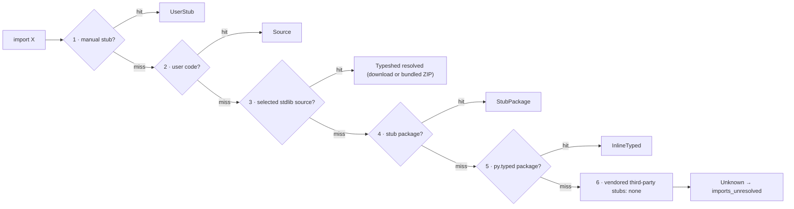

# Stub Resolution & Type Provenance — Specification {#STUBRES}

> **Crate**: `basilisk-stubs` (resolution, the downloaded `python/typeshed` archive + on-disk cache, and the bundled full-snapshot ZIP), `basilisk-config` (overrides)
> **Related**: [LSP-UV-INTEGRATION-SPEC.md §LSPUV-LOCK-REGISTRY](LSP-UV-INTEGRATION-SPEC.md#LSPUV-LOCK-REGISTRY) — `PackageRegistry` accelerates stub discovery

---

## Static Resolution Model {#STUBRES-STATIC-MODEL}

Import resolution is **purely static**. Basilisk resolves every import by
inspecting files on disk in the fixed order of [§STUBRES-PEP561](#STUBRES-PEP561),
and MUST NOT execute the target program or its import system to do so. There is
no embedded CPython, no interpreter subprocess, and no model of the runtime
`import` machinery — resolution is a filesystem search, never an execution. This
is what lets Basilisk ship as a single native binary with no Python runtime.

Two consequences follow directly, and both are **by design**, not gaps:

- **Computed / dynamic imports are unresolvable.** An import whose module name
  is not a static string literal — `importlib.import_module(name)`,
  `__import__(var)` — cannot be followed statically, because the name exists only
  at runtime. The call's result is `Any` (the declared return type of
  `importlib.import_module` / `__import__` in typeshed) and no member access on
  it is checked. Basilisk MUST NOT guess the target module.
- **`sys.meta_path` finders and custom loaders are not modelled.** A program MAY
  install import hooks (`sys.meta_path`, `sys.path_hooks`, custom
  `importlib.abc.MetaPathFinder`s) that make `import foo` resolve to something no
  filesystem search could find — generated modules, database-backed modules,
  zipimports. Honouring those hooks would mean running the target program, which
  a static checker MUST NOT do. Such a module matches no step of
  [§STUBRES-PEP561](#STUBRES-PEP561) and is treated exactly like any other
  unresolved import.

The typed-world answer for a module Basilisk cannot introspect statically is a
**stub** (`.pyi`), not a runtime model: authoring or installing a stub
([§STUBRES-PEP561](#STUBRES-PEP561) steps 1/4/5, or the "Create local stub" quick
fix [§STUBRES-CREATE-LOCAL](#STUBRES-CREATE-LOCAL)) gives an otherwise-dynamic
module precise types with zero execution.

**Terminal state.** When the static search of [§STUBRES-PEP561](#STUBRES-PEP561)
exhausts every step without a hit, the import lands in the terminal
`ImportResolution::Unresolved` state and its bound names carry an **implicit
`Any`**. Basilisk MUST NOT silently accept that `Any` the way a gradual checker
does: default-strict surfaces it as `imports_unresolved`
([§STUBRES-PROVENANCE-DIAG](#STUBRES-PROVENANCE-DIAG),
[CHKARCH-STRICTNESS-ANY](CHECKER-ARCHITECTURE-SPEC.md#CHKARCH-STRICTNESS-ANY)). A
module MAY *stay* `Any` only through an explicit opt-out — a module-level
`def __getattr__(name: str) -> Any: ...` in its stub
([§STUBRES-CREATE-LOCAL](#STUBRES-CREATE-LOCAL)) — never implicitly.

---

## Import Resolution Order {#STUBRES-PEP561}

Basilisk adopts the typing specification's upstream **SHOULD** order as an
internal **MUST** —
[Distributing type information → Import resolution ordering](https://typing.python.org/en/latest/spec/distributing.html#import-resolution-ordering)
(the normative successor to [PEP 561](https://peps.python.org/pep-0561/)).
The table maps that upstream order to Basilisk; the linked typing specification
is authoritative for the general rule. Its full normative text is reproduced
verbatim in [§STUBRES-PEP561-NORMATIVE](#STUBRES-PEP561-NORMATIVE) so the mapping
can be checked against the source directly, not paraphrased.

### Normative text, verbatim {#STUBRES-PEP561-NORMATIVE}

Quoted in full (no elision of any step) so Basilisk's behaviour can be audited
against the letter of the specification. Source pinned to
[`python/typing@6ef9f77` · `docs/spec/distributing.rst`](https://github.com/python/typing/blob/6ef9f7719ecfff09dad8724ef42b621fd994fb5e/docs/spec/distributing.rst)
(rendered: [Distributing type information → Import resolution ordering](https://typing.python.org/en/latest/spec/distributing.html#import-resolution-ordering)).
Verify the pin before relying on it: the SHA is a fixed point in history, and
`main` may have advanced.

**Import resolution ordering** — the complete ordered list, verbatim:

> The following is the order in which type checkers supporting this specification
> SHOULD resolve modules containing type information:
>
> 1. Stubs or Python source manually put in the beginning of the path. Type
>    checkers SHOULD provide this to allow the user complete control of which
>    stubs to use, and to patch broken stubs or inline types from packages. In
>    mypy the `$MYPYPATH` environment variable can be used for this.
> 2. User code - the files the type checker is running on.
> 3. Typeshed stubs for the standard library. These will usually be vendored by
>    type checkers, but type checkers SHOULD provide an option for users to
>    provide a path to a directory containing a custom or modified version of
>    typeshed; if this option is provided, type checkers SHOULD use this as the
>    canonical source for standard-library types in this step.
> 4. Stub packages - these packages SHOULD supersede any installed inline
>    package. They can be found in directories named `foopkg-stubs` for package
>    `foopkg`.
> 5. Packages with a `py.typed` marker file - if there is nothing overriding the
>    installed package, *and* it opts into type checking, the types bundled with
>    the package SHOULD be used (be they in `.pyi` type stub files or inline in
>    `.py` files).
> 6. If the type checker chooses to additionally vendor any third-party stubs
>    (from typeshed or elsewhere), these SHOULD come last in the module
>    resolution order.

The two immediately following clauses are also part of this contract, verbatim:

> If typecheckers identify a stub-only namespace package without the desired
> module in step 4, they should continue to step 5/6. Typecheckers should identify
> namespace packages by the absence of `__init__.pyi`. This allows different
> subpackages to independently opt for inline vs stub-only.

> Type checkers that check a different Python version than the version they run
> on MUST find the type information in the `site-packages`/`dist-packages` of that
> Python version. This can be queried e.g. `pythonX.Y -c 'import site;
> print(site.getsitepackages())'`. It is also recommended that the type checker
> allow for the user to point to a particular Python binary, in case it is not in
> the path.

**Stub files, `py.typed`, the `-stubs` naming scheme, partial stubs, and `.pyi`
precedence** — the remaining normative clauses this spec relies on, verbatim from
the same source (bracketed `[…]` marks where non-normative prose between
sentences is omitted; no normative sentence is cut):

> Package maintainers who wish to support type checking of their code MUST add a
> marker file named `py.typed` to their package supporting typing. This marker
> applies recursively: if a top-level package includes it, all its sub-packages
> MUST support type checking as well.

> The name of the stub package MUST follow the scheme `foopkg-stubs` for type
> stubs for the package named `foopkg`. […] For stub-only packages adding a
> `py.typed` marker is not needed since the name `*-stubs` is enough to indicate
> it is a source of typing information.

> If a stub package distribution is partial it MUST include `partial\n` in a
> `py.typed` file. […] Type checkers should treat namespace packages within
> stub-packages as incomplete since multiple distributions may populate them.
> Regular packages within namespace packages in stub-package distributions are
> considered complete unless a `py.typed` with `partial\n` is included.

> Type checkers MUST maintain the normal resolution order of checking `*.pyi`
> before `*.py` files.

Every row below applies the complete pinned quotation above from
[`python/typing@6ef9f77`](https://github.com/python/typing/blob/6ef9f7719ecfff09dad8724ef42b621fd994fb5e/docs/spec/distributing.rst).
Runtime acquisition only chooses the data used at step 3; it does not add or
reorder a resolution step.

### Basilisk mapping {#STUBRES-PEP561-MAPPING}

| Spec step | Basilisk mechanism | Config key |
|---|---|---|
| 1 — manual stubs at head of path | User `.pyi` stubs in `stub-paths` directories, plus the auto-discovered `.basilisk/stubs/` cache ([§STUBRES-CREATE-LOCAL](#STUBRES-CREATE-LOCAL)). They sit at the head of the path and MAY shadow any later module, stdlib or third-party. | `stub-paths` |
| 2 — user code | Workspace `.py` source under the configured roots / `include`. | roots, `include` |
| 3 — stdlib typeshed | One selected source: a custom `typeshed-path`; otherwise the pinned or latest commit downloaded as an archive; otherwise the bundled full-snapshot ZIP ([§STUBRES-TYPESHED](#STUBRES-TYPESHED)). | `typeshed-path`, `typeshed-commit`, `typeshed-cache-path` |
| 4 — stub-only packages | Installed `foopkg-stubs` / typeshed `types-foopkg` distributions, discovered in site-packages. They supersede an inline-typed install of the same package. | (auto) |
| 5 — `py.typed` packages | Installed packages shipping a `py.typed` marker (stubs in `.pyi` or inline in `.py`). | (auto) |
| 6 — vendored third-party stubs | Basilisk vendors none for resolution. The typeshed distribution map drives only the "install stubs" quick fix ([§STUBRES-CODEACTIONS](#STUBRES-CODEACTIONS)). | — |

A complete step-4 package stops on a miss; a partial package or stub-only
namespace miss continues to steps 5–6. Steps 4–5 use the target interpreter's
`site-packages`/`dist-packages`, not the process running Basilisk. This is the
pinned specification's only Python-version-to-storage relationship; it never
selects a typeshed commit.

A module that matches no step resolves to `Unknown` and `imports_unresolved`
fires ([§STUBRES-PROVENANCE-DIAG](#STUBRES-PROVENANCE-DIAG)).

> **uv fast path**: In uv projects, steps 4–5 are accelerated by the `PackageRegistry` parsed from `uv.lock`. The registry knows every installed package and whether a companion stub package exists — no site-packages directory walk needed. See [LSP-UV-INTEGRATION-SPEC.md §LSPUV-LOCK-REGISTRY](LSP-UV-INTEGRATION-SPEC.md#LSPUV-LOCK-REGISTRY).

### Custom typeshed override {#STUBRES-CUSTOM-TYPESHED}

The pinned typing specification says a configured custom typeshed should be the
"canonical source for standard-library types in this step" ([step 3,
`python/typing@6ef9f77`](https://github.com/python/typing/blob/6ef9f7719ecfff09dad8724ef42b621fd994fb5e/docs/spec/distributing.rst)).
Basilisk exposes that source as `typeshed-path`:

```toml
[tool.basilisk]
typeshed-path = "typeshed-micropython"
```

That directory is the sole step-3 source and disables archive download and the
bundled ZIP. A missing module continues at step 4; it never falls back
to another typeshed. Relative paths resolve from the workspace root and stdlib
stubs live at `<typeshed-path>/stdlib/<module>.pyi`. `stub-paths` remains the
separate step-1 override; `typeshed-cache-path` only relocates cached downloads.

### Resolution flow {#STUBRES-RESOLUTION-FLOW}

The flow is the six-step order quoted verbatim above and pinned to
[`python/typing@6ef9f77`](https://github.com/python/typing/blob/6ef9f7719ecfff09dad8724ef42b621fd994fb5e/docs/spec/distributing.rst).
Step 3 receives one preselected source; acquisition details never branch the
import order.



Step 3 selects `typeshed-path`; otherwise the downloaded archive for the explicit
`typeshed-commit` or the latest `main` commit; otherwise the bundled full-snapshot
ZIP. A custom-source miss proceeds to step 4. A downloaded archive replaces the
bundled ZIP wholesale.

---

## Stub Discovery Engine {#STUBRES-ENGINE}

`basilisk-stubs` provides stub resolution.

### Type model {#STUBRES-TYPE-MODEL}

Source tags map to the pinned six-step ordering quoted above
([`python/typing@6ef9f77`](https://github.com/python/typing/blob/6ef9f7719ecfff09dad8724ef42b621fd994fb5e/docs/spec/distributing.rst)).
The resolver returns a `StubResolution` tagged with **where** the type info came
from (`StubSource`) and **how much to trust it** (`StubTier`). The data model is
defined in [typeDiagram](https://typediagram.dev) markup — source of truth
[`models/stub_resolution.td`](../../models/stub_resolution.td), rendered to
[`models/stub_resolution.td`](../../models/stub_resolution.td). The Rust
ADTs in `crates/basilisk-stubs/src/types.rs` are generated from it
(`typediagram --to rust models/stub_resolution.td`):

```typeDiagram
alias PathBuf = String

type StubResolution {
  module: String
  source: StubSource
  pyi_path: Option<PathBuf>
  tier: StubTier
}

union StubSource {
  UserStub
  StubPackage
  InlineTyped
  Typeshed
  CustomTypeshed
}

union StubTier {
  Tier1
  Tier2
  Tier3
}
```

`StubSource` records which resolution step ([§STUBRES-PEP561](#STUBRES-PEP561)) supplied the stub:

| Variant | Resolution step | Meaning |
|---|---|---|
| `UserStub` | 1 | `.pyi` from a `stub-paths` directory (head of path) |
| `CustomTypeshed` | 3 | stdlib stub from a `typeshed-path` override ([§STUBRES-CUSTOM-TYPESHED](#STUBRES-CUSTOM-TYPESHED)) |
| `Typeshed` | 3 | stdlib resolved from the downloaded archive or the bundled full-snapshot ZIP ([§STUBRES-TYPESHED](#STUBRES-TYPESHED)) |
| `StubPackage` | 4 | installed `foopkg-stubs` package |
| `InlineTyped` | 5 | installed package with a `py.typed` marker |

A `CustomTypeshed` stub is `Tier1` (hand-written, trusted) and hovers as
`… (custom typeshed)`, so a MicroPython signature is never misreported as the
built-in CPython classification.

### Standard-library typeshed source {#STUBRES-TYPESHED}

The pinned typing specification names "Typeshed stubs for the standard library",
says they are "usually" vendored, and makes a configured custom tree canonical
([step 3, `python/typing@6ef9f77`](https://github.com/python/typing/blob/6ef9f7719ecfff09dad8724ef42b621fd994fb5e/docs/spec/distributing.rst)).
The specification does not prescribe transport, caching, commits, or freshness.
For precedent, mypy says all users need its bundled stdlib stubs, while ty
documents a vendored stdlib ZIP and custom-tree option
([mypy](https://mypy-lang.blogspot.com/2021/05/the-upcoming-switch-to-modular-typeshed.html),
[ty](https://docs.astral.sh/ty/reference/configuration/)). Basilisk uses one
complete source; names, `VERSIONS`, `.pyi` bodies, and derived indexes MUST NOT
mix across sources.

| Mode | Active source | Failure rule |
|---|---|---|
| Custom folder | `typeshed-path` verbatim | miss continues to step 4; no other step-3 source |
| Exact commit | verified archive, or bundled ZIP only if its SHA equals the pin | otherwise fail closed |
| Latest (default) | current `python/typeshed@main`, once per run/session | never reuse old unpinned data; warn and use bundled ZIP |

Freshness is the default; determinism is one **Pin current** action away. Every
mode without an explicit commit, including Custom folder and bundled, warns that
the project is unpinned ([§STUBRES-TYPESHED-WARN](#STUBRES-TYPESHED-WARN)).

#### Archive acquisition {#STUBRES-TYPESHED-ACQUIRE}

Basilisk never runs `git clone`. It resolves one exact commit SHA and downloads
that commit's source archive over HTTPS
(`codeload.github.com/python/typeshed/tar.gz/<sha>`), extracting it into the
cache. This implements the pinned step-3 allowance that typeshed is "usually"
vendored
([`python/typing@6ef9f77`](https://github.com/python/typing/blob/6ef9f7719ecfff09dad8724ef42b621fd994fb5e/docs/spec/distributing.rst));
the typing specification prescribes no transport, cache, commit, or freshness
policy.

- **SHA selection.** With no override, resolve `python/typeshed@main` to one
  exact commit SHA and record the **tree SHA** that commit points to, pinning
  both for this run/session. With `typeshed-commit`, resolve that commit to its
  tree SHA the same way. There is no Python-version-to-commit map.
- **The pin is immutable; the cached download is not.** A `typeshed-commit`
  checkout is reused while its cache entry survives. Cache entries MAY be evicted
  (size/age cleanup); a miss re-downloads the *same* SHA and re-verifies it. The
  re-fetched archive *bytes* need not be identical — GitHub does not guarantee
  stable tarball bytes — but the *extracted tree* is: it hashes to the same Git
  tree SHA. No freshness TTL is ever applied to a pin; only the cache entry is
  evictable.
- **Alternate download URL.** `typeshed-url` supplies an operator-chosen archive
  location (a template resolved with the selected SHA, e.g.
  `https://mirror.example/typeshed/{sha}.tar.gz`) for when the default GitHub
  endpoint is blocked or unavailable — corporate proxies, mirrors, air-gapped
  networks. It substitutes the *archive* download only, for a **known SHA**: a
  `typeshed-commit` pin fetches through it, but resolving the *latest* `main` SHA
  still needs GitHub commit metadata to be reachable. If metadata is unreachable
  and no pin is set, resolution falls to the bundled ZIP
  ([§STUBRES-TYPESHED-WARN](#STUBRES-TYPESHED-WARN)). Integrity verification still
  binds to the selected commit's tree SHA, so an alternate mirror cannot
  substitute different content.
- **Integrity verification.** Before use, a cached archive is verified by
  recomputing the extracted tree's Git object hashes (blobs → trees) and
  confirming the root hashes to the **tree SHA** recorded when the commit was
  resolved. GitHub archive tarball checksums are not stable, and a commit SHA also
  hashes commit metadata (author, date, message), so verification binds to the
  tree the commit points to — taken from the same trusted metadata response — not
  to the download bytes. The default is cheap (a recorded per-commit manifest, no
  re-extraction); `--no-typeshed-cache` forces a fresh download plus full
  verification then discards it (hermetic reproducibility);
  `--no-typeshed-verification` (or `typeshed-verify = false`) skips the hash check
  when its cost is unacceptable, and the resolved source is then reported
  **`UNVERIFIED`** ([§STUBRES-TYPESHED-WARN](#STUBRES-TYPESHED-WARN)). A passing
  check proves integrity against the SHA, not that the SHA is an official typeshed
  commit — see [§STUBRES-TYPESHED-SECURITY](#STUBRES-TYPESHED-SECURITY). The default
  verification depth is governed by the benchmark ratchet
  ([CHKARCH-TESTING-BENCH-RATCHET](CHECKER-ARCHITECTURE-SPEC.md#CHKARCH-TESTING-BENCH-RATCHET)).
- **Extraction safety is always on.** Independent of `typeshed-verify`, every
  downloaded archive is extracted under fixed guards — rejecting absolute or `..`
  path-traversal entries, symlinks escaping the cache root, and archives exceeding
  entry-count or decompressed-size ceilings (zip-bomb defence). These guards
  protect the filesystem and cannot be disabled; `--no-typeshed-verification`
  waives only the content-hash check, never extraction safety.
- `typeshed-cache-path` relocates the cache. `typeshed-path` bypasses download
  and is canonical under [§STUBRES-CUSTOM-TYPESHED](#STUBRES-CUSTOM-TYPESHED).

#### Integrity is not authenticity {#STUBRES-TYPESHED-SECURITY}

Tree-SHA verification ([§STUBRES-TYPESHED-ACQUIRE](#STUBRES-TYPESHED-ACQUIRE)) is
an **integrity** check, not an **authenticity** one, and this spec MUST NOT
overstate it. Confirming the extracted tree hashes to the resolved or pinned tree
SHA proves only that the content matches *that SHA* — that bytes were not corrupted
in transit or swapped for a different commit's content. It does **not** prove the
SHA is a genuine, official `python/typeshed` commit: Git content addressing binds
content to a hash, but anyone can construct a tree that hashes to a SHA they chose,
so a matching hash is not provenance. **There is no verifiable guarantee that a
type check ran against an official typeshed version** — Basilisk states this
plainly rather than papering over it.

The real trust anchors, and their limits:

- **Default transport (GitHub codeload over HTTPS).** TLS authenticates
  `github.com` as the origin, so a SHA resolved and fetched from GitHub is as
  trustworthy as GitHub itself. This is the strongest path.
- **A pinned SHA is only as trustworthy as its source.** A `typeshed-commit`
  copied from the official repository inherits that trust; a SHA taken from an
  untrusted place does not — verifying against it is circular, since an attacker
  who chose the SHA also supplies the tree that matches it.
- **`typeshed-url` mirrors are unauthenticated.** An operator-chosen mirror moves
  the trust decision to the operator; Basilisk cannot tell whether a mirror's tree
  is the official typeshed content for that SHA, only that it matches the SHA it
  was asked to match.
- **No signature check.** Basilisk validates no commit or tag signature (typeshed
  publishes none a checker verifies), so authenticity rests entirely on transport
  and on where the SHA came from — never on cryptographic proof of officialness.

Consequently a **`VERIFIED` report means "matches the resolved SHA," never
"provably official."** The source, SHA, and transport are surfaced on every
surface ([§STUBRES-TYPESHED-WARN](#STUBRES-TYPESHED-WARN)) precisely so a human can
judge provenance; `UNVERIFIED` marks the weaker state where even SHA-integrity was
waived. Extraction safety ([§STUBRES-TYPESHED-ACQUIRE](#STUBRES-TYPESHED-ACQUIRE))
is the one guarantee that holds regardless of provenance — it defends the
filesystem against a hostile archive whether or not the content is authentic.

#### Bundled ZIP snapshot {#STUBRES-TYPESHED-BASELINE}

Basilisk ships a complete typeshed **`stdlib/` stub snapshot** as a ZIP in the
binary — every standard-library `.pyi`, `stdlib/VERSIONS`, and typeshed's own
composite `LICENSE` (plus `NOTICE` iff the snapshot SHA has one) — pinned to one
exact SHA and refreshed per release. It is the offline floor for step 3 of the
pinned resolution order
([`python/typing@6ef9f77`](https://github.com/python/typing/blob/6ef9f7719ecfff09dad8724ef42b621fd994fb5e/docs/spec/distributing.rst))
and carries **real `.pyi` bodies** — the same shape ty
["bundled as a zip file in the binary"](https://docs.astral.sh/ty/reference/configuration/).
Because every stdlib body is present, #289/#288 signature hovers work offline,
not only after a download. A downloaded archive supersedes it wholesale; the two
never mix. A benchmark-justified compiled name index (the `stdlib/VERSIONS` module
set and the derived `types-<distribution>` map) MAY accelerate lookups over the
snapshot
([CHKARCH-TESTING-BENCH-RATCHET](CHECKER-ARCHITECTURE-SPEC.md#CHKARCH-TESTING-BENCH-RATCHET)).

#### License and attribution {#STUBRES-TYPESHED-LICENSE}

typeshed's `LICENSE` at the bundled SHA
([`python/typeshed@83c2518`](https://github.com/python/typeshed/blob/83c2518a9e6abbda0c44592c3483de459198f887/LICENSE))
is a single **composite** file: it states the project is "licensed under the terms
of the Apache license" and that "Parts of typeshed are licensed under different
licenses (like the MIT license)" (`Copyright (c) 2015 Jukka Lehtosalo and
contributors`). Both licenses are permissive and compatible with Basilisk's own
MIT license, so shipping the snapshot is an **attribution** obligation, not a
relicensing one: Basilisk stays MIT, and the bundled typeshed files retain their
own applicable terms. Basilisk MUST NOT describe the snapshot as Apache-only or
MIT-only — it ships the composite `LICENSE` verbatim and lets it govern the files
it covers.

**Redistribution boundary.** Only the bundled ZIP
([§STUBRES-TYPESHED-BASELINE](#STUBRES-TYPESHED-BASELINE)) is redistributed *by
Basilisk*: it is part of the release artifact, so Apache 2.0 §4 attaches. A
`typeshed-commit` / `main` archive, by contrast, is fetched by the user directly
from GitHub (or their `typeshed-url` mirror); Basilisk does not redistribute it,
so no packaging obligation attaches to a download.

**Legal obligations — bundled artifact only (Apache 2.0 §4, MUST):**

- **Deliver the license.** The ZIP carries typeshed's `stdlib/` stub files and its
  composite root `LICENSE`, each copied **byte-for-byte** from the bundled SHA.
  Selecting and repacking those files into a ZIP is not a modification of the
  files themselves.
- **Conditional `NOTICE`.** Iff the bundled SHA has a root `NOTICE`, its contents
  are reproduced. The reviewed SHA `83c2518a9e6abbda0c44592c3483de459198f887` has
  **no** `NOTICE`, so none ships for it; the release gate re-checks per SHA.
- **Mark modifications.** Any bundled upstream file Basilisk changes carries a
  prominent "modified by Basilisk" notice. Stub bodies ship unmodified, so today
  nothing is marked.
- **Retain notices.** Copyright, attribution, and license notices inside the
  bundled files are preserved as-is.
- No source-disclosure duty attaches (Apache 2.0 is not copyleft).
- **`THIRD-PARTY-LICENSES`** carries typeshed's full composite Apache 2.0 + MIT
  text; **`NOTICES`** names typeshed, both licenses, and the exact bundled SHA.

**Basilisk provenance policy — not legally required, but done because the user
asked for attribution done properly (SHOULD):**

- **Derived tables are attributed conservatively.** The compiled name index (the
  `stdlib/VERSIONS` module set and the `types-<distribution>` map) is derived data
  whose copyright/derivative status is fact-sensitive; rather than litigate it,
  Basilisk attributes it to typeshed and records the source SHA. This is a
  conservative policy, not an assertion that every derived table is legally an
  Apache-covered derivative work.
- **Cache retains provenance.** A downloaded archive keeps typeshed's `LICENSE`
  (and `NOTICE` if present) beside the extracted stubs. Because the download is
  not Basilisk redistribution this is provenance hygiene, not an Apache §4 duty —
  but Basilisk never strips upstream license files from a cache it extracted.
- **Custom `typeshed-path` is not relabelled.** A user-supplied tree is
  user-managed and MAY carry entirely different terms; Basilisk never presents it
  as Apache/typeshed-licensed.
- **Every surface shows the source.** CLI, LSP, and MCP report the active source
  and its SHA; a **View License** affordance onto the active tree's `LICENSE` is
  offered by the CLI and the config-editor typeshed section (the read-only Service
  Info tree mirrors state only)
  ([§STUBRES-TYPESHED-WARN](#STUBRES-TYPESHED-WARN)). Apache mandates none of this
  multi-surface display; it is Basilisk's traceability policy.

**Release gate.** A packaged-artifact test asserts the bundled ZIP ships
typeshed's `LICENSE` **byte-for-byte identical** to the file at the bundled SHA,
verifies `NOTICE` presence/absence matches that SHA (copying it iff present), and
confirms `THIRD-PARTY-LICENSES` + `NOTICES` name typeshed, its composite
Apache-2.0/MIT license, and the exact SHA. If the selected SHA changes the
`LICENSE` text or license identity, or adds a `NOTICE`, the gate **fails for human
review** before the artifact can ship. Basilisk discharges these obligations the
same way it already ships Ruff's license
([LSPFMT-PROVENANCE](LSP-FORMATTING-SPEC.md#LSPFMT-PROVENANCE)).

#### Source reporting {#STUBRES-TYPESHED-WARN}

The pinned typing specification defines resolution order, not transport status
([`python/typing@6ef9f77`](https://github.com/python/typing/blob/6ef9f7719ecfff09dad8724ef42b621fd994fb5e/docs/spec/distributing.rst)).
Basilisk reports the active source on every surface — CLI, LSP, and MCP. The
read-only LSP Service Info tree mirrors that state; the **View License** affordance
onto the active tree's `LICENSE` lives in the CLI output and the config-editor
typeshed section ([§LSPCFGED-TYPESHED](LSP-CONFIGURATION-EDITOR-SPEC.md#LSPCFGED-TYPESHED)),
not the tree:

- **downloaded archive**: `typeshed <short-sha> · <commit-date>` (with `pinned`
  when `typeshed-commit` selected it);
- **not pinned (advisory)**: whenever no explicit `typeshed-commit` is set — the
  **Latest** source — Basilisk emits a warning-level advisory that the typeshed
  source is *not pinned* and offers **Pin current** to freeze it. This fires **even
  when the bundled ZIP supplied step 3**: the snapshot is pinned at *build* time,
  but the user has chosen no commit, so from the project's standpoint the source
  still floats. Pinning writes the resolved SHA — the downloaded `main` SHA, or the
  bundled snapshot's own SHA when offline. A custom `typeshed-path` is an explicit
  source and raises no advisory.
- **bundled ZIP fallback**: a **prominent, high-severity, persistent warning** —
  never a quiet log line, and never auto-dismissed — on the CLI (a banner to
  stderr), in the LSP (a `window/showMessage` warning plus a standing row in the
  Service Info tree), and in MCP tool output:
  `typeshed download unavailable — checking against the bundled snapshot
  <short-sha>, which may be behind upstream`;
- **unverified source**: when `--no-typeshed-verification` / `typeshed-verify =
  false` waived the content-hash check, the active source is reported
  **`UNVERIFIED`** as a standing high-severity marker on all three surfaces, so a
  skipped check is never silent.

There is no stale-cache outcome (a pinned checkout is not stale). These three
signals compose orthogonally: the **not-pinned** advisory tracks *whether the user
pinned a commit* (warning-level), the **fallback** warning tracks *whether the
download succeeded* (high-severity), and **`UNVERIFIED`** tracks *whether the hash
check ran* (high-severity). A single run may show any combination — e.g. Latest +
offline + verification off surfaces all three.

#### Config keys {#STUBRES-TYPESHED-CONFIG}

The only typing-spec-facing setting is the custom canonical path named by pinned
step 3
([`python/typing@6ef9f77`](https://github.com/python/typing/blob/6ef9f7719ecfff09dad8724ef42b621fd994fb5e/docs/spec/distributing.rst));
the rest govern download, caching, and verification, which the specification
leaves open. Every one is exposed as a control in the configuration UI
([§LSPCFGED-TYPESHED](LSP-CONFIGURATION-EDITOR-SPEC.md#LSPCFGED-TYPESHED)).

| Config key / flag | Type | Default | Meaning |
|---|---|---|---|
| `typeshed-commit` | `string` | _(unset → resolve latest `main`)_ | Pin one exact immutable upstream commit; its archive is downloaded once and cached. |
| `typeshed-url` | `string` | _(GitHub codeload)_ | Alternate archive URL template (`{sha}`) for blocked/air-gapped networks; verification still binds to the SHA. |
| `typeshed-cache-path` | `string` | _(OS cache dir)_ | Where downloaded archives are extracted and cached. |
| `typeshed-path` | `string` | _(unset)_ | Supply the canonical custom step-3 tree; disables download and the bundled ZIP. |
| `typeshed-verify` | `bool` | `true` | Verify the extracted tree hashes to the resolved commit's tree SHA; `false` reports the source `UNVERIFIED`. Extraction safety is unaffected. |
| `--no-typeshed-cache` | flag | off | Ignore the cache for one run: download, fully verify, then discard — hermetic reproducibility. |
| `--no-typeshed-verification` | flag | off | One-run override of `typeshed-verify = false` when verification cost is unacceptable. |

#### Target Python version {#STUBRES-TYPESHED-VERSION}

The pinned typing specification expects checkers to "understand simple version
and platform checks"
([`python/typing@6ef9f77`, directives](https://github.com/python/typing/blob/6ef9f7719ecfff09dad8724ef42b621fd994fb5e/docs/spec/directives.rst)).
Accordingly, a known target version filters `stdlib/VERSIONS` and selects
`sys.version_info` / `sys.platform` branches inside one tree. It never selects a
typeshed commit. Basilisk has no fixed Python-version default and MUST NOT infer
or maintain a Python-version-to-commit map. `typeshed-commit` is only an explicit
user choice; `typeshed-path` may point at any user-maintained stub tree.

### .pyi File Parsing {#STUBRES-PYI}

The pinned specification says checkers should parse supported stub constructs
without contradiction and "fully support" typing features, imports, aliases,
and simple version/platform checks
([`python/typing@6ef9f77`, stub files](https://github.com/python/typing/blob/6ef9f7719ecfff09dad8724ef42b621fd994fb5e/docs/spec/distributing.rst)).
The `.pyi` index therefore retains declarations, overloads, decorators, class
bases, methods, variables, imports, aliases, and guards; bodies are ignored.
Class hover resolves the constructor through the canonical chain — metaclass
`__call__`, then `__new__`/`__init__`, following inheritance (e.g. `Mock`
inherits its constructor) — reusing
[CHKARCH-DIAG-CTOR-CALLABLE](CHECKER-ARCHITECTURE-SPEC.md#CHKARCH-DIAG-CTOR-CALLABLE),
not a bare local `__init__` (#289). Method hover preserves the full `@overload`
set, so `str.join`'s `LiteralString` and generic overloads are never collapsed to
a single signature (#288).

#### Re-exports {#STUBRES-PYI-REEXPORTS}

A stub's public interface includes the re-exports required by the pinned typing
specification's import conventions
([`python/typing@6ef9f77`](https://github.com/python/typing/blob/6ef9f7719ecfff09dad8724ef42b621fd994fb5e/docs/spec/distributing.rst)):

- **Redundant aliases** — `from y import x as x` and `import x as x` re-export
  `x`.
- **`__all__`** — assignment from a list/tuple plus `+=`, `extend`, `append`, and
  `remove`, including references to a submodule's `__all__`.
- **Star imports** — `from .sub import *` re-exports the target stub's export
  set: its `__all__` when it defines one (authoritative, exactly like runtime
  `import *`), otherwise its public (non-underscore) top-level names and
  re-exports, followed recursively through relative or absolute imports and
  import cycles.

Simple `sys.version_info` / `sys.platform` guards select the target branch; they
are never unioned. This follows the pinned directive that checkers are expected
to understand those checks
([`python/typing@6ef9f77`, directives](https://github.com/python/typing/blob/6ef9f7719ecfff09dad8724ef42b621fd994fb5e/docs/spec/directives.rst)).

---

## Type Provenance {#STUBRES-PROVENANCE}

Types carry a `TypeProvenance` value from
`crates/basilisk-stubs/src/types.rs`. It records source annotations,
built-in/custom typeshed recognition, community or generated stubs, and untyped
imports. There is no separate `TrackedType` wrapper.

### Diagnostic Behaviour by Provenance {#STUBRES-PROVENANCE-DIAG}

| Provenance | imports_unresolved | Downstream type errors | LSP hover | Code Action |
|------------|-----------|----------------------|-----------|-------------|
| Source | not fired | normal errors | shows inferred type | — |
| StubTier1 | not fired | normal errors | shows stub type + "(typeshed)" | — |
| StubCustomTypeshed | not fired | normal errors | shows stub type + "(custom typeshed)" | — |
| StubTier2 | not fired | normal errors | shows type + "(community stub)" | — |
| StubTier3 | downgraded to info | warnings only | shows type + "(best-effort stub, may be inaccurate)" | — |
| Untyped | error (default) | **suppressed** | shows type + "(no type stubs available)" | one-click install (typeshed) or create-local stub via LSP |

When provenance is `Untyped`, one diagnostic at the import site replaces cascading use-site errors:

1. imports_unresolved fires once at the import
2. The imported symbol becomes `Unknown` with `Untyped` provenance
3. Downstream rules check provenance — if one operand is `Untyped`, the cascade is suppressed
4. The fix is one click: the LSP provides code actions that run the appropriate `uv` command

### Code Actions for Unresolved Imports {#STUBRES-CODEACTIONS}

**Principle**: Diagnostics MUST NOT tell users to run CLI commands; the LSP provides one-click code actions that do the work. Every imports_unresolved and BSK-0152 diagnostic MUST have an associated code action:

| Diagnostic | Scenario | Code Action | LSP Command |
|------------|----------|-------------|-------------|
| imports_unresolved | Package not installed | "Add dependency: `{pkg}`" | `basilisk.uv.add` |
| imports_unresolved | Package not in deps (transitive only) | "Add dependency: `{pkg}`" | `basilisk.uv.add` |
| imports_unresolved | Package declared but not synced | "Sync environment" | `basilisk.uv.sync` |
| BSK-0152 | Package installed, typeshed stub exists | "Install type stubs: `types-{pkg}`" | `basilisk.uv.addDev` |
| BSK-0152 | Package installed, **no** typeshed stub | "Create local type stub for `{pkg}`" | `basilisk.stubs.createLocal` |

The `uv`-backed actions execute via `workspace/executeCommand`: the LSP spawns `uv` as a subprocess, reports progress via `window/logMessage`, and re-resolves on completion — the diagnostic clears automatically.

The create-local action is offered for **every** BSK-0152 (the only fix when typeshed publishes nothing, a fallback when it does), so the "every diagnostic has a code action" guarantee holds even for packages with no published stubs.

Diagnostic help text describes **what's wrong**, not a CLI command; the action is the fix. See [LSP-UV-INTEGRATION-SPEC.md §LSPUV-ACTIONS](LSP-UV-INTEGRATION-SPEC.md#LSPUV-ACTIONS).

#### Create Local Stub {#STUBRES-CREATE-LOCAL}

`basilisk.stubs.createLocal` (arg: module name) scaffolds a **strict** local
stub for an untyped package.

- **Target**: `<workspace-root>/.basilisk/stubs/{module}.pyi`, the same Tier-3
  stub cache the resolver auto-includes on its search path (see
  [§STUBRES-AUTOGEN](#STUBRES-AUTOGEN) and `ImportSearchPaths::from_config`), so
  the import re-resolves with **no config edit**.
- **Skeleton (strict by default)**: header comments only, declaring *nothing*.
  Creating it clears `BSK-0152`; because the stub is authoritative
  ([§STUBRES-MEMBER via E0154](CHECKER-ARCHITECTURE-SPEC.md#CHKARCH-DIAG-STUB-MEMBER)),
  `imports_module_attribute` then prompts the developer to declare each name used.
  The comment documents the opt-out (a module-level
  `def __getattr__(name: str) -> Any: ...` makes every attribute `Any`), but the
  skeleton deliberately does **not** emit it.
- **Idempotent**: an existing stub is never clobbered (handler returns
  `created: false`).
- After writing, the handler calls `rebuild_registry_and_resolve` so BSK-0152
  clears automatically.

The BSK-0152 `help`/`note` text names this `stub-paths`/`.pyi` route and links
[PEP 561](https://peps.python.org/pep-0561/) and the
[stub-writing guide](https://typing.python.org/en/latest/guides/writing_stubs.html),
folded onto the LSP diagnostic message (the LSP `Diagnostic` has no `help`/`note`
fields). No shell command appears in the help.

#### Add Member {#STUBRES-ADD-MEMBER}

`basilisk.stubs.addMember` (args: stub path, snippet line) is the quick fix for
`imports_module_attribute` ([§CHKARCH-DIAG-STUB-MEMBER](CHECKER-ARCHITECTURE-SPEC.md#CHKARCH-DIAG-STUB-MEMBER)) —
"add the undeclared member to the local stub", closing the loop opened by the
strict create-local skeleton.

- **Code action** (`code_actions/stubs.rs`): parses module/attribute and stub
  path from the folded diagnostic message, then inspects the access site. A call
  `module.attr(a, kw=b)` → a method with parameters inferred from the call
  (positional → `argN: Any`, keyword → `kw: Any`, `*`/`**` splat →
  `*args: Any, **kwargs: Any`); a plain `module.attr` → an attribute `attr: Any`.
- **Handler** (`server/stub_handlers.rs::execute_add_stub_member`): appends the
  snippet to the existing `.pyi`, inserting `from typing import Any` once if
  needed, then re-resolves so `imports_module_attribute` clears. Only an existing
  `.pyi` inside a workspace root is ever written.
- The developer then tightens the `Any` placeholders into real signatures.

### Provenance in Hover {#STUBRES-PROVENANCE-HOVER}

| Cursor on | Hover display |
|-----------|---------------|
| Untyped import | `fastmcp (no type stubs available)` |
| Tier 3 stub symbol | `FastMCP (best-effort stub, may be inaccurate)` |
| Tier 2 stub symbol | `pandas.read_csv(...) (community stub)` |
| typeshed symbol | `os.path.join (typeshed)` |
| custom-typeshed stdlib symbol | `os.uname (custom typeshed)` |
| Tier 1 stub symbol | `requests.get(...) -> Response` (no annotation — trusted) |

> uv projects enrich import hovers with package version and dependency classification from the `PackageRegistry`; see [LSPUV-HOVER](LSP-UV-INTEGRATION-SPEC.md#LSPUV-HOVER).

---

## Configuration {#STUBRES-CONFIG}

### Suppression ownership {#STUBRES-SUPPRESSION}

Stub/import diagnostics use the checker's ordinary severity and inline-suppression system;
there is no stub-specific suppression grammar. See
[CHKARCH-STRICTNESS-SUPPRESSION](CHECKER-ARCHITECTURE-SPEC.md#CHKARCH-STRICTNESS-SUPPRESSION).
Resolution still follows the pinned typing-spec order quoted in
[§STUBRES-PEP561-NORMATIVE](#STUBRES-PEP561-NORMATIVE)
([`python/typing@6ef9f77`](https://github.com/python/typing/blob/6ef9f7719ecfff09dad8724ef42b621fd994fb5e/docs/spec/distributing.rst)).

| Config key (`[tool.basilisk]`) | Type | Default | Description |
|-------------------------------|------|---------|-------------|
| `stub-paths` | `string[]` | `[]` | Additional directories to search for `.pyi` stubs (resolution step 1 — [§STUBRES-PEP561](#STUBRES-PEP561)) |

The step-3 typeshed keys — `typeshed-commit`, `typeshed-url`,
`typeshed-cache-path`, `typeshed-path`, `typeshed-verify`, and the
`--no-typeshed-cache` / `--no-typeshed-verification` flags — are specified once in
[§STUBRES-TYPESHED-CONFIG](#STUBRES-TYPESHED-CONFIG) and are not repeated here.

These keys live in the one project configuration — `pyproject.toml`
`[tool.basilisk]`
([CHKARCH-CONFIG-FILE](CHECKER-ARCHITECTURE-SPEC.md#CHKARCH-CONFIG-FILE)) —
with kebab-case as the canonical spelling. The camelCase spellings
(`stubPaths`, `typeshedPath`) are pyright-migration aliases accepted in the
same table and in the pyright compatibility sources (`[tool.pyright]`,
`pyrightconfig.json` —
[ANALYSIS-CONFIG-PRI](LSP-ANALYSIS-MODES-SPEC.md#ANALYSIS-CONFIG-PRI)). There
is no separate LSP-side JSON configuration.

`pyproject.toml` configuration:

```toml
[tool.basilisk]
stub-paths = ["stubs/"]
# No pin: the latest python/typeshed@main commit is downloaded; the bundled
# ZIP snapshot is the offline floor.
typeshed-cache-path = ".cache/typeshed"
# typeshed-commit = "<full commit SHA>"  # pin one immutable commit (determinism)
# typeshed-url = "https://mirror.example/typeshed/{sha}.tar.gz"  # alternate mirror
# Or supply the canonical step-3 tree and disable download:
# typeshed-path = "typeshed-micropython"

[tool.basilisk.rules]
"imports_unresolved" = "warning"
```

Scoping `imports_unresolved` differently for part of the tree (for example
vendored code) means placing a `pyproject.toml` with a `[tool.basilisk]` table
in that folder — the nearest entry wins per rule
([CHKARCH-CONFIG-MODEL](CHECKER-ARCHITECTURE-SPEC.md#CHKARCH-CONFIG-MODEL)) —
or using inline directives at the import site. There are no module-pattern or
glob-path override tables.

---

## Auto-Stub Generation {#STUBRES-AUTOGEN}

```bash
basilisk stubs generate requests      # generate stubs for one package
basilisk stubs generate --all         # generate for all untyped imports
basilisk stubs status                 # show stub coverage report
```

Generated stubs go into `.basilisk/stubs/`, tagged Tier 3 so provenance makes them produce warnings, not false confidence.

### Generation Modes {#STUBRES-AUTOGEN-MODES}

| Mode | Source | Accuracy |
|------|--------|----------|
| Runtime introspection | `inspect.signature()` via subprocess | Highest — sees actual signatures |
| AST-based inference | Parse `.py` source, infer types | Medium — misses dynamic patterns |
| Hybrid | Prefer runtime, fall back to AST | Best of both |

---
