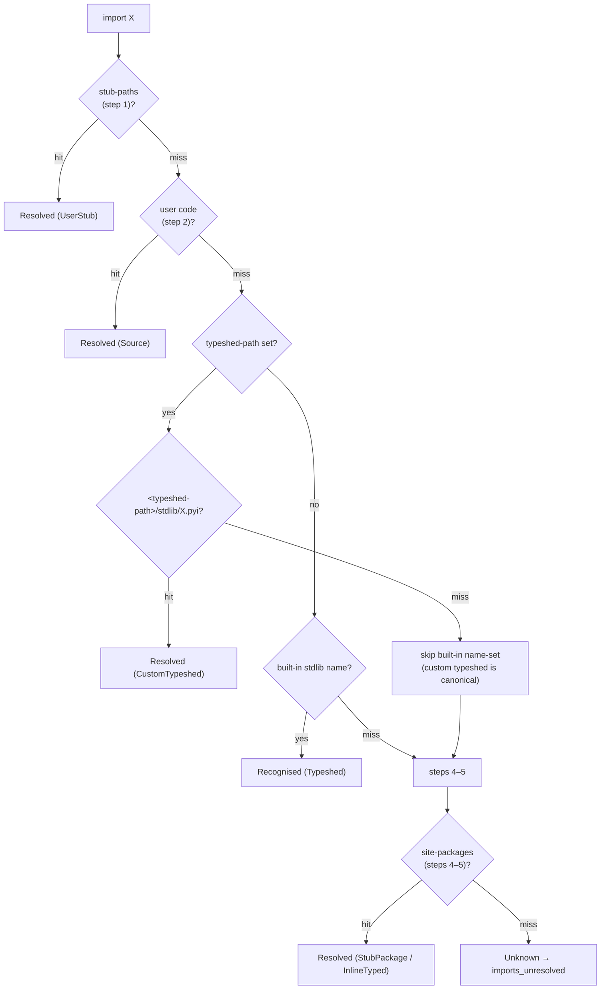

# Stub Resolution & Type Provenance — Specification {#STUBRES}

> **Crate**: `basilisk-stubs` (resolution and typeshed indexes), `basilisk-config` (overrides)
> **Related**: [LSP-UV-INTEGRATION-SPEC.md §LSPUV-LOCK-REGISTRY](LSP-UV-INTEGRATION-SPEC.md#LSPUV-LOCK-REGISTRY) — `PackageRegistry` accelerates stub discovery

---

## Static Resolution Model {#STUBRES-STATIC-MODEL}

Import resolution is **purely static**. Basilisk resolves every import by
inspecting files on disk in the fixed order of [§STUBRES-PEP561](#STUBRES-PEP561),
and MUST NOT execute the target program or its import system to do so. There is
no embedded CPython, no interpreter subprocess, and no model of the runtime
`import` machinery — resolution is a filesystem search, never an execution. This
is what lets Basilisk ship as a single native binary with no Python runtime.

Two consequences follow directly, and both are **by design**, not gaps:

- **Computed / dynamic imports are unresolvable.** An import whose module name
  is not a static string literal — `importlib.import_module(name)`,
  `__import__(var)` — cannot be followed statically, because the name exists only
  at runtime. The call's result is `Any` (the declared return type of
  `importlib.import_module` / `__import__` in typeshed) and no member access on
  it is checked. Basilisk MUST NOT guess the target module.
- **`sys.meta_path` finders and custom loaders are not modelled.** A program MAY
  install import hooks (`sys.meta_path`, `sys.path_hooks`, custom
  `importlib.abc.MetaPathFinder`s) that make `import foo` resolve to something no
  filesystem search could find — generated modules, database-backed modules,
  zipimports. Honouring those hooks would mean running the target program, which
  a static checker MUST NOT do. Such a module matches no step of
  [§STUBRES-PEP561](#STUBRES-PEP561) and is treated exactly like any other
  unresolved import.

The typed-world answer for a module Basilisk cannot introspect statically is a
**stub** (`.pyi`), not a runtime model: authoring or installing a stub
([§STUBRES-PEP561](#STUBRES-PEP561) steps 1/4/5, or the "Create local stub" quick
fix [§STUBRES-CREATE-LOCAL](#STUBRES-CREATE-LOCAL)) gives an otherwise-dynamic
module precise types with zero execution.

**Terminal state.** When the static search of [§STUBRES-PEP561](#STUBRES-PEP561)
exhausts every step without a hit, the import lands in the terminal
`ImportResolution::Unresolved` state and its bound names carry an **implicit
`Any`**. Basilisk MUST NOT silently accept that `Any` the way a gradual checker
does: default-strict surfaces it as `imports_unresolved`
([§STUBRES-PROVENANCE-DIAG](#STUBRES-PROVENANCE-DIAG),
[CHKARCH-STRICTNESS-ANY](CHECKER-ARCHITECTURE-SPEC.md#CHKARCH-STRICTNESS-ANY)). A
module MAY *stay* `Any` only through an explicit opt-out — a module-level
`def __getattr__(name: str) -> Any: ...` in its stub
([§STUBRES-CREATE-LOCAL](#STUBRES-CREATE-LOCAL)) — never implicitly.

---

## Import Resolution Order {#STUBRES-PEP561}

Basilisk MUST resolve modules that carry type information in the exact order
mandated by the Python typing specification —
[Distributing type information → Import resolution ordering](https://typing.python.org/en/latest/spec/distributing.html#import-resolution-ordering)
(the normative successor to [PEP 561](https://peps.python.org/pep-0561/)).
The table maps that upstream order to Basilisk; the linked typing specification
is authoritative for the general rule.

| Spec step | Basilisk mechanism | Config key |
|---|---|---|
| 1 — manual stubs at head of path | User `.pyi` stubs in `stub-paths` directories, plus the auto-discovered `.basilisk/stubs/` cache ([§STUBRES-CREATE-LOCAL](#STUBRES-CREATE-LOCAL)). They sit at the head of the path and MAY shadow any later module, stdlib or third-party. | `stub-paths` |
| 2 — user code | Workspace `.py` source under the configured roots / `include`. | roots, `include` |
| 3 — stdlib typeshed | The compile-time standard-library index in `basilisk-stubs` ([§STUBRES-TYPESHED](#STUBRES-TYPESHED)), **overridable** by real stubs from a custom typeshed directory ([§STUBRES-CUSTOM-TYPESHED](#STUBRES-CUSTOM-TYPESHED)). | `typeshed-path` |
| 4 — stub-only packages | Installed `foopkg-stubs` / typeshed `types-foopkg` distributions, discovered in site-packages. They supersede an inline-typed install of the same package. | (auto) |
| 5 — `py.typed` packages | Installed packages shipping a `py.typed` marker (stubs in `.pyi` or inline in `.py`). | (auto) |
| 6 — vendored third-party stubs | Basilisk vendors **no** third-party stubs for resolution; the bundled typeshed *distribution index* drives only the "install stubs" quick fix ([§STUBRES-CODEACTIONS](#STUBRES-CODEACTIONS)), never module resolution — nothing occupies this last slot. | — |

A module that matches no step resolves to `Unknown` and `imports_unresolved`
fires ([§STUBRES-PROVENANCE-DIAG](#STUBRES-PROVENANCE-DIAG)).

> **uv fast path**: In uv projects, steps 4–5 are accelerated by the `PackageRegistry` parsed from `uv.lock`. The registry knows every installed package and whether a companion stub package exists — no site-packages directory walk needed. See [LSP-UV-INTEGRATION-SPEC.md §LSPUV-LOCK-REGISTRY](LSP-UV-INTEGRATION-SPEC.md#LSPUV-LOCK-REGISTRY).

### Custom typeshed override {#STUBRES-CUSTOM-TYPESHED}

Step 3 of the resolution order requires that "type checkers SHOULD provide an
option for users to provide a path to a directory containing a custom or
modified version of typeshed; if this option is provided, type checkers SHOULD
use this as the canonical source for standard-library types in this step"
([typing spec, import resolution ordering](https://typing.python.org/en/latest/spec/distributing.html#import-resolution-ordering)).

Basilisk satisfies this with `typeshed-path` (`pyproject.toml`; LSP JSON:
`typeshedPath`) — a single path to the root of a typeshed-layout directory that
supplies standard-library stubs:

```toml
[tool.basilisk]
typeshed-path = "typeshed-micropython"   # stdlib/*.pyi replacing built-in stdlib recognition
```

Normative behaviour:

- When `typeshed-path` is set, that directory is the **canonical source for
  standard-library types** (spec step 3): Basilisk MUST resolve stdlib modules
  against it and MUST NOT consult the built-in stdlib index for any module the
  custom directory supplies.
- A stdlib module absent from the custom directory falls through to the later
  resolution steps exactly as an unrecognized built-in module would — the override
  replaces built-in stdlib recognition, it does not truncate resolution.
- A relative `typeshed-path` is resolved against the workspace root, mirroring
  `stub-paths`.
- `typeshed-path` is distinct from `stub-paths`: `stub-paths` (step 1)
  *prepends* extra stub directories at the head of the path and can shadow
  individual modules; `typeshed-path` (step 3) replaces the built-in stdlib-name
  index with a real canonical standard-library stub tree.
- The directory uses typeshed layout: stdlib stubs live under `stdlib/`, and
  Basilisk resolves `<typeshed-path>/stdlib/<module>.pyi`.

### Resolution flow {#STUBRES-RESOLUTION-FLOW}

The full order, including the canonicality rule: when `typeshed-path` is set, a
stdlib module absent from it MUST NOT be rescued by the built-in
`is_stdlib_module` name-set — the custom directory is canonical for step 3, so an
absent module falls through to steps 4–5 and, failing those, to
`imports_unresolved`.



---

## Stub Discovery Engine {#STUBRES-ENGINE}

`basilisk-stubs` provides stub resolution.

### Type model {#STUBRES-TYPE-MODEL}

The resolver returns a `StubResolution` tagged with **where** the type info came
from (`StubSource`) and **how much to trust it** (`StubTier`). The data model is
defined in [typeDiagram](https://typediagram.dev) markup — source of truth
[`models/stub_resolution.td`](../../models/stub_resolution.td), rendered to
[`docs/models/stub_resolution.svg`](../models/stub_resolution.svg). The Rust
ADTs in `crates/basilisk-stubs/src/types.rs` are generated from it
(`typediagram --to rust models/stub_resolution.td`):

```td
alias PathBuf = String

type StubResolution {
  module: String
  source: StubSource
  pyi_path: Option<PathBuf>
  tier: StubTier
}

union StubSource {
  UserStub
  StubPackage
  InlineTyped
  Typeshed
  CustomTypeshed
}

union StubTier {
  Tier1
  Tier2
  Tier3
}
```

`StubSource` records which resolution step ([§STUBRES-PEP561](#STUBRES-PEP561)) supplied the stub:

| Variant | Resolution step | Meaning |
|---|---|---|
| `UserStub` | 1 | `.pyi` from a `stub-paths` directory (head of path) |
| `CustomTypeshed` | 3 | stdlib stub from a `typeshed-path` override ([§STUBRES-CUSTOM-TYPESHED](#STUBRES-CUSTOM-TYPESHED)) |
| `Typeshed` | 3 | standard-library module recognized by the built-in index |
| `StubPackage` | 4 | installed `foopkg-stubs` package |
| `InlineTyped` | 5 | installed package with a `py.typed` marker |

A `CustomTypeshed` stub is `Tier1` (hand-written, trusted) and hovers as
`… (custom typeshed)`, so a MicroPython signature is never misreported as the
built-in CPython classification.

### Bundled typeshed indexes {#STUBRES-TYPESHED}

`basilisk-stubs/build.rs` generates two compile-time PHF indexes:

- CPython 3.12 standard-library top-level module names, used for O(1)
  recognition.
- Import-root to `types-<distribution>` mappings, generated from the committed
  typeshed distribution data and used for install-stub suggestions.

The build does not embed or parse the full typeshed `.pyi` tree. A
`typeshed-path` override supplies real stdlib stub files when a project needs
alternate or richer signatures.

### .pyi File Parsing {#STUBRES-PYI}

`ruff_python_parser` handles `.pyi` files too:

- Only signatures matter (function defs, class defs, variable annotations)
- Bodies (`...`/`pass`) ignored; no runtime analysis
- `@overload` is significant

---

## Type Provenance {#STUBRES-PROVENANCE}

Types carry a `TypeProvenance` value from
`crates/basilisk-stubs/src/types.rs`. It records source annotations,
built-in/custom typeshed recognition, community or generated stubs, and untyped
imports. There is no separate `TrackedType` wrapper.

### Diagnostic Behaviour by Provenance {#STUBRES-PROVENANCE-DIAG}

| Provenance | imports_unresolved | Downstream type errors | LSP hover | Code Action |
|------------|-----------|----------------------|-----------|-------------|
| Source | not fired | normal errors | shows inferred type | — |
| StubTier1 | not fired | normal errors | shows stub type + "(typeshed)" | — |
| StubCustomTypeshed | not fired | normal errors | shows stub type + "(custom typeshed)" | — |
| StubTier2 | not fired | normal errors | shows type + "(community stub)" | — |
| StubTier3 | downgraded to info | warnings only | shows type + "(best-effort stub, may be inaccurate)" | — |
| Untyped | error (default) | **suppressed** | shows type + "(no type stubs available)" | one-click install (typeshed) or create-local stub via LSP |

When provenance is `Untyped`, one diagnostic at the import site replaces cascading use-site errors:

1. imports_unresolved fires once at the import
2. The imported symbol becomes `Unknown` with `Untyped` provenance
3. Downstream rules check provenance — if one operand is `Untyped`, the cascade is suppressed
4. The fix is one click: the LSP provides code actions that run the appropriate `uv` command

### Code Actions for Unresolved Imports {#STUBRES-CODEACTIONS}

**Principle**: Diagnostics MUST NOT tell users to run CLI commands; the LSP provides one-click code actions that do the work. Every imports_unresolved and BSK-E0152 diagnostic MUST have an associated code action:

| Diagnostic | Scenario | Code Action | LSP Command |
|------------|----------|-------------|-------------|
| imports_unresolved | Package not installed | "Add dependency: `{pkg}`" | `basilisk.uv.add` |
| imports_unresolved | Package not in deps (transitive only) | "Add dependency: `{pkg}`" | `basilisk.uv.add` |
| imports_unresolved | Package declared but not synced | "Sync environment" | `basilisk.uv.sync` |
| BSK-E0152 | Package installed, typeshed stub exists | "Install type stubs: `types-{pkg}`" | `basilisk.uv.addDev` |
| BSK-E0152 | Package installed, **no** typeshed stub | "Create local type stub for `{pkg}`" | `basilisk.stubs.createLocal` |

The `uv`-backed actions execute via `workspace/executeCommand`: the LSP spawns `uv` as a subprocess, reports progress via `window/logMessage`, and re-resolves on completion — the diagnostic clears automatically.

The create-local action is offered for **every** BSK-E0152 (the only fix when typeshed publishes nothing, a fallback when it does), so the "every diagnostic has a code action" guarantee holds even for packages with no published stubs.

Diagnostic help text describes **what's wrong**, not a CLI command; the action is the fix. See [LSP-UV-INTEGRATION-SPEC.md §LSPUV-ACTIONS](LSP-UV-INTEGRATION-SPEC.md#LSPUV-ACTIONS).

#### Create Local Stub {#STUBRES-CREATE-LOCAL}

`basilisk.stubs.createLocal` (arg: module name) scaffolds a **strict** local
stub for an untyped package.

- **Target**: `<workspace-root>/.basilisk/stubs/{module}.pyi`, the same Tier-3
  stub cache the resolver auto-includes on its search path (see
  [§STUBRES-AUTOGEN](#STUBRES-AUTOGEN) and `ImportSearchPaths::from_config`), so
  the import re-resolves with **no config edit**.
- **Skeleton (strict by default)**: header comments only, declaring *nothing*.
  Creating it clears `BSK-E0152`; because the stub is authoritative
  ([§STUBRES-MEMBER via E0154](CHECKER-ARCHITECTURE-SPEC.md#CHKARCH-DIAG-STUB-MEMBER)),
  `imports_module_attribute` then prompts the developer to declare each name used.
  The comment documents the opt-out (a module-level
  `def __getattr__(name: str) -> Any: ...` makes every attribute `Any`), but the
  skeleton deliberately does **not** emit it.
- **Idempotent**: an existing stub is never clobbered (handler returns
  `created: false`).
- After writing, the handler calls `rebuild_registry_and_resolve` so BSK-E0152
  clears automatically.

The BSK-E0152 `help`/`note` text names this `stub-paths`/`.pyi` route and links
[PEP 561](https://peps.python.org/pep-0561/) and the
[stub-writing guide](https://typing.python.org/en/latest/guides/writing_stubs.html),
folded onto the LSP diagnostic message (the LSP `Diagnostic` has no `help`/`note`
fields). No shell command appears in the help.

#### Add Member {#STUBRES-ADD-MEMBER}

`basilisk.stubs.addMember` (args: stub path, snippet line) is the quick fix for
`imports_module_attribute` ([§CHKARCH-DIAG-STUB-MEMBER](CHECKER-ARCHITECTURE-SPEC.md#CHKARCH-DIAG-STUB-MEMBER)) —
"add the undeclared member to the local stub", closing the loop opened by the
strict create-local skeleton.

- **Code action** (`code_actions/stubs.rs`): parses module/attribute and stub
  path from the folded diagnostic message, then inspects the access site. A call
  `module.attr(a, kw=b)` → a method with parameters inferred from the call
  (positional → `argN: Any`, keyword → `kw: Any`, `*`/`**` splat →
  `*args: Any, **kwargs: Any`); a plain `module.attr` → an attribute `attr: Any`.
- **Handler** (`server/stub_handlers.rs::execute_add_stub_member`): appends the
  snippet to the existing `.pyi`, inserting `from typing import Any` once if
  needed, then re-resolves so `imports_module_attribute` clears. Only an existing
  `.pyi` inside a workspace root is ever written.
- The developer then tightens the `Any` placeholders into real signatures.

### Provenance in Hover {#STUBRES-PROVENANCE-HOVER}

| Cursor on | Hover display |
|-----------|---------------|
| Untyped import | `fastmcp (no type stubs available)` |
| Tier 3 stub symbol | `FastMCP (best-effort stub, may be inaccurate)` |
| Tier 2 stub symbol | `pandas.read_csv(...) (community stub)` |
| typeshed symbol | `os.path.join (typeshed)` |
| custom-typeshed stdlib symbol | `os.uname (custom typeshed)` |
| Tier 1 stub symbol | `requests.get(...) -> Response` (no annotation — trusted) |

> uv projects enrich import hovers with package version and dependency classification from the `PackageRegistry`; see [LSPUV-HOVER](LSP-UV-INTEGRATION-SPEC.md#LSPUV-HOVER).

---

## Configuration {#STUBRES-CONFIG}

### Suppression ownership {#STUBRES-SUPPRESSION}

Stub/import diagnostics use the checker's ordinary severity and inline-suppression system;
there is no stub-specific suppression grammar. See
[CHKARCH-STRICTNESS-SUPPRESSION](CHECKER-ARCHITECTURE-SPEC.md#CHKARCH-STRICTNESS-SUPPRESSION).

| Setting Key | Type | Default | Description |
|------------|------|---------|-------------|
| `basilisk.stubPaths` | `string[]` | `[]` | Additional directories to search for `.pyi` stubs (resolution step 1 — [§STUBRES-PEP561](#STUBRES-PEP561)) |
| `basilisk.typeshedPath` | `string` | _(built-in index)_ | Path to a custom/modified typeshed directory that becomes the canonical source for standard-library types (resolution step 3 — [§STUBRES-CUSTOM-TYPESHED](#STUBRES-CUSTOM-TYPESHED)) |

Both keys accept the `pyproject.toml` kebab-case (`stub-paths`, `typeshed-path`)
and the LSP JSON camelCase (`stubPaths`, `typeshedPath`) spellings.

`pyproject.toml` configuration:

```toml
[tool.basilisk]
stub-paths = ["stubs/"]
typeshed-path = "typeshed-micropython"   # optional: provide canonical stdlib stubs

[tool.basilisk.rules]
"imports_unresolved" = "warning"

[tool.basilisk.per-module-overrides."fastmcp"]
ignore-missing-stubs = true

[tool.basilisk.per-module-overrides."django.*"]
ignore-missing-stubs = true

[tool.basilisk.per-path-overrides."vendor/**"]
disabled = ["imports_unresolved"]
```

---

## Auto-Stub Generation {#STUBRES-AUTOGEN}

```bash
basilisk stubs generate requests      # generate stubs for one package
basilisk stubs generate --all         # generate for all untyped imports
basilisk stubs status                 # show stub coverage report
```

Generated stubs go into `.basilisk/stubs/`, tagged Tier 3 so provenance makes them produce warnings, not false confidence.

### Generation Modes {#STUBRES-AUTOGEN-MODES}

| Mode | Source | Accuracy |
|------|--------|----------|
| Runtime introspection | `inspect.signature()` via subprocess | Highest — sees actual signatures |
| AST-based inference | Parse `.py` source, infer types | Medium — misses dynamic patterns |
| Hybrid | Prefer runtime, fall back to AST | Best of both |

---
