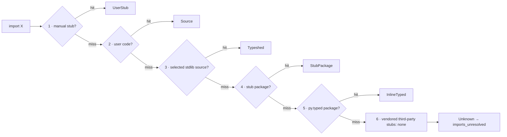

# Stub Resolution & Type Provenance — Specification {#STUBRES}

> **Crate**: `basilisk-stubs` (resolution, the runtime `python/typeshed` clone + on-disk cache, and the bundled offline baseline), `basilisk-config` (overrides)
> **Related**: [LSP-UV-INTEGRATION-SPEC.md §LSPUV-LOCK-REGISTRY](LSP-UV-INTEGRATION-SPEC.md#LSPUV-LOCK-REGISTRY) — `PackageRegistry` accelerates stub discovery

---

## Static Resolution Model {#STUBRES-STATIC-MODEL}

Import resolution is **purely static**. Basilisk resolves every import by
inspecting files on disk in the fixed order of [§STUBRES-PEP561](#STUBRES-PEP561),
and MUST NOT execute the target program or its import system to do so. There is
no embedded CPython, no interpreter subprocess, and no model of the runtime
`import` machinery — resolution is a filesystem search, never an execution. This
is what lets Basilisk ship as a single native binary with no Python runtime.

Two consequences follow directly, and both are **by design**, not gaps:

- **Computed / dynamic imports are unresolvable.** An import whose module name
  is not a static string literal — `importlib.import_module(name)`,
  `__import__(var)` — cannot be followed statically, because the name exists only
  at runtime. The call's result is `Any` (the declared return type of
  `importlib.import_module` / `__import__` in typeshed) and no member access on
  it is checked. Basilisk MUST NOT guess the target module.
- **`sys.meta_path` finders and custom loaders are not modelled.** A program MAY
  install import hooks (`sys.meta_path`, `sys.path_hooks`, custom
  `importlib.abc.MetaPathFinder`s) that make `import foo` resolve to something no
  filesystem search could find — generated modules, database-backed modules,
  zipimports. Honouring those hooks would mean running the target program, which
  a static checker MUST NOT do. Such a module matches no step of
  [§STUBRES-PEP561](#STUBRES-PEP561) and is treated exactly like any other
  unresolved import.

The typed-world answer for a module Basilisk cannot introspect statically is a
**stub** (`.pyi`), not a runtime model: authoring or installing a stub
([§STUBRES-PEP561](#STUBRES-PEP561) steps 1/4/5, or the "Create local stub" quick
fix [§STUBRES-CREATE-LOCAL](#STUBRES-CREATE-LOCAL)) gives an otherwise-dynamic
module precise types with zero execution.

**Terminal state.** When the static search of [§STUBRES-PEP561](#STUBRES-PEP561)
exhausts every step without a hit, the import lands in the terminal
`ImportResolution::Unresolved` state and its bound names carry an **implicit
`Any`**. Basilisk MUST NOT silently accept that `Any` the way a gradual checker
does: default-strict surfaces it as `imports_unresolved`
([§STUBRES-PROVENANCE-DIAG](#STUBRES-PROVENANCE-DIAG),
[CHKARCH-STRICTNESS-ANY](CHECKER-ARCHITECTURE-SPEC.md#CHKARCH-STRICTNESS-ANY)). A
module MAY *stay* `Any` only through an explicit opt-out — a module-level
`def __getattr__(name: str) -> Any: ...` in its stub
([§STUBRES-CREATE-LOCAL](#STUBRES-CREATE-LOCAL)) — never implicitly.

---

## Import Resolution Order {#STUBRES-PEP561}

Basilisk MUST resolve modules that carry type information in the exact order
mandated by the Python typing specification —
[Distributing type information → Import resolution ordering](https://typing.python.org/en/latest/spec/distributing.html#import-resolution-ordering)
(the normative successor to [PEP 561](https://peps.python.org/pep-0561/)).
The table maps that upstream order to Basilisk; the linked typing specification
is authoritative for the general rule. Its full normative text is reproduced
verbatim in [§STUBRES-PEP561-NORMATIVE](#STUBRES-PEP561-NORMATIVE) so the mapping
can be checked against the source directly, not paraphrased.

### Normative text, verbatim {#STUBRES-PEP561-NORMATIVE}

Quoted in full (no elision of any step) so Basilisk's behaviour can be audited
against the letter of the specification. Source pinned to
[`python/typing@6ef9f77` · `docs/spec/distributing.rst`](https://github.com/python/typing/blob/6ef9f7719ecfff09dad8724ef42b621fd994fb5e/docs/spec/distributing.rst)
(rendered: [Distributing type information → Import resolution ordering](https://typing.python.org/en/latest/spec/distributing.html#import-resolution-ordering)).
Verify the pin before relying on it: the SHA is a fixed point in history, and
`main` may have advanced.

**Import resolution ordering** — the complete ordered list, verbatim:

> The following is the order in which type checkers supporting this specification
> SHOULD resolve modules containing type information:
>
> 1. Stubs or Python source manually put in the beginning of the path. Type
>    checkers SHOULD provide this to allow the user complete control of which
>    stubs to use, and to patch broken stubs or inline types from packages. In
>    mypy the `$MYPYPATH` environment variable can be used for this.
> 2. User code - the files the type checker is running on.
> 3. Typeshed stubs for the standard library. These will usually be vendored by
>    type checkers, but type checkers SHOULD provide an option for users to
>    provide a path to a directory containing a custom or modified version of
>    typeshed; if this option is provided, type checkers SHOULD use this as the
>    canonical source for standard-library types in this step.
> 4. Stub packages - these packages SHOULD supersede any installed inline
>    package. They can be found in directories named `foopkg-stubs` for package
>    `foopkg`.
> 5. Packages with a `py.typed` marker file - if there is nothing overriding the
>    installed package, *and* it opts into type checking, the types bundled with
>    the package SHOULD be used (be they in `.pyi` type stub files or inline in
>    `.py` files).
> 6. If the type checker chooses to additionally vendor any third-party stubs
>    (from typeshed or elsewhere), these SHOULD come last in the module
>    resolution order.

**Stub files, `py.typed`, the `-stubs` naming scheme, partial stubs, and `.pyi`
precedence** — the remaining normative clauses this spec relies on, verbatim from
the same source (bracketed `[…]` marks where non-normative prose between
sentences is omitted; no normative sentence is cut):

> Package maintainers who wish to support type checking of their code MUST add a
> marker file named `py.typed` to their package supporting typing. This marker
> applies recursively: if a top-level package includes it, all its sub-packages
> MUST support type checking as well.

> The name of the stub package MUST follow the scheme `foopkg-stubs` for type
> stubs for the package named `foopkg`. […] For stub-only packages adding a
> `py.typed` marker is not needed since the name `*-stubs` is enough to indicate
> it is a source of typing information.

> If a stub package distribution is partial it MUST include `partial\n` in a
> `py.typed` file. […] Type checkers should treat namespace packages within
> stub-packages as incomplete since multiple distributions may populate them.
> Regular packages within namespace packages in stub-package distributions are
> considered complete unless a `py.typed` with `partial\n` is included.

> Type checkers MUST maintain the normal resolution order of checking `*.pyi`
> before `*.py` files.

Every row below applies the complete pinned quotation above from
[`python/typing@6ef9f77`](https://github.com/python/typing/blob/6ef9f7719ecfff09dad8724ef42b621fd994fb5e/docs/spec/distributing.rst).
Runtime acquisition only chooses the data used at step 3; it does not add or
reorder a resolution step.

### Basilisk mapping {#STUBRES-PEP561-MAPPING}

| Spec step | Basilisk mechanism | Config key |
|---|---|---|
| 1 — manual stubs at head of path | User `.pyi` stubs in `stub-paths` directories, plus the auto-discovered `.basilisk/stubs/` cache ([§STUBRES-CREATE-LOCAL](#STUBRES-CREATE-LOCAL)). They sit at the head of the path and MAY shadow any later module, stdlib or third-party. | `stub-paths` |
| 2 — user code | Workspace `.py` source under the configured roots / `include`. | roots, `include` |
| 3 — stdlib typeshed | One selected source: a custom `typeshed-path`; otherwise a freshly verified runtime clone; otherwise the bundled names-only baseline ([§STUBRES-TYPESHED](#STUBRES-TYPESHED)). | `typeshed-path`, `typeshed-cache-path` |
| 4 — stub-only packages | Installed `foopkg-stubs` / typeshed `types-foopkg` distributions, discovered in site-packages. They supersede an inline-typed install of the same package. | (auto) |
| 5 — `py.typed` packages | Installed packages shipping a `py.typed` marker (stubs in `.pyi` or inline in `.py`). | (auto) |
| 6 — vendored third-party stubs | Basilisk vendors none for resolution. The typeshed distribution map drives only the "install stubs" quick fix ([§STUBRES-CODEACTIONS](#STUBRES-CODEACTIONS)). | — |

A module that matches no step resolves to `Unknown` and `imports_unresolved`
fires ([§STUBRES-PROVENANCE-DIAG](#STUBRES-PROVENANCE-DIAG)).

> **uv fast path**: In uv projects, steps 4–5 are accelerated by the `PackageRegistry` parsed from `uv.lock`. The registry knows every installed package and whether a companion stub package exists — no site-packages directory walk needed. See [LSP-UV-INTEGRATION-SPEC.md §LSPUV-LOCK-REGISTRY](LSP-UV-INTEGRATION-SPEC.md#LSPUV-LOCK-REGISTRY).

### Custom typeshed override {#STUBRES-CUSTOM-TYPESHED}

The pinned typing specification says a configured custom typeshed should be the
"canonical source for standard-library types in this step" ([step 3,
`python/typing@6ef9f77`](https://github.com/python/typing/blob/6ef9f7719ecfff09dad8724ef42b621fd994fb5e/docs/spec/distributing.rst)).
Basilisk exposes that source as `typeshed-path`:

```toml
[tool.basilisk]
typeshed-path = "typeshed-micropython"
```

That directory is the sole step-3 source and disables automatic acquisition and
the bundled baseline. A missing module continues at step 4; it never falls back
to another typeshed. Relative paths resolve from the workspace root and stdlib
stubs live at `<typeshed-path>/stdlib/<module>.pyi`. `stub-paths` remains the
separate step-1 override; `typeshed-cache-path` only relocates automatic storage.

### Resolution flow {#STUBRES-RESOLUTION-FLOW}

The flow is the six-step order quoted verbatim above and pinned to
[`python/typing@6ef9f77`](https://github.com/python/typing/blob/6ef9f7719ecfff09dad8724ef42b621fd994fb5e/docs/spec/distributing.rst).
Step 3 receives one preselected source; acquisition details never branch the
import order.



Step 3 selects `typeshed-path`; otherwise a freshly verified download;
otherwise the bundled names-only baseline. A custom-source miss proceeds to
step 4. Downloaded data replaces bundled or compiled data wholesale.

---

## Stub Discovery Engine {#STUBRES-ENGINE}

`basilisk-stubs` provides stub resolution.

### Type model {#STUBRES-TYPE-MODEL}

The resolver returns a `StubResolution` tagged with **where** the type info came
from (`StubSource`) and **how much to trust it** (`StubTier`). The data model is
defined in [typeDiagram](https://typediagram.dev) markup — source of truth
[`models/stub_resolution.td`](../../models/stub_resolution.td), rendered to
[`models/stub_resolution.td`](../../models/stub_resolution.td). The Rust
ADTs in `crates/basilisk-stubs/src/types.rs` are generated from it
(`typediagram --to rust models/stub_resolution.td`):

```typeDiagram
alias PathBuf = String

type StubResolution {
  module: String
  source: StubSource
  pyi_path: Option<PathBuf>
  tier: StubTier
}

union StubSource {
  UserStub
  StubPackage
  InlineTyped
  Typeshed
  CustomTypeshed
}

union StubTier {
  Tier1
  Tier2
  Tier3
}
```

`StubSource` records which resolution step ([§STUBRES-PEP561](#STUBRES-PEP561)) supplied the stub:

| Variant | Resolution step | Meaning |
|---|---|---|
| `UserStub` | 1 | `.pyi` from a `stub-paths` directory (head of path) |
| `CustomTypeshed` | 3 | stdlib stub from a `typeshed-path` override ([§STUBRES-CUSTOM-TYPESHED](#STUBRES-CUSTOM-TYPESHED)) |
| `Typeshed` | 3 | stdlib resolved from the selected runtime clone or names-only baseline ([§STUBRES-TYPESHED](#STUBRES-TYPESHED)) |
| `StubPackage` | 4 | installed `foopkg-stubs` package |
| `InlineTyped` | 5 | installed package with a `py.typed` marker |

A `CustomTypeshed` stub is `Tier1` (hand-written, trusted) and hovers as
`… (custom typeshed)`, so a MicroPython signature is never misreported as the
built-in CPython classification.

### Standard-library typeshed source {#STUBRES-TYPESHED}

The pinned typing specification names "Typeshed stubs for the standard library",
says they are "usually" vendored, and makes a configured custom tree canonical
([step 3, `python/typing@6ef9f77`](https://github.com/python/typing/blob/6ef9f7719ecfff09dad8724ef42b621fd994fb5e/docs/spec/distributing.rst)).
Basilisk selects exactly one step-3 source:

1. `typeshed-path`, when configured;
2. a runtime `python/typeshed@main` clone verified during this CLI run or LSP
   session; or
3. the bundled names-only baseline when acquisition is unavailable.

A verified download replaces the baseline **wholesale**: stub bodies, module
names, and the distribution map all come from the same downloaded commit.
Bundled or compiled data MUST NOT override or mix with it.

#### Runtime acquisition {#STUBRES-TYPESHED-CLONE}

Runtime acquisition is Basilisk's implementation of the pinned step-3 allowance
that typeshed is "usually" vendored
([`python/typing@6ef9f77`](https://github.com/python/typing/blob/6ef9f7719ecfff09dad8724ef42b621fd994fb5e/docs/spec/distributing.rst));
the typing specification does not prescribe cloning, caching, commits, or
freshness policy.

- Before the first analysis, acquire and verify `python/typeshed@main`. There is
  no TTL, historical pin, or Python-version-to-commit map.
- The on-disk cache is a transport optimisation only. Every acquisition must
  contact upstream before activating it; failure MUST NOT reuse an earlier
  checkout. `stale` is not a valid source state.
- Clone/fetch into a temporary directory under a process lock, validate it, and
  atomically promote it. The activated commit stays immutable for that run or
  session.
- `typeshed-cache-path` relocates the cache. `typeshed-path` bypasses acquisition
  and is canonical under [§STUBRES-CUSTOM-TYPESHED](#STUBRES-CUSTOM-TYPESHED).

#### Bundled baseline {#STUBRES-TYPESHED-BASELINE}

The baseline is a degraded, names-only fallback within step 3 of the pinned
resolution order
([`python/typing@6ef9f77`](https://github.com/python/typing/blob/6ef9f7719ecfff09dad8724ef42b621fd994fb5e/docs/spec/distributing.rst)).
It contains `stdlib/VERSIONS`-format module names and the
`types-<distribution>` map, but no `.pyi` bodies. Loose packaged files are the
source of truth. A benchmark-justified compiled copy MAY accelerate only that
baseline and MUST be bypassed whenever downloaded or custom content is active.
Consequently, #289 hover and call-level stdlib types require the runtime clone.

#### Source reporting {#STUBRES-TYPESHED-WARN}

The pinned typing specification defines resolution order, not transport status
([`python/typing@6ef9f77`](https://github.com/python/typing/blob/6ef9f7719ecfff09dad8724ef42b621fd994fb5e/docs/spec/distributing.rst)).
Basilisk therefore reports only the two automatic outcomes it actually permits:

- verified download: `typeshed <short-sha> · <commit-date>`;
- bundled fallback: `typeshed download unavailable; using bundled names only`.

There is no stale-cache outcome. The CLI and LSP Service Info tree expose the
same source, and the baseline warning appears only when the baseline supplied
step 3.

#### Config keys {#STUBRES-TYPESHED-CONFIG}

The only typing-spec-facing setting is the custom canonical path named by pinned
step 3
([`python/typing@6ef9f77`](https://github.com/python/typing/blob/6ef9f7719ecfff09dad8724ef42b621fd994fb5e/docs/spec/distributing.rst)).

| Config key (`[tool.basilisk]`) | Type | Default | Meaning |
|---|---|---|---|
| `typeshed-cache-path` | `string` | _(OS cache dir)_ | Relocate automatic clone storage. |
| `typeshed-path` | `string` | _(unset)_ | Supply the canonical custom step-3 tree and disable acquisition. |

#### Target Python version {#STUBRES-TYPESHED-VERSION}

The pinned typing specification expects checkers to "understand simple version
and platform checks"
([`python/typing@6ef9f77`, directives](https://github.com/python/typing/blob/6ef9f7719ecfff09dad8724ef42b621fd994fb5e/docs/spec/directives.rst)).
Accordingly, a known target version filters `stdlib/VERSIONS` and selects
`sys.version_info` / `sys.platform` branches inside one tree. It never selects a
typeshed commit. Basilisk has no fixed Python-version default and MUST NOT infer
or maintain a Python-version-to-commit map.

### .pyi File Parsing {#STUBRES-PYI}

The pinned specification says checkers should parse supported stub constructs
without contradiction and "fully support" typing features, imports, aliases,
and simple version/platform checks
([`python/typing@6ef9f77`, stub files](https://github.com/python/typing/blob/6ef9f7719ecfff09dad8724ef42b621fd994fb5e/docs/spec/distributing.rst)).
The `.pyi` index therefore retains declarations, overloads, decorators, class
bases, methods, variables, imports, aliases, and guards; bodies are ignored.
Class hover uses the indexed `__init__` signature (#289), and method hover uses
the indexed method signature (#288).

#### Re-exports {#STUBRES-PYI-REEXPORTS}

A stub's public interface includes the re-exports required by the pinned typing
specification's import conventions
([`python/typing@6ef9f77`](https://github.com/python/typing/blob/6ef9f7719ecfff09dad8724ef42b621fd994fb5e/docs/spec/distributing.rst)):

- **Redundant aliases** — `from y import x as x` and `import x as x` re-export
  `x`.
- **`__all__`** — assignment from a list/tuple plus `+=`, `extend`, `append`, and
  `remove`, including references to a submodule's `__all__`.
- **Star imports** — `from .sub import *` re-exports the target stub's export
  set: its `__all__` when it defines one (authoritative, exactly like runtime
  `import *`), otherwise its public (non-underscore) top-level names and
  re-exports, followed recursively through relative or absolute imports and
  import cycles.

Simple `sys.version_info` / `sys.platform` guards select the target branch; they
are never unioned. This follows the pinned directive that checkers are expected
to understand those checks
([`python/typing@6ef9f77`, directives](https://github.com/python/typing/blob/6ef9f7719ecfff09dad8724ef42b621fd994fb5e/docs/spec/directives.rst)).

---

## Type Provenance {#STUBRES-PROVENANCE}

Types carry a `TypeProvenance` value from
`crates/basilisk-stubs/src/types.rs`. It records source annotations,
built-in/custom typeshed recognition, community or generated stubs, and untyped
imports. There is no separate `TrackedType` wrapper.

### Diagnostic Behaviour by Provenance {#STUBRES-PROVENANCE-DIAG}

| Provenance | imports_unresolved | Downstream type errors | LSP hover | Code Action |
|------------|-----------|----------------------|-----------|-------------|
| Source | not fired | normal errors | shows inferred type | — |
| StubTier1 | not fired | normal errors | shows stub type + "(typeshed)" | — |
| StubCustomTypeshed | not fired | normal errors | shows stub type + "(custom typeshed)" | — |
| StubTier2 | not fired | normal errors | shows type + "(community stub)" | — |
| StubTier3 | downgraded to info | warnings only | shows type + "(best-effort stub, may be inaccurate)" | — |
| Untyped | error (default) | **suppressed** | shows type + "(no type stubs available)" | one-click install (typeshed) or create-local stub via LSP |

When provenance is `Untyped`, one diagnostic at the import site replaces cascading use-site errors:

1. imports_unresolved fires once at the import
2. The imported symbol becomes `Unknown` with `Untyped` provenance
3. Downstream rules check provenance — if one operand is `Untyped`, the cascade is suppressed
4. The fix is one click: the LSP provides code actions that run the appropriate `uv` command

### Code Actions for Unresolved Imports {#STUBRES-CODEACTIONS}

**Principle**: Diagnostics MUST NOT tell users to run CLI commands; the LSP provides one-click code actions that do the work. Every imports_unresolved and BSK-0152 diagnostic MUST have an associated code action:

| Diagnostic | Scenario | Code Action | LSP Command |
|------------|----------|-------------|-------------|
| imports_unresolved | Package not installed | "Add dependency: `{pkg}`" | `basilisk.uv.add` |
| imports_unresolved | Package not in deps (transitive only) | "Add dependency: `{pkg}`" | `basilisk.uv.add` |
| imports_unresolved | Package declared but not synced | "Sync environment" | `basilisk.uv.sync` |
| BSK-0152 | Package installed, typeshed stub exists | "Install type stubs: `types-{pkg}`" | `basilisk.uv.addDev` |
| BSK-0152 | Package installed, **no** typeshed stub | "Create local type stub for `{pkg}`" | `basilisk.stubs.createLocal` |

The `uv`-backed actions execute via `workspace/executeCommand`: the LSP spawns `uv` as a subprocess, reports progress via `window/logMessage`, and re-resolves on completion — the diagnostic clears automatically.

The create-local action is offered for **every** BSK-0152 (the only fix when typeshed publishes nothing, a fallback when it does), so the "every diagnostic has a code action" guarantee holds even for packages with no published stubs.

Diagnostic help text describes **what's wrong**, not a CLI command; the action is the fix. See [LSP-UV-INTEGRATION-SPEC.md §LSPUV-ACTIONS](LSP-UV-INTEGRATION-SPEC.md#LSPUV-ACTIONS).

#### Create Local Stub {#STUBRES-CREATE-LOCAL}

`basilisk.stubs.createLocal` (arg: module name) scaffolds a **strict** local
stub for an untyped package.

- **Target**: `<workspace-root>/.basilisk/stubs/{module}.pyi`, the same Tier-3
  stub cache the resolver auto-includes on its search path (see
  [§STUBRES-AUTOGEN](#STUBRES-AUTOGEN) and `ImportSearchPaths::from_config`), so
  the import re-resolves with **no config edit**.
- **Skeleton (strict by default)**: header comments only, declaring *nothing*.
  Creating it clears `BSK-0152`; because the stub is authoritative
  ([§STUBRES-MEMBER via E0154](CHECKER-ARCHITECTURE-SPEC.md#CHKARCH-DIAG-STUB-MEMBER)),
  `imports_module_attribute` then prompts the developer to declare each name used.
  The comment documents the opt-out (a module-level
  `def __getattr__(name: str) -> Any: ...` makes every attribute `Any`), but the
  skeleton deliberately does **not** emit it.
- **Idempotent**: an existing stub is never clobbered (handler returns
  `created: false`).
- After writing, the handler calls `rebuild_registry_and_resolve` so BSK-0152
  clears automatically.

The BSK-0152 `help`/`note` text names this `stub-paths`/`.pyi` route and links
[PEP 561](https://peps.python.org/pep-0561/) and the
[stub-writing guide](https://typing.python.org/en/latest/guides/writing_stubs.html),
folded onto the LSP diagnostic message (the LSP `Diagnostic` has no `help`/`note`
fields). No shell command appears in the help.

#### Add Member {#STUBRES-ADD-MEMBER}

`basilisk.stubs.addMember` (args: stub path, snippet line) is the quick fix for
`imports_module_attribute` ([§CHKARCH-DIAG-STUB-MEMBER](CHECKER-ARCHITECTURE-SPEC.md#CHKARCH-DIAG-STUB-MEMBER)) —
"add the undeclared member to the local stub", closing the loop opened by the
strict create-local skeleton.

- **Code action** (`code_actions/stubs.rs`): parses module/attribute and stub
  path from the folded diagnostic message, then inspects the access site. A call
  `module.attr(a, kw=b)` → a method with parameters inferred from the call
  (positional → `argN: Any`, keyword → `kw: Any`, `*`/`**` splat →
  `*args: Any, **kwargs: Any`); a plain `module.attr` → an attribute `attr: Any`.
- **Handler** (`server/stub_handlers.rs::execute_add_stub_member`): appends the
  snippet to the existing `.pyi`, inserting `from typing import Any` once if
  needed, then re-resolves so `imports_module_attribute` clears. Only an existing
  `.pyi` inside a workspace root is ever written.
- The developer then tightens the `Any` placeholders into real signatures.

### Provenance in Hover {#STUBRES-PROVENANCE-HOVER}

| Cursor on | Hover display |
|-----------|---------------|
| Untyped import | `fastmcp (no type stubs available)` |
| Tier 3 stub symbol | `FastMCP (best-effort stub, may be inaccurate)` |
| Tier 2 stub symbol | `pandas.read_csv(...) (community stub)` |
| typeshed symbol | `os.path.join (typeshed)` |
| custom-typeshed stdlib symbol | `os.uname (custom typeshed)` |
| Tier 1 stub symbol | `requests.get(...) -> Response` (no annotation — trusted) |

> uv projects enrich import hovers with package version and dependency classification from the `PackageRegistry`; see [LSPUV-HOVER](LSP-UV-INTEGRATION-SPEC.md#LSPUV-HOVER).

---

## Configuration {#STUBRES-CONFIG}

### Suppression ownership {#STUBRES-SUPPRESSION}

Stub/import diagnostics use the checker's ordinary severity and inline-suppression system;
there is no stub-specific suppression grammar. See
[CHKARCH-STRICTNESS-SUPPRESSION](CHECKER-ARCHITECTURE-SPEC.md#CHKARCH-STRICTNESS-SUPPRESSION).
Resolution still follows the pinned typing-spec order quoted in
[§STUBRES-PEP561-NORMATIVE](#STUBRES-PEP561-NORMATIVE).

| Config key (`[tool.basilisk]`) | Type | Default | Description |
|-------------------------------|------|---------|-------------|
| `stub-paths` | `string[]` | `[]` | Additional directories to search for `.pyi` stubs (resolution step 1 — [§STUBRES-PEP561](#STUBRES-PEP561)) |
| `typeshed-cache-path` | `string` | _(OS cache dir)_ | Where the automatic clone is stored; folder-picker in the config UI ([§STUBRES-TYPESHED-CLONE](#STUBRES-TYPESHED-CLONE)) |
| `typeshed-path` | `string` | _(unset → auto-clone)_ | Supply your own typeshed tree; disables the auto-clone and becomes the canonical source for standard-library types (resolution step 3 — [§STUBRES-CUSTOM-TYPESHED](#STUBRES-CUSTOM-TYPESHED)) |

All three keys live in the one project configuration — `pyproject.toml`
`[tool.basilisk]`
([CHKARCH-CONFIG-FILE](CHECKER-ARCHITECTURE-SPEC.md#CHKARCH-CONFIG-FILE)) —
with kebab-case as the canonical spelling. The camelCase spellings
(`stubPaths`, `typeshedPath`) are pyright-migration aliases accepted in the
same table and in the pyright compatibility sources (`[tool.pyright]`,
`pyrightconfig.json` —
[ANALYSIS-CONFIG-PRI](LSP-ANALYSIS-MODES-SPEC.md#ANALYSIS-CONFIG-PRI)). There
is no separate LSP-side JSON configuration.

`pyproject.toml` configuration:

```toml
[tool.basilisk]
stub-paths = ["stubs/"]
# Automatic acquisition always verifies python/typeshed@main.
typeshed-cache-path = ".cache/typeshed"
# Or supply the canonical step-3 tree and disable acquisition:
# typeshed-path = "typeshed-micropython"

[tool.basilisk.rules]
"imports_unresolved" = "warning"
```

Scoping `imports_unresolved` differently for part of the tree (for example
vendored code) means placing a `pyproject.toml` with a `[tool.basilisk]` table
in that folder — the nearest entry wins per rule
([CHKARCH-CONFIG-MODEL](CHECKER-ARCHITECTURE-SPEC.md#CHKARCH-CONFIG-MODEL)) —
or using inline directives at the import site. There are no module-pattern or
glob-path override tables.

---

## Auto-Stub Generation {#STUBRES-AUTOGEN}

```bash
basilisk stubs generate requests      # generate stubs for one package
basilisk stubs generate --all         # generate for all untyped imports
basilisk stubs status                 # show stub coverage report
```

Generated stubs go into `.basilisk/stubs/`, tagged Tier 3 so provenance makes them produce warnings, not false confidence.

### Generation Modes {#STUBRES-AUTOGEN-MODES}

| Mode | Source | Accuracy |
|------|--------|----------|
| Runtime introspection | `inspect.signature()` via subprocess | Highest — sees actual signatures |
| AST-based inference | Parse `.py` source, infer types | Medium — misses dynamic patterns |
| Hybrid | Prefer runtime, fall back to AST | Best of both |

---
