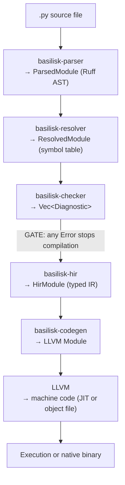

# Basilisk Compiler Specification {#COMPARCH}

**Version**: 0.1.0-draft
**Status**: Specification Draft
**License**: MIT

> ⚠️ **Implementation status: EXPERIMENTAL / mostly ROADMAP.** The `basilisk-compiler`
> crate (~1.8k LOC) currently implements a **parse → resolve → check (gate) →
> tree-walking interpreter** pipeline over a small Python subset. There is **no
> HIR, no LLVM/Cranelift, no native code generation, no AOT/JIT, no memory-layout
> model, no interop, no runtime crate, no stdlib, and no `run`/`build` CLI** (the
> compiler crate is not even a dependency of `basilisk-cli`). The four "new"
> crates named in [`COMPILER-CRATES`](#COMPILER-CRATES) do not exist. Sections
> below describe the *target* design, not what ships today; see
> [`CONFAUDIT-ROADMAP`](../plans/SPEC-CONFORMANCE-AUDIT-PLAN.md#CONFAUDIT-ROADMAP).

---

## The Basilisk Subset {#COMPILER-SUBSET}

Boundary: **if the type checker can verify it, the compiler can compile it.**

### Supported Features {#COMPILER-SUPPORTED}

Standard Python 3.12 semantics ([Language Reference](https://docs.python.org/3.12/reference/), [Typing Spec](https://typing.python.org/en/latest/spec/index.html)).

**Functions and Control Flow**
- `def` with typed parameters and return types
- `if` / `elif` / `else`, `while`, `for`
- `match` / `case` (PEP 634)
- `return`, `yield`, `yield from`
- `break`, `continue`, `pass`
- `assert` (runtime check in debug mode, stripped in release)
- `raise`, `try` / `except` / `finally`
- `with` / `as` (context managers)
- `async def`, `await`, `async for`, `async with`
- Comprehensions: list, dict, set, generator
- Lambda expressions (with inferred types from context)
- `*args: T`, `**kwargs: T` (with typed signatures)
- Closures with captured variables

**Type System**
- All PEPs listed in [CHECKER-ARCHITECTURE-SPEC.md §CHKARCH-PEPS](CHECKER-ARCHITECTURE-SPEC.md#CHKARCH-PEPS) (PEP 484, 526, 544, 585, 586, 589, 591, 604, 612, 613, 634, 646, 647, 673, 675, 681, 692, 695, 696, 698, 702, 742)
- `Union`, `Optional`, `Literal`, `Final`, `ClassVar`
- `TypeVar`, `TypeVarTuple`, `ParamSpec` (PEP 612)
- `Protocol` (structural subtyping, PEP 544)
- `TypeGuard`, `TypeIs` (PEP 647, 742)
- `Self` (PEP 673)
- `@overload`, `@override`, `@final`
- Type narrowing via `isinstance`, `is None`, truthiness, pattern matching, assertions

**Classes and Data**
- Classes with typed attributes
- Single and multiple inheritance (C3 linearization computed at compile time)
- `@dataclass`, `@dataclass(frozen=True)`
- `TypedDict`, `NamedTuple`
- `__slots__`
- `__init__`, `__repr__`, `__eq__`, `__hash__`, `__lt__`, etc.
- `@staticmethod`, `@classmethod`, `@property`
- `super()` (resolved statically from MRO)
- Descriptors with typed `__get__` / `__set__` / `__delete__`
- `Enum` and `IntEnum`

**Expressions and Operators**
- All arithmetic, comparison, logical, bitwise operators
- Augmented assignment (`+=`, `-=`, etc.)
- F-strings
- Walrus operator (`:=`, PEP 572)
- Unpacking (`a, b = ...`, `*rest = ...`)
- Subscript access with typed containers

**Modules**
- `import` and `from ... import ...` (statically resolved)
- Module-level typed variables
- `if __name__ == "__main__":` entry point

### Excluded Features {#COMPILER-EXCLUDED}

These require the CPython interpreter; not compiled natively. Use them via the interop layer ([Python Interop](#COMPILER-INTEROP)).

| Feature | Why Excluded |
|---|---|
| `eval()`, `exec()`, `compile()` | Requires runtime parsing and interpretation |
| `globals()`, `locals()` as mutable dicts | Requires dynamic frame introspection |
| `setattr()` / `getattr()` with dynamic names | Cannot be statically resolved |
| `__getattr__`, `__setattr__` for dynamic dispatch | Prevents static field layout |
| Metaclasses (beyond `type`) | Runtime code execution during class creation |
| `type("Name", bases, dict)` dynamic class creation | Cannot be statically analyzed |
| Monkey-patching (adding attributes at runtime) | Violates static class layout |
| `importlib` dynamic imports | Import graph must be known at compile time |
| `sys._getframe()`, `inspect.stack()` | No Python frames in compiled code |
| `ctypes` | Use Basilisk's FFI via interop layer instead |
| Untyped code | The type system IS the compilation contract |

### Boundary Cases {#COMPILER-BOUNDARY}

| Feature | Status | Notes |
|---|---|---|
| `__init_subclass__` | Supported | Evaluated at compile time as a static hook |
| Multiple inheritance | Supported | MRO computed at compile time via C3 linearization |
| `isinstance(x, T)` | Supported | Compiled to type-tag comparison (O(1)) |
| `type(x)` | Supported | Returns compile-time type tag, not a dynamic `type` object |
| `id(x)` | Supported | Returns memory address of the object |
| Generators | Supported | Compiled to state machine structs |
| Decorators | Supported | For decorators with known semantics; custom decorators must be typed |
| `*args: T` / `**kwargs: T` | Supported | Must have typed signatures |
| `property` | Supported | Getter/setter types inferred from annotations |

---

## Compilation Pipeline {#COMPILER-PIPELINE}

Extends the existing analysis pipeline. The type checker is a hard gate -- code that fails any rule does not enter codegen.



Existing parser/resolver/checker stages: [CHKARCH-ARCH](CHECKER-ARCHITECTURE-SPEC.md#CHKARCH-ARCH) (architecture), [CHECKER-TYPE-INFERENCE-SPEC.md](CHECKER-TYPE-INFERENCE-SPEC.md) (inference rules).

### HIR Stage {#COMPILER-HIR}

The High-level Intermediate Representation bridges analysis and codegen: takes the checker's `ResolvedModule` and produces a fully typed, monomorphized representation for LLVM lowering.

- Resolves all `InferredType` variants to concrete `CompiledType` values with memory layout
- Monomorphizes generics: `list[int]` and `list[str]` become distinct concrete types
- Lowers `Union[T1, T2]` to tagged union structs
- Lowers `Protocol` to vtable interfaces
- Resolves method dispatch (static dispatch for concrete types, vtable for protocols)
- Eliminates dead code and unreachable branches
- Evaluates `Final` values and inlines constants
- Computes class layouts (field offsets, sizes, alignments)

### Codegen Stage {#COMPILER-CODEGEN}

Translates HIR to LLVM IR via `inkwell` (safe Rust LLVM bindings):

- Function bodies → LLVM functions
- Class instances → LLVM structs
- Method dispatch → direct call (concrete) or vtable indirect call (protocol)
- Control flow → LLVM basic blocks with phi nodes
- Exception handling → LLVM landing pads (or setjmp/longjmp for simpler initial implementation)
- Pattern matching → switch + comparison chains
- Memory management → calls to pluggable runtime interface (incref/decref/alloc/dealloc)
- Python interop → calls into `libpython3.12` via pyo3-generated wrappers

---

## Type Representation {#COMPILER-TYPES}

Every `InferredType` maps to a concrete compiled representation. Unresolvable types (`Any`, `Unknown`) are rejected by the checker and never reach codegen.

| Python Type | Compiled Representation | Stack/Heap | Notes |
|---|---|---|---|
| `int` | `i64` | Stack | Fixed 64-bit. Overflow traps in debug, wraps in release. `--big-int` flag for arbitrary precision. |
| `float` | `f64` | Stack | IEEE 754 double precision |
| `bool` | `i8` (storage) / `i1` (LLVM ops) | Stack | |
| `None` | Zero-size type | N/A | No runtime representation |
| `str` | `{ ptr: *u8, len: usize, cap: usize }` | Heap (data) | UTF-8, reference-counted |
| `bytes` | `{ ptr: *u8, len: usize, cap: usize }` | Heap (data) | Reference-counted |
| `list[T]` | `{ ptr: *T, len: usize, cap: usize }` | Heap (data) | Contiguous array, reference-counted |
| `dict[K, V]` | Hash map (SwissTable layout) | Heap | Reference-counted |
| `set[T]` | Hash set | Heap | Reference-counted |
| `tuple[T1, T2, ...]` | `struct { _0: T1, _1: T2, ... }` | Stack | Fixed layout, no indirection |
| `T1 \| T2` (Union) | `{ tag: u8, data: [u8; max(sizeof(T1), sizeof(T2))] }` | Stack | Tagged/discriminated union |
| `T \| None` (Optional) | Nullable pointer if T is heap-allocated; tagged union otherwise | Stack | Null pointer optimization |
| `Callable[[P], R]` | `{ fn_ptr: *fn, env_ptr: *void }` | Stack (ptrs) | Function pointer + optional closure environment |
| Class instance | Struct with fields | Heap | Reference-counted, type-tagged |
| `@dataclass(frozen=True)` | Struct with fields | Stack (if small) | Value type, no refcount needed if stack-allocated |
| `Never` | LLVM `unreachable` | N/A | |
| `Literal[42]` | Compile-time constant | Inlined | Narrowed to base type at codegen |
| `type[T]` | Type tag (integer constant) | Stack | For `isinstance` checks |

### Integer Semantics {#COMPILER-TYPES-INT}

Default: 64-bit signed (`i64`), diverging from Python's arbitrary-precision integers.

- Overflow traps in debug, wraps in release
- `--big-int` enables arbitrary-precision integers (GMP-backed), matching Python exactly
- Integer literals exceeding `i64` range are a compile error unless `--big-int` is set

### String Semantics {#COMPILER-TYPES-STR}

UTF-8, matching Python 3's `str`:

- `s[i]` returns a single character (one-element `str`, not a code point integer)
- `s[i:j]` returns a new string (copy-on-write possible)
- `len(s)` returns Unicode code points, not bytes
- Concatenation allocates a new string (in-place when refcount == 1)

---

## Memory Model {#COMPILER-MEMORY}

Memory management is **pluggable**: the compiler emits calls to a runtime memory interface whose implementation is swappable. The same compiled user code runs under different strategies by relinking against a different runtime -- no recompilation.

Default: **CPython-style** -- reference counting with a cyclic garbage collector.

### Memory Interface {#COMPILER-MEMORY-IFACE}

All memory backends implement this interface:

```
alloc(size, type_tag) -> *void       # allocate a new object
dealloc(ptr)                         # free an object
incref(ptr)                          # increment reference count (no-op for tracing GC)
decref(ptr)                          # decrement reference count (no-op for tracing GC)
collect()                            # run cycle collection / GC pass
```

Codegen emits calls to these; the backend is selected at link time.

```bash
basilisk build --gc=refcount      # default: CPython-style (refcount + cyclic GC)
basilisk build --gc=arc           # ARC-only: no cycle collector, fastest, leaks cycles
basilisk build --gc=tracing       # tracing GC: throughput-optimized, non-deterministic __del__
basilisk build --gc=arena         # arena: bump allocator, free-all-at-once, ideal for CLI tools
```

### Default Backend {#COMPILER-MEMORY-DEFAULT}

The only backend implemented initially; others are future work. The interface exists from day one so adding a backend means implementing the trait, not restructuring the compiler.

Matches CPython's memory semantics:

- Every heap object has a reference count header
- Assignment increments the count; scope exit or reassignment decrements it
- At count zero, the object is destroyed immediately; `__del__` (if present) runs deterministically, as in CPython

**Cyclic garbage collector:**

- Objects that **can** form cycles (hold references to other heap objects) are tracked in a generation list
- Objects that **cannot** (e.g. `list[int]`, `dict[str, float]`, primitives) are exempt -- refcount alone suffices
- The collector runs when tracked object count exceeds a generation threshold
- Trial-deletion algorithm, three generations (0 young, 1, 2 old) -- same as CPython's `gc`

Acyclic object lifetime and `__del__` ordering match CPython exactly; cyclic objects use the same collection algorithm.

### Future Backends {#COMPILER-MEMORY-FUTURE}

Documented for interface design; implementation deferred.

| Backend | Flag | Trade-off | Best For |
|---|---|---|---|
| **ARC-only** | `--gc=arc` | Fastest, deterministic, but leaks reference cycles | Scripts, pipelines, acyclic data (trees, arrays, configs) |
| **Tracing GC** | `--gc=tracing` | Higher throughput, no per-assignment refcount, but non-deterministic `__del__` timing | Long-running servers, many short-lived allocations |
| **Arena** | `--gc=arena` | Bump allocation, free everything at once, fastest allocation | CLI tools, request handlers, short-lived programs |

### Stack Allocation {#COMPILER-MEMORY-STACK}

Regardless of backend, values that don't escape their scope are stack-allocated and bypass the memory interface:

- Primitives: `int`, `float`, `bool`, `None`
- Small tuples: `tuple[int, int]`, `tuple[str, float]`
- Small frozen dataclasses
- Tagged unions where all variants are stack-sized

Escape analysis: a value stays on the stack if it is never stored into a heap object, passed to a function that stores it, or returned.

### Ownership Annotations {#COMPILER-MEMORY-OWNERSHIP}

Optional optimization hints from [CHKARCH-MOJO-OWNERSHIP](CHECKER-ARCHITECTURE-SPEC.md#CHKARCH-MOJO-OWNERSHIP) (`Borrowed`, `Owned`, `InOut`), working across **all** backends. Without them the compiler conservatively inc/decrements refcounts at call boundaries; with them it elides unnecessary operations.

| Annotation | Compiler Effect |
|---|---|
| `Borrowed` (default) | No refcount increment at call boundary. Caller guarantees the value outlives the call. |
| `Owned` | Caller transfers ownership. No increment. Callee handles eventual decrement. Enables move semantics. |
| `InOut` | Exclusive mutable borrow. No refcount change. Enables in-place mutation. |
| (no annotation) | Same as `Borrowed` -- immutable parameter, refcount elided when provably safe. |

---

## Object Layout and Class Compilation {#COMPILER-LAYOUT}

### Class Layout {#COMPILER-LAYOUT-CLASS}

A class compiles to a struct with:
1. **Type tag** (u64): identifies the concrete type for `isinstance` checks
2. **Refcount** (usize): reference count for ARC
3. **Vtable pointer** (optional): only for classes used through `Protocol` interfaces
4. **Fields**: in declaration order, with alignment padding

```python
class Point:
    x: float
    y: float

    def __init__(self, x: float, y: float) -> None:
        self.x = x
        self.y = y
```

Compiles to:
```
struct Point {
    _type_tag: u64,      // 8 bytes
    _refcount: usize,    // 8 bytes
    x: f64,              // 8 bytes
    y: f64,              // 8 bytes
}
// Total: 32 bytes, alignment: 8
```

### Inheritance {#COMPILER-LAYOUT-INHERIT}

**Single inheritance**: child struct embeds the parent struct as its first field, enabling pointer casting.

**Multiple inheritance**: fields flattened per C3 MRO (computed at compile time). Each base class gets a vtable; method calls on a base type use the corresponding vtable offset.

### Protocols {#COMPILER-LAYOUT-PROTOCOLS}

`Protocol` types compile to vtable interfaces, like Rust's `dyn Trait`:

```python
class Printable(Protocol):
    def display(self) -> str: ...

def show(item: Printable) -> None:
    print(item.display())
```

`Printable` compiles to a vtable struct:
```
struct PrintableVtable {
    display: fn(*void) -> String,
}
```

Any class implementing `display(self) -> str` satisfies `Printable` at compile time. The vtable is built per concrete type and passed alongside the data pointer (fat pointer).

### isinstance {#COMPILER-LAYOUT-ISINSTANCE}

`isinstance(x, T)` compiles to an O(1) comparison of the object's type tag against `T`'s known tag constant. For hierarchies, each class stores its full ancestor chain as a compile-time constant and the check tests against the chain.

---

## Python Interop {#COMPILER-INTEROP}

Bidirectional CPython interop, explicit and typed at the boundary.

### Project Layout {#COMPILER-INTEROP-LAYOUT}

All Basilisk source uses the `.py` extension and is valid Python. Compiled vs. interpreted is decided by **folder convention**, not file extension.

```
myproject/
  src/              # Basilisk code -- compiled to native
    main.py
    core/
      engine.py
      models.py
  interop/          # Python code -- runs via CPython interpreter
    legacy.py
    scrapers.py
  pyproject.toml
```

Configuration in `pyproject.toml`:

```toml
[tool.basilisk]
compile = ["src/"]          # compiled to native code
interop = ["interop/"]      # stays in CPython, accessed via interop layer
```

No `.bsk` extension: keeping `.py` preserves `python3 script.py` compatibility and out-of-the-box Python tooling (Ruff, IDEs, pytest, highlighting), avoiding ecosystem fragmentation.

**How it works:**
- Imports within `compile` directories are native calls (zero overhead)
- Imports from `interop` directories cross the boundary automatically (value conversion at the call site)
- Third-party packages follow the stub strategy: compile if they pass the checker, otherwise interop (see [CHECKER-STUB-RESOLUTION-SPEC.md](CHECKER-STUB-RESOLUTION-SPEC.md))

**Gradual migration:** move files from `interop/` to a `compile` directory as you add annotations and fix checker errors.

**Per-file override:**

```python
# basilisk: compile
# Forces this file to be compiled even if it's outside the compile directories
```

```python
# basilisk: interop
# Forces this file to go through CPython even if it's inside a compile directory
```

### Calling Python from Basilisk {#COMPILER-INTEROP-PY2BSK}

Embeds `libpython3.12` via [pyo3](https://pyo3.rs). Imports from `interop` directories or untyped third-party packages go through this layer automatically.

```python
# src/main.py (compiled)
from interop.legacy import process_data  # crosses interop boundary automatically

def run(data: list[str]) -> int:
    result = process_data(data)  # Python interop call
    return int(result)           # convert back to Basilisk int
```

**At the boundary:**
- Basilisk values convert to `PyObject*` before crossing; return values convert back
- The return type must be annotated -- no implicit `Any`
- A return value that doesn't match the annotation raises a runtime error

**Conversion table:**

| Basilisk Type | Python Type | Conversion |
|---|---|---|
| `int` | `int` | Direct (i64 ↔ PyLong) |
| `float` | `float` | Direct (f64 ↔ PyFloat) |
| `bool` | `bool` | Direct |
| `str` | `str` | UTF-8 ↔ PyUnicode |
| `bytes` | `bytes` | Buffer copy |
| `list[T]` | `list` | Element-wise conversion |
| `dict[K, V]` | `dict` | Key/value-wise conversion |
| `None` | `None` | Direct |

### Calling Basilisk from Python {#COMPILER-INTEROP-BSK2PY}

Compiled Basilisk modules can be exported as CPython extension modules (`.so` / `.pyd`):

```python
# In Basilisk: mark functions for export
def fibonacci(n: int) -> int:  # automatically exportable -- it's typed
    if n <= 1:
        return n
    return fibonacci(n - 1) + fibonacci(n - 2)
```

```bash
basilisk build --lib fib.py    # produces fib.cpython-312-*.so
```

```python
# In Python:
import fib
print(fib.fibonacci(40))       # calls compiled native code
```

The compiler generates CPython C API wrappers (PEP 384 stable ABI) for all public typed functions and classes, enabling gradual adoption.

### Compiling Typed Python Libraries {#COMPILER-INTEROP-LIBS}

A PEP-compliant library that passes the checker compiles to a native shared library (`.bsk.so` / `.bsk.dylib`), linkable directly into a Basilisk program with no CPython call-boundary overhead:

```bash
basilisk build --lib /path/to/typed-library/
```

**Requirements:**
- Passes all checker rules (no `Any` escapes, no untyped functions)
- All dependencies natively compiled or available via interop
- Uses no [excluded features](#COMPILER-EXCLUDED)

Libraries with type stubs but dynamic internals cannot be natively compiled and go through interop (see [CHECKER-STUB-RESOLUTION-SPEC.md](CHECKER-STUB-RESOLUTION-SPEC.md)).

---

## Runtime Library {#COMPILER-RUNTIME}

`basilisk-runtime` is the minimal Rust crate linked into every Basilisk binary.

### Core Runtime Components {#COMPILER-RUNTIME-CORE}

| Component | Responsibility |
|---|---|
| **Memory** | Pluggable memory interface: alloc, dealloc, incref, decref, collect. Default backend: CPython-style refcount + cyclic GC (see [Memory Model](#COMPILER-MEMORY)) |
| **Allocator** | Memory allocation interface (defaults to system allocator, swappable) |
| **Strings** | UTF-8 string operations: concatenation, slicing, formatting, f-string evaluation |
| **Collections** | Native `list`, `dict`, `set` implementations with type-specialized layouts |
| **Exceptions** | Exception type hierarchy, raise/catch machinery, stack trace construction |
| **Builtins** | `print`, `len`, `range`, `enumerate`, `zip`, `map`, `filter`, `sorted`, `reversed`, `min`, `max`, `sum`, `abs`, `round`, `hash`, `id`, `type`, `isinstance`, `issubclass`, `repr`, `str`, `int`, `float`, `bool`, `list`, `dict`, `set`, `tuple`, `iter`, `next`, `open`, `input` |
| **Assertions** | `assert` compiled to conditional trap in debug mode |
| **Panic** | Unrecoverable error handling (integer overflow in debug, failed type assertions at interop boundary) |

### No GIL {#COMPILER-RUNTIME-NOGIL}

No Global Interpreter Lock: statically typed code needs no runtime type dispatch or reference-safety guards. True parallelism via typed concurrency primitives.

### Exception Implementation {#COMPILER-RUNTIME-EXCEPTIONS}

Exceptions compile to LLVM landing pads (zero-cost when none is thrown):

- `raise` generates an LLVM `invoke` to a runtime raise function
- `try` / `except` generates a landing pad that catches and dispatches by exception type
- `finally` generates cleanup code in both normal and exceptional paths
- Exception types are represented as tagged structs, `isinstance` dispatch is O(1)
- Stack traces are constructed from DWARF debug info in debug builds

---

## Standard Library Strategy {#COMPILER-STDLIB}

Three tiers.

### Tier 1: Native Builtins {#COMPILER-STDLIB-T1}

In the Rust runtime or compiled from Basilisk source. Full native speed, no CPython.

`builtins`, `math`, `os.path`, `sys` (subset: `argv`, `exit`, `platform`, `version`), `collections` (`deque`, `defaultdict`, `Counter`, `OrderedDict`), `itertools`, `functools` (subset: `reduce`, `partial`, `lru_cache`), `typing`, `dataclasses`, `enum`, `json`, `re` (via Rust `regex` crate), `pathlib`, `datetime`, `hashlib`, `struct`, `io` (subset: file read/write), `string`, `textwrap`, `copy` (`copy`, `deepcopy`)

### Tier 2: Wrapper Builtins {#COMPILER-STDLIB-T2}

Thin Basilisk wrappers over OS/C libraries. Native compute speed, syscall overhead for OS operations.

`os`, `socket`, `threading`, `subprocess`, `csv`, `tempfile`, `shutil`, `signal`, `select`, `mmap`

### Tier 3: Python Interop {#COMPILER-STDLIB-T3}

Everything else goes through CPython embedding, including all third-party packages.

`importlib`, `inspect`, `ast`, `asyncio` (native planned), `logging`, `unittest`, `argparse`, `http`, `urllib`, `email`, `xml`, `sqlite3`, `ctypes`, and all third-party packages

---

## CLI Interface {#COMPILER-CLI}

Existing `basilisk check` and `basilisk lsp` are unchanged. New compilation commands:

```bash
# Run (JIT compile and execute)
basilisk run script.py               # compile and run
basilisk run script.py -- arg1 arg2  # pass args to script

# Build (AOT compile to binary)
basilisk build script.py             # produce native binary
basilisk build -o myapp src/         # compile project to binary
basilisk build --lib src/            # compile to shared library (.so/.dylib/.dll)
basilisk build --cpython-ext src/    # compile to CPython extension module

# Existing commands
basilisk check src/                  # type check only
basilisk lsp                         # language server
```

### Flags {#COMPILER-CLI-FLAGS}

| Flag | Description |
|---|---|
| `--opt-level=0\|1\|2\|3` | LLVM optimization level (default: 0 for `run`, 2 for `build`) |
| `--debug` | Include DWARF debug info, enable assertions, integer overflow traps |
| `--release` | `-O2`, strip debug info, disable assertions, integer overflow wraps |
| `--target=<triple>` | Cross-compilation target (e.g., `x86_64-unknown-linux-gnu`) |
| `--emit=llvm-ir\|asm\|obj` | Emit intermediate artifacts instead of final binary |
| `--python-path=<path>` | Python interpreter for interop (default: `python3`) |
| `--no-interop` | Fail on any code that requires CPython (pure Basilisk mode) |
| `--big-int` | Use arbitrary-precision integers instead of i64 |
| `--gc=refcount\|arc\|tracing\|arena` | Memory management backend (default: `refcount`). See [Memory Model](#COMPILER-MEMORY). |

### Exit Codes {#COMPILER-CLI-EXIT}

| Code | Meaning |
|---|---|
| 0 | Success (check clean, or program exited 0) |
| 1 | Type errors found (check failed, compilation refused) |
| 2 | Configuration error |
| 3 | Internal compiler error |
| N | Program exit code (for `basilisk run`) |

---

## Compilation Modes {#COMPILER-MODES}

### JIT Mode {#COMPILER-MODES-JIT}

For development. Parse, check, lower to HIR, generate LLVM IR, JIT-compile, execute immediately.

- LLVM ORC JIT engine; module-level code runs as soon as it compiles
- Modules cached in `.basilisk/cache/` keyed by content hash; unchanged modules skip recompilation
- **Startup target**: < 100ms for a small script (cache warm)

### AOT Mode {#COMPILER-MODES-AOT}

For deployment. Full ahead-of-time compilation to a native binary or shared library.

- Whole-program analysis: monomorphization, dead-code elimination, cross-module inlining
- Links `basilisk-runtime` (static by default); links `libpython3.12` (dynamic) when interop is used
- Output: standalone binary, shared library, or CPython extension module
- Cross-compilation via LLVM target triples

### Caching {#COMPILER-MODES-CACHE}

Both modes use content-addressed caching:
- Each module hashed (source + compiler version + flags)
- Compiled LLVM IR and object files cached in `.basilisk/cache/`; auto-invalidated on source change
- `basilisk cache clear` to flush manually

---

## New Crates {#COMPILER-CRATES}

| Crate | Purpose | Key Dependencies |
|---|---|---|
| `basilisk-hir` | High-level typed IR: monomorphized types, resolved layouts, typed AST | `basilisk-checker`, `basilisk-resolver` |
| `basilisk-codegen` | LLVM IR generation from HIR | `basilisk-hir`, `inkwell` (safe LLVM bindings) |
| `basilisk-runtime` | ARC, strings, collections, builtins, exceptions | Minimal: libc, allocator |
| `basilisk-interop` | CPython embedding and value conversion | `pyo3`, `basilisk-runtime` |

### Dependency Graph {#COMPILER-CRATES-DEPS}

```
basilisk-cli
  |
  +-- basilisk-parser
  +-- basilisk-resolver  (depends on basilisk-parser)
  +-- basilisk-checker   (depends on basilisk-resolver)
  +-- basilisk-hir       (depends on basilisk-checker)   [NEW]
  +-- basilisk-codegen   (depends on basilisk-hir)       [NEW]
  +-- basilisk-runtime   (standalone)                    [NEW]
  +-- basilisk-interop   (depends on basilisk-runtime)   [NEW]
  +-- basilisk-lsp       (depends on basilisk-checker)
```

No cycles. The existing `parser → resolver → checker` chain extends with `→ hir → codegen`; runtime and interop are standalone.

---

## Phased Implementation Roadmap {#COMPILER-ROADMAP}

| Phase | Milestone | What Compiles |
|---|---|---|
| **C1: Hello World** | First compiled output | `print("hello")`, integer arithmetic, string literals, `if`/`else`, `while`, `for range()` |
| **C2: Functions** | Function calls | `def` with typed params/returns, local variables, recursion, basic closures |
| **C3: Classes** | Object-oriented code | Classes, single inheritance, methods, `@dataclass`, `__init__`, `isinstance` |
| **C4: Collections** | Data structures | Native `list[T]`, `dict[K,V]`, `set[T]`, `tuple[T1,T2,...]` |
| **C5: Generics** | Generic code | Monomorphization of `TypeVar`-based functions and classes |
| **C6: Exceptions** | Error handling | `try`/`except`/`finally`, exception hierarchy, `raise` |
| **C7: Interop** | Call Python libraries | CPython embedding via pyo3, value conversion, export as extension modules |
| **C8: Stdlib** | Useful programs | Native builtins, `os`, `json`, `re`, `pathlib`, `datetime` |
| **C9: AOT** | Production binaries | Whole-program optimization, cross-compilation, release builds |
| **C10: Async** | Async code | `async`/`await` compiled to coroutine state machines |

---

## Performance Targets {#COMPILER-PERF}

| Benchmark | Target vs C/Rust | Notes |
|---|---|---|
| Fibonacci(40) recursive | Within 2x of C | Tests function call overhead |
| String processing (100MB) | Within 3x of Rust | Tests string allocation and iteration |
| JSON parsing | Within 2x of serde_json | Tests dict/list construction |
| List comprehension (1M elements) | Within 2x of Rust Vec | Tests collection allocation |
| Startup time (hello world) | < 50ms | JIT compilation + execution |
| Binary size (hello world) | < 5MB | Statically linked with runtime |
| Compilation speed | < 1s for 10K LOC | Incremental: < 100ms for single file change |

---

## Testing Strategy {#COMPILER-TESTING}

Tested end-to-end: write a `.py` file, compile and run it, match stdout against an expected-output file. This is the primary layer, proving the whole source-to-execution pipeline.

### E2E Test Convention {#COMPILER-TESTING-E2E}

Fixtures live in `crates/basilisk-compiler/tests/e2e/` as file pairs:

```
crates/basilisk-compiler/tests/e2e/
  hello-expectedoutput.txt        # expected stdout
  hello.py                        # input program
  arithmetic-expectedoutput.txt
  arithmetic.py
  functions-expectedoutput.txt
  functions.py
  ...
```

The input is a valid Basilisk (typed Python) program; the `-expectedoutput.txt` file is its exact stdout:

```python
# crates/basilisk-compiler/tests/e2e/hello.py
def main() -> None:
    print("hello, world")

main()
```

```
# crates/basilisk-compiler/tests/e2e/hello-expectedoutput.txt
hello, world
```

The runner compiles each `.py`, runs the binary, and asserts captured stdout matches the corresponding `-expectedoutput.txt` byte-for-byte.

### Examples {#COMPILER-TESTING-EXAMPLES}

A `fizzbuzz(n: int) -> str` over `range(1, 16)`, an arithmetic `add`/`multiply`, and a `Point` class with a `distance` method, each paired with its expected stdout, exercise control flow, functions, and classes end-to-end.

### Test Layers {#COMPILER-TESTING-LAYERS}

Same testing philosophy as the analyzer ([CHKARCH-TESTING](CHECKER-ARCHITECTURE-SPEC.md#CHKARCH-TESTING)):

| Layer | Location | What It Tests |
|---|---|---|
| **E2E** | `crates/basilisk-compiler/tests/e2e/*.py` | Compile + run + match output. The thing that actually matters. |
| **Integration** | `crates/basilisk-hir/tests/`, `crates/basilisk-codegen/tests/` | HIR lowering and LLVM IR generation for specific constructs |
| **Unit** | `#[cfg(test)]` modules inside crate source files | Narrow logic only -- type layout computation, ARC elision decisions |

A feature without an E2E test and expected output does not work.

### Failure Tests {#COMPILER-TESTING-FAILURES}

Tests that should **fail to compile** use a `-expectederror.txt` file:

```python
# untyped-param.py
def greet(name):  # missing type annotation
    print(f"hello {name}")
```

```
# untyped-param-expectederror.txt
BSK-E0001
```

The runner asserts compilation fails and the error output contains the expected code.

---

## References {#COMPILER-REFERENCES}

- [CHECKER-ARCHITECTURE-SPEC.md §CHKARCH-TYPESYS](CHECKER-ARCHITECTURE-SPEC.md#CHKARCH-TYPESYS) -- Basilisk type system specification
- [CHECKER-TYPE-INFERENCE-SPEC.md](CHECKER-TYPE-INFERENCE-SPEC.md) -- Type inference rules
- [CHECKER-STUB-RESOLUTION-SPEC.md](CHECKER-STUB-RESOLUTION-SPEC.md) -- Stub resolution and type provenance
- [Python Language Reference (3.12)](https://docs.python.org/3.12/reference/)
- [Python Typing Specification](https://typing.python.org/en/latest/spec/index.html)
- [PEP Conformance Suite](https://github.com/python/typing/blob/main/conformance/README.md)
- [LLVM Language Reference](https://llvm.org/docs/LangRef.html)
- [inkwell -- Safe LLVM bindings for Rust](https://github.com/TheDan64/inkwell)
- [pyo3 -- Rust bindings for CPython](https://pyo3.rs)
