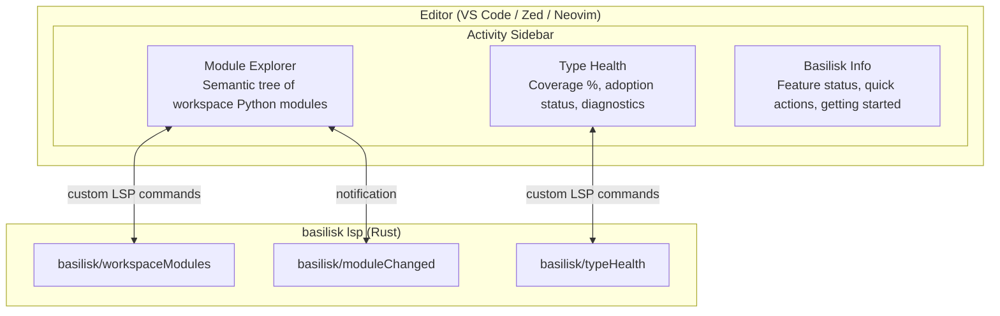

# Basilisk Activity Panel

## Goal {#ACTPANEL-GOAL}

The Basilisk activity icon opens a sidebar that is **genuinely useful** — not a branding placeholder. It gives Python developers immediate, actionable insight into their codebase: module structure, type coverage, diagnostics, adoption progress, and what Basilisk actually does for them.

**Cross-editor spec.** The LSP commands and data model are shared. The rendering differs per editor. This spec defines the shared protocol first, then per-editor implementation notes. Only **differences** are documented per-editor — if it's the same, it's in the shared section.

## Critical Docs

- [VS Code TreeView API](https://code.visualstudio.com/api/extension-guides/tree-view)
- [VS Code Extension API — views](https://code.visualstudio.com/api/references/contribution-points#contributes.views)
- [Zed Extension API](https://zed.dev/docs/extensions/developing-extensions)
- [VSIX-SPEC.md](VSIX-SPEC.md) — VS Code extension spec
- [ZED-SPEC.md](ZED-SPEC.md) — Zed extension spec
- [NEOVIM-SPEC.md](NEOVIM-SPEC.md) — Neovim plugin spec

---

## Architecture {#ACTPANEL-ARCH}



All data flows from the LSP server via custom commands. The editor extension is a **thin rendering layer**.

---

## Custom LSP Commands {#ACTPANEL-CMDS}

> See [LSP-ARCHITECTURE-SPEC.md §LSPARCH-CMDS](LSP-ARCHITECTURE-SPEC.md#LSPARCH-CMDS) for command definitions (`basilisk/workspaceModules`, `basilisk/moduleChanged`, `basilisk/typeHealth`).

---

## Data Model {#ACTPANEL-MODEL}

> Canonical types (`ModuleNode`, `SymbolNode`, `WorkspaceModulesResponse`, `HealthStats`, `ModuleHealth`, `TypeHealthResponse`) are defined in [LSP-ARCHITECTURE-SPEC.md §LSPARCH-TYPES](LSP-ARCHITECTURE-SPEC.md#LSPARCH-TYPES).

The activity panel extends the canonical types with these additional fields for UI rendering:

```typescript
/** Extended SymbolNode fields for activity panel rendering. */
interface SymbolNodeExtensions {
    /** Exported via __all__? */
    exported: boolean;
    /** Has type annotation? */
    annotated: boolean;
}

/** Extended ModuleHealth fields for activity panel rendering. */
interface ModuleHealthExtensions {
    path: string;
    /** true if file is in adopted (errors-as-warnings) mode */
    adopted: boolean;
    /** Unannotated symbol names (for quick-fix suggestions) */
    unannotated: string[];
}
```

---

## Panel 1: Module Explorer {#ACTPANEL-MODULES}

The killer panel. Shows the **semantic** structure of the workspace — not a file tree, a *module* tree. Every Python developer needs to understand their module graph, and the built-in Explorer doesn't show it.

### Tree Structure {#ACTPANEL-MODULES-TREE}

```
myapp/
  +-- __init__.py          (package)
  +-- api/                 (package)
  |   +-- auth.py          (module)
  |   |   +-- class AuthProvider
  |   |   |   +-- def authenticate(token: str) -> User
  |   |   |   +-- def revoke(session_id: str) -> None
  |   |   |   +-- _secret_key: str
  |   |   +-- def create_token(user: User) -> str
  |   |   +-- TOKEN_EXPIRY: int = 3600
  |   +-- routes.py        (module)
  |       +-- def get_users() -> list[User]
  |       +-- def create_user(data: UserCreate) -> User
  +-- models/              (package)
  |   +-- user.py
  |   |   +-- class User
  |   |   |   +-- id: int
  |   |   |   +-- name: str
  |   |   |   +-- email: str
  |   |   +-- class UserCreate
  |   +-- base.py
  |       +-- class BaseModel
  +-- utils.py             (module)
      +-- def slugify(text: str) -> str
      +-- def now() -> datetime
```

### Tree Item Properties {#ACTPANEL-MODULES-ITEMS}

| Property | Value |
|----------|-------|
| Label | Symbol name |
| Description | Type signature (dimmed, right-aligned) |
| Icon | Per kind: class, method, variable, constant, namespace (type alias) |
| Tooltip | Full signature + docstring first line (if available) |
| Click action | Open file at the symbol's line |

### Decorations {#ACTPANEL-MODULES-DECOR}

- **Unannotated symbols**: italic label, warning suffix — visual nudge to add types
- **Private symbols** (`_prefixed`): dimmed
- **`__all__` exported**: export icon overlay
- **Classes with errors**: red dot decoration

### Context Menu Actions {#ACTPANEL-MODULES-CTX}

| Action | Scope |
|--------|-------|
| Go to Definition | Any symbol |
| Find References | Any symbol |
| Rename Symbol | Any symbol |
| Copy Import Path | Module or symbol — copies `from myapp.api.auth import AuthProvider` |
| Copy Qualified Name | Any symbol — copies `myapp.api.auth.AuthProvider` |
| Organize Imports | Module |
| Fix All | Module |

### Toolbar Actions {#ACTPANEL-MODULES-TOOLBAR}

| Action | Description |
|--------|-------------|
| Refresh | Re-fetch module tree from LSP |
| Collapse All | Standard collapse |
| Filter | Toggle filter input to search modules/symbols by name |
| Toggle View | Switch between tree (grouped by module) and flat (all symbols alphabetically) |

### Refresh Strategy {#ACTPANEL-MODULES-REFRESH}

- **On workspace open**: full fetch
- **On file save**: incremental update via `basilisk/moduleChanged` notification
- **On file create/delete/rename**: full re-fetch
- **Manual**: refresh button

---

## Panel 2: Type Health {#ACTPANEL-HEALTH}

At-a-glance view of how well-typed the codebase is. Answers: "How much of my code does Basilisk actually understand?"

### Tree Structure

```
Workspace Health: 73% typed  [========---] 14E 23W
-------------------------------------------------
  [pass]  myapp/models/user.py        100%    0E  0W
  [pass]  myapp/models/base.py        100%    0E  0W
  [pass]  myapp/api/auth.py            95%    0E  1W
  [warn]  myapp/api/routes.py          68%    2E  3W
  [warn]  myapp/utils.py               54%    1E  0W    [adopted]
  [fail]  myapp/legacy/importer.py     12%   11E 19W    [adopted]
```

### Tree Item Properties

| Property | Value |
|----------|-------|
| Label | Module path (relative to workspace root) |
| Description | Coverage %, error/warning counts |
| Icon | Green (>=90%), yellow (50-89%), red (<50%) |
| Tooltip | "23 of 31 symbols annotated. 2 errors, 3 warnings." |
| Decoration | `[adopted]` badge if file is in adoption mode |
| Sort | Worst-first by default (lowest coverage at top). Toggleable. |

### Header Widget

The top-level item is a summary row showing workspace-wide stats:

- **Coverage bar**: progress bar rendered in description
- **Totals**: errors, warnings, adopted file count
- **Trend indicator** (future): up/down since last session

### Toolbar Actions

| Action | Description |
|--------|-------------|
| Refresh | Re-fetch health data |
| Sort | Cycle: worst-first -> best-first -> alphabetical |
| Filter | Show only: errors, warnings, unannotated, adopted |

### Context Menu Actions

| Action | Command |
|--------|---------|
| Open File | Open at line 1 |
| Adopt File | Errors -> warnings for this file |
| Un-adopt File | Restore full errors |
| Fix All in File | Run autofix |
| Add Missing Annotations | AI-powered (future) |

### Refresh Strategy

- **On diagnostic change**: re-compute health stats client-side from diagnostic events + cached annotation data
- **On adopt/unadopt**: immediate refresh
- **Full re-fetch**: on workspace open and manual refresh

---

## Panel 3: Basilisk {#ACTPANEL-INFO}

Helps users understand what Basilisk **is** and what it **does**. Not a static about page — a living dashboard of feature status and quick actions.

### Structure

Tree with grouped sections (top-level nodes are section headers, children are items).

```
Getting Started
  +-- What is Basilisk?                     -> opens walkthrough / help
  +-- Quick Setup Guide                     -> opens walkthrough / help
  +-- Keyboard Shortcuts                    -> opens keybinding reference

Feature Status
  +-- Type Checking                         enabled
  +-- Inlay Hints                           enabled
  +-- Autofix                               enabled
  +-- Debugger                              disabled (click to enable)
  +-- Test Explorer                         enabled
  +-- Ruff Integration                      enabled
  +-- AI Suggestions                        disabled
  +-- Profiler                              not installed

Quick Actions
  +-- Restart Language Server
  +-- Organize Imports (Workspace)
  +-- Fix All (Workspace)
  +-- Show Output Log
  +-- Run All Tests

Server Info
  +-- Version: 0.4.2
  +-- Binary: /usr/local/bin/basilisk
  +-- Python: /usr/bin/python3.12
  +-- Analysis Mode: wholeModule
  +-- Workspace: /home/user/myapp (142 files)
```

### Getting Started Section

**Walkthrough: "What is Basilisk?"**

1. **Type Checker** — Basilisk checks your Python types in real-time, like TypeScript does for JavaScript. No mypy, no Pyright, no Node.js. Pure Rust, sub-10ms incremental checks.
2. **Autofix Engine** — Detected a type error? Basilisk suggests and applies fixes automatically. Organize imports, add annotations, fix common patterns.
3. **Debugger** — Integrated Python debugging with type-aware features. See both static types and runtime values side-by-side.
4. **Test Explorer** — Discover and run pytest/unittest tests directly from your editor. No configuration needed.
5. **Gradual Adoption** — Don't want errors yet? "Adopt" files to downgrade errors to warnings. Incrementally migrate your codebase to full type safety.
6. **Ruff-Powered Formatting** — Basilisk delegates linting and formatting to Ruff. One extension, complete Python tooling.

**Walkthrough: "Quick Setup"**

1. **Binary Found** — Is `basilisk` on your PATH?
2. **Python Detected** — Which interpreter is Basilisk using?
3. **Open a Python File** — See diagnostics appear
4. **Try an Autofix** — Hover a diagnostic, click the lightbulb
5. **Run a Test** — Open Test Explorer, click play

### Feature Status Section

Each item reflects a real setting and shows whether the feature is active.

| Feature | Setting | Active Check |
|---------|---------|--------------|
| Type Checking | `basilisk.enabled` | boolean |
| Inlay Hints | `basilisk.inlayHints.*` | any sub-setting true |
| Autofix | always available | LSP running |
| Debugger | `basilisk.debugger.enabled` | boolean |
| Test Explorer | `basilisk.testExplorer.enabled` | boolean |
| Ruff Integration | `basilisk.ruff.enabled` | boolean |
| AI Suggestions | `basilisk.ai.enabled` | boolean (future) |
| Profiler | `basilisk.profiler.enabled` | boolean (future) |

**Click action**: toggles the setting. Disabled -> enabled, enabled -> disabled. Immediate effect.

### Quick Actions Section

Each item triggers an existing command. Convenience surface — users don't have to remember command palette names.

### Server Info Section

Read-only information fetched from:
- LSP `initialize` response (server version, capabilities)
- Extension settings (binary path, python path, analysis mode)
- Workspace stats from `basilisk/typeHealth` (file count)

---

## Editor-Specific Implementation {#ACTPANEL-EDITORS}

### VS Code {#ACTPANEL-VSCODE}

Full native support via TreeView API. This is the reference implementation.

**Activity bar icon**: `vscode-extension/resources/basilisk-icon.svg` — monochrome, 24x24px, works on light and dark themes.

**package.json contributions**:

```json
{
    "viewsContainers": {
        "activitybar": [
            {
                "id": "basilisk",
                "title": "Basilisk",
                "icon": "resources/basilisk-icon.svg"
            }
        ]
    },
    "views": {
        "basilisk": [
            {
                "id": "basilisk.moduleExplorer",
                "name": "Module Explorer",
                "icon": "$(symbol-namespace)",
                "contextualTitle": "Basilisk Module Explorer"
            },
            {
                "id": "basilisk.typeHealth",
                "name": "Type Health",
                "icon": "$(pulse)",
                "contextualTitle": "Basilisk Type Health",
                "visibility": "visible"
            },
            {
                "id": "basilisk.info",
                "name": "Basilisk",
                "icon": "$(info)",
                "contextualTitle": "Basilisk Info & Actions",
                "visibility": "collapsed"
            }
        ]
    },
    "viewsWelcome": [
        {
            "view": "basilisk.moduleExplorer",
            "contents": "No Python modules found.\n[Open a folder](command:vscode.openFolder) containing Python files to see the module tree.",
            "when": "workbenchState == empty"
        },
        {
            "view": "basilisk.moduleExplorer",
            "contents": "Basilisk is starting...\nWaiting for the language server to initialize.",
            "when": "basilisk.serverState == starting"
        }
    ],
    "menus": {
        "view/title": [
            {
                "command": "basilisk.refreshModuleExplorer",
                "when": "view == basilisk.moduleExplorer",
                "group": "navigation"
            },
            {
                "command": "basilisk.collapseModuleExplorer",
                "when": "view == basilisk.moduleExplorer",
                "group": "navigation"
            },
            {
                "command": "basilisk.toggleModuleExplorerView",
                "when": "view == basilisk.moduleExplorer",
                "group": "navigation"
            },
            {
                "command": "basilisk.refreshTypeHealth",
                "when": "view == basilisk.typeHealth",
                "group": "navigation"
            },
            {
                "command": "basilisk.sortTypeHealth",
                "when": "view == basilisk.typeHealth",
                "group": "navigation"
            }
        ],
        "view/item/context": [
            {
                "command": "basilisk.copyImportPath",
                "when": "viewItem =~ /basilisk\\.(module|class|function|variable)/",
                "group": "6_copypath@1"
            },
            {
                "command": "basilisk.copyQualifiedName",
                "when": "viewItem =~ /basilisk\\.(module|class|function|variable)/",
                "group": "6_copypath@2"
            },
            {
                "command": "basilisk.adoptFile",
                "when": "viewItem == basilisk.healthModule && !basilisk.adopted",
                "group": "2_actions@1"
            },
            {
                "command": "basilisk.unadoptFile",
                "when": "viewItem == basilisk.healthModule && basilisk.adopted",
                "group": "2_actions@2"
            },
            {
                "command": "basilisk.fixFile",
                "when": "viewItem == basilisk.healthModule",
                "group": "2_actions@3"
            }
        ]
    }
}
```

**New commands** (VS Code-specific registration):

| Command | Title |
|---------|-------|
| `basilisk.refreshModuleExplorer` | Basilisk: Refresh Module Explorer |
| `basilisk.toggleModuleExplorerView` | Basilisk: Toggle Module View |
| `basilisk.collapseModuleExplorer` | Basilisk: Collapse Module Explorer |
| `basilisk.copyImportPath` | Basilisk: Copy Import Path |
| `basilisk.copyQualifiedName` | Basilisk: Copy Qualified Name |
| `basilisk.refreshTypeHealth` | Basilisk: Refresh Type Health |
| `basilisk.sortTypeHealth` | Basilisk: Sort Type Health |
| `basilisk.openWalkthrough` | Basilisk: Getting Started |

**When clauses / context keys**:

| Context Key | Type | Purpose |
|-------------|------|---------|
| `basilisk.serverState` | `"starting" \| "running" \| "stopped" \| "error"` | Welcome content, feature status |
| `basilisk.hasWorkspace` | `boolean` | Show/hide module explorer content |
| `basilisk.moduleExplorerView` | `"tree" \| "flat"` | Toggle icon state |

**Walkthroughs**: VS Code's built-in walkthrough system via `contributes.walkthroughs` in package.json. The Getting Started items open these directly.

**Tree icons**: Codicons — `symbol-class`, `symbol-method`, `symbol-variable`, `symbol-constant`, `symbol-namespace`.

**Filter**: Built-in VS Code tree filter plus `basilisk.moduleExplorer.filter` command for glob-style module filtering. Filter state persists in `workspaceState`.

### Zed {#ACTPANEL-ZED}

Zed does **not** currently support custom sidebar panels (open issue #21208). Until it does, the same data is surfaced through available Zed mechanisms:

**Module Explorer alternative — slash commands**:

| Slash Command | Output |
|---------------|--------|
| `/modules` | Markdown tree of all workspace modules with symbols |
| `/modules myapp.api` | Filtered to a specific package |
| `/symbols myapp.api.auth` | All symbols in a specific module with types |

These slash commands call `basilisk/workspaceModules` and format the response as markdown in the AI assistant panel.

**Type Health alternative — slash command**:

| Slash Command | Output |
|---------------|--------|
| `/health` | Workspace health summary + per-module breakdown as markdown table |
| `/health myapp.api` | Filtered to specific package |

Calls `basilisk/typeHealth` and formats as markdown.

**Feature Status / Server Info alternative — slash command**:

| Slash Command | Output |
|---------------|--------|
| `/basilisk` | Server version, binary path, Python path, analysis mode, feature status |

**When Zed adds panel support**: the Zed extension will implement the same three panels using the same LSP commands. The slash commands remain as a complementary interface. No data model changes needed — the LSP commands are already editor-agnostic.

**Activity bar icon**: Zed uses the extension icon from `extension.toml`. Same SVG, rendered per Zed's theme.

### Neovim {#ACTPANEL-NEOVIM}

Neovim has no built-in sidebar framework, but the Lua ecosystem has mature tree plugins. `basilisk.nvim` implements the panels as Lua-rendered floating/split windows.

**Module Explorer**: Custom Lua buffer using `vim.api.nvim_buf_set_lines` with foldable tree structure. Keybindings mirror NvimTree / neo-tree conventions:

| Key | Action |
|-----|--------|
| `<CR>` | Open file at symbol line |
| `o` | Toggle expand/collapse |
| `r` | Refresh |
| `y` | Copy import path |
| `Y` | Copy qualified name |
| `q` | Close panel |

Opened via `:BasiliskModules` command or keymap (default: `<leader>bm`).

**Type Health**: Lua buffer with colored virtual text (highlights via `nvim_buf_add_highlight`). Green/yellow/red per coverage threshold.

Opened via `:BasiliskHealth` command or keymap (default: `<leader>bh`).

**Basilisk Info**: `:BasiliskInfo` opens a floating window with feature status, server info, and quick-toggle keymaps.

**All three panels** call the same `basilisk/workspaceModules` and `basilisk/typeHealth` LSP commands via `vim.lsp.buf_request`.

---

## Accessibility {#ACTPANEL-A11Y}

- All tree items have descriptive accessibility labels
- Icon + text for all status indicators (never color alone)
- Keyboard navigable in all editors
- Screen reader example: "Module myapp.api.auth, 95% typed, 0 errors, 1 warning"

---

## Performance {#ACTPANEL-PERF}

- **Lazy loading**: Module Explorer fetches children on expand, not upfront. Top-level modules loaded first, symbols loaded when a module is expanded.
- **Debounced updates**: `basilisk/moduleChanged` notifications are debounced (300ms) to avoid flicker during rapid saves.
- **Cached state**: Tree state (expanded nodes, scroll position) persisted across sessions (VS Code: `workspaceState`, Neovim: session file, Zed: N/A until panels exist).
- **Type Health**: Computed server-side using existing diagnostic + resolver data. No additional file I/O.
- **Large workspaces**: Modules with >100 symbols show a "Show all..." node. Type Health shows top 50 files by default with "Show all..." at bottom.

---

## Implementation Plan

See [EXTENSION-ACTIVITY-PANEL-PLAN.md](../plans/EXTENSION-ACTIVITY-PANEL-PLAN.md) for the full phased implementation plan and TODO list.
