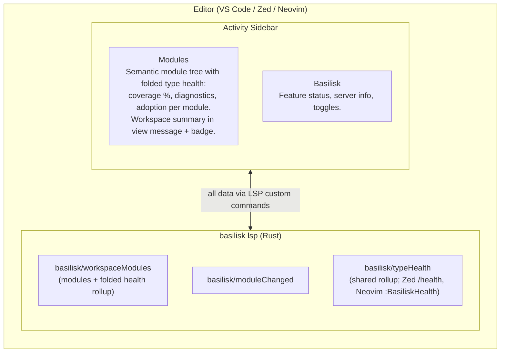

# Basilisk Activity Panel {#EXTACT}

## Goal {#EXTACT-GOAL}

The Basilisk activity icon opens a sidebar surfacing module structure, type coverage, diagnostics, and adoption progress. LSP commands and the data model are shared; rendering differs per editor. This spec defines the shared protocol first; per-editor sections document only the **differences**.

## Critical Docs {#EXTACT-CRITICAL-DOCS}

- [VS Code TreeView API](https://code.visualstudio.com/api/extension-guides/tree-view)
- [VS Code Extension API — views](https://code.visualstudio.com/api/references/contribution-points#contributes.views)
- [Zed Extension API](https://zed.dev/docs/extensions/developing-extensions)
- [VSIX-SPEC.md](VSIX-SPEC.md) — VS Code extension spec
- [ZED-SPEC.md](ZED-SPEC.md) — Zed extension spec
- [NEOVIM-SPEC.md](NEOVIM-SPEC.md) — Neovim plugin spec

---

## Architecture {#EXTACT-ARCHITECTURE}



All data flows from the LSP server via custom commands; the editor extension is a thin rendering layer.

---

## Custom LSP Commands (Shared) {#EXTACT-LSP-COMMANDS}

Every editor uses the same request/response types.

### `basilisk/workspaceModules` {#EXTACT-LSP-COMMANDS-WORKSPACE-MODULES}

Returns the semantic module tree with the type-health rollup folded in — each
`ModuleNode` carries coverage %, error/warning counts, and adoption state, and
the response carries a workspace-wide `HealthStats` summary. Powers the merged
Modules panel with no separate `basilisk/typeHealth` round-trip or client-side join.

- **Direction**: Client -> Server (request)
- **Params**: `{ scope?: string }` — optional module name prefix filter (e.g. `"myapp.api"`)
- **Returns**: `WorkspaceModulesResponse`
- **Trigger**: On panel open, refresh, or after `basilisk/moduleChanged` notification

### `basilisk/moduleChanged` {#EXTACT-LSP-COMMANDS-MODULE-CHANGED}

Server pushes updated module data after re-analysis.

- **Direction**: Server -> Client (notification)
- **Params**: `{ module: ModuleNode }` — the changed module's updated tree
- **Trigger**: After file save triggers re-analysis

### `basilisk/scanComplete` {#EXTACT-LSP-COMMANDS-SCAN-COMPLETE}

Server signals that a workspace scan has finished, so panels showing the
loading state ([EXTACT-MODULES-HEADER-LOADING](#EXTACT-MODULES-HEADER)) refetch
and can trust a zero-file rollup. This notification is required — not an
optimisation: a genuinely empty workspace publishes no diagnostics and sends no
`basilisk/moduleChanged`, so without it nothing would ever settle the loading
message into the honest `"No Python files found"` empty-state (issue #144).

- **Direction**: Server -> Client (notification)
- **Params**: `{ totalFiles: number }` — files discovered by the scan
- **Trigger**: When the workspace scan spawned at `initialized` (or after an
  analysis-mode/config change) completes; clients bump their analysis revision
  on receipt ([EXTACT-REACTIVE-STATE])

### `basilisk/typeHealth` {#EXTACT-LSP-COMMANDS-TYPE-HEALTH}

Returns type coverage and diagnostic health for the workspace, computed
identically to the rollup folded into `basilisk/workspaceModules`. Editors with a
unified panel (VS Code) read the folded rollup and do **not** call this command;
it remains the standalone workspace-health command for editors without a unified
panel — Zed's `/health` and Neovim's `:BasiliskHealth`.

- **Direction**: Client -> Server (request)
- **Params**: `{}` (whole workspace) or `{ module?: string }` (specific module)
- **Returns**: `TypeHealthResponse`
- **Trigger**: On panel open, refresh, diagnostic changes

---

## Shared Data Model {#EXTACT-DATA-MODEL}

```typescript
// --- Module Explorer ---

interface WorkspaceModulesResponse {
    modules: ModuleNode[];
    /** Workspace-wide health rollup — rendered in the view's native message + badge. */
    workspace: HealthStats;
}

interface ModuleNode {
    /** Fully qualified module name: "myapp.api.auth" */
    name: string;
    /** Absolute file path */
    path: string;
    /** Package (directory) or module (file) */
    kind: "package" | "module";
    /** Child modules (packages only) */
    children: ModuleNode[];
    /** Top-level symbols exported by this module */
    symbols: SymbolNode[];
    /**
     * Every diagnostic emitted for this module, so the `errors`/`warnings`
     * counts below are *reachable* in the tree rather than dead tallies
     * ([EXTACT-MODULES-DIAGNOSTICS]). The flat list mirrors the file's
     * `textDocument/publishDiagnostics`; the panel groups it under the module
     * row. `errors === diagnostics.filter(d => d.severity === "error").length`.
     */
    diagnostics: DiagnosticNode[];
    // --- Folded type-health rollup (single source of truth; see Type Health) ---
    // ABSENT while Type Checking is disabled ([ANALYSIS-ENABLED], #119): the
    // server OMITS the grading fields (never zeroes them), so a disabled
    // workspace cannot render "% typed" headers or coverage-tinted rows.
    /** annotatedSymbols / totalSymbols * 100 over this module's symbols */
    coveragePercent?: number;
    errors?: number;
    warnings?: number;
    /** true if the file is in adopted (errors-as-warnings) mode */
    adopted?: boolean;
}

interface DiagnosticNode {
    /** Severity drives the row's icon + colour ([EXTACT-MODULES-COUNT-STYLE]). */
    severity: "error" | "warning";
    /** Diagnostic code, e.g. "BSK-E0001"; rendered in the row description. */
    code: string;
    /** Single-line message, e.g. "Function is missing a return type annotation". */
    message: string;
    /** Zero-based start position, for the navigate-on-click range. */
    line: number;
    character: number;
}

interface SymbolNode {
    name: string;
    kind: "class" | "function" | "variable" | "constant" | "typeAlias";
    /** Human-readable type string: "(x: int, y: int) -> Point" */
    type: string;
    /** Line number in source */
    line: number;
    /** Children (methods for classes, nested classes) */
    children: SymbolNode[];
    /** Exported via __all__? */
    exported: boolean;
    /** Has type annotation? */
    annotated: boolean;
}

// --- Type Health ---

interface TypeHealthResponse {
    /** Overall workspace stats */
    workspace: HealthStats;
    /** Per-module breakdown — EMPTY while Type Checking is disabled ([ANALYSIS-ENABLED], #119). */
    modules: ModuleHealth[];
}

interface HealthStats {
    /**
     * The Type Checking toggle state, stamped into every payload
     * ([ANALYSIS-ENABLED], #119). When false, all grading fields below are
     * OMITTED and clients render "Type checking disabled" — no "% typed",
     * no badge, no tinted rows.
     */
    typeCheckingEnabled?: boolean;
    totalSymbols?: number;
    annotatedSymbols?: number;
    /** annotatedSymbols / totalSymbols * 100 */
    coveragePercent?: number;
    errors?: number;
    warnings?: number;
    adoptedFiles?: number;
    /** Always present — distinguishes an empty workspace even while disabled. */
    totalFiles: number;
    /**
     * Whether the server's initial workspace scan has finished
     * ([EXTACT-MODULES-HEADER-LOADING], issue #144). `totalFiles: 0` is only a
     * real empty workspace when this is true; before that it means "not
     * scanned yet" and clients MUST render a loading state instead of any
     * zero-file message. Stamped into every `basilisk.workspaceModules`
     * payload; absent (e.g. `basilisk.typeHealth`) reads as "unknown", which
     * clients treat as not complete.
     */
    scanComplete?: boolean;
}

interface ModuleHealth {
    name: string;
    path: string;
    coveragePercent: number;
    errors: number;
    warnings: number;
    /** true if file is in adopted (errors-as-warnings) mode */
    adopted: boolean;
    /** Unannotated symbol names (for quick-fix suggestions) */
    unannotated: string[];
}
```

---

## Panel 1: Modules {#EXTACT-MODULES}

Shows the **semantic** module tree of the workspace — not a file tree.

This panel **subsumes Type Health** (issue #103): the per-module health rollup is folded into `basilisk/workspaceModules`, so each module row shows coverage and diagnostics inline, and the workspace summary lives in native view chrome ([EXTACT-MODULES-HEADER](#EXTACT-MODULES-HEADER)). No separate Type Health panel in editors with a unified sidebar.

### Module Row Rendering {#EXTACT-MODULES-MODULE-ROW}

Each top-level module row renders its folded health:

| Property | Value |
|----------|-------|
| Label | Module name (`myapp.api.auth`) |
| Description | Coverage bar + `%`, then the diagnostic tally in [count style](#EXTACT-MODULES-COUNT-STYLE) (`🔴 2  🟠 3`, **never** `2E 3W`), then `[adopted]` badge — e.g. `████████░░ 80% 🔴 2 🟠 3 [adopted]` |
| Icon | `symbol-namespace` (package) / `symbol-file` (module), **tinted** green (>=90%) / yellow (50–89%) / red (<50%) by coverage |
| Tooltip | Name, path, coverage %, error/warning counts, adoption status |
| Drill-down | Expand to the module's **diagnostics first** ([EXTACT-MODULES-DIAGNOSTICS]) — so the advertised `🔴 n` errors are reachable, not a dead tally — then its symbols (the per-symbol "untyped" decoration is the type-coverage drill-down) |

### Diagnostic Count Style {#EXTACT-MODULES-COUNT-STYLE}

Error/warning tallies appear on module rows, container rows, and the workspace
header, rendered **without the `E`/`W` letters** and coloured by severity to
match the editor's own diagnostics:

- **Colours are the editor's diagnostic tokens** — errors `editorError.foreground`,
  warnings `editorWarning.foreground` — so the panel tracks the active theme.
- **Icons are exact**: a `ThemeIcon` accepts a `ThemeColor`, so each per-diagnostic
  row ([EXTACT-MODULES-DIAGNOSTICS]) and each severity-tinted row icon uses those
  tokens directly.
- **Plain-text surfaces cannot be**: tree `label` / `description` / `message` are
  plain strings — no sub-span colour, no `$(codicon)` markup. The inline tally
  there uses coloured Unicode glyphs `🔴 n` (errors) / `🟠 n` (warnings); a zero
  count for a severity is omitted, never shown as `🔴 0`.

Theme-token-exact coloured numbers inline would require a webview, forfeiting
native tree affordances (collapse-all, selection, [context menu](#EXTACT-MODULES-CONTEXT-MENU));
rejected. Exact colour lives on icons and drill-down rows; glyphs carry colour in
plain-text surfaces.

### Diagnostics Drill-Down {#EXTACT-MODULES-DIAGNOSTICS}

Expanding a module/file row lists that file's **actual diagnostics as the first
children** — above its symbols — so `🔴 29` is 29 navigable rows, not a dead tally.

Each diagnostic row:

| Property | Value |
|----------|-------|
| Label | The diagnostic message (`Function is missing a return type annotation`) |
| Description | `BSK-E0001 · Ln 42` — code + 1-based line |
| Icon | `$(error)` tinted `editorError.foreground` / `$(warning)` tinted `editorWarning.foreground` — the editor's own diagnostic colours ([EXTACT-MODULES-COUNT-STYLE]) |
| Order | Errors before warnings, then by ascending line; the module's symbols follow beneath the diagnostics |
| Click action | Open the file with the selection on the diagnostic's range |

A clean module (no diagnostics) drills straight to its symbols. The per-module
diagnostic list rides on `basilisk/workspaceModules` (`ModuleNode.diagnostics`),
derived from the same publish-diagnostics the editor shows, so it needs no extra
round-trip and can never disagree with the `errors`/`warnings` rollup.

### Workspace Health Header {#EXTACT-MODULES-HEADER}

The workspace-wide summary renders in the tree view's **native chrome**, not a synthetic summary row:

- **`treeView.message`**: `"73% typed · 🔴 14  🟠 23"` (coverage + diagnostic tally in [count style](#EXTACT-MODULES-COUNT-STYLE) — no `E`/`W`; `message` is plain text, so the coloured glyphs carry severity).
- **`treeView.badge`**: numeric — the count of outstanding diagnostics (errors + warnings); hidden when zero.
- **Loading state** `[EXTACT-MODULES-HEADER-LOADING]` (issue #144): while the analyzer is starting up or its initial workspace scan is incomplete — no `HealthStats` fetched yet, or `totalFiles == 0` without `scanComplete == true` — the message reads `"Analyzing workspace…"` and no badge shows. The panel must NEVER claim `"No Python files found"` before the scan has actually finished. The state is derived from centralised store signals through the standard revision subscription ([EXTACT-REACTIVE-STATE]) — no panel-local readiness flag, no polling; the `basilisk/scanComplete` notification ([EXTACT-LSP-COMMANDS-SCAN-COMPLETE](#EXTACT-LSP-COMMANDS-SCAN-COMPLETE)) settles it even when the scan published nothing.
- **Empty workspace** (`totalFiles == 0` with `scanComplete == true`): the message reads `"No Python files found"` — never a misleading `100%` for 0/0 symbols, and no badge (preserves the issue #57 guarantee in the merged panel).
- **Type Checking disabled** (`typeCheckingEnabled == false` in the payload, [ANALYSIS-ENABLED], #119): the message reads `"Type checking disabled"` — never `"NN% typed"` — with no badge, no coverage bars/tints on rows, and no per-module tallies. The server omits all grading fields while disabled, so this state is structural, not a client-side hide.

### Tree Structure {#EXTACT-MODULES-TREE-STRUCTURE}

```
myapp/
  +-- __init__.py          (package)
  +-- api/                 (package)
  |   +-- auth.py          (module)
  |   |   +-- class AuthProvider
  |   |   |   +-- def authenticate(token: str) -> User
  |   |   |   +-- def revoke(session_id: str) -> None
  |   |   |   +-- _secret_key: str
  |   |   +-- def create_token(user: User) -> str
  |   |   +-- TOKEN_EXPIRY: int = 3600
  |   +-- routes.py        (module)
  |       +-- def get_users() -> list[User]
  |       +-- def create_user(data: UserCreate) -> User
  +-- models/              (package)
  |   +-- user.py
  |   |   +-- class User
  |   |   |   +-- id: int
  |   |   |   +-- name: str
  |   |   |   +-- email: str
  |   |   +-- class UserCreate
  |   +-- base.py
  |       +-- class BaseModel
  +-- utils.py             (module)
      +-- def slugify(text: str) -> str
      +-- def now() -> datetime
```

**Reconstruction (client-side).** `basilisk/workspaceModules` returns a **flat**
list of modules keyed by fully-qualified dotted name (`pkg.sub.mod`), with no
`children` nesting (the server keeps the wire format flat for performance). The
VS Code provider rebuilds the hierarchy above by splitting each module's dotted
name into path segments and threading it into a node trie
(`module-explorer.ts::ModuleExplorerProvider.buildPackageTree`):

- Each segment becomes a tree node labelled by that **segment** (`auth`), never
  the full dotted name (`myapp.api.auth`) — a flat dotted list at the root is the
  exact #149 defect.
- A segment that corresponds to a real package file (`pkg/__init__.py`, dotted
  name `pkg`) attaches that `ModuleNode` to its node, so the folder row carries
  the package's coverage rollup and its own symbols.
- Intermediate folders that are **not** Python packages (no `__init__.py`, e.g.
  `models/` above) have no `ModuleNode`; they are **synthesised** as structural
  container nodes with a namespace icon, no coverage rollup, and no open action.
- Sibling order is structural: containers (packages/folders) before leaf
  modules, each alphabetical by segment. The flat-view sort picker does not
  apply in tree view ([EXTACT-MODULES-TOOLBAR](#EXTACT-MODULES-TOOLBAR)).
- **Diagnostics roll up onto containers.** Each folder/package row shows the
  total in [count style](#EXTACT-MODULES-COUNT-STYLE) (`🔴 n  🟠 n`) rolled up
  across its whole subtree and tints its icon red (any
  descendant error) / yellow (any descendant warning), so a branch hiding errors
  is visible at a glance without expanding it. Coverage % stays per-module (the
  flat list carries no per-module symbol counts to weight a folder rollup).

**Flat view (`flat`, opt-in toggle).** Flat view drops the folder nesting and
lists **every module** as one sortable row labelled by its full dotted name,
ordered by the selected sort mode (module name / path / type coverage — #189).
It is "flat" only in that folders are not nested — symbols still expand **under
their owning module** and are **never** dumped bare at the tree root (the #149
§2 flat-mode defect). The default view is always the nested tree.

### Tree Item Properties {#EXTACT-MODULES-ITEM-PROPERTIES}

| Property | Value |
|----------|-------|
| Label | Symbol name |
| Description | Type signature (dimmed, right-aligned) |
| Icon | Per kind: class, method, variable, constant, namespace (type alias) |
| Tooltip | Full signature + docstring first line (if available) |
| Click action | Open file at the symbol's line |

### Decorations {#EXTACT-MODULES-DECORATIONS}

- **Unannotated symbols**: italic label, warning suffix — visual nudge to add types
- **Private symbols** (`_prefixed`): dimmed
- **`__all__` exported**: export icon overlay
- **Classes with errors**: red dot decoration

### Context Menu Actions {#EXTACT-MODULES-CONTEXT-MENU}

| Action | Scope |
|--------|-------|
| Go to Definition | Any symbol |
| Find References | Any symbol |
| Rename Symbol | Any symbol |
| Copy Import Path | Module or symbol — copies `from myapp.api.auth import AuthProvider` |
| Copy Qualified Name | Any symbol — copies `myapp.api.auth.AuthProvider` |
| Organize Imports | Module |
| Fix All (Safe) | Module |

### Toolbar Actions {#EXTACT-MODULES-TOOLBAR}

| Action | Description |
|--------|-------------|
| Refresh | Re-fetch module tree from LSP |
| Collapse All | VS Code's **native** `showCollapseAll` button — never a contributed command. A custom collapse command alongside it is a duplicate (issue #113). |
| Filter | Toggle filter input to search modules/symbols by name |
| Toggle View | Switch between tree (nested folder/package hierarchy, default) and flat (every module as one sortable row) |
| Sort | Picker of three labelled modes — **Module Name**, **Path**, **Type Coverage** — with the active mode checked (no blind cycle, issue #189). Coverage sorts ascending (least-typed first), the default. Flat view only; gated on `basilisk.moduleExplorerView == 'flat'` so it is hidden (not a silent no-op) in tree view (issue #151). |
| Fix All (Safe) | Run `basilisk.fixWorkspace` (Safe fixes only — the [AUTOFIX-CLASSIFY] default tier). Promoted from the info panel (issue #103); `when`-gated on `basilisk.serverState == 'running'` **and** the `config.basilisk.experimental.fixAll` flag (default off, issue #113). |
| Organize Imports | Run `basilisk.organizeImports`. Same promotion + gating. |
| Restart Server | Run `basilisk.restartServer`. Same promotion + gating. |

### Refresh Strategy {#EXTACT-MODULES-REFRESH}

- **On workspace open**: full fetch
- **On file save**: incremental update via `basilisk/moduleChanged` notification
- **On file create/delete/rename**: full re-fetch
- **Manual**: refresh button

All automatic refreshes flow through the centralized `analysisRevision`
signal — see [#EXTACT-REACTIVE-STATE].

### Centralized Reactive State (MANDATORY) {#EXTACT-REACTIVE-STATE}

All panel state is centralized in the store (`vscode-extension/src/store.ts`),
reactive via Preact signals (issue #58). Panels MUST NOT hand-roll `setInterval`
polls or register their own LSP notification listeners.

- The store owns a monotonic **`analysisRevision`** signal that bumps when:
  1. the server reaches `Running` (initial analysis),
  2. `basilisk/moduleChanged` fires (re-analysis complete),
  3. diagnostics change (debounced 300 ms).
- Panels subscribe with a signals `effect(...)` (see
  `module-explorer.ts::wireReactiveRefresh`) so a state change auto-fires a refresh.
- Tests: `vscode-extension/src/test/suite/store-reactivity.test.ts`.

---

## Type Health {#EXTACT-HEALTH}

At-a-glance view of how well-typed the codebase is.

> **Merged into the Modules panel (issue #103).** In editors with a unified
> sidebar (VS Code), Type Health is **not a separate panel**: the per-module
> rollup is folded onto each module row
> ([EXTACT-MODULES-MODULE-ROW](#EXTACT-MODULES-MODULE-ROW)) and the workspace
> summary lives in the view's message + badge
> ([EXTACT-MODULES-HEADER](#EXTACT-MODULES-HEADER)). The `basilisk/typeHealth`
> command, `TypeHealthResponse`, and the tree structure below remain the **shared
> health surface** for editors without a unified panel (Zed `/health`, Neovim
> `:BasiliskHealth`), computed from the same per-file figures. Icon thresholds,
> coverage bar, and `[adopted]` badge carry over to the merged panel.

### Tree Structure {#EXTACT-HEALTH-TREE-STRUCTURE}

Tallies follow [count style](#EXTACT-MODULES-COUNT-STYLE) — coloured glyphs
`🔴 n` (errors) / `🟠 n` (warnings), **never** `nE nW`; a zero for a severity is
omitted, never shown as `🔴 0`:

```
Workspace Health: 73% typed  [========---] 🔴 14  🟠 23
-------------------------------------------------
  [pass]  myapp/models/user.py        100%
  [pass]  myapp/models/base.py        100%
  [pass]  myapp/api/auth.py            95%          🟠 1
  [warn]  myapp/api/routes.py          68%    🔴 2  🟠 3
  [warn]  myapp/utils.py               54%    🔴 1        [adopted]
  [fail]  myapp/legacy/importer.py     12%   🔴 11 🟠 19  [adopted]
```

### Tree Item Properties {#EXTACT-HEALTH-ITEM-PROPERTIES}

| Property | Value |
|----------|-------|
| Label | Module path (relative to workspace root) |
| Description | Coverage %, then the diagnostic tally in [count style](#EXTACT-MODULES-COUNT-STYLE) (`🔴 n` errors / `🟠 n` warnings — **never** `nE nW`) |
| Icon | Green (>=90%), yellow (50-89%), red (<50%) |
| Tooltip | "23 of 31 symbols annotated. 2 errors, 3 warnings." |
| Decoration | `[adopted]` badge if file is in adoption mode |
| Sort | Worst-first by default (lowest coverage at top). Toggleable. |

### Header Widget {#EXTACT-HEALTH-HEADER}

The top-level item is a summary row showing workspace-wide stats:

- **Coverage bar**: progress bar rendered in description
- **Totals**: errors, warnings, adopted file count
- **Trend indicator** (future): up/down since last session
- **Empty workspace** (`totalFiles == 0`): renders an explicit `No Python files found` state with a neutral info icon — never a `100%` bar or green "pass" icon. Editors **must** branch on `totalFiles == 0`; `coveragePercent` is vacuously 100 for an empty workspace and must not be displayed.

### Toolbar Actions {#EXTACT-HEALTH-TOOLBAR}

| Action | Description |
|--------|-------------|
| Refresh | Re-fetch health data |
| Sort | Cycle: worst-first -> best-first -> alphabetical |
| Filter | Show only: errors, warnings, unannotated, adopted |

### Context Menu Actions {#EXTACT-HEALTH-CONTEXT-MENU}

| Action | Command |
|--------|---------|
| Open File | Open at line 1 |
| Adopt File | Errors -> warnings for this file |
| Un-adopt File | Restore full errors |
| Fix All (Safe) in File | Run autofix (Safe fixes only) |
| Add Missing Annotations | AI-powered (future) |

### Refresh Strategy {#EXTACT-HEALTH-REFRESH}

- **On diagnostic change**: re-compute health stats client-side from diagnostic events + cached annotation data
- **On adopt/unadopt**: immediate refresh
- **Full re-fetch**: on workspace open and manual refresh

---

## Panel 3: Basilisk {#EXTACT-INFO}

A living dashboard of feature status and quick actions.

### Structure {#EXTACT-INFO-STRUCTURE}

Slimmed per issue #103: feature toggles render **at the root** (a single shipped
toggle does not justify a "Feature Status" header) followed by one compact
read-only **Server Info** section. There is **no Quick Actions section** — see
[EXTACT-INFO-QUICK-ACTIONS](#EXTACT-INFO-QUICK-ACTIONS) for where each action lives.

Every row is one of two **interaction classes**, which **must be visually
unmistakable** (see [EXTACT-INFO-AFFORDANCE](#EXTACT-INFO-AFFORDANCE)): `[A]` marks
an **actionable** row, `·` marks a **read-only** display row. The markers are spec
notation, not literal glyphs.

```
[A] Type Checking                         Enabled        (click to disable)

Server Info                               (read-only — display only)
  ·   Version: 0.4.2                      (present once the server is up)
  ·   Analysis Mode: wholeModule
  ·   Python: auto-detect
  ·   uv: auto-detect                     (tooltip: enabled, executable, auto-sync, stub suggestions)
  ·   Binary: basilisk
```

Notably absent, by design (issue #103):

- **No live "Server: running/stopped" row** — the status bar already shows the
  server state; duplicating it here invited staleness.
- **No Quick Actions rows** — promoted to the Modules toolbar / status bar /
  command palette, where they can be `when`-gated properly.
- **No separate uv Auto-Sync / Stub Suggestions rows** — folded into the uv
  row's tooltip.

**Freshness:** the provider re-renders on `basilisk.*` configuration changes AND
on `lspState`/`client` signal changes (a signals `effect()`) so the Version row
appears as soon as the server initializes — never stale (issue #103 defect 3).

**Toggle write target:** the panel is always visible, so toggles are clickable
with no folder open. `basilisk.toggleFeature` writes to
`ConfigurationTarget.Workspace` when a folder exists, else `Global` (issue #103 defect 2).

### Interaction Affordance {#EXTACT-INFO-AFFORDANCE}

Users **must** be able to tell at a glance, without clicking, which rows are
actionable and which are read-only. Verified by tests.

**Actionable rows** (`contextValue` of `feature` — the only actionable class;
former `action` and `gettingStarted` rows removed in issue #103):

- **Must** carry a `command` that runs on row click, and that command **must** be
  registered (see [EXTACT-INFO-ACTION-WIRING](#EXTACT-INFO-ACTION-WIRING)).
- **Must** surface their command as an **always-visible inline action button** (the
  `inline` `view/item/context` menu group).
- **Must** carry a tooltip phrased as an imperative (e.g. "Restart the language server").
- Use an action-connoting icon (toggle state for features; verb/tool icon for actions).

**Read-only rows** (`contextValue` of `info`):

- **Must not** carry a `command` or any inline action button.
- **Must not** use a button-like icon; the value shows in the row `description`.
- Tooltip, if present, states the fact — never an imperative.

A single centralized helper **must** own each interaction class so affordance rules
cannot drift per call site. No row may be both actionable and read-only.

### Getting Started Section {#EXTACT-INFO-GETTING-STARTED}

VS Code `contributes.walkthroughs` content (not panel rows).

**Walkthrough "What is Basilisk?"** — Type Checker (real-time, Rust, sub-10ms incremental); Autofix Engine (organize imports, add annotations, fix patterns); Debugger (type-aware, static + runtime values); Test Explorer (pytest/unittest); Gradual Adoption (adopt files to downgrade errors to warnings); Ruff-Powered Formatting.

**Walkthrough "Quick Setup"** — Binary on PATH; Python interpreter detected; open a Python file (diagnostics appear); try an autofix (lightbulb); run a test.

### Feature Status Section {#EXTACT-INFO-FEATURE-STATUS}

**A toggle may appear here ONLY if flipping it has a real, observable effect
matching its label, proven by a VSIX test.** A toggle that writes a setting no
code reads must not exist. (Audited 2026-05-30: most originally-specced toggles
were no-ops — the server's `did_change_configuration` parses only `analysisMode`,
`testExplorer`, and `enabled`; every other forwarded setting was silently dropped.)

**Shipped toggles** (each has a namesake effect):

| Feature | Setting | Effect when off |
|---------|---------|-----------------|
| Type Checking | `basilisk.enabled` | The LSP — authoritative for diagnostics in the default mode — clears all published diagnostics and suppresses new ones; re-enabling re-scans. See [ANALYSIS-ENABLED]. Subprocess mode mirrors this via `checkDocument`. (GitHub #65 / #119) |

**Not yet implemented** — removed because the setting is currently ignored. They
return only once the server honors the setting AND a VSIX test proves the effect.
See [EXTENSION-ACTIVITY-PANEL-PLAN.md](../plans/EXTENSION-ACTIVITY-PANEL-PLAN.md#EXTACT-PLAN-FEATURE-TOGGLES).

| Feature | Setting | Why it's not shipped |
|---------|---------|----------------------|
| uv Integration | `basilisk.uv.enabled` | No server code reads it — the toggle never disabled uv integration (a no-op affordance). Removed per GitHub #190; uv commands stay in the palette / code actions and the read-only "uv" Server Info row still reports uv status |
| Inlay Hints (Params) | `basilisk.inlayHints.parameterNames` | Server emits hints unconditionally; setting dropped |
| Inlay Hints (Types) | `basilisk.inlayHints.variableTypes` | Server emits hints unconditionally; setting dropped |
| Ruff Integration | `basilisk.ruff.enabled` / `basilisk.ruff.executablePath` | Dropped — no `ruff` binary; formatting is the embedded Ruff crate. Replaced by the functional `basilisk.formatter` flag ([LSPFMT-CONFIG](LSP-FORMATTING-SPEC.md#LSPFMT-CONFIG)), not a dashboard toggle |
| Test Explorer | `basilisk.testExplorer.enabled` | Only gates auto-discovery-on-save; does not disable the explorer |
| Debugger | `basilisk.debugger.enabled` | Setting was never even declared; debugging is always registered |
| AI Suggestions | `basilisk.aiTyping.enabled` | No provider implemented; nothing reads the setting |
| Profiler | `basilisk.profiler.enabled` | Setting does not exist; profiler is always available |

**Click action**: toggles the setting, immediate effect. Every row is actionable per [EXTACT-INFO-AFFORDANCE](#EXTACT-INFO-AFFORDANCE).

**Layout**: toggles render at the panel root with **no "Feature Status" header** — with a single shipped toggle a header is noise (issue #103). Reintroduce it if the set grows past ~4.

**Write target**: `basilisk.toggleFeature` picks `ConfigurationTarget` from the live workspace-folder count — `Workspace` when a folder is open, `Global` otherwise (no `when` clause makes the no-folder state reachable, where `Workspace` is invalid; issue #103 defect 2).

### Quick Actions {#EXTACT-INFO-QUICK-ACTIONS}

There is **no Quick Actions section in this panel** (issue #103) — pseudo-buttons
in an always-visible panel surfaced rows whose handlers were not alive. Each
action now lives on a surface that can gate it properly:

| Action | Where it lives now | Gating |
|--------|--------------------|--------|
| Fix All (Safe) in Workspace (`basilisk.fixWorkspace`) | Modules panel toolbar button | `view == basilisk.moduleExplorer && basilisk.serverState == 'running'` |
| Organize Imports (`basilisk.organizeImports`) | Modules panel toolbar button | same |
| Restart Server (`basilisk.restartServer`) | Modules panel toolbar button | same |
| Show Output (`basilisk.showOutput`) | Status bar item click action | always (client-registered) |
| uv actions (`basilisk.uv.*`) | Command palette (+ code actions) | server-advertised handlers |

The `basilisk.serverState` context key is set from the `lspState` signal
effect in `lsp-client.ts` (values: `idle | starting | running | stopped`).

#### Action Wiring {#EXTACT-INFO-ACTION-WIRING}

A quick action contributed to any surface (toolbar button, panel row, or
`contributes.commands`) **must** have a live `registerCommand` handler whenever
it is visible/invocable — a command without a handler ("command not found" on
click) is a defect. Server-dependent actions **must** be `when`-gated on
`basilisk.serverState == 'running'` (toolbar) or hidden (rows); never shown-but-dead.
Asserted by e2e tests driving the real contribution, not by inspecting the registry.

### Server Info Section {#EXTACT-INFO-SERVER-INFO}

Compact read-only information fetched from:
- LSP `initialize` response (server version — row appears once the server is up)
- Extension settings (binary path, python path, analysis mode, uv)

Rules (issue #103):
- **No live server-state row** — the status bar is the single home for "running/stopped".
- **One uv row** — sub-settings (executable path, auto-sync, stub suggestions) live in its tooltip, not separate rows.
- **Never stale** — re-renders on `lspState`/`client` signal changes (defect 3), so the Version row tracks the server lifecycle.

Every row is read-only per [EXTACT-INFO-AFFORDANCE](#EXTACT-INFO-AFFORDANCE): no command, no inline button, no button-like icon.

---

## Editor-Specific Implementation {#EXTACT-EDITORS}

Per-editor rendering of the shared panels; only differences from the shared protocol are documented.

### VS Code {#EXTACT-EDITORS-VSCODE}

Reference implementation, full native TreeView API support.

**Activity bar icon**: `vscode-extension/resources/basilisk-icon.svg` — monochrome, 24x24px, light/dark themes.

**package.json contributions**:

```json
{
    "viewsContainers": {
        "activitybar": [
            {
                "id": "basilisk",
                "title": "Basilisk",
                "icon": "resources/basilisk-icon.svg"
            }
        ]
    },
    "views": {
        "basilisk": [
            {
                "id": "basilisk.moduleExplorer",
                "name": "Modules",
                "icon": "$(symbol-namespace)",
                "contextualTitle": "Basilisk Modules"
            },
            {
                "id": "basilisk.info",
                "name": "Basilisk",
                "icon": "$(info)",
                "contextualTitle": "Basilisk Info & Actions",
                "visibility": "collapsed"
            }
        ]
    },
    "viewsWelcome": [
        {
            "view": "basilisk.moduleExplorer",
            "contents": "No Python modules found.\n[Open a folder](command:vscode.openFolder) containing Python files to see the module tree.",
            "when": "workbenchState == empty"
        },
        {
            "view": "basilisk.moduleExplorer",
            "contents": "Basilisk is starting...\nWaiting for the language server to initialize.",
            "when": "basilisk.serverState == starting"
        }
    ],
    "menus": {
        "//": "Collapse All is VS Code's native showCollapseAll button — never contributed here. Ordering/overflow grouping, the flat-gated Sort, and the Fix All feature-flag are the fixed contract in [VSIX-MODULE-EXPLORER-TOOLBAR].",
        "view/title": [
            {
                "command": "basilisk.refreshModuleExplorer",
                "when": "view == basilisk.moduleExplorer",
                "group": "navigation@1"
            },
            {
                "command": "basilisk.toggleModuleExplorerView",
                "when": "view == basilisk.moduleExplorer",
                "group": "navigation@2"
            },
            {
                "command": "basilisk.filterModuleExplorer",
                "when": "view == basilisk.moduleExplorer",
                "group": "navigation@3"
            },
            {
                "command": "basilisk.sortModuleExplorer",
                "when": "view == basilisk.moduleExplorer && basilisk.moduleExplorerView == 'flat'",
                "group": "navigation@4"
            },
            {
                "command": "basilisk.organizeImports",
                "when": "view == basilisk.moduleExplorer && basilisk.serverState == 'running'",
                "group": "1_modify@1"
            },
            {
                "command": "basilisk.fixWorkspace",
                "when": "view == basilisk.moduleExplorer && basilisk.serverState == 'running' && config.basilisk.experimental.fixAll",
                "group": "1_modify@2"
            },
            {
                "command": "basilisk.restartServer",
                "when": "view == basilisk.moduleExplorer && basilisk.serverState == 'running'",
                "group": "9_server@1"
            }
        ],
        "view/item/context": [
            {
                "command": "basilisk.copyImportPath",
                "when": "viewItem =~ /basilisk\\.(module|class|function|variable)/",
                "group": "6_copypath@1"
            },
            {
                "command": "basilisk.copyQualifiedName",
                "when": "viewItem =~ /basilisk\\.(module|class|function|variable)/",
                "group": "6_copypath@2"
            },
            {
                "command": "basilisk.adoptFile",
                "when": "viewItem == basilisk.healthModule && !basilisk.adopted",
                "group": "2_actions@1"
            },
            {
                "command": "basilisk.unadoptFile",
                "when": "viewItem == basilisk.healthModule && basilisk.adopted",
                "group": "2_actions@2"
            },
            {
                "command": "basilisk.fixFile",
                "when": "viewItem == basilisk.healthModule",
                "group": "2_actions@3"
            }
        ]
    }
}
```

**New commands** (VS Code-specific registration):

| Command | Title |
|---------|-------|
| `basilisk.refreshModuleExplorer` | Basilisk: Refresh Module Explorer |
| `basilisk.toggleModuleExplorerView` | Basilisk: Toggle Tree/Flat View |
| `basilisk.filterModuleExplorer` | Basilisk: Filter Modules |
| `basilisk.sortModuleExplorer` | Basilisk: Toggle Sort Order (folded Type Health) |
| `basilisk.copyImportPath` | Basilisk: Copy Import Path |
| `basilisk.copyQualifiedName` | Basilisk: Copy Qualified Name |
| `basilisk.openWalkthrough` | Basilisk: Getting Started |

**When clauses / context keys**:

| Context Key | Type | Purpose |
|-------------|------|---------|
| `basilisk.serverState` | `"starting" \| "running" \| "stopped" \| "error"` | Welcome content, feature status |
| `basilisk.hasWorkspace` | `boolean` | Show/hide module explorer content |
| `basilisk.moduleExplorerView` | `"tree" \| "flat"` | Toggle icon state |

**Walkthroughs**: `contributes.walkthroughs` in package.json; Getting Started items open these directly.

**Tree icons**: Codicons — `symbol-class`, `symbol-method`, `symbol-variable`, `symbol-constant`, `symbol-namespace`.

**Filter**: built-in tree filter plus `basilisk.moduleExplorer.filter` command for glob-style filtering. State persists in `workspaceState`.

### Zed {#EXTACT-EDITORS-ZED}

Zed does **not** currently support custom sidebar panels ([zed-industries/zed#21208](https://github.com/zed-industries/zed/issues/21208)). Until it does, data is surfaced via slash commands:

**Module Explorer — slash commands**:

| Slash Command | Output |
|---------------|--------|
| `/modules` | Markdown tree of all workspace modules with symbols |
| `/modules myapp.api` | Filtered to a specific package |
| `/symbols myapp.api.auth` | All symbols in a specific module with types |

These call `basilisk/workspaceModules` and format the response as markdown in the AI assistant panel.

**Type Health — slash command**:

| Slash Command | Output |
|---------------|--------|
| `/health` | Workspace health summary + per-module breakdown as markdown table |
| `/health myapp.api` | Filtered to specific package |

Calls `basilisk/typeHealth`, formats as markdown.

**Feature Status / Server Info — slash command**:

| Slash Command | Output |
|---------------|--------|
| `/basilisk` | Server version, binary path, Python path, analysis mode, feature status |

**When Zed adds panel support**: implement the same three panels using the same (editor-agnostic) LSP commands; slash commands remain complementary. No data model changes.

**Activity bar icon**: Zed uses the extension icon from `extension.toml` (same SVG).

### Neovim {#EXTACT-EDITORS-NEOVIM}

`basilisk.nvim` implements the panels as Lua-rendered floating/split windows.

**Module Explorer**: Lua buffer via `vim.api.nvim_buf_set_lines` with a foldable tree. Keybindings mirror NvimTree / neo-tree:

| Key | Action |
|-----|--------|
| `<CR>` | Open file at symbol line |
| `o` | Toggle expand/collapse |
| `r` | Refresh |
| `y` | Copy import path |
| `Y` | Copy qualified name |
| `q` | Close panel |

Opened via `:BasiliskModules` or keymap (default `<leader>bm`).

**Type Health**: Lua buffer with colored virtual text (`nvim_buf_add_highlight`), green/yellow/red per coverage threshold. Opened via `:BasiliskHealth` or `<leader>bh`.

**Basilisk Info**: `:BasiliskInfo` opens a floating window with feature status, server info, and quick-toggle keymaps.

All three panels call `basilisk/workspaceModules` and `basilisk/typeHealth` via `vim.lsp.buf_request`.

---

## Accessibility {#EXTACT-ACCESSIBILITY}

- All tree items have descriptive accessibility labels
- Icon + text for all status indicators (never color alone)
- Keyboard navigable in all editors
- Screen reader example: "Module myapp.api.auth, 95% typed, 0 errors, 1 warning"

---

## Performance {#EXTACT-PERFORMANCE}

- **Lazy loading**: Module Explorer fetches children on expand — top-level modules first, symbols when a module is expanded.
- **Debounced updates**: `basilisk/moduleChanged` debounced 300ms to avoid flicker during rapid saves.
- **Cached state**: tree state (expanded nodes, scroll) persisted across sessions (VS Code `workspaceState`, Neovim session file, Zed N/A until panels exist).
- **Type Health**: computed server-side from existing diagnostic + resolver data, no extra file I/O.
- **Large workspaces**: modules with >100 symbols show a "Show all..." node; Type Health shows top 50 files with "Show all..." at bottom.

---

## Implementation Plan {#EXTACT-IMPLEMENTATION-PLAN}

See [EXTENSION-ACTIVITY-PANEL-PLAN.md](../plans/EXTENSION-ACTIVITY-PANEL-PLAN.md) for the full phased implementation plan and TODO list.
