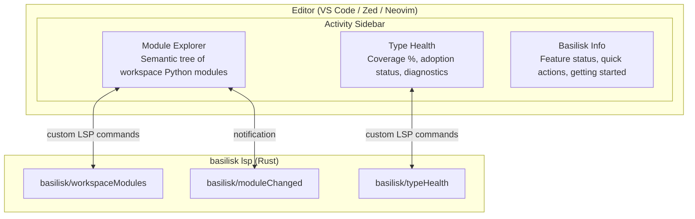

# Basilisk Activity Panel

## Goal {#ACTPANEL-GOAL}

The Basilisk activity icon opens a sidebar that is **genuinely useful** — not a branding placeholder. It gives Python developers immediate, actionable insight into their codebase: module structure, type coverage, diagnostics, adoption progress, and what Basilisk actually does for them.

**Cross-editor spec.** The LSP commands and data model are shared. The rendering differs per editor. This spec defines the shared protocol first, then per-editor implementation notes. Only **differences** are documented per-editor — if it's the same, it's in the shared section.

## Critical Docs

- [VS Code TreeView API](https://code.visualstudio.com/api/extension-guides/tree-view)
- [VS Code Extension API — views](https://code.visualstudio.com/api/references/contribution-points#contributes.views)
- [Zed Extension API](https://zed.dev/docs/extensions/developing-extensions)
- [VSIX-SPEC.md](VSIX-SPEC.md) — VS Code extension spec
- [ZED-SPEC.md](ZED-SPEC.md) — Zed extension spec
- [NEOVIM-SPEC.md](NEOVIM-SPEC.md) — Neovim plugin spec

---

## Architecture {#ACTPANEL-ARCH}



All data flows from the LSP server via custom commands. The editor extension is a **thin rendering layer**.

---

## Custom LSP Commands {#ACTPANEL-CMDS}

> See [LSP-ARCHITECTURE-SPEC.md §LSPARCH-CMDS](LSP-ARCHITECTURE-SPEC.md#LSPARCH-CMDS) for command definitions (`basilisk/workspaceModules`, `basilisk/moduleChanged`, `basilisk/typeHealth`).

---

## Data Model {#ACTPANEL-MODEL}

> Canonical types (`ModuleNode`, `SymbolNode`, `WorkspaceModulesResponse`, `HealthStats`, `ModuleHealth`, `TypeHealthResponse`) are defined in [LSP-ARCHITECTURE-SPEC.md §LSPARCH-TYPES](LSP-ARCHITECTURE-SPEC.md#LSPARCH-TYPES).

The activity panel extends the canonical types with these additional fields for UI rendering:

```typescript
/** Extended SymbolNode fields for activity panel rendering. */
interface SymbolNodeExtensions {
    /** Exported via __all__? */
    exported: boolean;
    /** Has type annotation? */
    annotated: boolean;
}

/** Extended ModuleHealth fields for activity panel rendering. */
interface ModuleHealthExtensions {
    path: string;
    /** true if file is in adopted (errors-as-warnings) mode */
    adopted: boolean;
    /** Unannotated symbol names (for quick-fix suggestions) */
    unannotated: string[];
}
```

---

## Panel 1: Module Explorer {#ACTPANEL-MODULES}

The killer panel. Shows the **semantic** structure of the workspace — not a file tree, a *module* tree. Every Python developer needs to understand their module graph, and the built-in Explorer doesn't show it.

### Tree Structure {#ACTPANEL-MODULES-TREE}

```
myapp/
  +-- __init__.py          (package)
  +-- api/                 (package)
  |   +-- auth.py          (module)
  |   |   +-- class AuthProvider
  |   |   |   +-- def authenticate(token: str) -> User
  |   |   |   +-- def revoke(session_id: str) -> None
  |   |   |   +-- _secret_key: str
  |   |   +-- def create_token(user: User) -> str
  |   |   +-- TOKEN_EXPIRY: int = 3600
  |   +-- routes.py        (module)
  |       +-- def get_users() -> list[User]
  |       +-- def create_user(data: UserCreate) -> User
  +-- models/              (package)
  |   +-- user.py
  |   |   +-- class User
  |   |   |   +-- id: int
  |   |   |   +-- name: str
  |   |   |   +-- email: str
  |   |   +-- class UserCreate
  |   +-- base.py
  |       +-- class BaseModel
  +-- utils.py             (module)
      +-- def slugify(text: str) -> str
      +-- def now() -> datetime
```

### Tree Item Properties {#ACTPANEL-MODULES-ITEMS}

| Property | Value |
|----------|-------|
| Label | Symbol name |
| Description | Type signature (dimmed, right-aligned) |
| Icon | Per kind: class, method, variable, constant, namespace (type alias) |
| Tooltip | Full signature + docstring first line (if available) |
| Click action | Open file at the symbol's line |

### Decorations {#ACTPANEL-MODULES-DECOR}

- **Unannotated symbols**: italic label, warning suffix — visual nudge to add types
- **Private symbols** (`_prefixed`): dimmed
- **`__all__` exported**: export icon overlay
- **Classes with errors**: red dot decoration

### Context Menu Actions {#ACTPANEL-MODULES-CTX}

| Action | Scope |
|--------|-------|
| Go to Definition | Any symbol |
| Find References | Any symbol |
| Rename Symbol | Any symbol |
| Copy Import Path | Module or symbol — copies `from myapp.api.auth import AuthProvider` |
| Copy Qualified Name | Any symbol — copies `myapp.api.auth.AuthProvider` |
| Organize Imports | Module |
| Fix All | Module |

### Toolbar Actions {#ACTPANEL-MODULES-TOOLBAR}

| Action | Description |
|--------|-------------|
| Refresh | Re-fetch module tree from LSP |
| Collapse All | Standard collapse |
| Filter | Toggle filter input to search modules/symbols by name |
| Toggle View | Switch between tree (grouped by module) and flat (all symbols alphabetically) |

### Refresh Strategy {#ACTPANEL-MODULES-REFRESH}

- **On workspace open**: full fetch
- **On file save**: incremental update via `basilisk/moduleChanged` notification
- **On file create/delete/rename**: full re-fetch
- **Manual**: refresh button

---

## Panel 2: Type Health {#ACTPANEL-HEALTH}

At-a-glance view of how well-typed the codebase is. Answers: "How much of my code does Basilisk actually understand?"

### Tree Structure

```
Workspace Health: 73% typed  [========---] 14E 23W
-------------------------------------------------
  [pass]  myapp/models/user.py        100%    0E  0W
  [pass]  myapp/models/base.py        100%    0E  0W
  [pass]  myapp/api/auth.py            95%    0E  1W
  [warn]  myapp/api/routes.py          68%    2E  3W
  [warn]  myapp/utils.py               54%    1E  0W    [adopted]
  [fail]  myapp/legacy/importer.py     12%   11E 19W    [adopted]
```

### Tree Item Properties

| Property | Value |
|----------|-------|
| Label | Module path (relative to workspace root) |
| Description | Coverage %, error/warning counts |
| Icon | Green (>=90%), yellow (50-89%), red (<50%) |
| Tooltip | "23 of 31 symbols annotated. 2 errors, 3 warnings." |
| Decoration | `[adopted]` badge if file is in adoption mode |
| Sort | Worst-first by default (lowest coverage at top). Toggleable. |

### Header Widget

The top-level item is a summary row showing workspace-wide stats:

- **Coverage bar**: progress bar rendered in description
- **Totals**: errors, warnings, adopted file count
- **Trend indicator** (future): up/down since last session

### Toolbar Actions

| Action | Description |
|--------|-------------|
| Refresh | Re-fetch health data |
| Sort | Cycle: worst-first -> best-first -> alphabetical |
| Filter | Show only: errors, warnings, unannotated, adopted |

### Context Menu Actions

| Action | Command |
|--------|---------|
| Open File | Open at line 1 |
| Adopt File | Errors -> warnings for this file |
| Un-adopt File | Restore full errors |
| Fix All in File | Run autofix |
| Add Missing Annotations | AI-powered (future) |

### Refresh Strategy

- **On diagnostic change**: re-compute health stats client-side from diagnostic events + cached annotation data
- **On adopt/unadopt**: immediate refresh
- **Full re-fetch**: on workspace open and manual refresh

---

## Panel 3: Basilisk {#ACTPANEL-INFO}

Helps users understand what Basilisk **is** and what it **does**. Not a static about page — a living dashboard of feature status and quick actions.

### Structure

Tree with four grouped sections (top-level nodes are section headers, children are items):

- **Getting Started** — Links to walkthroughs and keybinding reference
- **Feature Status** — Live toggle for each Basilisk feature (type checking, inlay hints, debugger, test explorer, etc.) showing enabled/disabled state
- **Quick Actions** — Convenience commands (restart server, organize imports, fix all, show log, run tests)
- **Server Info** — Read-only server version, binary path, Python interpreter, analysis mode, workspace stats

### Getting Started Section

The Getting Started section provides walkthroughs for first-time users covering core features and initial setup.

### Feature Status Section

Each item reflects a real setting (e.g. `basilisk.enabled`, `basilisk.debugger.enabled`) and shows whether the feature is active. Clicking an item toggles the setting immediately.

### Quick Actions Section

Each item triggers an existing command. Convenience surface — users don't have to remember command palette names.

### Server Info Section

Read-only information fetched from the LSP `initialize` response (server version, capabilities), extension settings (binary path, python path, analysis mode), and workspace stats from `basilisk/typeHealth` (file count).

---

## Editor-Specific Implementation {#ACTPANEL-EDITORS}

### VS Code {#ACTPANEL-VSCODE}

Full native support via TreeView API. This is the reference implementation.

**Activity bar icon**: `vscode-extension/resources/basilisk-icon.svg` — monochrome, 24x24px, works on light and dark themes.

See [VSIX-SPEC.md](VSIX-SPEC.md) for the full `package.json` contribution.

Commands are registered per [VSIX-SPEC.md §VSIX-CMDS](VSIX-SPEC.md#VSIX-CMDS). When clauses and context keys are defined there as well.

**Tree icons**: Codicons — `symbol-class`, `symbol-method`, `symbol-variable`, `symbol-constant`, `symbol-namespace`.

### Zed {#ACTPANEL-ZED}

Zed does **not** currently support custom sidebar panels (open issue #21208). Until it does, the panel data is surfaced via slash commands (`/modules`, `/health`, `/basilisk`) that call the same LSP commands and format responses as markdown.

When Zed adds panel support, the extension will implement the same three panels using the same LSP commands. No data model changes needed.

See [ZED-SPEC.md](ZED-SPEC.md) for full Zed implementation details.

### Neovim {#ACTPANEL-NEOVIM}

Neovim has no built-in sidebar framework. `basilisk.nvim` implements the panels as Lua-rendered floating/split windows (`:BasiliskModules`, `:BasiliskHealth`, `:BasiliskInfo`), calling the same LSP commands via `vim.lsp.buf_request`.

See [NEOVIM-SPEC.md](NEOVIM-SPEC.md) for full Neovim implementation details including keybindings and UI rendering.

---

## Accessibility {#ACTPANEL-A11Y}

- All tree items have descriptive accessibility labels
- Icon + text for all status indicators (never color alone)
- Keyboard navigable in all editors
- Screen reader example: "Module myapp.api.auth, 95% typed, 0 errors, 1 warning"

---

## Performance {#ACTPANEL-PERF}

- **Lazy loading**: Module Explorer fetches children on expand, not upfront. Top-level modules loaded first, symbols loaded when a module is expanded.
- **Debounced updates**: `basilisk/moduleChanged` notifications are debounced (300ms) to avoid flicker during rapid saves.
- **Cached state**: Tree state (expanded nodes, scroll position) persisted across sessions (VS Code: `workspaceState`, Neovim: session file, Zed: N/A until panels exist).
- **Type Health**: Computed server-side using existing diagnostic + resolver data. No additional file I/O.
- **Large workspaces**: Modules with >100 symbols show a "Show all..." node. Type Health shows top 50 files by default with "Show all..." at bottom.

---

## Implementation Plan

See [EXTENSION-ACTIVITY-PANEL-PLAN.md](../plans/EXTENSION-ACTIVITY-PANEL-PLAN.md) for the full phased implementation plan and TODO list.
