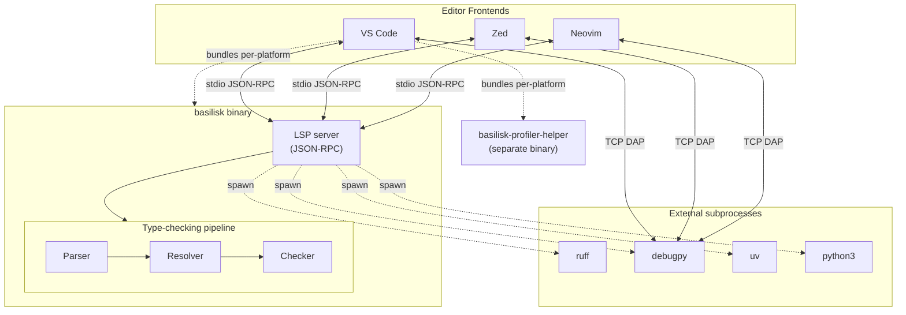
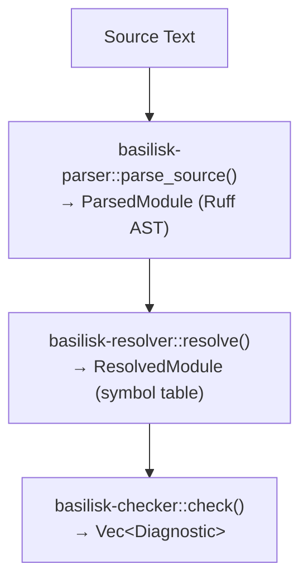

# Basilisk LSP — Feature Specification {#LSPARCH}

**Single source of truth** for all LSP features, DAP integration, custom commands, configuration settings, and binary resolution. Editor-specific specs MUST reference this document, not duplicate LSP details.

- **VS Code**: `VSIX-SPEC.md`
- **Zed**: `ZED-SPEC.md`
- **Neovim**: `NEOVIM-SPEC.md`
- **uv Integration**: `LSP-UV-INTEGRATION-SPEC.md` — environment detection, lock file intelligence, package commands

Design principle: the LSP drives functionality. IDE extensions react to LSP signals (e.g. commands) and never register a command the LSP does not advertise.

---

## System Architecture {#LSPARCH-SYSTEM}

Three editor frontends share one binary. The binary embeds the LSP server and the type-checking pipeline (parser → resolver → checker), and shells out to external tools (`ruff`, `debugpy`, `uv`) on demand.



- Solid arrows: runtime data flow. Dotted: process spawns or build-time bundling.
- The VSIX ships `basilisk` and `basilisk-profiler-helper` for 5 platforms (darwin x64/arm64, linux x64/arm64, win32 x64). Zed and Neovim users install `basilisk` themselves.
- DAP from each editor connects directly to `debugpy` over TCP; `basilisk` only spawns `debugpy` and reports the port.
- Pipeline detail: [Three-Phase Pipeline](#LSPARCH-ARCH-PIPELINE).

---

## Binary Invocation {#LSPARCH-INVOKE}

```bash
basilisk lsp [--transport stdio|ws] [--port 8765]
```

- Default transport: `stdio` (JSON-RPC over stdin/stdout)
- WebSocket transport: `--transport ws --port 8765`
- Logging: `BASILISK_LOG=debug basilisk lsp` (default level: `warn`, written to stderr)

## Binary Resolution (all editors) {#LSPARCH-BINRES}

Runtime binaries are declared in `shipwright.json` and resolved by the Shipwright framework. Each component's `sources` array controls the resolution cascade. The only permitted sources, in order:

1. **`user-setting`** — explicit user override via editor setting (e.g. `basilisk.executablePath`).
2. **`bundled`** — binary shipped inside the extension package at `bin/${platform}/${binaryName}${exe}`.

No other source is permitted. `cargo-bin`, `pkgmgr`, `path`, `env`, and `lsp-initialize` are **illegal** — the extension must never fall back to system-installed binaries.

Current components (see `shipwright.json` for the full manifest):

| Component | Required | Platforms |
|-----------|----------|-----------|
| `basilisk` (LSP server) | yes | all 5 |
| `basilisk-profiler-helper` | no | darwin-arm64 |

## Shared Configuration Settings (all editors) {#LSPARCH-CONFIG}

These settings are sent to the LSP server via `workspace/configuration` under the `basilisk` key. Every editor MUST support them:

| Setting Key | Type | Default | Description |
|------------|------|---------|-------------|
| `basilisk.python` | `string` | `""` (auto-detect) | Path to Python interpreter |
| `basilisk.executablePath` | `string` | `""` (auto-detect) | Path to basilisk binary |
| `basilisk.enabled` | `boolean` | `true` | Enable/disable type checker |
| `basilisk.analysisMode` | `enum` | `"wholeModule"` | `openFilesOnly` / `wholeModule` / `crossModule` |
| `basilisk.inlayHints.parameterNames` | `boolean` | `true` | Show parameter name hints at call sites |
| `basilisk.inlayHints.variableTypes` | `boolean` | `true` | Show inferred type hints for unannotated variables |
| `basilisk.ruff.enabled` | `boolean` | `true` | Enable Ruff integration (formatting + import org) |
| `basilisk.ruff.executablePath` | `string` | `"ruff"` | Path to the ruff binary |
| `basilisk.debugger.enabled` | `boolean` | `true` | Enable debugger |
| `basilisk.debugger.typeChecking` | `boolean` | `false` | Enable type assertion breakpoints |
| `basilisk.debugger.debugpyPath` | `string` | `"debugpy"` | Path to debugpy module |
| `basilisk.testExplorer.*` | — | — | See `LSP-TEST-INTEGRATION-SPEC.md` § Configuration Settings |
| `basilisk.uv.enabled` | `boolean` | `true` | Enable uv integration (auto-detected, see `LSP-UV-INTEGRATION-SPEC.md`) |
| `basilisk.uv.executablePath` | `string` | `""` (auto-detect) | Path to `uv` binary (only needed for commands, not detection) |
| `basilisk.uv.autoSync` | `boolean` | `false` | Auto-run `uv sync` when `pyproject.toml` changes |
| `basilisk.uv.stubSuggestions` | `boolean` | `true` | Suggest installing type stub packages |
| `basilisk.uv.dependencyDiagnostics` | `boolean` | `false` | Enable BSK-W0011/W0012/W0013 dependency hygiene warnings |

## Command Registration Rule {#LSPARCH-CMDREG}

Reference: https://code.visualstudio.com/api/references/vscode-api#commands

The LSP server is the single source of truth for commands; it advertises every command it handles via `executeCommandProvider` in its `initialize` response. Applies to VS Code, Neovim, and Zed equally:

1. The server MUST advertise ALL commands it handles in `executeCommandProvider.commands`. See `basilisk_common::commands::ALL` in `crates/basilisk-common/src/lib.rs`.
2. No editor extension may pre-register server commands. The client library (e.g. `vscode-languageclient`) discovers and registers them from server capabilities; a duplicate `registerCommand()` crashes the client with "command already exists".
3. Client-side UI logic belongs in middleware, not `registerCommand()` — e.g. VS Code's `executeCommand` middleware injects editor URIs, shows prompts, displays toasts.
4. Tests must wait for LSP readiness before asserting command availability — server-advertised commands exist only after the handshake.
5. Client-only commands with no server handler (e.g. `restartServer`, `showOutput`) ARE registered client-side and are NOT in `executeCommandProvider`.

### Modules Toolbar Contract (VS Code) {#VSIX-MODULE-EXPLORER-TOOLBAR}

The `basilisk.moduleExplorer` (MODULES) view title-bar contract (issue #113):

1. **Deterministic order.** Every `view/title` entry carries an explicit `@N` index — bare `"group": "navigation"` is forbidden.
2. **Collapse All is native, never contributed.** VS Code renders the Collapse All button from the tree view's `showCollapseAll: true`. The panel must **not** also contribute a custom collapse command — the dead `basilisk.collapseModuleExplorer` no-op next to the native button was the duplicate Collapse All in #113. Exactly one Collapse All may exist, and it is the native one; no contributed command may carry the `$(collapse-all)` glyph.
3. **Read-only inline, mutating in overflow.** The *contributed* inline icon row is exactly the read-only view-state actions, in this order: refresh (`navigation@1`), tree/flat toggle (`@2`), filter (`@3`), sort (`@4`). The native Collapse All renders alongside them. Mutating actions (`organizeImports`, `fixWorkspace` → group `1_modify`) and server control (`restartServer` → group `9_server`) live in the `…` overflow menu, in distinct groups so VS Code renders a divider between them.
4. **Sort is flat-view-only.** Sort applies only in flat view ([EXTACT-MODULES-TOOLBAR]); its `view/title` entry is gated on `basilisk.moduleExplorerView == 'flat'` so it never surfaces as an enabled no-op in the default tree view (issue #151).
5. **No colliding glyphs.** No two inline buttons may use the same codicon. Keeping `restartServer` (`$(debug-restart)`) in the overflow keeps it from rendering as a near-duplicate of `$(refresh)`.
6. **Fix All is feature-flagged.** `basilisk.fixWorkspace` is additionally gated on `config.basilisk.experimental.fixAll` (boolean setting, default `false`). It must not surface to users who have not opted in, and stays gated on `basilisk.serverState == 'running'`.

Enforced by the toolbar contract tests in `vscode-extension/src/test/suite/activity-panel.test.ts`.

---

## Custom LSP Commands (`workspace/executeCommand`) {#LSPARCH-CMDS}

| Command | Arguments | Response | Description |
|---------|-----------|----------|-------------|
| `basilisk.organizeImports` | `{uri}` | `TextEdit[]` | Run Ruff import organization |
| `basilisk.startDebugSession` | `{uri, pythonPath?}` | `{host, port, sessionId}` | Spawn debugpy, return connection info |
| `basilisk.stopDebugSession` | `{sessionId}` | `{}` | Terminate debug session |
| `basilisk.profiler.start` | `{pid?}` | `{sessionId}` | Start profiling (active process or PID) |
| `basilisk.profiler.stop` | `{sessionId}` | `{results}` | Stop profiling, return results |
| `basilisk.profiler.snapshot` | `{sessionId}` | `{results}` | Snapshot without stopping |
| `basilisk.memory.start` | `{}` | `{sessionId}` | Start memory tracking |
| `basilisk.memory.snapshot` | `{sessionId}` | `{snapshot}` | Take a heap snapshot |
| `basilisk.memory.diff` | `{sessionId}` | `{leakReport}` | Diff snapshots → leak report |
| `basilisk.memory.references` | `{typeName}` | `{retentionPaths}` | Query retention paths for a type |
| `basilisk.uv.sync` | `{}` | `{}` | Run `uv sync` in project root (see `LSP-UV-INTEGRATION-SPEC.md`) |
| `basilisk.uv.add` | `{package}` | `{}` | Run `uv add <package>` |
| `basilisk.uv.addDev` | `{package}` | `{}` | Run `uv add --dev <package>` |
| `basilisk.uv.remove` | `{package}` | `{}` | Run `uv remove <package>` |
| `basilisk.uv.lock` | `{}` | `{}` | Run `uv lock` (resolve without installing) |
| `basilisk.uv.createEnv` | `{pythonVersion?}` | `{}` | Run `uv venv` (optionally `--python X.Y`) |
| `basilisk.workspaceModules` | `{scope?: string}` | `WorkspaceModulesResponse` | Return the workspace module tree (optionally scoped to a package/subpackage) |
| `basilisk.typeHealth` | `{module?: string}` | `TypeHealthResponse` | Type health stats for the workspace or one module. The same rollup is folded into `basilisk.workspaceModules`; this command serves editors without a unified panel (Zed `/health`, Neovim `:BasiliskHealth`). |

### Custom LSP Notifications {#LSPARCH-NOTIFS}

| Notification | Direction | Params | Description |
|-------------|-----------|--------|-------------|
| `basilisk/moduleChanged` | Server → Client | `{module: {name, path, kind, symbols}}` | Sent when a module's symbol table changes after re-analysis. Debounced at 300ms. Carries a partial `ModuleNode` — no folded health fields; clients refetch via `basilisk.workspaceModules` for rollups. |

### Data Model Types {#LSPARCH-DATAMODEL}

The wire shapes below are the shipped contract, consumed field-for-field by the
VS Code extension (`module-explorer.ts`), basilisk.nvim (`type_health.lua`), and
the Zed slash commands. Source of truth: `crates/basilisk-lsp/src/server/activity_panel/`
(`module_tree.rs`, `type_health.rs`, `helpers.rs`). Panel-rendering semantics live in
[EXTACT-DATA-MODEL](EXTENSION-ACTIVITY-PANEL-SPEC.md#EXTACT-DATA-MODEL).

```typescript
/**
 * A module entry. `basilisk.workspaceModules` returns a FLAT list sorted by
 * name; clients rebuild the package hierarchy from dotted names
 * ([EXTACT-MODULES-TREE-STRUCTURE]).
 */
interface ModuleNode {
    name: string;              // Fully qualified module name (e.g. "mypackage.utils")
    path: string;              // Absolute filesystem path to the module file or __init__.py
    kind: "package" | "module";  // "package" iff the file is __init__.py/__init__.pyi
    symbols: SymbolNode[];     // Top-level symbols in this module
    // Folded per-module health rollup (single source: compute_file_health):
    coveragePercent: number;   // annotated/total * 100, rounded; 100 when the module has no symbols
    errors: number;            // 0 when type checking is disabled ([ANALYSIS-ENABLED], #119)
    warnings: number;          // ditto
    adopted: boolean;          // file is in adopted (errors-as-warnings) mode
}

/** A symbol within a module. */
interface SymbolNode {
    name: string;
    kind: "function" | "class" | "variable" | "constant";
                               // "constant" = module var whose name chars are all
                               //   uppercase/underscore (digit-bearing names emit "variable")
    line: number;              // 0-based line number of the definition
    annotated: boolean;        // functions: all params + return annotated (methods exclude
                               //   self/cls); vars/attrs: annotation present; classes: always true
    exported: boolean;         // reserved for __all__ tracking; currently always false
    children?: SymbolNode[];   // present on class nodes only (methods + attributes, sorted by line)
}

/**
 * Response from `basilisk.workspaceModules`. Carries a workspace-wide health
 * summary so a merged Modules panel needs no separate `basilisk.typeHealth`
 * round-trip (issue #103).
 */
interface WorkspaceModulesResponse {
    modules: ModuleNode[];
    workspace: HealthStats;
}

/** Aggregate health statistics for a scope (workspace or single module). */
interface HealthStats {
    totalSymbols: number;      // Total symbols in scope
    annotatedSymbols: number;  // Symbols counted as annotated (see SymbolNode.annotated)
    coveragePercent: number;   // (annotatedSymbols / totalSymbols) * 100; 100 when
                               //   totalSymbols == 0 (clients branch on totalFiles == 0
                               //   for the empty state, #57)
    errors: number;            // Number of BSK-E* diagnostics
    warnings: number;          // Number of BSK-W* diagnostics
    adoptedFiles: number;      // Files with >= 1 demoted diagnostic
    totalFiles: number;        // In workspaceModules this counts ALL indexed files,
                               //   regardless of the scope filter
}

/**
 * Per-module health breakdown (`TypeHealthResponse.modules` entry), sorted
 * ascending by coveragePercent — worst first. Unlike `basilisk.workspaceModules`,
 * typeHealth errors/warnings are NOT gated on type checking being enabled.
 */
interface ModuleHealth {
    name: string;              // Fully qualified module name
    path: string;              // Absolute filesystem path
    coveragePercent: number;
    errors: number;
    warnings: number;
    adopted: boolean;
    unannotated: string[];     // Names of unannotated symbols (quick-fix suggestions)
}

/** Response from `basilisk.typeHealth`. */
interface TypeHealthResponse {
    workspace: HealthStats;    // Rolled-up stats for the entire workspace
    modules: ModuleHealth[];   // Per-module breakdown (all modules, or single module when filtered)
}
```

## DapTcpProxy (all editors) {#LSPARCH-DAPPROXY}

All editors MUST implement a TCP proxy between the DAP client and debugpy to fix known stepping quirks:

1. Listen on a random local port.
2. Connect to debugpy on the `{host, port}` returned by `basilisk.startDebugSession`.
3. Frame DAP messages with `Content-Length` headers.
4. **Intercept `stepOut`** — inject auto-`next` for structural lines (`try:`, `with:`, `if:`).
5. **Attach-mode timeout** — 3s timeout with synthetic success response.
6. **Inject `exited` event** before `terminated` if missing.
7. **Fast disconnect** — respond immediately post-termination.

---

## Architecture {#LSPARCH-ARCH}

### Three-Phase Pipeline {#LSPARCH-ARCH-PIPELINE}



### ResolvedModule {#LSPARCH-ARCH-RESOLVED}

`ResolvedModule` (`crates/basilisk-resolver/src/scope.rs`) contains:

| Field | Type | Powers |
|-------|------|--------|
| `functions` | `Vec<FunctionInfo>` | Hover, completion, signature help, go-to-def, outline |
| `classes` | `Vec<ClassInfo>` | Hover, completion, go-to-def, outline, type hierarchy |
| `module_vars` | `Vec<VariableInfo>` | Hover, completion, go-to-def, inlay hints |
| `imports` | `Vec<ImportInfo>` | Completion, go-to-def, outline |
| `calls` | `Vec<CallSite>` | Inlay hints (param names), call hierarchy |
| `module_attr_accesses` | `Vec<ModuleAttrAccessInfo>` | Find references |
| `typevar_calls` | `Vec<TypeVarCallInfo>` | Semantic tokens |
| `source` | `String` | Extracting annotation text from spans |

**FunctionInfo** carries: `name`, `name_span`, `def_span`, `parameters` (with `name_span`, `annotation_span`), `return_annotation`, `decorators`, `class_name`, `return_stmts`, `local_vars`.

**ClassInfo** carries: `name`, `name_span`, `def_span`, `bases`, `attributes` (with `name_span`, `annotation_span`), `method_names`, `is_dataclass`, `is_typed_dict`, etc.

Every symbol has a `Span` (byte start/end) for precise positioning.

### Server Module Structure {#LSPARCH-ARCH-MODSTRUCT}

```
crates/basilisk-lsp/src/
  server.rs          — LspServer struct + tower-lsp trait impl (dispatch only)
  lib.rs             — re-exports run_server, check_source
  util.rs            — find_symbol_at_offset, position conversion, format_type_signature
  hover.rs           — type-aware hover + diagnostic hover
  definition.rs      — go-to-definition
  references.rs      — find all references + rename
  symbols.rs         — document symbols + workspace symbols
  completion.rs      — symbol + dot + import + kwarg completions
  signature.rs       — signature help
  inlay_hints.rs     — inferred types, parameter names, return types
  semantic_tokens.rs — token classification
  code_actions.rs    — quick fixes (E0001-E0003, suppress, organize imports)
  formatting.rs      — Ruff delegation
  highlight.rs       — document highlight (symbol occurrences)
  call_hierarchy.rs  — incoming/outgoing call navigation
  type_hierarchy.rs  — supertype/subtype navigation
  code_lens.rs       — reference count lenses
  folding.rs         — folding ranges
  selection.rs       — selection ranges (Smart Select)
```

Each module exports pure functions: `(resolved: &ResolvedModule, source: &str, ...) → LSP response type`.

### Performance: Cache ResolvedModule {#LSPARCH-ARCH-CACHE}

```rust
struct DocumentState {
    text: String,
    resolved: Option<Arc<ResolvedModule>>,  // cached from last did_change/did_open
    diagnostics: Vec<Diagnostic>,
}
```

Update `resolved` on `did_change`/`did_open`; reuse the cached result for all feature handlers.

---

## LSP Features {#LSPARCH-FEATURES}

### Shared Infrastructure: `find_symbol_at_offset` {#LSPARCH-FEATURES-FINDSYM}

Central symbol lookup reused by hover, go-to-def, references, rename:

```rust
// crates/basilisk-lsp/src/util.rs

pub enum SymbolHit<'a> {
    Function(&'a FunctionInfo),
    Class(&'a ClassInfo),
    Variable(&'a VariableInfo),
    Parameter { func: &'a FunctionInfo, param: &'a ParameterInfo },
    Attribute { class: &'a ClassInfo, attr: &'a AttributeInfo },
    Import(&'a ImportInfo),
}

/// Find the symbol at a byte offset by checking all name_spans in the ResolvedModule.
pub fn find_symbol_at_offset(resolved: &ResolvedModule, offset: usize) -> Option<SymbolHit<'_>>
```

Also: `pub fn format_type_signature(hit: &SymbolHit, source: &str) -> String` — builds hover markdown for any symbol kind.

### Hover (`textDocument/hover`) {#LSPARCH-FEATURES-HOVER}

Type signature for any symbol, with diagnostics secondary:

```
(function) def greet(name: str) -> str

---
**BSK-E0003** — Variable assignment missing type annotation
```

| Symbol Kind | Display Format |
|------------|---------------|
| Function | `(function) def name(param: Type, ...) -> ReturnType` |
| Method | `(method) def ClassName.name(self, param: Type, ...) -> ReturnType` |
| Class | `(class) ClassName(Base1, Base2)` |
| Variable | `(variable) name: Type` or `(variable) name = <inferred type>` |
| Parameter | `(parameter) name: Type` |
| Attribute | `(property) ClassName.name: Type` |

### Go to Definition (`textDocument/definition`) {#LSPARCH-FEATURES-DEFINITION}

Ctrl+Click / F12 on a symbol jumps to its definition.

| Cursor on | Jumps to |
|-----------|----------|
| Function call `greet(...)` | `FunctionInfo.name_span` of `greet` |
| Class instantiation `Dog(...)` | `ClassInfo.name_span` of `Dog` |
| Variable reference `x` | `VariableInfo.name_span` of `x` |
| `self.attr` | `AttributeInfo.name_span` in enclosing class |
| `ClassName.attr` | `AttributeInfo.name_span` in named class |
| Parameter reference | `ParameterInfo.name_span` in function |

Single-file scope. Cross-module requires workspace module resolver.

### Document Symbols (`textDocument/documentSymbol`) {#LSPARCH-FEATURES-DOCSYM}

Hierarchical outline tree:

```
▼ MyClass                          (class)
    name: str                      (field)
    age: int                       (field)
    ▶ __init__(self, name, age)    (method)
    ▶ greet(self) -> str           (method)
▶ helper(x: int) -> int           (function)
  MAX_SIZE: int                    (variable)
```

### Signature Help (`textDocument/signatureHelp`) {#LSPARCH-FEATURES-SIGHELP}

Trigger on `(` and `,`. Shows parameter hints with active parameter tracking. Skips `self`/`cls` for methods.

### Find All References (`textDocument/references`) {#LSPARCH-FEATURES-REFS}

Whole-word text scan with word boundary checks, filtering strings/comments. Respects `include_declaration`.

### Rename Symbol (`textDocument/prepareRename` + `textDocument/rename`) {#LSPARCH-FEATURES-RENAME}

`prepareRename` returns the identifier range + placeholder when the cursor is on a renameable symbol, `null` otherwise; the new name itself is validated in `rename` (`scope_tree::validate_rename`). `rename` returns a workspace-wide `WorkspaceEdit` built in two halves: (1) a scope-aware single-file core (`references::rename_symbol`) that renames every occurrence in the current file respecting lexical scoping (shadowed bindings untouched) and also updates keyword-argument call sites and docstring references when renaming a parameter, `self.attr` references when renaming a class attribute, and `__all__` entries when renaming a module-level symbol; (2) a cross-file half ([ANALYSIS-CROSSLSP-RENAME](LSP-ANALYSIS-MODES-SPEC.md#ANALYSIS-CROSSLSP-RENAME), [REFACTOR-RENAME](LSP-REFACTORING-SPEC.md#REFACTOR-RENAME)) that walks the import graph to also rename the symbol in every importer of the current file and — when the cursor symbol is itself imported — at its source-definition file. The cross-file half is gated on `crossModule` analysis; without it rename degrades gracefully to single-file.

### Completion (`textDocument/completion`) {#LSPARCH-FEATURES-COMPLETION}

- **Symbol completions**: functions, classes, variables from resolved module
- **Dot-access completions**: `self.attr`, `ClassName.attr` — class members
- **Import completions**: module names from import statements
- **Builtin completions**: 78 Python builtins (functions, constants, exceptions)
- **Keyword argument completions**: `param_name=` inside function calls

### Code Actions (`textDocument/codeAction`) {#LSPARCH-FEATURES-CODEACTIONS}

| Diagnostic | Action | Transformation |
|-----------|--------|----------------|
| BSK-E0001 | Add parameter annotation | Insert `: Any` |
| BSK-E0002 | Add return annotation | Insert `-> None` |
| BSK-E0003 | Add variable annotation | Insert `: <inferred_type>` |
| (any) | Suppress with `# type: ignore` | Append comment to line |
| (source) | Organize imports | Delegate to `ruff check --select I --fix` |

| imports_unresolved (uv) | Add dependency | `uv add <package>` via `basilisk.uv.add` command |
| BSK-E0152 (uv) | Install type stubs | `uv add --dev types-<package>` via `basilisk.uv.addDev` command |
| BSK-W0011 (uv) | Add dependency | `uv add <package>` — transitive dep used directly |
| BSK-W0013 (uv) | Sync environment | `uv sync` via `basilisk.uv.sync` command |

Register `codeActionKinds`: `[QUICKFIX, SOURCE_ORGANIZE_IMPORTS, REFACTOR]`

### Execute Command (`workspace/executeCommand`) {#LSPARCH-FEATURES-EXECCMD}

- `basilisk.organizeImports` — run Ruff import organization on a document

### Inlay Hints (`textDocument/inlayHint`) {#LSPARCH-FEATURES-INLAYHINTS}

1. **Variable type hints** — unannotated variables (module-level and function-local), inferred type at `name_span.end`
2. **Parameter name hints** — call sites, `"param_name="` at arg span start
3. **Function return type hints** — inferred from `return_stmts[].rhs_kind`, positioned after closing `)`

### Semantic Tokens (`textDocument/semanticTokens/full`) {#LSPARCH-FEATURES-SEMTOKENS}

**Token type legend**:

| Token Type | Applied To |
|-----------|-----------|
| `function` | Function names at definition and call sites |
| `method` | Method names (functions with `class_name.is_some()`) |
| `class` | Class names at definition and reference sites |
| `parameter` | Parameter names in function signatures |
| `variable` | Module-level and local variable names |
| `property` | Class attribute names |
| `decorator` | Decorator names (`@staticmethod`, `@override`, etc.) |
| `type` | Type annotation identifiers |
| `typeParameter` | TypeVar names, PEP 695 type params |

**Token modifier legend**: `declaration`, `definition`, `readonly`, `static`, `deprecated`

### Document Highlight (`textDocument/documentHighlight`) {#LSPARCH-FEATURES-HIGHLIGHT}

Highlight all occurrences of symbol under cursor. Definition = WRITE, usages = READ.

### Workspace Symbols (`workspace/symbol`) {#LSPARCH-FEATURES-WSSYM}

Ctrl+T symbol search across all open documents. Aggregates from DashMap, filters by query.

### Format Document (`textDocument/formatting`) {#LSPARCH-FEATURES-FORMAT}

Spawn `ruff format --stdin-filename <path> -` with document text on stdin. Return single `TextEdit` replacing entire document.

### Folding Ranges (`textDocument/foldingRange`) {#LSPARCH-FEATURES-FOLDING}

Emit `FoldingRange` for: function `def_span`, class `def_span`, consecutive import blocks.

### Selection Ranges (`textDocument/selectionRange`) {#LSPARCH-FEATURES-SELECTION}

Smart Select: identifier → parameter → parameter list → function → class → module. Nested range tree from `ResolvedModule` spans.

### Call Hierarchy (`textDocument/prepareCallHierarchy` + incoming/outgoing) {#LSPARCH-FEATURES-CALLHIER}

- **Prepare**: Find function/class at cursor, return `CallHierarchyItem`
- **Incoming**: Find all `CallSite`s where `callee == name`, group by enclosing function
- **Outgoing**: Find all `CallSite`s within function's `def_span`

### Type Hierarchy (`textDocument/prepareTypeHierarchy` + supertypes/subtypes) {#LSPARCH-FEATURES-TYPEHIER}

- **Prepare**: Find `ClassInfo` at cursor
- **Supertypes**: Use `ClassInfo.bases` to find parent classes
- **Subtypes**: Find classes whose `bases` contains target class name

### Code Lens (`textDocument/codeLens`) {#LSPARCH-FEATURES-CODELENS}

Show "N references" above each function and class definition.

---

## uv Integration Architecture {#LSPARCH-UV}

Full spec: [LSP-UV-INTEGRATION-SPEC.md](LSP-UV-INTEGRATION-SPEC.md). Key architecture:

### Detection & Registry {#LSPARCH-UV-DETECT}

On startup the LSP detects uv projects via filesystem signals (`uv.lock`, `[tool.uv]` in `pyproject.toml`, `.venv/pyvenv.cfg` with `uv = true`). If detected:

1. Parse `uv.lock` → `LockFile` (TOML, zero subprocess calls).
2. Extract `[project].dependencies` from `pyproject.toml` (PEP 508 specifier parsing).
3. Build `PackageRegistry` — HashMap keyed by normalised import name, classifying each package `Direct`, `Dev`, or `Transitive`.
4. Discover `[tool.uv.workspace]` members → add source roots to import search paths.

The registry feeds: import resolution (`PackageDepKind` on each `ImportInfo`), diagnostics (BSK-W0011 for transitive imports), hover (dependency classification, workspace member status), and code actions (`uv add`, `uv add --dev`, `uv sync`).

### Hot Reload {#LSPARCH-UV-HOTRELOAD}

uv commands trigger `rebuild_registry_and_resolve()` on success — re-parse `uv.lock`, rebuild registry, re-resolve imports, republish diagnostics for every indexed file. Same path fires when the file watcher detects a `uv.lock`, `pyproject.toml`, `basilisk.json`, or `.python-version` change — first reloading each root's checker config (`reload_root_configs`) so version-aware rules ([CHKARCH-VERSION-TARGET]) and rule-severity overrides update live, then re-checking. No LSP restart.

### uv Binary Resolution {#LSPARCH-UV-BINRES}

| Priority | Source |
|----------|--------|
| 1 | `basilisk.uv.executablePath` setting |
| 2 | `UV_PATH` environment variable |
| 3 | `~/.cargo/bin/uv` |
| 4 | `~/.local/bin/uv` |
| 5 | OS PATH search |

The uv binary is needed only for **commands** (sync, add, remove); lock-file parsing and environment detection are pure filesystem operations.

### uv Diagnostic Codes {#LSPARCH-UV-DIAGCODES}

| Code | Severity | Default | Gate | Description |
|------|----------|---------|------|-------------|
| BSK-E0152 | Error | Enabled | `uv.stubSuggestions` | Package installed but no type stubs (opt down to import untyped libs at your own risk) |
| BSK-W0011 | Warning | Disabled | `uv.dependencyDiagnostics` | Import of transitive dependency not in `[project.dependencies]` |
| BSK-W0012 | Info | Disabled | `uv.dependencyDiagnostics` | Declared dependency never imported (whole-module only, skeleton) |
| BSK-W0013 | Warning | Disabled | `uv.dependencyDiagnostics` | `uv.lock` older than `pyproject.toml` (skeleton) |

---

## Stub Resolution & Type Provenance {#LSPARCH-STUBS}

See [CHECKER-STUB-RESOLUTION-SPEC.md](CHECKER-STUB-RESOLUTION-SPEC.md) for PEP 561 resolution order, typeshed bundling, type provenance tracking, suppression system, and auto-stub generation.

---

## Analysis Modes {#LSPARCH-MODES}

See [LSP-ANALYSIS-MODES-SPEC.md](LSP-ANALYSIS-MODES-SPEC.md) for `openFilesOnly` / `wholeModule` / `crossModule` modes, workspace index, import graph, and cross-file LSP features.

---

## Editor-Specific Specs {#LSPARCH-EDITORS}

Editor-specific implementation (commands, UI, config schema, DAP proxy):

- **VS Code**: [`VSIX-SPEC.md`](VSIX-SPEC.md)
- **Zed**: [`ZED-SPEC.md`](ZED-SPEC.md)
- **Neovim**: [`NEOVIM-SPEC.md`](NEOVIM-SPEC.md)

---

## Testing Strategy {#LSPARCH-TESTING}

Every LSP feature gets E2E tests in `crates/basilisk-lsp/tests/lsp_e2e_tests.rs` and WS tests in `crates/basilisk-lsp/tests/lsp_ws_tests.rs`. No mocking — test the actual protocol.

| Feature | Test Cases |
|---------|-----------|
| Hover (type) | Hover on function name shows signature; hover on class shows bases; hover on variable shows type |
| Go to Definition | F12 on call site returns def_span; F12 on class ref returns class span |
| Document Symbols | File with class+functions returns hierarchical tree; methods nested under classes |
| Signature Help | Inside `greet(` returns signature; after comma selects next param; outside call returns None |
| Find References | All call sites found; definition included when requested |
| Rename | Function rename updates all call sites; class rename updates all references |
| Inlay Hints | Unannotated var gets type hint; call site gets param name hints; return type hints |
| Semantic Tokens | Function def classified as function; class def as class; parameter as parameter |
| Code Actions | E0001/E0002/E0003 quick fixes; suppress; organize imports |
| Completion | Symbol, dot, kwarg, builtin completions |

All tests must pass. `cargo clippy` must be clean. No `.unwrap()` in production code.
