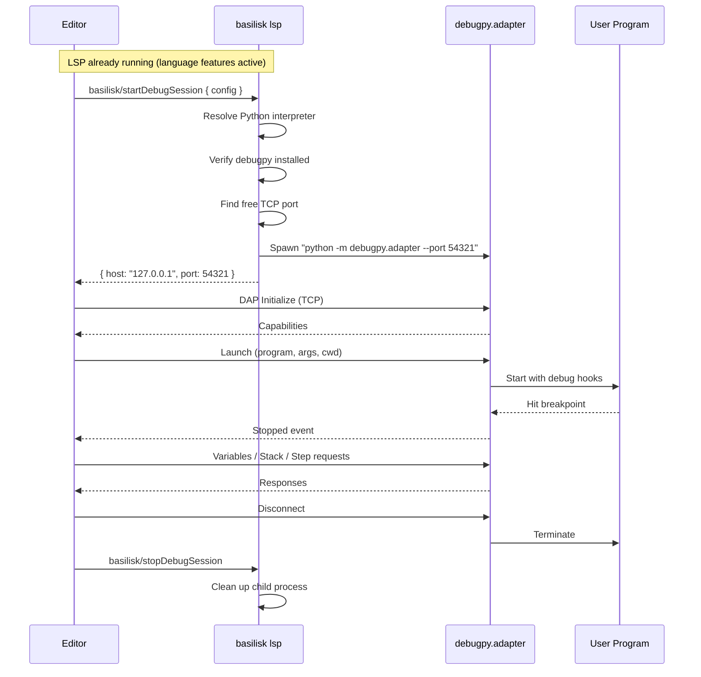
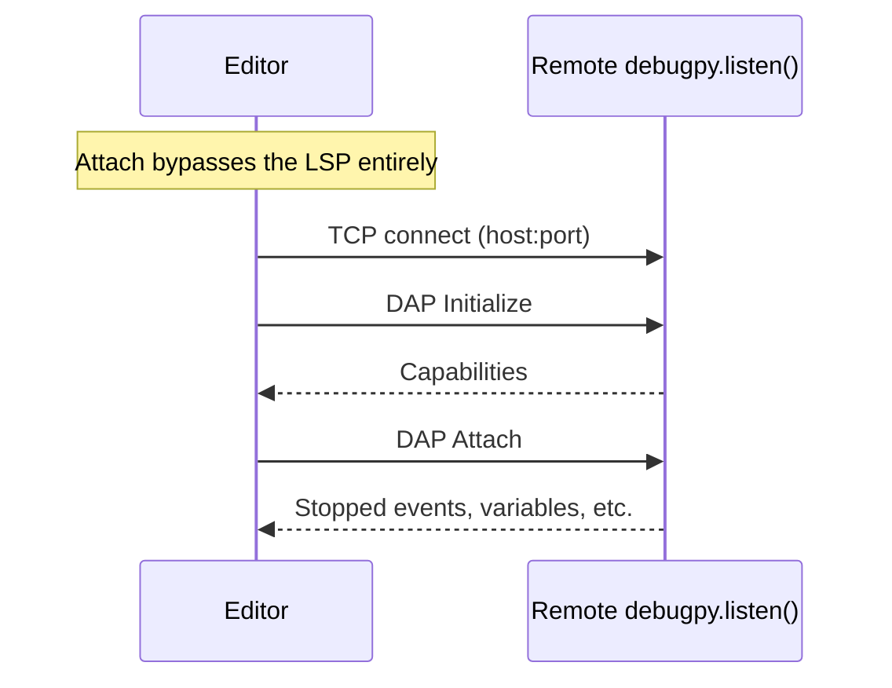

# Basilisk Debug Integration via debugpy {#LSPDEBUG}

The Basilisk LSP brokers Python debugging: the editor sends a custom LSP request, the LSP spawns `debugpy.adapter` on a free TCP port and returns `host:port`, and the editor's built-in DAP client connects directly to debugpy over TCP. The LSP brokers the connection only — it does not proxy DAP traffic. Editor-agnostic: any LSP-compatible editor sends `basilisk.startDebugSession` and connects to the returned port.

## How It Works {#LSPDEBUG-FLOW}



## LSP Custom Requests {#LSPDEBUG-LSP}

### startDebugSession {#LSPDEBUG-START}

The LSP only needs which Python to use. All DAP config (program, args, justMyCode, etc.) goes directly from editor to debugpy after the TCP connection is established.

**Request:**
```json
{
    "python": null
}
```

`python` is optional — if omitted, the LSP resolves it from the workspace venv or system PATH.

**Response:**
```json
{
    "host": "127.0.0.1",
    "port": 54321,
    "sessionId": "a1b2c3"
}
```

The LSP waits until debugpy is accepting TCP connections before returning, avoiding a race where the editor connects before debugpy is ready.

**`host` is the IPv4 literal, never the name `localhost`.** Every bind in the session path is IPv4 — the free-port allocator, the readiness probe, and `debugpy.adapter` itself, which defaults to `127.0.0.1` when spawned with `--port` and no `--host`. `localhost` is a *name*, and on Windows it resolves to the IPv6 `::1` first; nothing listens there, so a client that connects to the advertised host has its connection refused and either fails outright or stalls while the resolver falls back to IPv4. That is why debugging and profiling appeared broken on Windows while working on Linux and macOS. Advertising the address that is actually bound removes the name-resolution step entirely. Asserted in `crates/basilisk-lsp/tests/debug_spawn.rs` and `vscode-extension/src/test/suite/debug-integration.test.ts`.

**Port-collision retry.** Free-port allocation is a TOCTOU: the allocator's listener is dropped before debugpy rebinds the port, and anything on the machine can steal it in between — debugpy then exits 1 before accepting connections. `start_session` therefore tries up to 3 candidate ports (each allocated only after the previous attempt failed): a pre-flight occupancy check skips a stolen port without spawning a doomed adapter, and an adapter that exits on a bind failure is retried on the next candidate. Readiness checks the child's exit **before** the port probe, so a stranger's listener on the candidate port is never reported as a ready session. Non-port failures (missing interpreter, timeout) are never retried or masked, and an adapter-exit error carries debugpy's trailing stderr — never a bare exit status. Covered by `crates/basilisk-lsp/tests/debug_spawn.rs`.

### stopDebugSession {#LSPDEBUG-STOP}

**Request:**
```json
{
    "sessionId": "a1b2c3"
}
```

**Response:**
```json
{
    "stopped": true
}
```

### Rust Implementation {#LSPDEBUG-RUST}

`DebugSessionManager` in `basilisk-lsp/src/debug.rs` owns session lifecycle: spawning debugpy on a free TCP port, polling until the port accepts connections, tracking active sessions, and killing child processes on stop or shutdown.

### Python Resolver {#LSPDEBUG-PYRES}

The resolver finds the Python interpreter using a three-step cascade: (1) `BASILISK_PYTHON` environment variable, (2) workspace virtualenv (`.venv/bin/python` or `venv/bin/python`), (3) system `python3` (or `python` on Windows). Before spawning debugpy, `check_debugpy` verifies the interpreter can import debugpy and returns `DebugError::DebugpyNotFound` if it cannot.

#### Verifying debugpy once, ahead of time {#LSPDEBUG-PYRES-WARM}

`check_debugpy` spawns a whole Python process, and the FIRST interpreter a
server process spawns is dramatically more expensive than every one after it —
measured at **~15s against ~0.4s** on win32, where a freshly spawned interpreter
is scanned before it runs. The adapter spawn that follows costs ~300ms, so the
pre-flight, not the thing it guards, was the whole cost of starting a debug
session.

Two rules follow:

- **Verify an interpreter at most once.** `DebugSessionManager::ensure_debugpy`
  remembers interpreters that passed. A **failure is never cached**: a user who
  installs debugpy after being told it is missing must be able to retry without
  restarting the server.
- **Pay the first spawn during initialization, not on F5.**
  `warm_debugpy` runs from `initialized` in a spawned task, so the expensive
  first spawn overlaps the workspace scan. It is never awaited and never fails
  initialization — a workspace with no usable interpreter must still start, and
  the real debug request reports the real error.

Without this, every debug session on win32 began with a multi-second stall the
user could neither see nor explain, and the DAP e2e suite timed out behind it
([VSIX-CI-PLATFORM-COVERAGE-CLASSES]).

### LSP Server Wiring {#LSPDEBUG-WIRE}

Add `DebugSessionManager` to `LspServer` and handle `basilisk.startDebugSession` / `basilisk.stopDebugSession` in the `execute_command` dispatch. Register both commands in the `initialize` response's `executeCommandProvider`.

## VS Code Extension {#LSPDEBUG-VSCODE}

VS Code-specific DAP implementation: [VSIX-PYTHON-DEBUGGER-DAP](VSIX-SPEC.md#VSIX-PYTHON-DEBUGGER-DAP).

## Attach Session Flow {#LSPDEBUG-ATTACH}



For attach, the editor connects directly to the remote debugpy server; the LSP is not involved.

## Error Handling {#LSPDEBUG-ERRORS}

When debugpy is not installed, the LSP returns:

```json
{
    "error": {
        "code": -32001,
        "message": "debugpy not found. Install it: pip install debugpy"
    }
}
```

The editor surfaces this as a notification with an action button to run `pip install debugpy` in the terminal.

When the Python interpreter can't be found, the error lists what was tried:

```json
{
    "error": {
        "code": -32002,
        "message": "No Python interpreter found. Checked: .venv/bin/python, venv/bin/python, python3. Set BASILISK_PYTHON or create a virtualenv."
    }
}
```

## Python Version Targeting {#LSPDEBUG-PYTHON}

The session uses the interpreter resolved by [LSPDEBUG-PYRES](#LSPDEBUG-PYRES).
Interpreter compatibility belongs to that runtime and debugpy; Basilisk does
not declare one canonical Python release for debugging.
