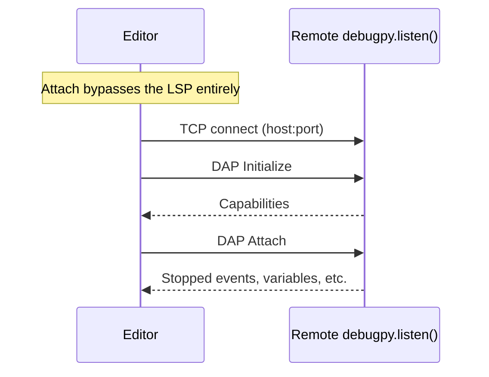

# Basilisk Debug Integration via debugpy {#LSPDEBUG}

The Basilisk LSP brokers Python debugging: the editor sends a custom LSP request, the LSP spawns `debugpy.adapter` on a free TCP port and returns `host:port`, and the editor's built-in DAP client connects directly to debugpy over TCP. The LSP brokers the connection only — it does not proxy DAP traffic. The design is editor-agnostic: any LSP-compatible editor sends `basilisk.startDebugSession` and connects to the returned port.

## How It Works {#LSPDEBUG-FLOW}


## LSP Custom Requests {#LSPDEBUG-LSP}

### startDebugSession {#LSPDEBUG-START}

The LSP only needs to know which Python to use. All DAP config (program, args, justMyCode, etc.) goes directly from the editor to debugpy after the TCP connection is established.

**Request:**
```json
{
    "python": null
}
```

`python` is optional — if omitted, the LSP resolves it from the workspace venv or system PATH.

**Response:**
```json
{
    "host": "localhost",
    "port": 54321,
    "sessionId": "a1b2c3"
}
```

The LSP waits until debugpy is actually accepting TCP connections before returning. This avoids a race where the editor tries to connect before debugpy is ready.

### stopDebugSession {#LSPDEBUG-STOP}

**Request:**
```json
{
    "sessionId": "a1b2c3"
}
```

**Response:**
```json
{
    "stopped": true
}
```

### Rust Implementation {#LSPDEBUG-RUST}

`DebugSessionManager` in `basilisk-lsp/src/debug.rs` owns session lifecycle: spawning debugpy on a free TCP port, polling until the port accepts connections, tracking active sessions, and killing child processes on stop or shutdown.

### Python Resolver {#LSPDEBUG-PYRES}

The resolver finds the Python interpreter using a three-step cascade: (1) `BASILISK_PYTHON` environment variable, (2) workspace virtualenv (`.venv/bin/python` or `venv/bin/python`), (3) system `python3` (or `python` on Windows). Before spawning debugpy, `check_debugpy` verifies the interpreter can import debugpy and returns `DebugError::DebugpyNotFound` if it cannot.

### LSP Server Wiring {#LSPDEBUG-WIRE}

Add `DebugSessionManager` to `LspServer` and handle `basilisk.startDebugSession` / `basilisk.stopDebugSession` in the `execute_command` dispatch. Register both commands in the `initialize` response's `executeCommandProvider`.

## VS Code Extension {#LSPDEBUG-VSCODE}

See [VSIX-SPEC.md VSIX-DAP](VSIX-SPEC.md#VSIX-DAP) for VS Code-specific DAP implementation.

## Attach Session Flow {#LSPDEBUG-ATTACH}



For attach, the editor connects directly to the remote debugpy server. The LSP is not involved.

## Error Handling {#LSPDEBUG-ERRORS}

When debugpy is not installed, the LSP returns a clear error:

```json
{
    "error": {
        "code": -32001,
        "message": "debugpy not found. Install it: pip install debugpy"
    }
}
```

The editor extension surfaces this as a notification with an action button to run `pip install debugpy` in the terminal.

When the Python interpreter can't be found, the error tells the user exactly what was tried:

```json
{
    "error": {
        "code": -32002,
        "message": "No Python interpreter found. Checked: .venv/bin/python, venv/bin/python, python3. Set BASILISK_PYTHON or create a virtualenv."
    }
}
```

## Python Version Targeting {#LSPDEBUG-PYTHON}

Primary target: Python 3.12 (the canonical Basilisk version). debugpy uses `sys.settrace` (via pydevd) on 3.12, which is fully supported.
