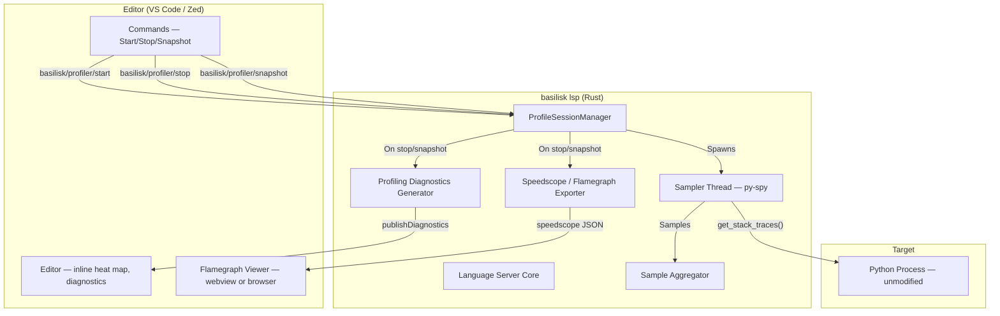
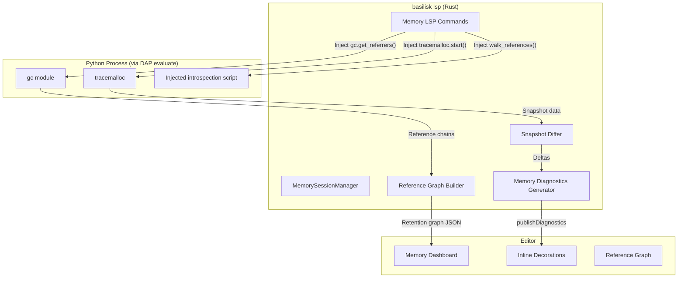

# Basilisk Profiling — Specification {#LSPPROF}

## Goal {#PROFILE-GOAL}

A Python profiler embedded in the Basilisk LSP (no separate tool or `pip install`). Attaches to running Python processes, samples call stacks, and surfaces hotspots inline (VS Code and Zed).

## UI Availability Gate {#PROFILE-UI-GATE}

The profiler is complete in the LSP; its VS Code surfaces stay hidden from shipped users until the end-to-end experience is reliable.

`isProfilingUiEnabled(context)` (`vscode-extension/src/profiling-ui.ts`) returns `true` only under test (`ExtensionMode.Test`), `false` in shipped and dev-host sessions, so the suite still exercises the full UI. `extension.ts` mirrors it into the `basilisk.profilingEnabled` context key every profiling `when` clause keys off; `memory-status.ts` reads it for the memory status-bar item (no `when` clause can reach it). Nothing is removed — all commands stay advertised ([PROFILE-REQUESTS]) and registered. To ship, return `true` unconditionally and drop the gate.

## Why py-spy {#PROFILE-PYSPY}

py-spy is a **Rust crate on crates.io** — the only Python profiler embeddable as a library dependency in a Rust project (Basilisk is Rust).

| Property | py-spy | Scalene | Memray | Austin |
|---|---|---|---|---|
| Language | **Rust** | Python/C++ | C++ | C |
| Embeddable as Rust crate | **Yes** | No | No | No |
| Attaches externally | **Yes** | No | No | Yes |
| Modifies target | **No** | Yes | Yes | No |
| Overhead | **~2%** | ~5-30% | High | ~2% |
| CPU / Memory profiling | **Yes** / No | Yes / Yes | No / Yes | Yes / No |

> Comparison drawn from each project's own documentation — [py-spy](https://github.com/benfred/py-spy), [Scalene](https://github.com/plasma-umass/scalene), [Memray](https://github.com/bloomberg/memray), [Austin](https://github.com/P403n1x87/austin); overhead figures are approximate and workload-dependent.

py-spy reads target-process memory directly via OS calls (`vm_read` on macOS, `process_vm_readv` on Linux, `ReadProcessMemory` on Windows), resolves CPython interpreter state, and walks `PyFrameObject` chains to build stack traces — no injection or instrumentation in the target.

## Architecture {#PROFILE-ARCH}



### Core Components {#PROFILE-COMPONENTS}

- **`ProfileSessionManager`** — owns active sessions (one per PID); handles start/stop/snapshot lifecycle. Lives in the LSP server alongside `DebugSessionManager`.
- **`Sampler` thread** — one dedicated OS thread per session; calls `py_spy::PythonSpy::get_stack_traces()` in a loop at the configured rate, sending samples to the aggregator via `mpsc` channel.
- **`SampleAggregator`** — accumulates stack traces into per-file/per-line hit counts; tracks total, per-function, and per-line samples. Thread-safe (receives from channel, queried from LSP thread).
- **`SpeedscopeExporter`** — converts aggregated samples to speedscope JSON.
- **`ProfilingDiagnosticsGenerator`** — converts aggregated samples to LSP diagnostics; each hot line becomes a `Diagnostic` with severity `Hint` and a message like `"38.2% CPU (412 samples)"`, published via `textDocument/publishDiagnostics`.

## py-spy Rust API {#PROFILE-API}

Stack sampling uses `py-spy` (crate version 0.4); see [py-spy docs](https://github.com/benfred/py-spy).

### Platform Permissions {#PROFILE-PERMS}

| Platform | Requirement | Impact |
|---|---|---|
| macOS | **Root required** (`vm_read` needs task port) | Must spawn privileged helper or use `sudo` |
| Linux | Root, or `ptrace_scope=0`, or profiling own child | Works without root if `ptrace_scope` is relaxed |
| Windows | No elevation for processes you own | Works out of the box |

**macOS mitigation**: a process Basilisk launched (a child) is traced directly by its parent, no root. Any other process — *including a same-user process started in another terminal* — needs the helper binary (`basilisk-profiler-helper`), spawned via `osascript` for elevation; it runs as root and streams samples back over a Unix socket. See [#PROFILE-PERMISSIONS-MACOS], [#PROFILE-HELPER-PROTOCOL], [#PROFILE-HELPER-SOCKET].

## LSP Protocol {#PROFILE-PROTOCOL}

### Custom Requests {#PROFILE-REQUESTS}

#### basilisk/profiler/start {#PROFILE-REQUESTS-START}

Start profiling a Python process.

| Field | Type | Required | Description |
|---|---|---|---|
| `pid` | `number` | **Yes** | Target PID. The editor obtains it from [`basilisk.profiler.processes`](#PROFILE-PROCESSES-LSP) (the Python Processes panel) or, for the active debug session, from the captured debuggee PID (see [#PROFILE-SAME-PROCESS]). There is **no** silent auto-detect. |
| `sampleRate` | `number` | No | Samples per second (default: 100) |
| `includeNative` | `boolean` | No | Include C extension frames (default: false) |
| `duration` | `number` | No | Auto-stop after N seconds (default: null = manual stop) |

A missing `pid` is rejected with `-32001`; PID discovery is an explicit, user-visible step (#62).

#### Profiling the debug session's process {#PROFILE-SAME-PROCESS}

The profiler and debugger **use the same process**. The LSP holds no DAP
connection, so it never learns the debuggee's OS PID directly (it spawns
`debugpy.adapter`; debugpy spawns the debuggee later). The editor captures it: the
DAP proxy (`vscode-extension/src/dap-proxy.ts`) intercepts debugpy's `process`
event (`body.systemProcessId`) and stores `sessionId → pid` in the extension
store; "Profile Debug Session" (`basilisk.profileAttachToDebug`) then calls
`basilisk.profiler.start` with that concrete `pid`. The LSP profiler stays
PID-based — **no server-side `debugSession`→PID resolution** — and the privilege
layer ([#PROFILE-PERMISSIONS]) routes the attach: child/same-user → in-process
py-spy (Linux/Windows), external/grandchild → elevated helper (macOS).

**Response fields:** `sessionId`, `pid`, `pythonVersion`, `startedAt`.

**Error codes:** `-32001` (process not found), `-32002` (not Python), `-32003` (permission denied), `-32004` (already profiling).

#### basilisk/profiler/stop {#PROFILE-REQUESTS-STOP}

Stop profiling and return results.

| Field | Type | Required | Description |
|---|---|---|---|
| `sessionId` | `string` | Yes | Session to stop |
| `format` | `string` | No | `"speedscope"` (default), `"flamegraph"` (SVG), `"summary"` (text) |

**Response fields:** `sessionId`, `duration`, `totalSamples`, `outputFile`, `flamegraphPath`, `cpuProfilePath`, `exportError`, `hotFunctions[]` (name, file, line, samples, percentage, selfPercentage), `hotLines[]` (file, line, samples, percentage).

- `flamegraphPath` — local self-contained flamegraph SVG, always attempted regardless of `format`, so every editor has a network-free viewer ([PROFILE-FLAMEGRAPH]).
- `exportError` — set when any export was refused or failed ([PROFILE-SPEEDSCOPE-VALIDATE]); never silent, editors must surface it.

#### basilisk/profiler/snapshot {#PROFILE-REQUESTS-SNAPSHOT}

Take a point-in-time snapshot without stopping the session. Same response as `stop`, but profiling continues.

#### basilisk/profiler/list {#PROFILE-REQUESTS-LIST}

List active profiling sessions. Returns `sessions[]` with `sessionId`, `pid`, `startedAt`, `sampleCount`, `duration`.

### LSP Notifications {#PROFILE-NOTIFICATIONS}

#### basilisk/profiler/diagnostics {#PROFILE-NOTIFICATIONS-DIAG}

After `stop` or `snapshot`, the LSP publishes profiling diagnostics for every file in the samples via `textDocument/publishDiagnostics`. Profiling diagnostics use severity `Hint` (4) and source `"basilisk-profiler"` so they don't pollute error/warning counts.

#### basilisk/profiler/progress {#PROFILE-NOTIFICATIONS-PROGRESS}

Periodic notification during active profiling with `sessionId`, `sampleCount`, `duration`, `topFunction`. Editors display this in a status indicator.

**The editor's handler follows the client reactively.** The LSP runtime can be re-created within one editor session (a store reset mints a brand-new client) and a cold start can outlast any fixed registration window, so a one-shot "register when running" listener goes silently dead — the status bar sits on "Profiling…" with no data forever. The VS Code handler is bound per client *instance* via an effect over the store's client signal (`registerProgressListener` in `profiler.ts`); `vscode-languageclient` queues pre-connection registrations and replays them across restarts of the same instance, so once-per-instance is sufficient. Covered by the "live progress survives an LSP client re-creation" e2e (`profiler-cpu-e2e.test.ts`).

### Editor loading & progress states {#PROFILE-UX-PROGRESS}

No profiling action is silent while it works. Every multi-second flow shows a progress surface from click to outcome:

- **One notification per user action**, with live stage messages ("Waiting for the program to pause…", "Injecting the in-process sampler…", "Attaching…", "Collecting results…"). Covered: one-click CPU launch (cooperative and py-spy legs), per-row py-spy attach, profiler stop, and every memory operation (start, snapshot, compare, GC, reference graph). All progress goes through one shared wrapper (`progress-ops.ts`) so styling, structured logs, and the e2e seam stay uniform — VS Code's progress UI is not readable via the public API, so the wrapper records a begin/step/end **operation log** that tests assert against.
- **Status bar "starting" state**: between click and the first sample batch the profiler item shows `$(loading~spin)` with an explanatory tooltip, then flips to the live flame counter ([#PROFILE-NOTIFICATIONS-PROGRESS]); never hidden while a start is in flight. The **memory** item mirrors the same lifecycle: hidden outside Basilisk debug sessions, the one-click start affordance while debugging, `$(loading~spin) Memory: starting…` while a start is in flight, and the tracking readout while live (`memory-status.ts`; e2e seam `memoryStatusText()`, covered by the status-bar lifecycle test in `memory-e2e.test.ts`).
- **Panel loading states** ([#PROFILE-PROCESSES-PANEL]): manual Refresh runs under the view's progress bar; the auto-refresh poll stays silent. The empty state is gated on **two** context keys so it never lies (#147): `basilisk.serverState` (server starting reads "Connecting to the Basilisk language server…"; stopped offers a one-click Restart) and `basilisk.processesState`, published from the provider's fetch lifecycle (`loading` | `loaded` | `error`). "No Python processes running" shows **only** when the server is running, a fetch succeeded (`processesState == loaded`), and the list is empty; a still-loading fetch reads "Loading Python processes…", a failed one "Couldn't load the Python process list." — an errored/disconnected panel never asserts the definitive negative. The empty state has no standalone Refresh button and no "refreshes automatically" narration; refresh lives in the view title, and the panel renders reactively from the centralised store state fed by the store-side poll (#148, [#PROFILE-PROCESSES-REACTIVE]).
- **Reactive session chrome** ([#PROFILE-PROCESSES-REACTIVE]): once a profile is starting or running, the Python Processes panel reflects it — live message + badge, launch buttons swapped for Stop, profiled row marked — so it never offers "Run & Profile" mid-session.

## Process Enumeration & Selection {#PROFILE-PROCESSES}

Starting a profile never requires hand-typing a PID (#62). The LSP owns process **discovery**; editors only render it. This section defines the enumeration command, its data model, and the panel/launch UX (implemented and shipped; see [PROFILE-PROCESSES-LSP]).

### basilisk.profiler.processes {#PROFILE-PROCESSES-LSP}

A `workspace/executeCommand` request returning **every** Python process on the machine ([#PROFILE-PROCESSES-SCOPE]). No required arguments; responds with `{ "processes": ProcessInfo[] }`, sorted by CPU usage descending — except non-attachable processes always sort last ([#PROFILE-PROCESSES-DISPLAY]).

Enumeration **only reads the OS process table**, so it never requires elevation (discovery works without `sudo`). Implemented in [`processes.rs`](../../crates/basilisk-lsp/src/profiler/processes.rs) over the `sysinfo` crate, advertised in `executeCommandProvider` like every other command (editors must not pre-register it — see [LSP-ARCHITECTURE-SPEC.md] command registration rule).

### Enumeration scope — system-wide, zero filters {#PROFILE-PROCESSES-SCOPE}

The panel lists **every** Python process on the machine — background system interpreters, processes outside the workspace, debugger machinery. The enumerator **filters nothing**; it reads the OS process table and tags each row with rendering attributes ([#PROFILE-PROCESSES-MODEL]).

Workspace membership drives **display**, not inclusion: a process is a **workspace process** when its working directory, target script, or interpreter path resolves inside an editor workspace root. Relative script/interpreter paths resolve against the process working directory; roots and candidate paths are canonicalized so a symlinked root (e.g. macOS `/var/…` → `/private/var/…`) still matches the canonical working directory `sysinfo` reports. Workspace processes render green ([#PROFILE-PROCESSES-DISPLAY]). With **no workspace root** open, nothing is a workspace process and nothing is greened, but the full system-wide list still shows.

Narrowing is **user-driven**: the panel's Filter command (by name, script, or PID) and sort/group controls. The enumerator never silently drops a process.

### ProcessInfo {#PROFILE-PROCESSES-MODEL}

Each entry in the `processes[]` response:

| Field (JSON) | Type | Notes |
|---|---|---|
| `pid` | number | Process id |
| `ppid` | number | Parent pid (`0` if unknown) — enables "group by parent" |
| `name` | string | Process name, e.g. `python3.12` |
| `interpreterPath` | string \| null | Resolved interpreter executable path |
| `script` | string \| null | Best-effort target script (first positional arg) |
| `pythonVersion` | string \| null | e.g. `3.12.13`; `null` ⇒ render `—` |
| `cpuPercent` | number | Instantaneous CPU% (may exceed 100 across cores) |
| `memoryBytes` | number | Resident memory in bytes |
| `runtimeSecs` | number | Seconds since process start |
| `user` | string \| null | Owner login name |
| `requiresElevation` | boolean | `true` when attaching the profiler would need elevation: on macOS, any **external** process (not a debuggee/child Basilisk launched) — even same-user — needs `vm_read` (root); on Linux/Windows only another user's process does. Drives the lock badge, not a blocker |
| `inWorkspace` | boolean | `true` when the process belongs to an open workspace root ([#PROFILE-PROCESSES-SCOPE]); drives the green row |
| `launcher` | string \| null | The framework name (`uvicorn`, `pytest`, …) when the process is a known launcher, else `null`; rendered as a chip |
| `debuggable` | boolean | `false` when the profiler cannot attach (debugger machinery, or no resolvable interpreter); drives the 🚫 marker, the greyed row, and the sort-to-bottom. Elevation is *not* a blocker — see `requiresElevation` |
| `undebuggableReason` | string \| null | Short human-readable reason shown in the tooltip when `debuggable` is `false`, else `null` |

**Detection:** a process is "Python" when its name, interpreter exe basename, or `argv[0]` basename matches `python`, `python3`, `pythonX.Y`, or `pypy`. Known launchers (uvicorn, gunicorn, pytest, celery, flask, hypercorn, daphne, uwsgi, sanic) on a Python interpreter get `launcher` set to the framework name.

**No exclusions — machinery is marked, not hidden.** Debugger machinery (`python -m debugpy.adapter`/`pydevd` and the debugpy/pydevd **launcher**/**adapter** submodules) is listed like any other process but flagged `debuggable = false` with `undebuggableReason = "debugger machinery"`, so the panel greys it, marks it 🚫, and sinks it ([#PROFILE-PROCESSES-DISPLAY]).

**Debuggee surfacing:** the **debuggee** — the developer's own program running under debugpy (how VS Code launches a script) — is debuggable. Its argv is `python <…>/debugpy --connect <addr> … <program>`, and the bundled debugpy path `…/debugpy/debugpy` contains `/debugpy/`. A process is a debuggee (debugpy-entry basename `debugpy`, or `-m debugpy`, *carrying a user program* after the bootstrap flags) with `script` set to that program and `debuggable = true`. Only the `launcher`/`adapter` submodules (no user program) are marked `debuggable = false`.

**Debuggability:** `debuggable` is `false` for debugger machinery or an unresolvable interpreter path, else `true`. A process owned by another user is **still debuggable** — it carries the `requiresElevation` lock hint and the privilege helper attaches at profile time ([#PROFILE-PERMISSIONS]) — so it is not greyed or sunk. This is a *display* hint; the authoritative attach-time check is unchanged.

**macOS argv:** sysinfo cannot read other processes' argv on macOS, so the enumerator takes one batched `ps -axo pid=,args=` snapshot per enumeration — powering script labels, launcher detection, and exclusions there.

**Version resolution:** `pythonVersion` resolves server-side — exact from `<exe> --version` (cached per interpreter, bounded per enumeration), falling back to the `pythonX.Y` path pattern, then `null`.

**Logging:** only the process *count* is logged. Command lines and user names may contain secrets/PII and are never logged (CLAUDE.md logging standards).

### basilisk/profiler/processesChanged {#PROFILE-PROCESSES-NOTIFY}

Reserved notification for pushing lazily-resolved interpreter versions after an enumeration returned `null`. v1 resolves versions inline within the request budget, so this is currently optional; editors treat its absence as "versions are already final".

### Python Processes panel {#PROFILE-PROCESSES-PANEL}

VS Code contributes a `basilisk.pythonProcesses` tree view in the `basilisk-explorer` activity-bar container ([`process-explorer.ts`](../../vscode-extension/src/process-explorer.ts)). It calls `basilisk.profiler.processes` and renders one row per process:

- **label** `python3.12 — app.py`, prefixed 🚫 when not `debuggable`
- **description** chips then metrics: `[uvicorn] PID 82875 · 3.12.13 · 12.4% · 88 MB`
- **tooltip** interpreter path, script, version, CPU/memory, runtime, user, workspace membership, launcher, and (when not debuggable) the reason
- **icon** Python glyph; `$(rocket)` for launchers, `$(circle-slash)` for non-debuggable rows, flame for the actively-profiled row

The OS has no push event for process changes, so the list is poll-sourced — but the poll lives **store-side** (`process-poll.ts`), never in the panel (#148): while the view is visible (interval `basilisk.profiler.processRefreshMs`, default 2000; an immediate fetch on becoming visible) it fetches into the store's `processes` Signal, and a manual refresh button re-runs the same fetch under the view's progress bar. Rows carry a stable `TreeItem.id` (`pythonProcess:<pid>`) so VS Code maps inline-button clicks back to elements across refreshes (#79). The empty state (`viewsWelcome`, reached only when no Python runs) offers the two metric-explicit launches of [#PROFILE-PROCESSES-LAUNCH-FILE].

**Pinned launch rows.** `viewsWelcome` renders only for an *empty* view, so the moment a process appears the welcome buttons vanish. To keep current-file launches reachable alongside a populated list, the panel pins them as the **top rows** (`contextValue = launchAction`, flame/database icons), gated per activity like the title-bar buttons: the CPU launch row hides while CPU profiling is busy, the memory launch row while memory tracking is busy ([#PROFILE-PROCESSES-REACTIVE]). When empty the rows are omitted so the welcome buttons show — the launches are always present one way or the other.

#### Visual treatment {#PROFILE-PROCESSES-DISPLAY}

The panel lists **every** Python process ([#PROFILE-PROCESSES-SCOPE]), so rows carry visual cues:

- **Workspace processes are green.** When `inWorkspace`, the whole row label is coloured green (a `FileDecorationProvider` keyed on a synthetic `basilisk-process:` `resourceUri`).
- **Non-debuggable rows are de-emphasised and sink.** When `debuggable = false`, the label is greyed (same provider, `disabledForeground`), prefixed 🚫, and **always sorted to the bottom** of the list/group regardless of sort mode. Greying takes precedence over workspace green: an undebuggable process is never shown as an actionable workspace row.
- **Launcher chips.** When `launcher` is set, the framework name renders as a `[uvicorn]`-style bracketed chip at the head of the description (tree rows have no native chip control).
- **All detail surfaced.** Every resolved attribute — PID, version, CPU%, memory, runtime, user, interpreter, script, workspace membership, launcher, debuggability reason — appears across label, description, and tooltip.

#### Sort modes {#PROFILE-PROCESSES-PANEL-SORT}

CPU% (default, descending), Memory, PID, Name, Runtime, Python version.

#### Group modes {#PROFILE-PROCESSES-PANEL-GROUP}

None (flat), Python version, Interpreter, User, Parent process. Groups render as
collapsible parent nodes with a count badge.

#### Reactive session state {#PROFILE-PROCESSES-REACTIVE}

The panel is **reactive to the profiling session**, not a static list. CPU and memory session state is the single reactive `profiler` signal owned by the store (`profiler-state.ts`); the status bar, panel chrome, and gating context keys all derive from it, so nothing goes stale. The per-metric state machine is `idle → starting → active → idle`.

**All panel state is centralised (#148).** The process list itself, the fetch lifecycle behind the welcome's honesty (#147), the sort/group/filter view modes, and the active-debuggee marker live in the store's `processes` Signal (`processes-state.ts`), mutated only through store actions and fed by the store-side poll (`process-poll.ts`). The tree provider is a **pure projection**: it holds no data, no fetch flag, and no timer — it renders whatever the store says and re-renders on each `processesRevision` bump via `subscribeRevision` ([EXTACT-REACTIVE-STATE]), exactly like the Modules panel keys off `analysisRevision`. The actively-profiled row marker derives straight from the `profiler` signal inside the provider (never a pushed field), and `bindDebuggeeTracking` writes the debuggee PID into the store, repainting every subscriber. The `basilisk.processesState` context key is a reactive mirror of the same signal (`bindProcessesContextKey`).

One `effect` over the signal (`process-reactivity.ts`) drives the panel:

- **Live chrome.** A message above the tree plus a badge dot while busy: `⏳ Starting CPU profiler…`, then `🔥 Profiling PID 1234 · 12.3K samples (4s) · hot_function` live from [#PROFILE-NOTIFICATIONS-PROGRESS]; `⏳ Starting memory tracking…` / `🗄️ Tracking memory allocations…` for the memory leg. The sample-count tick repaints only the message; the tree rebuilds only on a *gating* transition.
- **Button gating — per activity.** Per-activity context keys gate the metrics independently: `basilisk.cpuBusy` (CPU starting or active), `basilisk.memoryBusy` (memory starting or active), `basilisk.profiling` (CPU active), `basilisk.memoryTracking` (memory active), `basilisk.profilerStarting`, and aggregate `basilisk.profilerBusy`. While `cpuBusy`, the "Run & Profile CPU" launch and per-row **Profile** hide; while `memoryBusy`, "Run & Track Memory" and per-row **Track** hide. In their place the title bar shows **Stop Profiling** (`profiling`) or **Stop Memory Tracking** (`memoryTracking`). Per-own-metric gating is deliberate: at most one CPU **and** one memory session per store ([profiler-state.ts]) — the legs are independent, so a second start of the *same* metric is blocked, but CPU-while-memory (and vice versa) is permitted.
- **Active-row marker.** The CPU-profiled PID's row gets a flame icon, "· profiling" suffix, and `contextValue = pythonProcessProfiling`, swapping its inline Profile button for **Stop**.

Launch commands also guard imperatively (`profileCurrentFile`, `startProfilingForPid`, `handleProfileAttachToDebug`, `handleMemoryStart`): invoked from the palette while the **matching metric** is busy (CPU checks `cpuBusy`, memory checks `memoryBusy`), they decline with "stop the current session first" rather than spawning a duplicate. The e2e seams are the pure `panelMessage`/`panelBadge` builders plus `pythonProcessesViewState()` (view chrome) and `profilerStatusText()` (status bar).

### Launch from the panel {#PROFILE-PROCESSES-LAUNCH}

The headline fix for #62. Per-row inline buttons act on that row's `pid` in one click, **no input box**:

- **▶ Profile CPU** (`basilisk.profileProcess`) — CPU sampling session for the row's PID.
- **🧠 Track Memory** (`basilisk.memoryTrackProcess`) — memory tracking rides the DAP-`evaluate` courier ([#PROFILE-MEMORY-HOWTO]), so it targets only the **live Basilisk debuggee**, never an external process. The action is **shown only on the active-debuggee row** (that row alone carries `contextValue = pythonProcessDebuggee`, computed reactively from the active `basilisk-debug` session's PID via `bindDebuggeeTracking`); the inline/context entries gate on `viewItem == pythonProcessDebuggee`. Every other row hides it and points the tooltip at "Run & Track Memory (Current File)" ([#PROFILE-PROCESSES-LAUNCH-FILE]). The runtime routing (`memoryTrackRoute` in `process-launch.ts`) guards the debuggee/other decision and **never** falls back to CPU.

The row context menu adds Copy PID and Reveal Script. The old palette command `basilisk.profileStart` is **kept but rewritten**: it focuses this panel and toasts "Pick a process below" instead of prompting for a PID (the "auto-detect" prompt is deleted).

VS Code can invoke an inline tree command with **no argument** (#79 — a click racing auto-refresh), so handlers resolve the target as: explicit item → panel selection → warning (`createProcessRowActions` in `process-launch.ts`). Both row commands share this.

#### Run & profile the current file {#PROFILE-PROCESSES-LAUNCH-FILE}

The view-title entry point states **what it tracks** (#82). Two metric-explicit buttons mirror the per-row actions:

- **🔥 Run & Profile CPU (Current File)** (`basilisk.profileCurrentFileCpu`) — launches the active `.py` under `basilisk-debug` with `profileOnLaunch: true`; profiler.ts honours that flag (or the global `basilisk.profiler.profileOnLaunch` setting) and attaches the CPU profiler to the captured debuggee PID ([#PROFILE-SAME-PROCESS]).
- **🗄️ Run & Track Memory (Current File)** (`basilisk.trackMemoryCurrentFile`) — launches with `stopOnEntry: true` + `memoryTrackOnLaunch: true`; tracemalloc needs a paused debuggee ([#PROFILE-MEMORY-HOWTO]), so memory-profiler.ts starts tracking at the entry pause then resumes. With no breakpoint, the start script also arms an at-exit snapshot so the run finalises into a visible result rather than dead-ending ([#PROFILE-MEMORY-FINAL]).

Both appear in the title bar, the empty state, and (gated on [#PROFILE-UI-GATE]) the command palette.

##### Profiling runs complete; they do not stop interactively {#PROFILE-LAUNCH-NOSTOP}

A "Run & Profile" launch is a *profiling run*: it must run to completion and surface a profile, never halt at breakpoints or exception stops (#145). It **cannot** set DAP `noDebug` — debugpy then runs with no adapter, so `stopOnEntry` never fires and the macOS cooperative sampler ([#PROFILE-COOPERATIVE]) loses its entry pause.

Instead the DAP proxy (`dap-proxy.ts`) neutralises breakpoints per session: on `launch` it records `profileOnLaunch`, then rewrites every `setBreakpoints`/`setFunctionBreakpoints` to an empty `breakpoints` array and every `setExceptionBreakpoints` to empty `filters`/`filterOptions` before forwarding. `stopOnEntry` is a launch argument, not a breakpoint, so the entry pause (and cooperative injection) survives. Normal sessions (`profileOnLaunch` unset) forward untouched. The pure transformation is `suppressBreakpointsForProfiling`; DAP order guarantees `launch` precedes `setBreakpoints`, so the flag is known in time.

Both triggers of [#PROFILE-PROCESSES-LAUNCH-FILE] reach this guard: the explicit entry point sets `profileOnLaunch` directly, and with the global setting on, the config resolver (`applyDebugConfigDefaults` in `debug-adapter.ts`) stamps `profileOnLaunch: true` onto every resolved `basilisk-debug` launch — keeping the proxy's predicate in lock step with `shouldProfileOnLaunch`'s two triggers.

## Cooperative In-Process Sampling {#PROFILE-COOPERATIVE}

The out-of-the-box CPU path for **debug-launched** sessions. Modern macOS gates task ports behind signed, debugger-entitled callers (even root + py-spy gets `EPERM`), so for debugpy-launched sessions Basilisk samples **from inside the debuggee** instead of reading foreign memory:

1. The launch config sets `stopOnEntry` (macOS only; [#PROFILE-PROCESSES-LAUNCH-FILE]).
2. `basilisk.profiler.cooperativeScript` (leg 1) mints a sample-file path and returns a Python script; the editor evaluates it at the entry pause via the memory-profiling courier ([#PROFILE-MEMORY-HOWTO]), then resumes. The script starts a **daemon thread** that walks `sys._current_frames()` at the configured rate, appending one JSONL tick per sample (header first: `{"header":{"python":…,"pid":…}}`, then `{"ticks":[[threadId,active,frames…]]}` with leaf-first frames, matching py-spy). Leading debugpy/pydevd `sys.settrace` callback frames are stripped (tracer overhead attributed to the traced user line); threads whose remaining leaf sits in stdlib wait modules are marked idle.
3. `basilisk.profiler.cooperativeAttach` (leg 2) tails the file as a standard `SamplerHandle` (`cooperative.rs`) — handshaking on the header like the elevated helper does on `attached` — and registers a normal session, so aggregation, hotspots, exports, diagnostics, and live progress ([#PROFILE-NOTIFICATIONS-PROGRESS]) are reused unchanged. Response matches `profiler.start`.
4. Stop writes a `<file>.stop` sentinel; the injected thread exits, the tailer drains what was flushed (0.5 s flush cadence) and removes both files.

Platform routing: macOS launch → cooperative; Linux/Windows launch → py-spy attach to the captured debuggee PID ([#PROFILE-SAME-PROCESS]); macOS external-process attach still uses the elevated helper ([#PROFILE-PERMISSIONS-MACOS]). Trade-off: no native (C-extension) frames and GIL ownership unobserved — acceptable for the launch flow, where zero-setup beats fidelity.

## Sample Aggregation {#PROFILE-AGGREGATION}

### Data Structures {#PROFILE-AGGREGATION-STRUCTS}

```rust
/// Accumulated profiling data for a single session
struct ProfileData {
    /// file path -> line number -> sample count
    line_hits: HashMap<String, HashMap<i32, u64>>,
    /// file path -> function name -> FunctionStats
    function_stats: HashMap<String, HashMap<String, FunctionStats>>,
    total_samples: u64,
    thread_samples: HashMap<u64, u64>,
    /// Raw frame list for speedscope export (frame index dedup)
    frame_index: HashMap<(String, String, i32), usize>,
    frames: Vec<SpeedscopeFrame>,
    /// Per-thread sample stacks (indices into frames)
    thread_stacks: HashMap<u64, Vec<Vec<usize>>>,
    thread_weights: HashMap<u64, Vec<f64>>,
}

struct FunctionStats {
    name: String,
    file: String,
    line: i32,
    /// Samples where this function appears anywhere in the stack
    total_samples: u64,
    /// Samples where this function is the leaf (top of stack)
    self_samples: u64,
}
```

### Aggregation Logic {#PROFILE-AGGREGATION-LOGIC}

For each `get_stack_traces()` call:

1. For each thread's `StackTrace`:
   - Skip if `!trace.active && !config.include_idle`
   - For each `Frame` in the stack: increment `line_hits` and `function_stats.total_samples`
   - The leaf frame (index 0) also gets `self_samples` incremented
   - Record the stack as frame indices for speedscope export
2. Increment `total_samples`

### Runtime-scaffolding filtering {#PROFILE-AGGREGATION-SCAFFOLD}

A debug-launched program arrives wrapped in ~9 frames of launcher machinery (`_run_module_as_main → _run_code → debugpy <module> → main → run_file → run_path → _run_module_code → _run_code` before the user's `<module>`), which squashes the user's code into unreadable slivers at the bottom of every flame chart. `ingest_traces` strips that scaffolding at the single choke point every surface derives from, so the `.cpuprofile`, speedscope JSON, flamegraph SVG, hot lists, and diagnostics all root at the user's own code — the CPU-side mirror of the memory profiler's noise filtering ([#PROFILE-MEMORY-FINAL]).

- **What is scaffolding:** `<string>` (the injected cooperative sampler lives there), `<frozen runpy>`, basename `runpy.py`, basenames starting `pydevd`/`debugpy`/`_pydev`, or an exact `debugpy`/`pydevd` path segment. **Anchored matching only** — never a full-path substring — so a user file under `debugpy_utils/` is never mistaken for the debugger.
- **Leaf tracer frames:** a pydevd `trace_dispatch` leaf is stripped and its self-time attributed to the user line it was tracing, matching the cooperative sampler's leaf handling ([#PROFILE-COOPERATIVE]).
- **Machinery-only threads** (debugger housekeeping, the injected sampler thread) are dropped entirely — they never register as threads, stacks, or hits.

Covered by the `[PROFILE-AGGREGATION-SCAFFOLD]` tests in `profiler_tests.rs`.

### Hotspot Threshold {#PROFILE-AGGREGATION-THRESHOLD}

Only lines/functions above a configurable threshold generate diagnostics:

- **Line threshold**: 1% of total samples (default)
- **Function threshold**: 2% of total samples (default)
- **Max diagnostics per file**: 20

## Speedscope Export {#PROFILE-SPEEDSCOPE}

### Mapping {#PROFILE-SPEEDSCOPE-MAPPING}

Output conforms to the [speedscope file format schema](https://www.speedscope.app/file-format-schema.json).

| py-spy | Speedscope |
|---|---|
| `Frame { name, filename, line }` | `shared.frames[i] { name, file, line }` |
| Each `get_stack_traces()` call | One entry in `samples` per thread |
| `1.0 / sampling_rate` | Each entry in `weights` |
| `StackTrace.thread_name` | `profiles[i].name` |
| Frames deduplicated by `(name, filename, line)` | Index into `shared.frames` |

Speedscope stacks are root-first (callers before callees); py-spy returns leaf-first, so reverse the frame order when building `samples` entries.

### Export Validation {#PROFILE-SPEEDSCOPE-VALIDATE}

speedscope.app's importer indexes `shared.frames` by every sample, walks parallel `samples`/`weights` arrays, and reads `profiles[activeProfileIndex]`; violating any invariant loads as "Something went wrong". The exporter **refuses to write** (returns an error) when:

- the session captured **zero samples** (`profiles: []` with `activeProfileIndex: 0` is unloadable);
- any weight is **non-finite or negative** (serde serializes NaN/∞ as `null`, rejected);
- any sample's **frame index is out of bounds** for `shared.frames`;
- a thread's `samples` and `weights` **lengths differ**.

The same validation guards the flamegraph SVG and the V8 `.cpuprofile` export (`export_cpuprofile` calls `validate_exportable`). The `.cpuprofile` case matters because VS Code's viewer crashes on a **zero-sample** profile: its `buildModel` guard `if (!timeDeltas || !samples)` misfires (an empty array is truthy in JS), then reads `samples[timeDeltas.length - 1]` = `samples[-1]` = `undefined`, throwing `Cannot read properties of undefined (reading 'selfTime')` (#145). So a zero-sample `.cpuprofile` is never written; with no `cpuProfilePath` the editor falls back to the self-contained flamegraph ([PROFILE-NATIVE-FALLBACK]).

Tests assert the full invariant set on every exported file (`profiler_tests.rs::assert_speedscope_loadable`, `cpuprofile.rs::export_refuses_a_zero_sample_profile`).

### Viewer Delivery {#PROFILE-VIEWER-DELIVERY}

`https://www.speedscope.app/#profileURL=<url>` works only for http(s) URLs the browser may fetch from that origin; an https page can **never** read `file://`, so editors must never build a speedscope.app link to a local file (always "Something went wrong"). Until profiles are served over localhost HTTP with CORS, editors open the local flamegraph SVG (`flamegraphPath`) directly and point the user at the speedscope JSON for manual drag-and-drop import.

## Flamegraph SVG Export {#PROFILE-FLAMEGRAPH}

Direct SVG output uses the `inferno` crate (Rust port of Brendan Gregg's FlameGraph): convert aggregated stacks to collapsed format and pipe through `inferno::flamegraph::from_lines()`. The stop/snapshot response always carries the artifact as `flamegraphPath` regardless of the requested `format`.

**The editor surfaces it — a profiler's results view must contain an actual flame graph.** The results webview (`profiler-flamegraph-html.ts`) inlines the SVG as a `data:` URI image at the top of the panel (its CSP admits `img-src data:` only), so the flame shape is visible immediately without running the SVG's embedded script. An **"Open Interactive Flame Graph"** button opens the file externally (`vscode.env.openExternal`), where inferno's own zoom/search interactivity works untouched. A missing, unreadable, or oversized (> 4 MB inline cap) SVG degrades gracefully: the hero section is omitted and the summary cards/tables still render — never a broken image.

## Profiler Webview Host {#PROFILE-WEBVIEW-HOST}

All profiler results panels (CPU results, memory dashboard, retention graph) are built on one shared host, `profiler-webview.ts`, which owns the primitives each panel would otherwise hand-roll:

- **Singleton panel with a once-bound message handler.** `SingletonWebviewPanel` creates the panel on first show and only re-reveals + re-renders afterwards; the message handler is registered exactly once per panel instance. (Before this host, the memory dashboard and retention graph re-registered their handler on every open — with the autopilot re-rendering the dashboard on each pause, one row click navigated N times.)
- **Nonce-gated CSP on every document.** `buildWebviewDocument` emits `default-src 'none'; img-src data:; style-src 'unsafe-inline'; script-src 'nonce-…'` with a fresh random nonce per render. No profiler webview may assemble its own `<html>` skeleton.
- **Safe embedding of profiled-program data.** `embedJson` escapes `<` so frame names, allocation paths, type reprs, and leak reasons from the (possibly hostile) profiled program can never close the inline `<script>` early.
- **Shared source navigation.** `handleSourceNavigation` routes the `navigateToSource` message every panel posts; panels layer their own message types on top.
- **Theme-aware surfaces.** The shared palette (`profiler-styles.ts`) maps backgrounds, text, and borders to the editor's `--vscode-*` variables (with the brand dark palette as non-webview fallback), so panels follow light/dark/high-contrast themes; heat and leak accents stay brand-fixed. Canvas drawing reads the same variables at runtime via the shared `cssVar` helper.

## Native VS Code profile files {#PROFILE-NATIVE}

Both profilers also emit **V8 profile files** that VS Code's built-in viewer opens natively (flame chart + bottom-up/left-heavy tables) — the same UI as [Node.js profiling](https://code.visualstudio.com/docs/nodejs/profiling). The editor opens them with `vscode.open`; the custom flamegraph/dashboard webviews remain fallbacks.

### Never dead-end the user {#PROFILE-NATIVE-FALLBACK}

The built-in `.cpuprofile`/`.heapprofile` viewer is best-effort: it can be **unavailable** in the host (e.g. a dev host with `vscode-js-profile-*` disabled) or **refuse to render**, surfacing "The editor could not be opened…" inside the tab. Critically, `vscode.open` **resolves even when the editor later fails to render** (the failure is contained in the tab, not a rejected command), so a completed profile must never depend on the built-in viewer (#145).

On profile stop the editor:

- opens the native `.cpuprofile` beside the source when one was produced, catching any `vscode.open` rejection and falling back to the self-contained flamegraph webview ([PROFILE-FLAMEGRAPH]); and
- **always** raises a completion notification offering **"Open Flame Chart"** (the network-free webview) and **"Reveal Trace File"** (the `.cpuprofile`, else the speedscope JSON). The "Profile complete — N samples" toast must carry these, never announce an unreachable result.

`presentProfileResult` in `profiler-flamegraph-html.ts` owns this routing.

### Programs too short to sample {#PROFILE-SHORT-PROGRAM}

A sampling profiler takes one snapshot per `1/rate` seconds (10 ms at the default 100 Hz). A program running a few milliseconds (e.g. `examples/debug_demo.py` ≈ 1 ms over ~600 calls) yields ~0 useful samples, and **raising the rate cannot fix it**: the in-process sampler is a pure-Python GIL-bound daemon and `ingest_traces` stamps a fixed `weight = 1/sample_rate`, so a sub-tick run is structurally un-sampleable (#145).

**Phase 1 (current) — honest detection.** The signal is **attribution, not raw count**: a sub-tick program finishes before its work is sampled, yet the session keeps sampling the idle/exiting interpreter, so a result can carry dozens of samples (observed: 48) resolving to **zero** hot functions and lines. When a completed profile has no hot functions and no hot lines, the editor shows "captured N samples, but none landed in your code — ran too briefly to profile by sampling" rather than an empty flame chart/heat map or a higher-rate promise. `profileHasNoUsableData` in `profiler-flamegraph-html.ts` gates this.

**Phase 2 (planned) — deterministic profiling.** A launch-only deterministic mode: inject `cProfile` at the `stopOnEntry` pause via the courier ([PROFILE-COOPERATIVE]), dump `pstats` at exit via the file courier ([PROFILE-MEMORY-HOWTO]), and ingest into `ProfileData` (`ingest_pstats`, sibling of `ingest_traces`). `cProfile` counts every call regardless of duration. Attach-to-PID stays sampling (no injection seam into a foreign process). Tracked separately, not yet implemented.

- **CPU → `.cpuprofile`** (`Profiler.Profile` schema): [`cpuprofile.rs`](../../crates/basilisk-lsp/src/profiler/cpuprofile.rs) merges per-thread py-spy stacks into one call tree (`nodes` + `samples` + integer-µs `timeDeltas` from the sample rate). Written on `profiler.stop`; path returned as `cpuProfilePath`.
- **Memory → `.heapprofile`** (`HeapProfiler.SamplingHeapProfile` schema): [`heapprofile.rs`](../../crates/basilisk-lsp/src/profiler/memory/heapprofile.rs) maps each `tracemalloc` site to a `head`-tree node with `selfSize`. Written on snapshot ingest; path returned as `heapProfilePath`.

V8 line numbers are 0-based; `url` is the source path for navigation. `.heapsnapshot` is intentionally not produced (the built-in editor doesn't render it).

## Visualization {#PROFILE-VIS}

### Brand Palette for Profiling {#PROFILE-VIS-PALETTE}

| Token | Hex | Usage |
|---|---|---|
| `--prof-critical` | `#e8500a` | >20% CPU — Basilisk orange |
| `--prof-hot` | `#f97316` | 10-20% CPU |
| `--prof-warm` | `#fbbf24` | 5-10% CPU |
| `--prof-cool` | `#4a5468` | 1-5% CPU |
| `--prof-idle` | `#1a1f2e` | <1% — background blend |
| `--prof-mem-critical` | `#c084fc` | Memory hotspot — purple |
| `--prof-mem-leak` | `#f87171` | Memory leak detected — red |
| `--prof-success` | `#34d399` | Freed / resolved — green |
| `--prof-bg` | `#0a0c12` | Panel background |
| `--prof-surface` | `#141820` | Card/chart background |
| `--prof-text` | `#f0f2f7` | Primary text |
| `--prof-text-secondary` | `#8892a4` | Secondary text |

### Typography {#PROFILE-VIS-TYPOGRAPHY}

- **Headings**: Space Grotesk 600
- **Labels / Data**: Space Grotesk 500
- **Code / Filenames**: JetBrains Mono 400
- **Numbers / Percentages**: JetBrains Mono 500

### Chart Components {#PROFILE-VIS-CHARTS}

All charts render in Canvas 2D (no heavy deps like d3).

- **Flamegraph**: frames colored by self-time %; hover tooltip, click to source, zoom to subtrees with breadcrumb, search highlight.
- **Donut Chart**: top 5 functions by CPU %, center shows total sample count; click a slice to filter the flamegraph.
- **Timeline**: bezier curves per function over time; hover crosshair, click+drag to zoom; live mode extends rightward during profiling.
- **Sunburst Chart**: radial, root at center; arc width ∝ total time, color by self-time.
- **Memory Leak Retention Graph**: force-directed object-reference graph; nodes sized by retained memory, cycles red with pulsing animation.
- **GIL Contention Gauge**: animated arc gauge — green (<10%), amber (10-30%), red (>30%); real-time during live profiling.

### Inline Heat Map {#PROFILE-VIS-HEATMAP}

Hot lines get colored gutter decorations:

| Level | Color | Threshold |
|---|---|---|
| Critical | `#e8500a` Basilisk Orange | >20% |
| Hot | `#f97316` Light Orange | 10-20% |
| Warm | `#fbbf24` Amber | 5-10% |
| Cool | `#4a5468` Muted | 1-5% |

Memory profiling uses the purple palette on a separate decoration track for allocation sizes and leak warnings.

## Editor Integration {#PROFILE-EDITOR}

### VS Code {#PROFILE-EDITOR-VSCODE}

See [VSIX-SPEC.md](VSIX-SPEC.md) for VS Code-specific UX.

- **Commands:** `basilisk.profileStart`, `basilisk.profileStop`, `basilisk.profileSnapshot`, `basilisk.profileAttachToDebug`.
- **Flamegraph Webview:** full dashboard, all chart types, source navigation, PNG/SVG export.
- **Status Bar:** profiling state with pulsing orange dot; click to stop.

### Zed {#PROFILE-EDITOR-ZED}

See [ZED-SPEC.md](ZED-SPEC.md) for Zed-specific UX. Zed's limited API means profiling works through LSP diagnostics (hot lines as `Hint`) and slash commands (`/profile`, `/profstop`); flamegraph via speedscope in browser.

### Shared Code {#PROFILE-EDITOR-SHARED}

| Component | Code Location | Used By |
|---|---|---|
| py-spy sampling | `basilisk-lsp/src/profiler/sampler.rs` | Both |
| Privilege check / sampler selection | `basilisk-lsp/src/profiler/privilege.rs` | Both |
| Elevated helper socket client | `basilisk-lsp/src/profiler/helper_client.rs` | Both |
| Elevated helper binary | `basilisk-profiler-helper/src/main.rs` | Both |
| Helper wire protocol | `basilisk-profiler-protocol/src/lib.rs` | Both |
| Sample aggregation | `basilisk-lsp/src/profiler/aggregator.rs` | Both |
| Speedscope export | `basilisk-lsp/src/profiler/export.rs` | Both |
| Flamegraph SVG | `basilisk-lsp/src/profiler/flamegraph.rs` | Both |
| LSP commands | `basilisk-lsp/src/profiler/commands.rs` | Both |
| Diagnostic generation | `basilisk-lsp/src/profiler/diagnostics.rs` | Both |
| Webview flamegraph | `vscode-extension/src/flamegraph/` | VS Code only |
| Slash command handler | `basilisk-zed/src/lib.rs` | Zed only |

100% of the profiler engine is shared; editors differ only in visualization.

## Memory Profiling & Leak Detection {#PROFILE-MEMORY}

### Overview {#PROFILE-MEMORY-OVERVIEW}

Two engines answer **what allocated the memory, how much, and what's holding on to it**:

1. **tracemalloc** (stdlib) — per-line allocation tracking, allocation flamegraphs, growth-over-time analysis.
2. **gc + objgraph introspection** (stdlib + DAP evaluate) — reference-graph walking, cycle detection, retention-chain analysis, leak identification.

### Architecture {#PROFILE-MEMORY-ARCH}



### How It Works — Editor-as-Courier Round-Trip {#PROFILE-MEMORY-HOWTO}

Memory profiling requires an active **debug session** (debugpy). **The LSP holds no DAP connection — the editor does** (it connects directly to debugpy; see [LSP-DEBUG-INTEGRATION-SPEC.md](LSP-DEBUG-INTEGRATION-SPEC.md)), so the LSP cannot inject Python itself. Memory analysis is a **two-leg round-trip with the editor as courier**, and debugpy can only `evaluate` against a **stopped** frame. The editor satisfies that itself: while the program runs, memory ops **transparently pause → evaluate → resume** (`acquireStoppedFrame` in `dap-evaluate.ts`) — snapshots never demand a manual breakpoint, and a user-created breakpoint stop is left untouched after evaluation.

**The transparent pause is a retry loop, not a single pause.** A `pause` landing while the debuggee is still inside interpreter/debugger bootstrap (a launch is only milliseconds old) suspends it in frames `justMyCode` hides — `stackTrace` reports **zero frames**, and the parked thread would stay unevaluable forever, so waiting longer cannot help. `acquireStoppedFrame` therefore pauses, waits briefly for an evaluable frame, and when none appears **resumes and re-pauses after a backoff** (the program progresses into user code between attempts), bounded by the startup budget. Covered by the running-program tests in `memory-e2e.test.ts` and `memory-autopilot-e2e.test.ts`.

1. **Leg 1 — LSP → editor (get script):** a `basilisk.memory.*` command returns a Python injection script (e.g. `tracemalloc.take_snapshot()` printing a `__BASILISK_MEM__`-prefixed JSON payload). The LSP performs no DAP I/O.
2. **Editor runs the script** in the paused debuggee via DAP `evaluate` (`dap-evaluate.ts`), capturing the marker output. **Pause detection is event-tracked, never probed:** debugpy answers `stackTrace` for a *running* thread with a non-evaluable sampled frame (`evaluate` fails with "Unable to find thread for evaluation"), so `currentStoppedFrameId` mints a frame id only for threads the DAP tracker saw `stopped` (and not since `continued`) — how VS Code's own debug UI tracks pause state (`dap-output.ts`). Anything else returns null with the "Pause the debugger at a breakpoint" guidance.
3. **Leg 2 — editor → LSP (ingest):** the editor posts raw output back via [`basilisk.memory.ingest`](#PROFILE-MEMORY-INGEST). The LSP marker-dispatches to the matching parser, updates per-session state ([`MemorySessionManager`](../../crates/basilisk-lsp/src/profiler/memory/session.rs) holds the cross-diff [`LeakTracker`] and timeline), **publishes diagnostics** via `textDocument/publishDiagnostics`, and returns the `kind`-tagged result the editor renders.

Operations: **start tracking** (`tracemalloc.start(25)` + `gc.set_debug`), **snapshots** (`__BASILISK_MEM__`), **diffs** (`__BASILISK_MEM_DIFF__`; lines growing across ≥3 consecutive diffs escalate to High confidence), **gc collect** (`__BASILISK_MEM_GC__`), and **reference-graph walks** (`__BASILISK_MEM_REFS__`, via `gc.get_referrers()` with cycle detection). The diff script self-seeds its baseline (`tracemalloc._basilisk_prev_snapshot`) inside the debuggee, so cross-snapshot baseline lives in Python; the LSP keeps only leak-confidence history and diagnostics.

Identical for both editors. Zed reaches the same flow through `workspace/executeCommand`; only the script-running leg is editor-specific.

#### Large payloads ride a temp file, not stdout {#PROFILE-MEMORY-COURIER}

debugpy truncates a single `print()` at ~20 KB, and a real snapshot easily exceeds that (100 stats × depth-25 tracebacks of absolute paths ≈ 200 KB), silently corrupting the JSON. So every JSON-emitting script (`take_snapshot`, `diff_snapshot`, `walk_references`, `objects_by_type`, `gc_collect`) writes `marker + json` to a temp file (`emit_via_file_helper` in [`scripts.rs`](../../crates/basilisk-lsp/src/profiler/memory/scripts.rs)) and prints only the short, never-truncated `__BASILISK_MEM_FILE__<path>`. The editor's `resolveMarkerFilePayload` ([`dap-evaluate.ts`](../../vscode-extension/src/dap-evaluate.ts)) reads it back (deleting it), posting the full payload to `ingest` unchanged — leg-3 dispatch is untouched. Local debugging only: editor and debuggee share a filesystem, as the cooperative CPU sampler ([#PROFILE-COOPERATIVE]) assumes. Small acks (`__BASILISK_MEM_OK__`, the CPU ack) still go over stdout.

#### Final snapshot on session end {#PROFILE-MEMORY-FINAL}

The "Run & Track Memory (Current File)" flow ([#PROFILE-PROCESSES-LAUNCH-FILE]) runs to completion with **no breakpoint**. Every other memory op needs a *paused* debuggee to `evaluate` against ([#PROFILE-MEMORY-HOWTO]), so a finished run leaves no frame to snapshot, and the old flow dead-ended — tracking started, the program exited, nothing was shown (#146).

The fix mirrors the cooperative CPU sampler ([#PROFILE-COOPERATIVE]): capture to a **file during the run, read it at the end**. On start, `basilisk.memory.start` mints a per-session `finalSnapshotFile` and returns it with the script; the start script ([`start_tracemalloc`](../../crates/basilisk-lsp/src/profiler/memory/scripts.rs)) registers a Python `atexit` hook that takes one `tracemalloc` snapshot **as the program exits** and writes it directly to that file. The payload is byte-identical to an evaluate-path snapshot (both embed the shared `snapshot_payload_fn`), so it ingests through [`basilisk.memory.ingest`](#PROFILE-MEMORY-INGEST) with no new parser. A direct in-process write (not the `_basilisk_emit` print path) is used because at exit there is no DAP `evaluate` round-trip listening, and it sidesteps debugpy's print truncation ([#PROFILE-MEMORY-COURIER]).

When the debug session terminates, `memory-profiler.ts`'s `onDidTerminateDebugSession` listener finalises **only the tracked session** — the store records `memoryDebugSessionId` at start and the listener matches against it, so an unrelated session ending never tears down live tracking. For the tracked session it calls `finalizeMemorySessionOnEnd`: settles the stale tracking state ([#PROFILE-PROCESSES-REACTIVE]), reads the file (briefly polling for the terminate/flush race, then deleting), posts it to `ingest`, and presents it like a manual snapshot — the purple allocation track plus the V8 `.heapprofile` ([#PROFILE-NATIVE]). The launch toast says so up front ("a final snapshot opens automatically when the program finishes"). **Stopping never silently produces nothing:** if the hook didn't run (crash, `os._exit`, no live allocations), the editor says so rather than clearing state silently, and `basilisk.memory.stop` reports whether a snapshot was captured. Stopping *mid-run* leaves the hook armed, scheduling its exit-written file for deletion on termination — a manual stop never orphans a temp file.

The injected path is a JSON-encoded Python string literal (the cross-platform-safe pattern of [#PROFILE-COOPERATIVE]), so a Windows backslash or a quote in `TMPDIR` cannot break the script.

**The snapshot is the user's program, as a real call tree.** Two choices in `snapshot_payload_fn` make the `.heapprofile` worth reading:

1. **Noise filtering.** `tracemalloc` traces the *whole* process, so a naive snapshot is dominated by debugger allocations (pydevd/debugpy) and snapshot machinery (`tracemalloc`, `<frozen …>`, `<string>`). `filter_traces` drops any allocation whose **site** is one of those, then strips debugger/runtime frames from each kept stack — matching the anchored **basename** (e.g. `pydevd*`) or an exact **path segment** (`debugpy`/`pydevd`), never an unanchored substring (so `debugpy_utils/app.py` is never mistaken for the debugger). An allocation is dropped when only stdlib-proper frames survive; user code **and the libraries it calls** (site-/dist-packages) are kept.
2. **Full call stacks.** `statistics('traceback')` (not `'lineno'`) gives each allocation its whole call stack (`tracemalloc.start(25)` depth), root→leaf with the leaf as the allocation site. The builder ([`heapprofile.rs`](../../crates/basilisk-lsp/src/profiler/memory/heapprofile.rs)) merges shared prefixes into a genuine call tree (flame graph with depth), `selfSize` accruing at each leaf, labelling frames with source line (basename fallback) — so the chart reads like the code, not a flat bar list.

Covered by the "Run & Track Memory (Current File): the run finalises into a visible memory result on session end (#146)" test and the "an unrelated debug session ending does not tear down live memory tracking (#146)" regression, both in [`memory-e2e.test.ts`](../../vscode-extension/src/test/suite/memory-e2e.test.ts).

### Autopilot — automatic capture, zero per-pause clicks {#PROFILE-MEMORY-AUTOPILOT}

The **memory autopilot** ([`memory-autopilot.ts`](../../vscode-extension/src/memory-autopilot.ts)) captures automatically while tracking is active, collapsing the manual *Take Memory Snapshot* + *Compare Memory Snapshots* treadmill to "set a breakpoint, start tracking (or *Run & Track Memory*), press Continue."

The capture is the shared snapshot-then-diff round-trip in [`memory-capture.ts`](../../vscode-extension/src/memory-capture.ts) (`captureSnapshotAndDiff`) — the *same* courier legs ([#PROFILE-MEMORY-HOWTO]) the manual commands use, so it paints the identical purple track, leak decorations, dashboard, and timeline. Auto-captures are **quiet**: they update the reused dashboard panel and decorations but never pop a fresh `.heapprofile` tab (that stays the manual affordance).

#### On every debugger pause {#PROFILE-MEMORY-AUTOPILOT-PAUSE}

While tracking is active, each `stopped` event on the **tracked** session (forwarded via the `onStopped` callback in [`debug-adapter.ts`](../../vscode-extension/src/debug-adapter.ts)) triggers one auto-capture. The first diff self-seeds its baseline; each later pass over a growing site escalates confidence Low → Medium → High ([#PROFILE-MEMORY-CONFIDENCE]). On by default — `basilisk.profiler.autoSnapshotOnPause` (`false` restores manual pauses).

Two invariants prevent interference or loops:

1. **Only genuine user pauses.** Auto-capture is suppressed whenever a memory op is already in flight (`isMemoryOperationInFlight` in `memory-capture.ts`), so a capture's own transparent pause/resume ([#PROFILE-MEMORY-HOWTO]) and any in-progress manual op never trigger a second capture. A synchronous re-entrancy guard closes the gap between two near-simultaneous `stopped` events.
2. **Only the tracked session.** The autopilot reads `memoryDebugSessionId` from the store ([#PROFILE-PROCESSES-REACTIVE]); pauses in unrelated sessions are ignored.

#### At a fixed interval {#PROFILE-MEMORY-AUTOPILOT-INTERVAL}

For a long run that never pauses, `basilisk.profiler.autoSnapshot` (off by default) auto-captures every `basilisk.profiler.autoSnapshotInterval` seconds (default 30, matching the LSP-side `AutoSnapshotConfig` in [`timeline.rs`](../../crates/basilisk-lsp/src/profiler/memory/timeline.rs)). The running program is transparently paused and resumed ([#PROFILE-MEMORY-HOWTO]); the timer follows the store's tracking signal and is torn down when tracking stops, so no timer outlives its session.

#### Proactive leak actions {#PROFILE-MEMORY-LEAK-ACTIONS}

The first time a diff escalates a site to **High** (or a snapshot finds a **Definite** cycle), the autopilot surfaces one notification — *Suspected memory leak at `file:line` (HIGH)* — offering one-click **Show Reference Graph** and **Force Garbage Collection**. Offered at most once per session so the Continue loop is never spammed.

### Reference-graph type picker {#PROFILE-MEMORY-REFGRAPH-PICKER}

*Show Reference Graph* offers a data-driven Quick Pick built from the active file's **document symbols** (the user's own `class` definitions via `textDocument/documentSymbol`) plus container builtins (`dict`, `list`, `set`, `tuple`, `frozenset`), with an "*Other type…*" free-text escape hatch. Candidate computation (`gatherReferenceTypeCandidates`) is a pure, e2e-tested seam over the real symbol provider, so the picker is always populated from the real program.

### LSP Commands {#PROFILE-MEMORY-COMMANDS}

The `start`/`snapshot`/`diff`/`references`/`objectsByType`/`gcCollect` commands are **leg 1** — they return `{ memorySessionId?, script }`. The editor runs the script and posts output to [`basilisk.memory.ingest`](#PROFILE-MEMORY-INGEST) (leg 2).

| Command | Request Fields | Leg-1 Response |
|---|---|---|
| `basilisk.memory.start` | `tracebackDepth` (default 25) | `memorySessionId`, `tracingStarted`, `script`, `finalSnapshotFile` ([#PROFILE-MEMORY-FINAL]) |
| `basilisk.memory.snapshot` | `memorySessionId` | `memorySessionId`, `script` |
| `basilisk.memory.diff` | `memorySessionId` | `memorySessionId`, `script` |
| `basilisk.memory.references` | `memorySessionId`, `targetType`, `targetReprContains`, `maxDepth`, `maxNodes` | `script` |
| `basilisk.memory.objectsByType` | `memorySessionId`, `typeName`, `limit` | `script` |
| `basilisk.memory.gcCollect` | `memorySessionId` | `script` |

#### basilisk.memory.ingest {#PROFILE-MEMORY-INGEST}

Leg 2. Request: `{ memorySessionId, output }`, where `output` is the raw stdout of a script run in the debuggee. The [`MemorySessionManager`](../../crates/basilisk-lsp/src/profiler/memory/session.rs) detects the `__BASILISK_MEM*__` marker, parses it, scores leaks via the per-session `LeakTracker`, publishes diagnostics, and returns a `kind`-tagged object:

- `kind: "snapshot"` → `snapshotId`, `currentMemory`, `peakMemory`, `gcObjects`, `gcCounts`, `topAllocations[]`
- `kind: "diff"` → `totalGrowth`, `totalFreed`, `netGrowth`, `suspectedLeaks[]` (with `confidence`)
- `kind: "gc"` → `collected`, `uncollectable`, `memoryFreed`, `uncollectableObjects[]`
- `kind: "refs"` → `graph` with `nodes[]`, `edges[]`, `cycles[]`
- `kind: "objects"` → `objects` (`objects[]`, `totalCount`, `totalSize`, `typeSummary`)
- `kind: "ack"` → bare acknowledgment (start/stop scripts)

An unknown session or a marker-less payload is rejected with `-32010`.

### Reference Graph Visualization {#PROFILE-MEMORY-VIS-REFGRAPH}

Answers "what is holding on to this?" Force-directed layout with physics simulation:

- **Node sizing**: ∝ `log(size)`
- **Node coloring**: targets purple, root retainers blue, intermediate containers gray, cyclic objects red with pulsing animation
- **Edge labels**: reference type (`.attribute`, `['key']`, `[index]`)
- **Interactions**: hover tooltip, click to expand referrers/referents, right-click to navigate to creation site
- **Cycle highlighting**: thick red edges, pulsing animation, banner explaining `__del__` implications
- **Layout modes**: force-directed (default), tree, radial

### Leak Confidence Scoring {#PROFILE-MEMORY-CONFIDENCE}

| Confidence | Criteria | Color |
|---|---|---|
| **Definite** | Object has `__del__` and is in a reference cycle (uncollectable) | Red, solid |
| **High** | Consistent growth across 3+ consecutive snapshot diffs | Red, dashed |
| **Medium** | Growth in 2 consecutive diffs, or >10 MB single-diff growth | Amber |
| **Low** | Single-diff growth, small size, possible cache warmup | Gray |

### Diagnostic Codes {#PROFILE-MEMORY-CODES}

| Code | Severity | Meaning |
|---|---|---|
| `BSK-MEM-ALLOC` | Hint | Top allocation site (above threshold) |
| `BSK-MEM-GROWTH` | Warning | Memory growth between snapshots |
| `BSK-MEM-LEAK` | Warning | Suspected memory leak (high confidence) |
| `BSK-MEM-CYCLE` | Error | Reference cycle with `__del__` — definite leak |
| `BSK-MEM-UNCOLLECTABLE` | Error | gc reports uncollectable object |

### CPU+Memory Integration {#PROFILE-MEMORY-CPU-INTEGRATION}

CPU and memory profiling can run simultaneously. The dashboard shows dual heat maps (orange CPU, purple memory), correlated flamegraphs, and a "Hot and Heavy" filter for functions that are both CPU- and memory-intensive.

### Shared Code {#PROFILE-MEMORY-SHARED}

| Component | Code Location |
|---|---|
| tracemalloc / gc injection scripts (incl. reference-graph walker) | `basilisk-lsp/src/profiler/memory/scripts.rs` |
| Snapshot/diff/refs/objects parsers | `basilisk-lsp/src/profiler/memory/{mod,diff}.rs` |
| Leak confidence scoring | `basilisk-lsp/src/profiler/memory/leaks.rs` |
| Memory diagnostics | `basilisk-lsp/src/profiler/memory/diagnostics.rs` |
| Session state + marker-dispatched ingest | `basilisk-lsp/src/profiler/memory/session.rs` |
| LSP memory command handlers (incl. `ingest`) | `basilisk-lsp/src/server/memory_handlers.rs` |
| Editor DAP `evaluate` courier bridge | `vscode-extension/src/dap-evaluate.ts` (VS Code only) |
| Memory UI (decorations, dashboard, reference graph webview, status bar) | `vscode-extension/src/memory-profiler.ts`, `memory-status.ts`, `memory-decorations.ts` (VS Code only) |

## Permissions Model {#PROFILE-PERMISSIONS}

### macOS {#PROFILE-PERMISSIONS-MACOS}

`vm_read` (via `task_for_pid`) requires root, a child-process relationship with a non-hardened target, the `com.apple.security.get-task-allow` entitlement, or SIP disabled.

1. **Child-process profiling (no elevation):** a process Basilisk launched (e.g. a debug session) is traced by its parent without elevation. Primary UX.
2. **External-process profiling (elevation required):** any process Basilisk did **not** launch — **including a same-user process in another terminal** — is not a child, so macOS requires elevation. There is no "same-user, no-elevation" macOS shortcut (unlike Windows); do not message users as if there were (#61, Defect 4). The LSP spawns `basilisk-profiler-helper` via `osascript` with administrator privileges; it runs as root and streams samples over a Unix domain socket.

`check_profiling_permissions` in `basilisk-lsp/src/profiler/privilege.rs` decides: child PID → `Allowed` (in-process py-spy), external PID → `ElevationRequired` (helper socket path), missing PID → `Denied`.

### Helper Socket Protocol {#PROFILE-HELPER-PROTOCOL}

The elevated helper and LSP talk over a Unix domain socket using **newline-delimited JSON**. Message shapes and framing live in the shared `basilisk-profiler-protocol` crate (both `basilisk-lsp` and `basilisk-profiler-helper` depend on it) so they can never drift.

```text
LSP    -> {"cmd":"attach","pid":12345,"rate":100,"native":false}
helper -> {"type":"attached","pid":12345,"python":"3.12.0"}
helper -> {"type":"samples","traces":[...]}        (repeating)
LSP    -> {"cmd":"stop"}
helper -> {"type":"stopped"}
```

On an attach failure the helper MUST report the cause over the socket before exiting (#81 — a silent exit leaves the LSP with an undiagnosable EOF):

```text
helper -> {"type":"attachfailed","pid":12345,"reason":"py-spy attach failed: ..."}
```

The LSP classifies the reason into an actionable error (target exited, permission denied, or the verbatim py-spy error), and when an old helper still EOFs without reporting, harvests its exit status into the error message (`helper_client::describe_helper_eof`).

`traces` carry the minimal per-thread/per-frame fields py-spy produces; the LSP converts them back to py-spy shapes and feeds the same aggregator as the in-process sampler.

#### Attach-failure reporting {#PROFILE-HELPER-PROTOCOL-ERRORS}

A failed attach must never surface as a bare EOF (#81). Two layers guarantee a diagnosable cause:

1. **Structured error frame.** On attach failure the helper sends `{"type":"error","kind":"<kind>","message":"<py-spy cause>"}` before exiting. `kind` is `process-not-found`, `not-python`, `permission-denied`, or `attach-failed` (`AttachErrorKind` in `basilisk-profiler-protocol`), shared with the in-process sampler via `classify_attach_error` so both paths report identical modes. The helper refines py-spy's ambiguous "cannot open process" with a liveness probe: alive ⇒ `permission-denied`, gone ⇒ `process-not-found`.
2. **Exit diagnosis fallback.** If the socket still EOFs (or the handshake/accept times out) before `attached`, the LSP reaps the helper (stderr piped at spawn) and appends its exit status plus trailing stderr — also surfacing `osascript` elevation failures like a cancelled privilege prompt.

### Helper Socket Sampling {#PROFILE-HELPER-SOCKET}

The LSP side (`basilisk-lsp/src/profiler/helper_client.rs`) owns the socket lifecycle. The ordering is load-bearing — getting it wrong was the entirety of #61:

1. **Bind the `UnixListener` first**, before spawning the helper. (The original bug: nothing bound the socket, so the helper's `connect()` always failed with `No such file or directory (os error 2)`.)
2. **Spawn the helper detached** — `osascript`-elevated in production, directly for tests — never blocking on its exit (`.output().await` is wrong for a long-lived streamer).
3. **Guard the elevated command's working directory** with `cd /` so `do shell script … with administrator privileges` cannot fail with `getcwd: cannot access parent directories`.
4. Accept the connection, drive `attach`/`samples`/`stop`, and forward batches into a `SamplerHandle` channel — identical to the in-process path from there.

### Linux {#PROFILE-PERMISSIONS-LINUX}

Works without root if `ptrace_scope=0`. Under the default `ptrace_scope=1`, the precheck **attempts the attach rather than denying upfront**: Yama still grants *ancestors* (a debuggee is the LSP's grandchild via `debugpy.adapter`) and `PR_SET_PTRACER` opt-ins, neither observable by the precheck. A real `EPERM` surfaces as a classified permission error ([#PROFILE-HELPER-PROTOCOL-ERRORS]) with remedies appended: `sudo sysctl kernel.yama.ptrace_scope=0`, `setcap cap_sys_ptrace+ep`, or profiling via a debug session. Scopes `2`/`3` are kernel-enforced regardless of process relationships and stay denied upfront with the matching remedy.

### Windows {#PROFILE-PERMISSIONS-WINDOWS}

`ReadProcessMemory` works without elevation for same-user processes.

## Configuration {#PROFILE-CONFIG}

```json
{
    "basilisk": {
        "profiler": {
            "enabled": true,
            "sampleRate": 100,
            "includeNative": false,
            "includeIdle": false,
            "hotLineThreshold": 1.0,
            "hotFunctionThreshold": 2.0,
            "maxDiagnosticsPerFile": 20,
            "outputDirectory": "/tmp",
            "autoOpenFlamegraph": true
        }
    }
}
```

### Diagnostic Codes {#PROFILE-CONFIG-CODES}

| Code | Severity | Meaning |
|---|---|---|
| `BSK-PROF-LINE` | Hint | Hot line (above threshold) |
| `BSK-PROF-FUNC` | Hint | Hot function (above threshold) |
| `BSK-PROF-GIL` | Info | GIL contention detected |

## Error Handling {#PROFILE-ERRORS}

| Scenario | Code | Recovery |
|---|---|---|
| PID not found | -32001 | User re-enters PID |
| Not a Python process | -32002 | User checks PID |
| Permission denied | -32003 | Elevation or debug mode |
| Already profiling | -32004 | Stop first, or snapshot |
| Process exited during profiling | N/A | Auto-stops, partial results returned |
| Unsupported Python version | -32005 | Upgrade to 3.3+ |

## Performance Targets {#PROFILE-PERF}

| Metric | Target |
|---|---|
| Sampling overhead on target | <3% CPU |
| LSP memory for 10-minute session at 100Hz | <50 MB |
| Time to generate diagnostics from 60K samples | <100ms |
| Speedscope export for 60K samples | <200ms |
| Flamegraph SVG for 60K samples | <500ms |

## Testing Strategy {#PROFILE-TESTING}

### Unit Tests {#PROFILE-TESTING-UNIT}

- `aggregator.rs`: hit counts, function stats, threshold filtering
- `export.rs`: speedscope JSON schema, frame deduplication, stack reversal
- `diagnostics.rs`: diagnostic message format, severity, threshold filtering

### Integration Tests {#PROFILE-TESTING-INTEGRATION}

- Attach to a known script; hot function matches the expected bottleneck
- Profile a debug session; debuggee PID captured from the DAP `process` event ([#PROFILE-SAME-PROCESS])
- speedscope output opens in speedscope.app
- Diagnostics appear for hot lines and clear afterward

### E2E Tests {#PROFILE-TESTING-E2E}

- **VS Code**: palette profile attach, debug-session profiling, inline decorations
- **Zed**: `/profile` and `/profstop` slash commands, hint diagnostics

### Platform Tests {#PROFILE-TESTING-PLATFORM}

- macOS: escalation prompt for external process; debug-session profiling without elevation
- Linux: ptrace_scope handling
- Windows: no-elevation profiling
