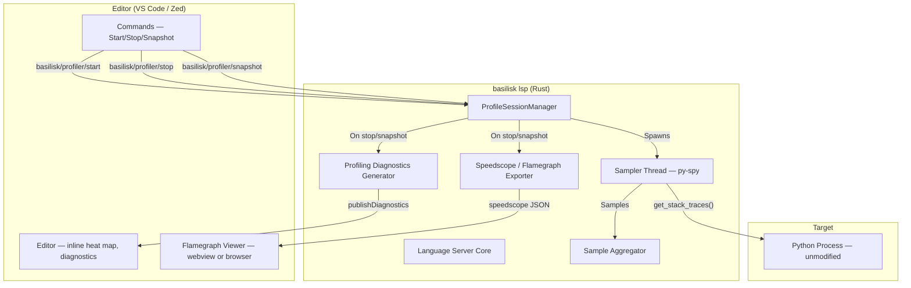
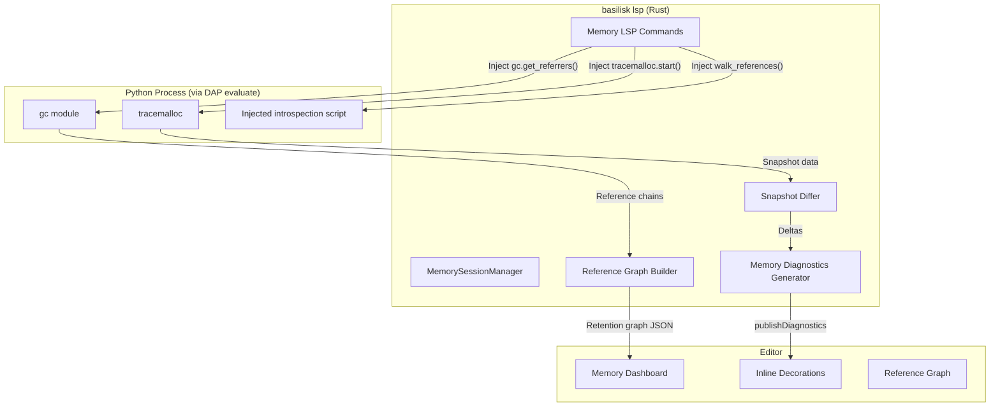

# Basilisk Profiling — Specification

## Goal {#PROFILE-GOAL}

Embed a state-of-the-art Python profiler directly into the Basilisk LSP. No `pip install`. No separate tool. One binary does type checking, debugging, and profiling. The profiler attaches to running Python processes, samples call stacks, and surfaces hotspots inline in the editor — VS Code and Zed.

## Why py-spy {#PROFILE-PYSPY}

py-spy is a **Rust crate on crates.io**. Basilisk is Rust. This is the only Python profiler that can be embedded as a library dependency in a Rust project.

| Property | py-spy | Scalene | Memray | Austin |
|---|---|---|---|---|
| Language | **Rust** | Python/C++ | C++ | C |
| Embeddable as Rust crate | **Yes** | No | No | No |
| Attaches externally | **Yes** | No | No | Yes |
| Modifies target | **No** | Yes | Yes | No |
| Overhead | **~2%** | ~5-30% | High | ~2% |
| CPU / Memory profiling | **Yes** / No | Yes / Yes | No / Yes | Yes / No |

py-spy reads the target process's memory directly via OS calls (`vm_read` on macOS, `process_vm_readv` on Linux, `ReadProcessMemory` on Windows). It resolves the CPython interpreter state and walks `PyFrameObject` chains to build stack traces. Zero injection, zero instrumentation, zero overhead on the target.

## Architecture {#PROFILE-ARCH}



### Core Components {#PROFILE-COMPONENTS}

**`ProfileSessionManager`** — Owns active profiling sessions. One session per PID. Handles start/stop/snapshot lifecycle. Lives in the LSP server alongside `DebugSessionManager`.

**`Sampler` thread** — A dedicated OS thread per profiling session. Calls `py_spy::PythonSpy::get_stack_traces()` in a loop at the configured sample rate. Sends samples to the aggregator via `mpsc` channel.

**`SampleAggregator`** — Accumulates stack traces into a per-file, per-line hit count map. Tracks total samples, per-function samples, and per-line samples. Thread-safe (receives from channel, queried from LSP thread).

**`SpeedscopeExporter`** — Converts aggregated samples into speedscope JSON format.

**`ProfilingDiagnosticsGenerator`** — Converts aggregated samples into LSP diagnostics. Each hot line becomes a `Diagnostic` with severity `Hint` and a message like `"38.2% CPU (412 samples)"`. Publishes via `textDocument/publishDiagnostics`.

## py-spy Rust API {#PROFILE-API}

The profiler uses `py-spy` (crate version 0.4) for stack sampling. See [py-spy docs](https://github.com/benfred/py-spy) for the Rust API.

### Platform Permissions {#PROFILE-PERMS}

| Platform | Requirement | Impact |
|---|---|---|
| macOS | **Root required** (`vm_read` needs task port) | Must spawn privileged helper or use `sudo` |
| Linux | Root, or `ptrace_scope=0`, or profiling own child | Works without root if `ptrace_scope` is relaxed |
| Windows | No elevation for processes you own | Works out of the box |

**macOS mitigation**: The LSP spawns a small helper binary (`basilisk-profiler-helper`) via `osascript` or `security authorizationdb` to get elevated privileges. It communicates with the LSP over a Unix socket. If the Python process was spawned by Basilisk's debug session manager, the LSP already has the child PID and can trace it directly (parent can trace child on macOS without root).

## LSP Protocol {#PROFILE-PROTOCOL}

### Custom Requests {#PROFILE-REQUESTS}

#### basilisk/profiler/start {#PROFILE-REQUESTS-START}

Start profiling a Python process.

| Field | Type | Required | Description |
|---|---|---|---|
| `pid` | `number` | No | Target PID. If omitted, uses active debug session or auto-detects. |
| `sampleRate` | `number` | No | Samples per second (default: 100) |
| `includeNative` | `boolean` | No | Include C extension frames (default: false) |
| `duration` | `number` | No | Auto-stop after N seconds (default: null = manual stop) |

**Response fields:** `sessionId`, `pid`, `pythonVersion`, `startedAt`.

**Error codes:** `-32001` (process not found), `-32002` (not Python), `-32003` (permission denied), `-32004` (already profiling).

#### basilisk/profiler/stop {#PROFILE-REQUESTS-STOP}

Stop profiling and return results.

| Field | Type | Required | Description |
|---|---|---|---|
| `sessionId` | `string` | Yes | Session to stop |
| `format` | `string` | No | `"speedscope"` (default), `"flamegraph"` (SVG), `"summary"` (text) |

**Response fields:** `sessionId`, `duration`, `totalSamples`, `outputFile`, `hotFunctions[]` (name, file, line, samples, percentage, selfPercentage), `hotLines[]` (file, line, samples, percentage).

#### basilisk/profiler/snapshot {#PROFILE-REQUESTS-SNAPSHOT}

Take a point-in-time snapshot without stopping the session. Same response as `stop`, but profiling continues.

#### basilisk/profiler/list {#PROFILE-REQUESTS-LIST}

List active profiling sessions. Returns `sessions[]` with `sessionId`, `pid`, `startedAt`, `sampleCount`, `duration`.

### LSP Notifications {#PROFILE-NOTIFICATIONS}

#### basilisk/profiler/diagnostics {#PROFILE-NOTIFICATIONS-DIAG}

After `stop` or `snapshot`, the LSP publishes profiling diagnostics for every file in the samples via `textDocument/publishDiagnostics`. Profiling diagnostics use severity `Hint` (4) and source `"basilisk-profiler"` so they don't pollute error/warning counts.

#### basilisk/profiler/progress {#PROFILE-NOTIFICATIONS-PROGRESS}

Periodic notification during active profiling with `sessionId`, `sampleCount`, `duration`, `topFunction`. Editors display this in a status indicator.

## Sample Aggregation {#PROFILE-AGGREGATION}

### Data Structures {#PROFILE-AGGREGATION-STRUCTS}

```rust
/// Accumulated profiling data for a single session
struct ProfileData {
    /// file path -> line number -> sample count
    line_hits: HashMap<String, HashMap<i32, u64>>,
    /// file path -> function name -> FunctionStats
    function_stats: HashMap<String, HashMap<String, FunctionStats>>,
    total_samples: u64,
    thread_samples: HashMap<u64, u64>,
    /// Raw frame list for speedscope export (frame index dedup)
    frame_index: HashMap<(String, String, i32), usize>,
    frames: Vec<SpeedscopeFrame>,
    /// Per-thread sample stacks (indices into frames)
    thread_stacks: HashMap<u64, Vec<Vec<usize>>>,
    thread_weights: HashMap<u64, Vec<f64>>,
}

struct FunctionStats {
    name: String,
    file: String,
    line: i32,
    /// Samples where this function appears anywhere in the stack
    total_samples: u64,
    /// Samples where this function is the leaf (top of stack)
    self_samples: u64,
}
```

### Aggregation Logic {#PROFILE-AGGREGATION-LOGIC}

For each `get_stack_traces()` call:

1. For each thread's `StackTrace`:
   - Skip if `!trace.active && !config.include_idle`
   - For each `Frame` in the stack: increment `line_hits` and `function_stats.total_samples`
   - The leaf frame (index 0) also gets `self_samples` incremented
   - Record the stack as frame indices for speedscope export
2. Increment `total_samples`

### Hotspot Threshold {#PROFILE-AGGREGATION-THRESHOLD}

Only lines/functions above a configurable threshold generate diagnostics:

- **Line threshold**: 1% of total samples (default)
- **Function threshold**: 2% of total samples (default)
- **Maximum diagnostics per file**: 20 (to avoid flooding)

## Speedscope Export {#PROFILE-SPEEDSCOPE}

### Mapping {#PROFILE-SPEEDSCOPE-MAPPING}

Output conforms to the [speedscope file format schema](https://www.speedscope.app/file-format-schema.json).

| py-spy | Speedscope |
|---|---|
| `Frame { name, filename, line }` | `shared.frames[i] { name, file, line }` |
| Each `get_stack_traces()` call | One entry in `samples` per thread |
| `1.0 / sampling_rate` | Each entry in `weights` |
| `StackTrace.thread_name` | `profiles[i].name` |
| Frames deduplicated by `(name, filename, line)` | Index into `shared.frames` |

Stacks in speedscope are root-first (callers before callees). py-spy returns leaf-first. Reverse the frame order when building `samples` entries.

## Flamegraph SVG Export {#PROFILE-FLAMEGRAPH}

For direct SVG flamegraph output, use the `inferno` crate (Rust port of Brendan Gregg's FlameGraph). Convert aggregated stacks to collapsed format and pipe through `inferno::flamegraph::from_lines()`.

## Visualization {#PROFILE-VIS}

### Brand Palette for Profiling {#PROFILE-VIS-PALETTE}

| Token | Hex | Usage |
|---|---|---|
| `--prof-critical` | `#e8500a` | >20% CPU — Basilisk orange |
| `--prof-hot` | `#f97316` | 10-20% CPU |
| `--prof-warm` | `#fbbf24` | 5-10% CPU |
| `--prof-cool` | `#4a5468` | 1-5% CPU |
| `--prof-idle` | `#1a1f2e` | <1% — background blend |
| `--prof-mem-critical` | `#c084fc` | Memory hotspot — purple |
| `--prof-mem-leak` | `#f87171` | Memory leak detected — red |
| `--prof-success` | `#34d399` | Freed / resolved — green |
| `--prof-bg` | `#0a0c12` | Panel background |
| `--prof-surface` | `#141820` | Card/chart background |
| `--prof-text` | `#f0f2f7` | Primary text |
| `--prof-text-secondary` | `#8892a4` | Secondary text |

### Typography {#PROFILE-VIS-TYPOGRAPHY}

- **Headings**: Space Grotesk 600
- **Labels / Data**: Space Grotesk 500
- **Code / Filenames**: JetBrains Mono 400
- **Numbers / Percentages**: JetBrains Mono 500

### Animation Principles {#PROFILE-VIS-ANIMATION}

- Entry: 200ms ease-out, charts fade in at 95%-100% scale, numbers count up from 0
- Transitions: 120ms ease for hover, 200ms ease for view switches
- Live updates: smooth interpolation, no jarring jumps
- Loading: pulsing Basilisk orange glow, no spinners

### Chart Components {#PROFILE-VIS-CHARTS}

All charts rendered in Canvas 2D (no heavy dependencies like d3).

**Flamegraph**: Frames colored by self-time percentage. Hover for tooltip, click to navigate to source, zoom to subtrees with breadcrumb trail, search to highlight matching frames.

**Donut Chart**: Top 5 functions by CPU %, center shows total sample count. Click a slice to filter flamegraph.

**Timeline**: Smooth bezier curves per function over time. Hover for crosshair, click+drag to zoom time range. Live mode extends rightward during active profiling.

**Sunburst Chart**: Radial layout with root at center. Arc width proportional to total time, color by self-time.

**Memory Leak Retention Graph**: Interactive force-directed graph of object references. Nodes sized by retained memory, cycles highlighted in red with pulsing animation.

**GIL Contention Gauge**: Animated arc gauge. Green (<10%), amber (10-30%), red (>30%). Real-time updates during live profiling.

### Inline Heat Map {#PROFILE-VIS-HEATMAP}

Hot lines get colored decorations in the editor gutter:

| Level | Color | Threshold |
|---|---|---|
| Critical | `#e8500a` Basilisk Orange | >20% |
| Hot | `#f97316` Light Orange | 10-20% |
| Warm | `#fbbf24` Amber | 5-10% |
| Cool | `#4a5468` Muted | 1-5% |

Memory profiling uses the purple palette for a separate decoration track showing allocation sizes and leak warnings.

### Profiler Dashboard {#PROFILE-VIS-DASHBOARD}

Full dashboard with summary cards (samples, duration, threads), donut chart, timeline, flamegraph, and hot functions table. All charts are interactive and cross-linked. Updates live during active profiling.

## Editor Integration {#PROFILE-EDITOR}

### VS Code {#PROFILE-EDITOR-VSCODE}

See [VSIX-SPEC.md](VSIX-SPEC.md) for VS Code-specific profiling UX.

**Commands:** `basilisk.profileStart`, `basilisk.profileStop`, `basilisk.profileSnapshot`, `basilisk.profileAttachToDebug`.

**Flamegraph Webview:** Full dashboard with all chart types, Basilisk design system, source navigation, export as PNG/SVG.

**Status Bar:** Shows profiling state with pulsing orange dot. Click to stop.

### Zed {#PROFILE-EDITOR-ZED}

See [ZED-SPEC.md](ZED-SPEC.md) for Zed-specific profiling UX.

Zed's limited extension API means profiling works through LSP diagnostics (hot lines as `Hint`) and slash commands (`/profile`, `/profstop`). Flamegraph via speedscope in browser.

### Shared Code {#PROFILE-EDITOR-SHARED}

| Component | Code Location | Used By |
|---|---|---|
| py-spy sampling | `basilisk-lsp/src/profiler/sampler.rs` | Both |
| Sample aggregation | `basilisk-lsp/src/profiler/aggregator.rs` | Both |
| Speedscope export | `basilisk-lsp/src/profiler/export.rs` | Both |
| Flamegraph SVG | `basilisk-lsp/src/profiler/flamegraph.rs` | Both |
| LSP commands | `basilisk-lsp/src/profiler/commands.rs` | Both |
| Diagnostic generation | `basilisk-lsp/src/profiler/diagnostics.rs` | Both |
| Webview flamegraph | `vscode-extension/src/flamegraph/` | VS Code only |
| Slash command handler | `basilisk-zed/src/lib.rs` | Zed only |

100% of the profiler engine is shared. Editors differ only in visualization.

## Memory Profiling & Leak Detection {#PROFILE-MEMORY}

### Overview {#PROFILE-MEMORY-OVERVIEW}

Built on two engines:

1. **tracemalloc** (Python stdlib) — per-line allocation tracking, allocation flamegraphs, growth-over-time analysis
2. **gc + objgraph introspection** (Python stdlib + DAP evaluate) — reference graph walking, cycle detection, retention chain analysis, leak identification

Together they answer: **what allocated the memory, how much, and what's holding on to it.**

### Architecture {#PROFILE-MEMORY-ARCH}



### How It Works {#PROFILE-MEMORY-HOWTO}

Memory profiling requires an active **debug session** (debugpy). The LSP injects Python code into the running process via DAP `evaluate` requests.

1. **Start tracking**: Inject `tracemalloc.start(25)` (25-frame deep tracebacks) and `gc.set_debug(gc.DEBUG_SAVEALL)`.
2. **Take snapshots**: Inject code to call `tracemalloc.take_snapshot()` and serialize top allocations as JSON via a `__BASILISK_MEM__` marker.
3. **Diff snapshots**: Compare two snapshots to find growing allocations (suspected leaks), new allocations, and freed allocations. Lines that consistently grow across multiple diffs are flagged as suspected leaks.
4. **Walk reference graph**: Inject an introspection script that uses `gc.get_referrers()` to walk the reference graph for a target object type, building a node/edge graph with cycle detection. This answers "why won't this object die?"

### LSP Commands {#PROFILE-MEMORY-COMMANDS}

| Command | Request Fields | Response Summary |
|---|---|---|
| `basilisk/memory/start` | `sessionId`, `tracebackDepth` (default 25), `snapshotInterval` (optional auto-snapshot) | `memorySessionId`, `tracingStarted`, `currentMemory`, `peakMemory` |
| `basilisk/memory/snapshot` | `memorySessionId` | `snapshotId`, `currentMemory`, `peakMemory`, `gcObjects`, `gcCounts`, `topAllocations[]` |
| `basilisk/memory/diff` | `memorySessionId`, `snapshot1`, `snapshot2` | `totalGrowth`, `totalFreed`, `netGrowth`, `suspectedLeaks[]`, `grownAllocations[]`, `freedAllocations[]` |
| `basilisk/memory/references` | `memorySessionId`, `targetType`, `targetReprContains`, `maxDepth`, `maxNodes`, `direction` (`referrers`/`referents`/`both`) | `graph` with `nodes[]`, `edges[]`, `cycles[]`, `retentionPath[]` |
| `basilisk/memory/objectsByType` | `memorySessionId`, `typeName`, `sortBy`, `limit` | `objects[]` (id, type, size, refcount, repr, createdAt), `totalCount`, `totalSize`, `typeSummary` |
| `basilisk/memory/gcCollect` | `memorySessionId` | `collected`, `uncollectable`, `memoryFreed`, `uncollectableObjects[]` |

### Reference Graph Visualization {#PROFILE-MEMORY-VIS-REFGRAPH}

The reference graph answers "what is holding on to this?" Force-directed layout with physics simulation:

- **Node sizing**: proportional to `log(size)`
- **Node coloring**: target objects in purple, root retainers in blue, intermediate containers in gray, cyclic objects in red with pulsing animation
- **Edge labels**: show reference type (`.attribute`, `['key']`, `[index]`)
- **Interactions**: hover for tooltip, click to expand referrers/referents, right-click to navigate to creation site
- **Cycle highlighting**: thick red edges, pulsing animation, banner explaining `__del__` implications
- **Layout modes**: force-directed (default), tree, radial

### Leak Confidence Scoring {#PROFILE-MEMORY-CONFIDENCE}

| Confidence | Criteria | Color |
|---|---|---|
| **Definite** | Object has `__del__` and is in a reference cycle (uncollectable) | Red, solid |
| **High** | Consistent growth across 3+ consecutive snapshot diffs | Red, dashed |
| **Medium** | Growth in 2 consecutive diffs, or >10 MB single-diff growth | Amber |
| **Low** | Single-diff growth, small size, possible cache warmup | Gray |

### Diagnostic Codes {#PROFILE-MEMORY-CODES}

| Code | Severity | Meaning |
|---|---|---|
| `BSK-MEM-ALLOC` | Hint | Top allocation site (above threshold) |
| `BSK-MEM-GROWTH` | Warning | Memory growth between snapshots |
| `BSK-MEM-LEAK` | Warning | Suspected memory leak (high confidence) |
| `BSK-MEM-CYCLE` | Error | Reference cycle with `__del__` — definite leak |
| `BSK-MEM-UNCOLLECTABLE` | Error | gc reports uncollectable object |

### CPU+Memory Integration {#PROFILE-MEMORY-CPU-INTEGRATION}

CPU and memory profiling can run simultaneously. Dashboard shows dual heat maps (orange CPU, purple memory), correlated flamegraphs, and a "Hot and Heavy" filter for functions that are both CPU-intensive and memory-intensive.

### Shared Code {#PROFILE-MEMORY-SHARED}

| Component | Code Location |
|---|---|
| tracemalloc injection scripts | `basilisk-lsp/src/profiler/memory/scripts.rs` |
| Reference graph walker script | `basilisk-lsp/src/profiler/memory/refgraph.rs` |
| Snapshot diffing | `basilisk-lsp/src/profiler/memory/diff.rs` |
| Leak confidence scoring | `basilisk-lsp/src/profiler/memory/leaks.rs` |
| Memory diagnostics | `basilisk-lsp/src/profiler/memory/diagnostics.rs` |
| LSP memory commands | `basilisk-lsp/src/profiler/memory/commands.rs` |
| Reference graph webview | `vscode-extension/src/profiler/refgraph/` (VS Code only) |

## Permissions Model {#PROFILE-PERMISSIONS}

### macOS {#PROFILE-PERMISSIONS-MACOS}

`vm_read` requires root, child-process relationship, `com.apple.security.get-task-allow` entitlement, or SIP disabled.

1. **Debug session profiling (no elevation):** Parent can trace child on macOS. This is the primary UX.
2. **External process profiling (elevation):** Spawn `basilisk-profiler-helper` via `osascript` with admin privileges. Helper runs as root, streams samples back over Unix domain socket.

### Linux {#PROFILE-PERMISSIONS-LINUX}

Works without root if `ptrace_scope=0`. Options for restricted environments: `sudo`, `setcap cap_sys_ptrace+ep`, or profile child processes only.

### Windows {#PROFILE-PERMISSIONS-WINDOWS}

`ReadProcessMemory` works without elevation for same-user processes.

## Configuration {#PROFILE-CONFIG}

```json
{
    "basilisk": {
        "profiler": {
            "enabled": true,
            "sampleRate": 100,
            "includeNative": false,
            "includeIdle": false,
            "hotLineThreshold": 1.0,
            "hotFunctionThreshold": 2.0,
            "maxDiagnosticsPerFile": 20,
            "outputDirectory": "/tmp",
            "autoOpenFlamegraph": true
        }
    }
}
```

### Diagnostic Codes {#PROFILE-CONFIG-CODES}

| Code | Severity | Meaning |
|---|---|---|
| `BSK-PROF-LINE` | Hint | Hot line (above threshold) |
| `BSK-PROF-FUNC` | Hint | Hot function (above threshold) |
| `BSK-PROF-GIL` | Info | GIL contention detected |

## Error Handling {#PROFILE-ERRORS}

| Scenario | Code | Recovery |
|---|---|---|
| PID not found | -32001 | User re-enters PID |
| Not a Python process | -32002 | User checks PID |
| Permission denied | -32003 | Elevation or debug mode |
| Already profiling | -32004 | Stop first, or snapshot |
| Process exited during profiling | N/A | Auto-stops, partial results returned |
| Unsupported Python version | -32005 | Upgrade to 3.3+ |

## Performance Targets {#PROFILE-PERF}

| Metric | Target |
|---|---|
| Sampling overhead on target | <3% CPU |
| LSP memory for 10-minute session at 100Hz | <50 MB |
| Time to generate diagnostics from 60K samples | <100ms |
| Speedscope export for 60K samples | <200ms |
| Flamegraph SVG for 60K samples | <500ms |

## Testing Strategy {#PROFILE-TESTING}

### Unit Tests {#PROFILE-TESTING-UNIT}

- `aggregator.rs`: Verify hit counts, function stats, threshold filtering
- `export.rs`: Verify speedscope JSON matches schema, frame deduplication, stack reversal
- `diagnostics.rs`: Verify diagnostic message format, severity, threshold filtering

### Integration Tests {#PROFILE-TESTING-INTEGRATION}

- Start a known Python script, attach profiler, verify hot function matches expected bottleneck
- Profile a debug session, verify PID auto-detection
- Verify speedscope output opens correctly in speedscope.app
- Verify diagnostics appear for hot lines and disappear after clearing

### E2E Tests {#PROFILE-TESTING-E2E}

- **VS Code**: Command palette profile attach, debug session profiling, inline decorations
- **Zed**: `/profile` and `/profstop` slash commands, hint diagnostics

### Platform Tests {#PROFILE-TESTING-PLATFORM}

- macOS: privilege escalation prompt for external process, debug-session profiling without elevation
- Linux: ptrace_scope handling
- Windows: no-elevation profiling
