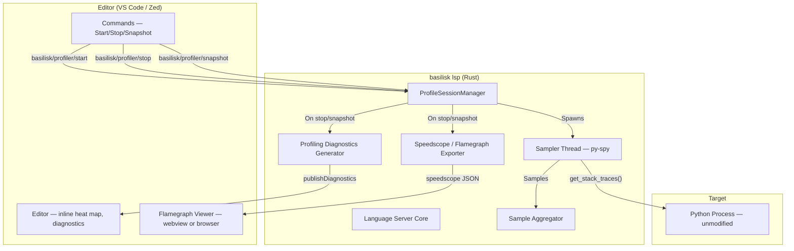
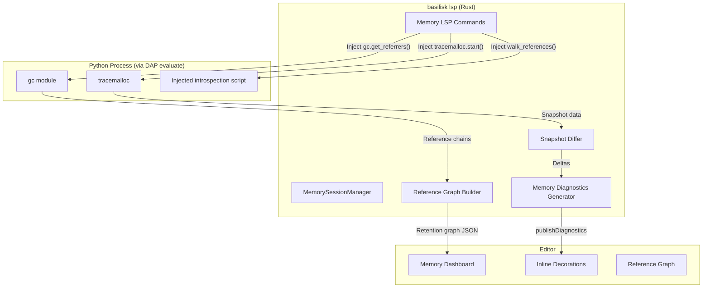

# Basilisk Profiling — Specification {#LSPPROF}

## Goal {#PROFILE-GOAL}

Embed a state-of-the-art Python profiler directly into the Basilisk LSP. No `pip install`. No separate tool. One binary does type checking, debugging, and profiling. The profiler attaches to running Python processes, samples call stacks, and surfaces hotspots inline in the editor — VS Code and Zed.

## UI Availability Gate {#PROFILE-UI-GATE}

The profiler is complete in the LSP, but its VS Code surfaces are hidden from shipped users until the end-to-end experience is reliable — an entry point that errors or does nothing is worse first-run UX than none.

A single switch, `isProfilingUiEnabled(context)` (`vscode-extension/src/profiling-ui.ts`), returns `true` only under test (`ExtensionMode.Test`) and `false` in shipped and dev-host sessions, so the suite still exercises the full UI. `extension.ts` mirrors it into the `basilisk.profilingEnabled` context key that every profiling `when` clause keys off; `memory-profiler.ts` reads it for the one surface no `when` clause can reach (the memory status-bar item). Nothing is removed — all commands stay advertised ([PROFILE-REQUESTS]) and registered. To ship profiling, return `true` unconditionally and drop the gate.

## Why py-spy {#PROFILE-PYSPY}

py-spy is a **Rust crate on crates.io**. Basilisk is Rust. This is the only Python profiler that can be embedded as a library dependency in a Rust project.

| Property | py-spy | Scalene | Memray | Austin |
|---|---|---|---|---|
| Language | **Rust** | Python/C++ | C++ | C |
| Embeddable as Rust crate | **Yes** | No | No | No |
| Attaches externally | **Yes** | No | No | Yes |
| Modifies target | **No** | Yes | Yes | No |
| Overhead | **~2%** | ~5-30% | High | ~2% |
| CPU / Memory profiling | **Yes** / No | Yes / Yes | No / Yes | Yes / No |

py-spy reads the target process's memory directly via OS calls (`vm_read` on macOS, `process_vm_readv` on Linux, `ReadProcessMemory` on Windows). It resolves the CPython interpreter state and walks `PyFrameObject` chains to build stack traces. Zero injection, zero instrumentation, zero overhead on the target.

## Architecture {#PROFILE-ARCH}



### Core Components {#PROFILE-COMPONENTS}

**`ProfileSessionManager`** — Owns active profiling sessions. One session per PID. Handles start/stop/snapshot lifecycle. Lives in the LSP server alongside `DebugSessionManager`.

**`Sampler` thread** — A dedicated OS thread per profiling session. Calls `py_spy::PythonSpy::get_stack_traces()` in a loop at the configured sample rate. Sends samples to the aggregator via `mpsc` channel.

**`SampleAggregator`** — Accumulates stack traces into a per-file, per-line hit count map. Tracks total samples, per-function samples, and per-line samples. Thread-safe (receives from channel, queried from LSP thread).

**`SpeedscopeExporter`** — Converts aggregated samples into speedscope JSON format.

**`ProfilingDiagnosticsGenerator`** — Converts aggregated samples into LSP diagnostics. Each hot line becomes a `Diagnostic` with severity `Hint` and a message like `"38.2% CPU (412 samples)"`. Publishes via `textDocument/publishDiagnostics`.

## py-spy Rust API {#PROFILE-API}

The profiler uses `py-spy` (crate version 0.4) for stack sampling. See [py-spy docs](https://github.com/benfred/py-spy) for the Rust API.

### Platform Permissions {#PROFILE-PERMS}

| Platform | Requirement | Impact |
|---|---|---|
| macOS | **Root required** (`vm_read` needs task port) | Must spawn privileged helper or use `sudo` |
| Linux | Root, or `ptrace_scope=0`, or profiling own child | Works without root if `ptrace_scope` is relaxed |
| Windows | No elevation for processes you own | Works out of the box |

**macOS mitigation**: For a process Basilisk launched (a child), the LSP already holds the child PID and traces it directly (parent traces child, no root). For any other process — *including a same-user process started in another terminal* — the LSP spawns a small helper binary (`basilisk-profiler-helper`) via `osascript` to get elevated privileges; the helper runs as root and streams samples back over a Unix socket. See [#PROFILE-PERMISSIONS-MACOS], [#PROFILE-HELPER-PROTOCOL], and [#PROFILE-HELPER-SOCKET].

## LSP Protocol {#PROFILE-PROTOCOL}

### Custom Requests {#PROFILE-REQUESTS}

#### basilisk/profiler/start {#PROFILE-REQUESTS-START}

Start profiling a Python process.

| Field | Type | Required | Description |
|---|---|---|---|
| `pid` | `number` | **Yes** | Target PID. The editor obtains it from [`basilisk.profiler.processes`](#PROFILE-PROCESSES-LSP) (the Python Processes panel) or, for the active debug session, from the captured debuggee PID (see [#PROFILE-SAME-PROCESS]). There is **no** silent auto-detect. |
| `sampleRate` | `number` | No | Samples per second (default: 100) |
| `includeNative` | `boolean` | No | Include C extension frames (default: false) |
| `duration` | `number` | No | Auto-stop after N seconds (default: null = manual stop) |

A missing `pid` is rejected with `-32001` — earlier revisions of this spec
claimed an "auto-detect when omitted", but none was ever implemented (#62). PID
discovery is now an explicit, user-visible step.

#### Profiling the debug session's process {#PROFILE-SAME-PROCESS}

The profiler and debugger **use the same process**. Because the LSP holds no DAP
connection, it never learns the debuggee's OS PID directly (it spawns
`debugpy.adapter`; debugpy spawns the debuggee later). Instead the editor captures
it: the DAP proxy (`vscode-extension/src/dap-proxy.ts`) intercepts debugpy's
`process` event (`body.systemProcessId`) and stores `sessionId → pid` in the
extension store; "Profile Debug Session" (`basilisk.profileAttachToDebug`) then
calls `basilisk.profiler.start` with that concrete `pid`. The LSP profiler stays
PID-based — **no server-side `debugSession`→PID resolution** — and the existing
privilege layer ([#PROFILE-PERMISSIONS]) routes the attach: child/same-user →
in-process py-spy (Linux/Windows), external/grandchild → elevated helper (macOS).

**Response fields:** `sessionId`, `pid`, `pythonVersion`, `startedAt`.

**Error codes:** `-32001` (process not found), `-32002` (not Python), `-32003` (permission denied), `-32004` (already profiling).

#### basilisk/profiler/stop {#PROFILE-REQUESTS-STOP}

Stop profiling and return results.

| Field | Type | Required | Description |
|---|---|---|---|
| `sessionId` | `string` | Yes | Session to stop |
| `format` | `string` | No | `"speedscope"` (default), `"flamegraph"` (SVG), `"summary"` (text) |

**Response fields:** `sessionId`, `duration`, `totalSamples`, `outputFile`, `flamegraphPath`, `cpuProfilePath`, `exportError`, `hotFunctions[]` (name, file, line, samples, percentage, selfPercentage), `hotLines[]` (file, line, samples, percentage).

- `flamegraphPath` — the local self-contained flamegraph SVG, always attempted
  regardless of `format` so every editor has a viewer that needs no network
  access ([PROFILE-FLAMEGRAPH]).
- `exportError` — set when any export was refused or failed
  ([PROFILE-SPEEDSCOPE-VALIDATE]); a failed export is never silent. Editors
  must surface it to the user.

#### basilisk/profiler/snapshot {#PROFILE-REQUESTS-SNAPSHOT}

Take a point-in-time snapshot without stopping the session. Same response as `stop`, but profiling continues.

#### basilisk/profiler/list {#PROFILE-REQUESTS-LIST}

List active profiling sessions. Returns `sessions[]` with `sessionId`, `pid`, `startedAt`, `sampleCount`, `duration`.

### LSP Notifications {#PROFILE-NOTIFICATIONS}

#### basilisk/profiler/diagnostics {#PROFILE-NOTIFICATIONS-DIAG}

After `stop` or `snapshot`, the LSP publishes profiling diagnostics for every file in the samples via `textDocument/publishDiagnostics`. Profiling diagnostics use severity `Hint` (4) and source `"basilisk-profiler"` so they don't pollute error/warning counts.

#### basilisk/profiler/progress {#PROFILE-NOTIFICATIONS-PROGRESS}

Periodic notification during active profiling with `sessionId`, `sampleCount`, `duration`, `topFunction`. Editors display this in a status indicator.

## Process Enumeration & Selection {#PROFILE-PROCESSES}

Starting a profile must never require the user to hand-type a PID (#62). The LSP
owns process **discovery**; editors only render it. This section defines the
enumeration command, its data model, and the panel/launch UX that replaces the
old raw PID input box. Design + phased TODO: [LSP-PROFILER-PROCESS-PANEL-PLAN.md](../plans/LSP-PROFILER-PROCESS-PANEL-PLAN.md) `{#PROFPANEL-PLAN}`.

### basilisk.profiler.processes {#PROFILE-PROCESSES-LSP}

A `workspace/executeCommand` request that returns every attachable Python
process. It takes no required arguments and responds with
`{ "processes": ProcessInfo[] }`, sorted by CPU usage descending.

Enumeration **only reads the OS process table** and therefore never requires
elevation — discovery works without `sudo`, which is the whole point. It is
implemented in [`processes.rs`](../../crates/basilisk-lsp/src/profiler/processes.rs)
over the `sysinfo` crate and is advertised in `executeCommandProvider` like every
other Basilisk command (editors must not pre-register it — see
[LSP-ARCHITECTURE-SPEC.md] command registration rule).

### ProcessInfo {#PROFILE-PROCESSES-MODEL}

Each entry in the `processes[]` response:

| Field (JSON) | Type | Notes |
|---|---|---|
| `pid` | number | Process id |
| `ppid` | number | Parent pid (`0` if unknown) — enables "group by parent" |
| `name` | string | Process name, e.g. `python3.12` |
| `interpreterPath` | string \| null | Resolved interpreter executable path |
| `script` | string \| null | Best-effort target script (first positional arg) |
| `pythonVersion` | string \| null | e.g. `3.12.13`; `null` ⇒ render `—` |
| `cpuPercent` | number | Instantaneous CPU% (may exceed 100 across cores) |
| `memoryBytes` | number | Resident memory in bytes |
| `runtimeSecs` | number | Seconds since process start |
| `user` | string \| null | Owner login name |
| `requiresElevation` | boolean | `true` if not owned by the current user |
| `kind` | `"interpreter"` \| `"launcher"` | Bare interpreter vs. launcher |

**Detection:** a process is "Python" when its name, interpreter exe basename, or
`argv[0]` basename matches `python`, `python3`, `pythonX.Y`, or `pypy`. Known
launchers (uvicorn, gunicorn, pytest, celery, flask, hypercorn, daphne, uwsgi,
sanic) running on a Python interpreter are included and tagged `kind = "launcher"`
so they are still offered for profiling rather than hidden.

**Version resolution:** `pythonVersion` is resolved server-side — an exact
version from `<exe> --version` (cached per interpreter, bounded per enumeration),
falling back to the `pythonX.Y` path pattern, then `null`.

**`requiresElevation`** is a *hint* for the panel's lock badge; the authoritative
permission check still happens at attach time (see [#PROFILE-PERMISSIONS]).

**Logging:** only the process *count* is logged. Command lines and user names may
contain secrets/PII and are never logged (CLAUDE.md logging standards).

### basilisk/profiler/processesChanged {#PROFILE-PROCESSES-NOTIFY}

Reserved notification for pushing lazily-resolved interpreter versions to the
editor after an enumeration returned them as `null`. v1 resolves versions inline
within the request's resolution budget, so this notification is currently
optional; editors treat its absence as "versions are already final".

### Python Processes panel {#PROFILE-PROCESSES-PANEL}

VS Code contributes a `basilisk.pythonProcesses` tree view in the
`basilisk-explorer` activity-bar container, implemented in
[`process-explorer.ts`](../../vscode-extension/src/process-explorer.ts). It calls
`basilisk.profiler.processes` and renders one row per process:

- **label** `python3.12 — app.py` · **description** `PID 82875 · 3.12.13 · 12.4% · 88 MB`
- **tooltip** interpreter path, script, user, runtime, elevation note
- **icon** a Python glyph, with a `$(lock)` badge when `requiresElevation`

Auto-refresh is gated on view visibility (interval from
`basilisk.profiler.processRefreshMs`, default 2000); a manual refresh button is
always present. An empty state (`viewsWelcome`) offers **Run & Profile Current File**.

#### Sort modes {#PROFILE-PROCESSES-PANEL-SORT}

CPU% (default, descending), Memory, PID, Name, Runtime, Python version.

#### Group modes {#PROFILE-PROCESSES-PANEL-GROUP}

None (flat), Python version, Interpreter, User, Parent process. Groups render as
collapsible parent nodes with a count badge.

### Launch from the panel {#PROFILE-PROCESSES-LAUNCH}

This is the headline fix for #62. Per-row inline buttons — **▶ Profile CPU**
(`basilisk.profileProcess`) and **🧠 Track Memory** (`basilisk.memoryTrackProcess`)
— start profiling with that row's `pid` in one click, **with no input box**. The
row context menu adds Copy PID and Reveal Script. The old palette command
`basilisk.profileStart` is **kept but rewritten**: instead of prompting for a PID
it focuses this panel and shows a toast ("Pick a process below"). The lying
"auto-detect" prompt is deleted.

## Sample Aggregation {#PROFILE-AGGREGATION}

### Data Structures {#PROFILE-AGGREGATION-STRUCTS}

```rust
/// Accumulated profiling data for a single session
struct ProfileData {
    /// file path -> line number -> sample count
    line_hits: HashMap<String, HashMap<i32, u64>>,
    /// file path -> function name -> FunctionStats
    function_stats: HashMap<String, HashMap<String, FunctionStats>>,
    total_samples: u64,
    thread_samples: HashMap<u64, u64>,
    /// Raw frame list for speedscope export (frame index dedup)
    frame_index: HashMap<(String, String, i32), usize>,
    frames: Vec<SpeedscopeFrame>,
    /// Per-thread sample stacks (indices into frames)
    thread_stacks: HashMap<u64, Vec<Vec<usize>>>,
    thread_weights: HashMap<u64, Vec<f64>>,
}

struct FunctionStats {
    name: String,
    file: String,
    line: i32,
    /// Samples where this function appears anywhere in the stack
    total_samples: u64,
    /// Samples where this function is the leaf (top of stack)
    self_samples: u64,
}
```

### Aggregation Logic {#PROFILE-AGGREGATION-LOGIC}

For each `get_stack_traces()` call:

1. For each thread's `StackTrace`:
   - Skip if `!trace.active && !config.include_idle`
   - For each `Frame` in the stack: increment `line_hits` and `function_stats.total_samples`
   - The leaf frame (index 0) also gets `self_samples` incremented
   - Record the stack as frame indices for speedscope export
2. Increment `total_samples`

### Hotspot Threshold {#PROFILE-AGGREGATION-THRESHOLD}

Only lines/functions above a configurable threshold generate diagnostics:

- **Line threshold**: 1% of total samples (default)
- **Function threshold**: 2% of total samples (default)
- **Maximum diagnostics per file**: 20 (to avoid flooding)

## Speedscope Export {#PROFILE-SPEEDSCOPE}

### Mapping {#PROFILE-SPEEDSCOPE-MAPPING}

Output conforms to the [speedscope file format schema](https://www.speedscope.app/file-format-schema.json).

| py-spy | Speedscope |
|---|---|
| `Frame { name, filename, line }` | `shared.frames[i] { name, file, line }` |
| Each `get_stack_traces()` call | One entry in `samples` per thread |
| `1.0 / sampling_rate` | Each entry in `weights` |
| `StackTrace.thread_name` | `profiles[i].name` |
| Frames deduplicated by `(name, filename, line)` | Index into `shared.frames` |

Stacks in speedscope are root-first (callers before callees). py-spy returns leaf-first. Reverse the frame order when building `samples` entries.

### Export Validation {#PROFILE-SPEEDSCOPE-VALIDATE}

speedscope.app's importer indexes `shared.frames` by every sample entry, walks
parallel `samples`/`weights` arrays, and reads `profiles[activeProfileIndex]`.
A file violating any of those invariants loads as "Something went wrong" in
the browser. The exporter therefore **refuses to write** (returns an error
instead) when:

- the session captured **zero samples** (`profiles: []` with
  `activeProfileIndex: 0` is unloadable);
- any weight is **non-finite or negative** (serde serializes NaN/∞ as `null`,
  which the importer rejects);
- any sample's **frame index is out of bounds** for `shared.frames`;
- a thread's `samples` and `weights` **lengths differ**.

The same validation guards the flamegraph SVG export. Tests assert the full
invariant set on every exported file, not just key presence
(`profiler_tests.rs::assert_speedscope_loadable`).

### Viewer Delivery {#PROFILE-VIEWER-DELIVERY}

`https://www.speedscope.app/#profileURL=<url>` only works for http(s) URLs the
browser may fetch from that origin. An https page can **never** read
`file://` URLs, so editors must never construct a speedscope.app link to a
local file — it always fails with "Something went wrong". Until profiles are
served over localhost HTTP with CORS, editors open the local flamegraph SVG
(`flamegraphPath`) directly and tell the user where the speedscope JSON lives
for manual import (drag-and-drop at speedscope.app).

## Flamegraph SVG Export {#PROFILE-FLAMEGRAPH}

For direct SVG flamegraph output, use the `inferno` crate (Rust port of Brendan Gregg's FlameGraph). Convert aggregated stacks to collapsed format and pipe through `inferno::flamegraph::from_lines()`.

## Native VS Code profile files {#PROFILE-NATIVE}

Both profilers also emit **V8 profile files** that VS Code's built-in profile
viewer opens natively (flame chart + bottom-up/left-heavy tables) — the same UI
as Node.js profiling (see <https://code.visualstudio.com/docs/nodejs/profiling>).
The editor opens them with `vscode.open`; the custom flamegraph/dashboard
webviews remain as fallbacks.

- **CPU → `.cpuprofile`** (`Profiler.Profile` schema):
  [`cpuprofile.rs`](../../crates/basilisk-lsp/src/profiler/cpuprofile.rs) merges the
  per-thread py-spy stacks into one call tree (`nodes` + `samples` + integer-µs
  `timeDeltas`, derived from the sample rate). Written on `profiler.stop`;
  the path is returned as `cpuProfilePath`.
- **Memory → `.heapprofile`** (`HeapProfiler.SamplingHeapProfile` schema):
  [`heapprofile.rs`](../../crates/basilisk-lsp/src/profiler/memory/heapprofile.rs)
  maps each `tracemalloc` site to a `head`-tree node with `selfSize`. Written on
  a snapshot ingest; the path is returned as `heapProfilePath`.

Line numbers are 0-based in V8; `url` is the source file path so the viewer can
navigate. `.heapsnapshot` is intentionally not produced (the built-in editor
doesn't render it).

## Visualization {#PROFILE-VIS}

### Brand Palette for Profiling {#PROFILE-VIS-PALETTE}

| Token | Hex | Usage |
|---|---|---|
| `--prof-critical` | `#e8500a` | >20% CPU — Basilisk orange |
| `--prof-hot` | `#f97316` | 10-20% CPU |
| `--prof-warm` | `#fbbf24` | 5-10% CPU |
| `--prof-cool` | `#4a5468` | 1-5% CPU |
| `--prof-idle` | `#1a1f2e` | <1% — background blend |
| `--prof-mem-critical` | `#c084fc` | Memory hotspot — purple |
| `--prof-mem-leak` | `#f87171` | Memory leak detected — red |
| `--prof-success` | `#34d399` | Freed / resolved — green |
| `--prof-bg` | `#0a0c12` | Panel background |
| `--prof-surface` | `#141820` | Card/chart background |
| `--prof-text` | `#f0f2f7` | Primary text |
| `--prof-text-secondary` | `#8892a4` | Secondary text |

### Typography {#PROFILE-VIS-TYPOGRAPHY}

- **Headings**: Space Grotesk 600
- **Labels / Data**: Space Grotesk 500
- **Code / Filenames**: JetBrains Mono 400
- **Numbers / Percentages**: JetBrains Mono 500

### Animation Principles {#PROFILE-VIS-ANIMATION}

- Entry: 200ms ease-out, charts fade in at 95%-100% scale, numbers count up from 0
- Transitions: 120ms ease for hover, 200ms ease for view switches
- Live updates: smooth interpolation, no jarring jumps
- Loading: pulsing Basilisk orange glow, no spinners

### Chart Components {#PROFILE-VIS-CHARTS}

All charts rendered in Canvas 2D (no heavy dependencies like d3).

**Flamegraph**: Frames colored by self-time percentage. Hover for tooltip, click to navigate to source, zoom to subtrees with breadcrumb trail, search to highlight matching frames.

**Donut Chart**: Top 5 functions by CPU %, center shows total sample count. Click a slice to filter flamegraph.

**Timeline**: Smooth bezier curves per function over time. Hover for crosshair, click+drag to zoom time range. Live mode extends rightward during active profiling.

**Sunburst Chart**: Radial layout with root at center. Arc width proportional to total time, color by self-time.

**Memory Leak Retention Graph**: Interactive force-directed graph of object references. Nodes sized by retained memory, cycles highlighted in red with pulsing animation.

**GIL Contention Gauge**: Animated arc gauge. Green (<10%), amber (10-30%), red (>30%). Real-time updates during live profiling.

### Inline Heat Map {#PROFILE-VIS-HEATMAP}

Hot lines get colored decorations in the editor gutter:

| Level | Color | Threshold |
|---|---|---|
| Critical | `#e8500a` Basilisk Orange | >20% |
| Hot | `#f97316` Light Orange | 10-20% |
| Warm | `#fbbf24` Amber | 5-10% |
| Cool | `#4a5468` Muted | 1-5% |

Memory profiling uses the purple palette for a separate decoration track showing allocation sizes and leak warnings.

### Profiler Dashboard {#PROFILE-VIS-DASHBOARD}

Full dashboard with summary cards (samples, duration, threads), donut chart, timeline, flamegraph, and hot functions table. All charts are interactive and cross-linked. Updates live during active profiling.

## Editor Integration {#PROFILE-EDITOR}

### VS Code {#PROFILE-EDITOR-VSCODE}

See [VSIX-SPEC.md](VSIX-SPEC.md) for VS Code-specific profiling UX.

**Commands:** `basilisk.profileStart`, `basilisk.profileStop`, `basilisk.profileSnapshot`, `basilisk.profileAttachToDebug`.

**Flamegraph Webview:** Full dashboard with all chart types, Basilisk design system, source navigation, export as PNG/SVG.

**Status Bar:** Shows profiling state with pulsing orange dot. Click to stop.

### Zed {#PROFILE-EDITOR-ZED}

See [ZED-SPEC.md](ZED-SPEC.md) for Zed-specific profiling UX.

Zed's limited extension API means profiling works through LSP diagnostics (hot lines as `Hint`) and slash commands (`/profile`, `/profstop`). Flamegraph via speedscope in browser.

### Shared Code {#PROFILE-EDITOR-SHARED}

| Component | Code Location | Used By |
|---|---|---|
| py-spy sampling | `basilisk-lsp/src/profiler/sampler.rs` | Both |
| Privilege check / sampler selection | `basilisk-lsp/src/profiler/privilege.rs` | Both |
| Elevated helper socket client | `basilisk-lsp/src/profiler/helper_client.rs` | Both |
| Elevated helper binary | `basilisk-profiler-helper/src/main.rs` | Both |
| Helper wire protocol | `basilisk-profiler-protocol/src/lib.rs` | Both |
| Sample aggregation | `basilisk-lsp/src/profiler/aggregator.rs` | Both |
| Speedscope export | `basilisk-lsp/src/profiler/export.rs` | Both |
| Flamegraph SVG | `basilisk-lsp/src/profiler/flamegraph.rs` | Both |
| LSP commands | `basilisk-lsp/src/profiler/commands.rs` | Both |
| Diagnostic generation | `basilisk-lsp/src/profiler/diagnostics.rs` | Both |
| Webview flamegraph | `vscode-extension/src/flamegraph/` | VS Code only |
| Slash command handler | `basilisk-zed/src/lib.rs` | Zed only |

100% of the profiler engine is shared. Editors differ only in visualization.

## Memory Profiling & Leak Detection {#PROFILE-MEMORY}

### Overview {#PROFILE-MEMORY-OVERVIEW}

Built on two engines:

1. **tracemalloc** (Python stdlib) — per-line allocation tracking, allocation flamegraphs, growth-over-time analysis
2. **gc + objgraph introspection** (Python stdlib + DAP evaluate) — reference graph walking, cycle detection, retention chain analysis, leak identification

Together they answer: **what allocated the memory, how much, and what's holding on to it.**

### Architecture {#PROFILE-MEMORY-ARCH}



### How It Works — Editor-as-Courier Round-Trip {#PROFILE-MEMORY-HOWTO}

Memory profiling requires an active **debug session** (debugpy). Crucially, **the
LSP holds no DAP connection — the editor does** (the editor connects directly to
debugpy; see [LSP-DEBUG-INTEGRATION-SPEC]). So the LSP cannot inject Python
itself. Instead, memory analysis is a **two-leg round-trip with the editor as
courier**, and debugpy can only `evaluate` against a **stopped** frame, so the
debuggee must be paused at a breakpoint:

1. **Leg 1 — LSP → editor (get script):** A `basilisk.memory.*` command returns a
   Python injection script (e.g. `tracemalloc.take_snapshot()` printing a
   `__BASILISK_MEM__`-prefixed JSON payload). The LSP performs no DAP I/O.
2. **Editor runs the script** in the paused debuggee via a DAP `evaluate` request
   (`vscode-extension/src/dap-evaluate.ts`), capturing the printed marker output.
3. **Leg 2 — editor → LSP (ingest):** The editor posts the raw output back via
   [`basilisk.memory.ingest`](#PROFILE-MEMORY-INGEST). The LSP marker-dispatches it
   to the matching parser, updates per-session state (the
   [`MemorySessionManager`](../../crates/basilisk-lsp/src/profiler/memory/session.rs)
   holds the cross-diff [`LeakTracker`] and timeline), **publishes memory
   diagnostics** via `textDocument/publishDiagnostics`, and returns the structured,
   `kind`-tagged result the editor renders (decorations, dashboard, reference graph).

The operations: **start tracking** (`tracemalloc.start(25)` + `gc.set_debug`),
**snapshots** (`__BASILISK_MEM__`), **diffs** (`__BASILISK_MEM_DIFF__`; lines that
grow across ≥3 consecutive diffs escalate to High confidence), **gc collect**
(`__BASILISK_MEM_GC__`), and **reference-graph walks** (`__BASILISK_MEM_REFS__`,
via `gc.get_referrers()` with cycle detection). The diff script self-seeds its
baseline (`tracemalloc._basilisk_prev_snapshot`) inside the debuggee, so
cross-snapshot baseline state lives in Python; the LSP keeps only leak-confidence
history and diagnostics.

This is identical for both editors — 100% of the engine is shared. Zed reaches the
same flow through `workspace/executeCommand`; only the script-running leg is
editor-specific.

### LSP Commands {#PROFILE-MEMORY-COMMANDS}

The `start`/`snapshot`/`diff`/`references`/`objectsByType`/`gcCollect` commands are
**leg 1** — they return `{ memorySessionId?, script }`. The editor runs the script
and posts the output to [`basilisk.memory.ingest`](#PROFILE-MEMORY-INGEST) (leg 2).

| Command | Request Fields | Leg-1 Response |
|---|---|---|
| `basilisk.memory.start` | `tracebackDepth` (default 25) | `memorySessionId`, `tracingStarted`, `script` |
| `basilisk.memory.snapshot` | `memorySessionId` | `memorySessionId`, `script` |
| `basilisk.memory.diff` | `memorySessionId` | `memorySessionId`, `script` |
| `basilisk.memory.references` | `memorySessionId`, `targetType`, `targetReprContains`, `maxDepth`, `maxNodes` | `script` |
| `basilisk.memory.objectsByType` | `memorySessionId`, `typeName`, `limit` | `script` |
| `basilisk.memory.gcCollect` | `memorySessionId` | `script` |

#### basilisk.memory.ingest {#PROFILE-MEMORY-INGEST}

Leg 2 of the round-trip. Request: `{ memorySessionId, output }` where `output` is
the raw stdout of a script run in the debuggee. The
[`MemorySessionManager`](../../crates/basilisk-lsp/src/profiler/memory/session.rs)
detects the `__BASILISK_MEM*__` marker, parses with the existing parsers, scores
leaks via the per-session `LeakTracker`, publishes diagnostics, and returns a
`kind`-tagged object:

- `kind: "snapshot"` → `snapshotId`, `currentMemory`, `peakMemory`, `gcObjects`, `gcCounts`, `topAllocations[]`
- `kind: "diff"` → `totalGrowth`, `totalFreed`, `netGrowth`, `suspectedLeaks[]` (with `confidence`)
- `kind: "gc"` → `collected`, `uncollectable`, `memoryFreed`, `uncollectableObjects[]`
- `kind: "refs"` → `graph` with `nodes[]`, `edges[]`, `cycles[]`
- `kind: "objects"` → `objects` (`objects[]`, `totalCount`, `totalSize`, `typeSummary`)
- `kind: "ack"` → bare acknowledgment (start/stop scripts)

An unknown session or a marker-less payload is rejected with `-32010`.

### Reference Graph Visualization {#PROFILE-MEMORY-VIS-REFGRAPH}

The reference graph answers "what is holding on to this?" Force-directed layout with physics simulation:

- **Node sizing**: proportional to `log(size)`
- **Node coloring**: target objects in purple, root retainers in blue, intermediate containers in gray, cyclic objects in red with pulsing animation
- **Edge labels**: show reference type (`.attribute`, `['key']`, `[index]`)
- **Interactions**: hover for tooltip, click to expand referrers/referents, right-click to navigate to creation site
- **Cycle highlighting**: thick red edges, pulsing animation, banner explaining `__del__` implications
- **Layout modes**: force-directed (default), tree, radial

### Leak Confidence Scoring {#PROFILE-MEMORY-CONFIDENCE}

| Confidence | Criteria | Color |
|---|---|---|
| **Definite** | Object has `__del__` and is in a reference cycle (uncollectable) | Red, solid |
| **High** | Consistent growth across 3+ consecutive snapshot diffs | Red, dashed |
| **Medium** | Growth in 2 consecutive diffs, or >10 MB single-diff growth | Amber |
| **Low** | Single-diff growth, small size, possible cache warmup | Gray |

### Diagnostic Codes {#PROFILE-MEMORY-CODES}

| Code | Severity | Meaning |
|---|---|---|
| `BSK-MEM-ALLOC` | Hint | Top allocation site (above threshold) |
| `BSK-MEM-GROWTH` | Warning | Memory growth between snapshots |
| `BSK-MEM-LEAK` | Warning | Suspected memory leak (high confidence) |
| `BSK-MEM-CYCLE` | Error | Reference cycle with `__del__` — definite leak |
| `BSK-MEM-UNCOLLECTABLE` | Error | gc reports uncollectable object |

### CPU+Memory Integration {#PROFILE-MEMORY-CPU-INTEGRATION}

CPU and memory profiling can run simultaneously. Dashboard shows dual heat maps (orange CPU, purple memory), correlated flamegraphs, and a "Hot and Heavy" filter for functions that are both CPU-intensive and memory-intensive.

### Shared Code {#PROFILE-MEMORY-SHARED}

| Component | Code Location |
|---|---|
| tracemalloc / gc injection scripts (incl. reference-graph walker) | `basilisk-lsp/src/profiler/memory/scripts.rs` |
| Snapshot/diff/refs/objects parsers | `basilisk-lsp/src/profiler/memory/{mod,diff}.rs` |
| Leak confidence scoring | `basilisk-lsp/src/profiler/memory/leaks.rs` |
| Memory diagnostics | `basilisk-lsp/src/profiler/memory/diagnostics.rs` |
| Session state + marker-dispatched ingest | `basilisk-lsp/src/profiler/memory/session.rs` |
| LSP memory command handlers (incl. `ingest`) | `basilisk-lsp/src/server/memory_handlers.rs` |
| Editor DAP `evaluate` courier bridge | `vscode-extension/src/dap-evaluate.ts` (VS Code only) |
| Memory UI (decorations, dashboard, reference graph webview) | `vscode-extension/src/memory-profiler.ts`, `memory-decorations.ts` (VS Code only) |

## Permissions Model {#PROFILE-PERMISSIONS}

### macOS {#PROFILE-PERMISSIONS-MACOS}

`vm_read` (via `task_for_pid`) requires root, a child-process relationship with a non-hardened target, the `com.apple.security.get-task-allow` entitlement, or SIP disabled.

1. **Child-process profiling (no elevation):** A process Basilisk launched itself (e.g. a debug session) can be traced by its parent without elevation. This is the primary UX.
2. **External-process profiling (elevation required):** Any process Basilisk did **not** launch — **including a same-user process started in another terminal** — is not a child, so macOS still requires elevation. There is no "same-user, no-elevation" shortcut on macOS the way there is on Windows; do not message users as if there were (issue #61, Defect 4). The LSP spawns `basilisk-profiler-helper` via `osascript` with administrator privileges; the helper runs as root and streams samples back over a Unix domain socket.

The split is decided by `check_profiling_permissions` in `basilisk-lsp/src/profiler/privilege.rs`: a child PID yields `Allowed` (in-process py-spy), an external PID yields `ElevationRequired` (helper socket path), and a missing PID yields `Denied`.

### Helper Socket Protocol {#PROFILE-HELPER-PROTOCOL}

When elevation is required, the elevated helper and the LSP talk over a Unix domain socket using **newline-delimited JSON**. The message shapes and framing live in the shared `basilisk-profiler-protocol` crate so the two binaries can never drift; both `basilisk-lsp` and `basilisk-profiler-helper` depend on it.

```text
LSP    -> {"cmd":"attach","pid":12345,"rate":100,"native":false}
helper -> {"type":"attached","pid":12345,"python":"3.12.0"}
helper -> {"type":"samples","traces":[...]}        (repeating)
LSP    -> {"cmd":"stop"}
helper -> {"type":"stopped"}
```

`traces` carry the minimal per-thread / per-frame fields py-spy produces; the LSP converts them back into py-spy shapes and feeds the same aggregator the in-process sampler uses.

### Helper Socket Sampling {#PROFILE-HELPER-SOCKET}

The LSP side (`basilisk-lsp/src/profiler/helper_client.rs`) owns the socket lifecycle. The ordering is load-bearing — getting it wrong was the entirety of issue #61:

1. **Bind the `UnixListener` first**, before spawning the helper. (The original bug: nothing ever bound the socket, so the helper's `connect()` always failed with `No such file or directory (os error 2)`.)
2. **Spawn the helper detached** — `osascript`-elevated in production, or directly for tests — and never block on its exit (`.output().await` is wrong for a long-lived streamer).
3. **Guard the elevated command's working directory** with `cd /` so `do shell script ... with administrator privileges` cannot fail with `getcwd: cannot access parent directories`.
4. Accept the connection, drive `attach`/`samples`/`stop`, and forward batches into a `SamplerHandle` channel — identical to the in-process path from there on.

### Linux {#PROFILE-PERMISSIONS-LINUX}

Works without root if `ptrace_scope=0`. Options for restricted environments: `sudo`, `setcap cap_sys_ptrace+ep`, or profile child processes only.

### Windows {#PROFILE-PERMISSIONS-WINDOWS}

`ReadProcessMemory` works without elevation for same-user processes.

## Configuration {#PROFILE-CONFIG}

```json
{
    "basilisk": {
        "profiler": {
            "enabled": true,
            "sampleRate": 100,
            "includeNative": false,
            "includeIdle": false,
            "hotLineThreshold": 1.0,
            "hotFunctionThreshold": 2.0,
            "maxDiagnosticsPerFile": 20,
            "outputDirectory": "/tmp",
            "autoOpenFlamegraph": true
        }
    }
}
```

### Diagnostic Codes {#PROFILE-CONFIG-CODES}

| Code | Severity | Meaning |
|---|---|---|
| `BSK-PROF-LINE` | Hint | Hot line (above threshold) |
| `BSK-PROF-FUNC` | Hint | Hot function (above threshold) |
| `BSK-PROF-GIL` | Info | GIL contention detected |

## Error Handling {#PROFILE-ERRORS}

| Scenario | Code | Recovery |
|---|---|---|
| PID not found | -32001 | User re-enters PID |
| Not a Python process | -32002 | User checks PID |
| Permission denied | -32003 | Elevation or debug mode |
| Already profiling | -32004 | Stop first, or snapshot |
| Process exited during profiling | N/A | Auto-stops, partial results returned |
| Unsupported Python version | -32005 | Upgrade to 3.3+ |

## Performance Targets {#PROFILE-PERF}

| Metric | Target |
|---|---|
| Sampling overhead on target | <3% CPU |
| LSP memory for 10-minute session at 100Hz | <50 MB |
| Time to generate diagnostics from 60K samples | <100ms |
| Speedscope export for 60K samples | <200ms |
| Flamegraph SVG for 60K samples | <500ms |

## Testing Strategy {#PROFILE-TESTING}

### Unit Tests {#PROFILE-TESTING-UNIT}

- `aggregator.rs`: Verify hit counts, function stats, threshold filtering
- `export.rs`: Verify speedscope JSON matches schema, frame deduplication, stack reversal
- `diagnostics.rs`: Verify diagnostic message format, severity, threshold filtering

### Integration Tests {#PROFILE-TESTING-INTEGRATION}

- Start a known Python script, attach profiler, verify hot function matches expected bottleneck
- Profile a debug session, verifying the debuggee PID captured from the DAP `process` event ([#PROFILE-SAME-PROCESS])
- Verify speedscope output opens correctly in speedscope.app
- Verify diagnostics appear for hot lines and disappear after clearing

### E2E Tests {#PROFILE-TESTING-E2E}

- **VS Code**: Command palette profile attach, debug session profiling, inline decorations
- **Zed**: `/profile` and `/profstop` slash commands, hint diagnostics

### Platform Tests {#PROFILE-TESTING-PLATFORM}

- macOS: privilege escalation prompt for external process, debug-session profiling without elevation
- Linux: ptrace_scope handling
- Windows: no-elevation profiling
