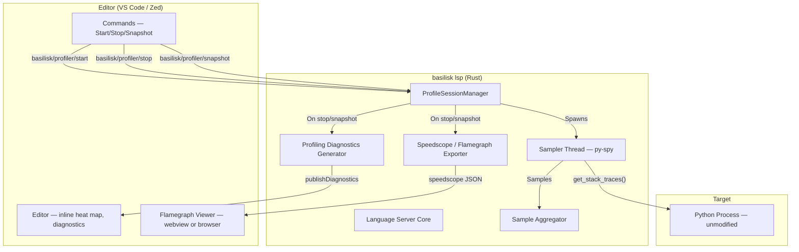
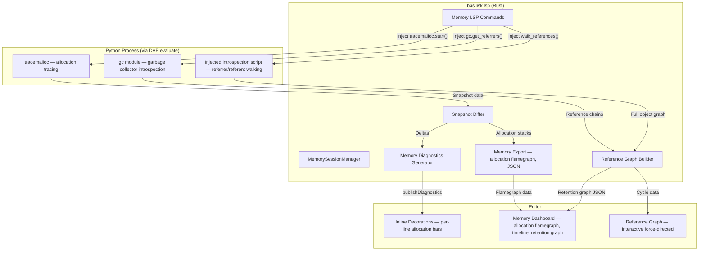

# Basilisk Profiling — Specification

## Goal {#PROFILE-GOAL}

Embed a state-of-the-art Python profiler directly into the Basilisk LSP. No `pip install`. No separate tool. One binary does type checking, debugging, and profiling. The profiler attaches to running Python processes, samples call stacks, and surfaces hotspots inline in the editor — VS Code and Zed.

## Why py-spy {#PROFILE-PYSPY}

py-spy is a **Rust crate on crates.io**. Basilisk is Rust. This is the only Python profiler that can be embedded as a library dependency in a Rust project.

| Property | py-spy | Scalene | Memray | Austin |
|---|---|---|---|---|
| Language | **Rust** | Python/C++ | C++ | C |
| Embeddable as Rust crate | **Yes** | No | No | No |
| Attaches externally | **Yes** | No (wraps target) | No (wraps target) | Yes |
| Modifies target process | **No** | Yes | Yes | No |
| Overhead | **~2%** | ~5-30% | High (tracing) | ~2% |
| CPU profiling | **Yes** | Yes | No | Yes |
| Memory profiling | No | Yes | Yes | No |
| Speedscope output | **Yes** | No | No | Via converter |
| Platform | **All** | All | Linux/macOS | All |

py-spy reads the target process's memory directly via OS calls (`vm_read` on macOS, `process_vm_readv` on Linux, `ReadProcessMemory` on Windows). It resolves the CPython interpreter state and walks `PyFrameObject` chains to build stack traces. Zero injection, zero instrumentation, zero overhead on the target.

## Architecture {#PROFILE-ARCH}



### Core Components {#PROFILE-COMPONENTS}

**`ProfileSessionManager`** — Owns active profiling sessions. One session per PID. Handles start/stop/snapshot lifecycle. Lives in the LSP server alongside `DebugSessionManager`.

**`Sampler` thread** — A dedicated OS thread per profiling session. Calls `py_spy::PythonSpy::get_stack_traces()` in a loop at the configured sample rate. Sends samples to the aggregator via `mpsc` channel. py-spy's `Sampler` struct handles this pattern natively.

**`SampleAggregator`** — Accumulates stack traces into a per-file, per-line hit count map. Tracks total samples, per-function samples, and per-line samples. Thread-safe (receives from channel, queried from LSP thread).

**`SpeedscopeExporter`** — Converts aggregated samples into speedscope JSON format. Generates the `shared.frames` array, per-thread `sampled` profiles, and writes to a temp file.

**`ProfilingDiagnosticsGenerator`** — Converts aggregated samples into LSP diagnostics. Each hot line becomes a `Diagnostic` with severity `Hint` and a message like `"38.2% CPU (412 samples)"`. Publishes via `textDocument/publishDiagnostics`.

## py-spy Rust API {#PROFILE-API}

### Dependency {#PROFILE-DEP}

```toml
# Cargo.toml
[dependencies]
py-spy = "0.4"
```

### Key Types {#PROFILE-TYPES}

```rust
// Attach to a running Python process
let config = py_spy::Config {
    sampling_rate: 100,      // 100 Hz
    include_idle: false,
    native: false,           // true to include C extension frames
    dump_locals: 0,          // >0 to capture local variable names
    ..Default::default()
};

let mut spy = py_spy::PythonSpy::new(pid, &config)?;

// Sample once — returns one StackTrace per thread
let traces: Vec<py_spy::StackTrace> = spy.get_stack_traces()?;

for trace in &traces {
    // trace.thread_id: u64
    // trace.thread_name: Option<String>
    // trace.owns_gil: bool
    // trace.active: bool
    for frame in &trace.frames {
        // frame.name: String      — function name
        // frame.filename: String  — source file path
        // frame.line: i32         — line number
        // frame.module: Option<String>
    }
}
```

### Sampler {#PROFILE-SAMPLER}

py-spy provides a `Sampler` struct that manages the sampling thread:

```rust
let sampler = py_spy::sampler::Sampler::new(pid, &config)?;
// sampler implements Iterator, yielding Sample objects
for sample in sampler {
    // sample.traces: Vec<StackTrace>
    // sample.sampling_errors: HashMap<Pid, Error>
    // sample.late_sample: Duration — latency above target
}
```

### Platform Permissions {#PROFILE-PERMS}

| Platform | Requirement | Impact |
|---|---|---|
| macOS | **Root required** (`vm_read` needs task port) | Must spawn privileged helper or use `sudo` |
| Linux | Root, or `ptrace_scope=0`, or profiling own child | Works without root if `ptrace_scope` is relaxed |
| Windows | No elevation for processes you own | Works out of the box |

**macOS mitigation**: The LSP spawns a small helper binary (`basilisk-profiler-helper`) via `osascript` or `security authorizationdb` to get elevated privileges. The helper is the only component that touches `vm_read`. It communicates with the LSP over a Unix socket, streaming stack trace data back. The user sees a one-time macOS permission prompt.

Alternative: if the Python process was spawned by Basilisk's debug session manager, the LSP already has the child PID and can trace it directly (parent can trace child on macOS without root).

## LSP Protocol {#PROFILE-PROTOCOL}

### Custom Requests {#PROFILE-REQUESTS}

#### basilisk/profiler/start {#PROFILE-REQUESTS-START}

Start profiling a Python process.

**Request:**
```json
{
    "pid": 12345,
    "sampleRate": 100,
    "includeNative": false,
    "duration": null
}
```

If `pid` is omitted, the LSP looks for:
1. An active debug session (uses that PID)
2. A running Python process in the workspace (auto-detect)

If `duration` is set (seconds), profiling stops automatically after that time.

**Response:**
```json
{
    "sessionId": "prof-a1b2c3",
    "pid": 12345,
    "pythonVersion": "3.12.0",
    "startedAt": "2026-03-12T10:30:00Z"
}
```

**Errors:**
```json
{ "code": -32001, "message": "Process not found: PID 12345" }
{ "code": -32002, "message": "Not a Python process: PID 12345" }
{ "code": -32003, "message": "Permission denied. On macOS, profiling requires elevated privileges." }
{ "code": -32004, "message": "Already profiling PID 12345 (session prof-a1b2c3)" }
```

#### basilisk/profiler/stop {#PROFILE-REQUESTS-STOP}

Stop profiling and return results.

**Request:**
```json
{
    "sessionId": "prof-a1b2c3",
    "format": "speedscope"
}
```

`format` options: `"speedscope"` (default), `"flamegraph"` (SVG), `"summary"` (text).

**Response:**
```json
{
    "sessionId": "prof-a1b2c3",
    "duration": 5.2,
    "totalSamples": 520,
    "outputFile": "/tmp/basilisk-prof-a1b2c3.speedscope.json",
    "hotFunctions": [
        {
            "name": "process_data",
            "file": "src/pipeline.py",
            "line": 42,
            "samples": 210,
            "percentage": 40.4,
            "selfPercentage": 28.1
        },
        {
            "name": "parse_record",
            "file": "src/parser.py",
            "line": 15,
            "samples": 156,
            "percentage": 30.0,
            "selfPercentage": 30.0
        }
    ],
    "hotLines": [
        {
            "file": "src/pipeline.py",
            "line": 47,
            "samples": 98,
            "percentage": 18.8
        }
    ]
}
```

#### basilisk/profiler/snapshot {#PROFILE-REQUESTS-SNAPSHOT}

Take a point-in-time snapshot without stopping the session.

**Request:**
```json
{
    "sessionId": "prof-a1b2c3"
}
```

**Response:** Same as `stop`, but profiling continues.

#### basilisk/profiler/list {#PROFILE-REQUESTS-LIST}

List active profiling sessions.

**Response:**
```json
{
    "sessions": [
        {
            "sessionId": "prof-a1b2c3",
            "pid": 12345,
            "startedAt": "2026-03-12T10:30:00Z",
            "sampleCount": 12400,
            "duration": 124.0
        }
    ]
}
```

### LSP Notifications {#PROFILE-NOTIFICATIONS}

#### basilisk/profiler/diagnostics {#PROFILE-NOTIFICATIONS-DIAG}

After `stop` or `snapshot`, the LSP publishes profiling diagnostics for every file that appeared in the samples:

```json
{
    "method": "textDocument/publishDiagnostics",
    "params": {
        "uri": "file:///src/pipeline.py",
        "diagnostics": [
            {
                "range": { "start": {"line": 46, "character": 0}, "end": {"line": 46, "character": 999} },
                "severity": 4,
                "source": "basilisk-profiler",
                "code": "BSK-PROF",
                "message": "Hot line: 18.8% CPU (98/520 samples)",
                "data": {
                    "samples": 98,
                    "totalSamples": 520,
                    "percentage": 18.8
                }
            },
            {
                "range": { "start": {"line": 41, "character": 0}, "end": {"line": 41, "character": 999} },
                "severity": 4,
                "source": "basilisk-profiler",
                "code": "BSK-PROF",
                "message": "Hot function: process_data — 40.4% CPU (210 samples, 28.1% self)",
                "data": {
                    "samples": 210,
                    "selfSamples": 146,
                    "percentage": 40.4,
                    "selfPercentage": 28.1
                }
            }
        ]
    }
}
```

Profiling diagnostics use severity `Hint` (4) so they don't pollute error/warning counts. They carry the source `"basilisk-profiler"` for filtering.

#### basilisk/profiler/progress {#PROFILE-NOTIFICATIONS-PROGRESS}

Periodic notification during active profiling:

```json
{
    "method": "basilisk/profiler/progress",
    "params": {
        "sessionId": "prof-a1b2c3",
        "sampleCount": 5200,
        "duration": 52.0,
        "topFunction": "process_data (38.1%)"
    }
}
```

Editors can display this in a status indicator.

## Sample Aggregation {#PROFILE-AGGREGATION}

### Data Structures {#PROFILE-AGGREGATION-STRUCTS}

```rust
/// Accumulated profiling data for a single session
struct ProfileData {
    /// file path -> line number -> sample count
    line_hits: HashMap<String, HashMap<i32, u64>>,

    /// file path -> function name -> FunctionStats
    function_stats: HashMap<String, HashMap<String, FunctionStats>>,

    /// Total samples collected
    total_samples: u64,

    /// Per-thread sample counts
    thread_samples: HashMap<u64, u64>,

    /// Raw frame list for speedscope export (frame index dedup)
    frame_index: HashMap<(String, String, i32), usize>,
    frames: Vec<SpeedscopeFrame>,

    /// Per-thread sample stacks (indices into frames)
    thread_stacks: HashMap<u64, Vec<Vec<usize>>>,
    thread_weights: HashMap<u64, Vec<f64>>,
}

struct FunctionStats {
    name: String,
    file: String,
    line: i32,
    /// Samples where this function appears anywhere in the stack
    total_samples: u64,
    /// Samples where this function is the leaf (top of stack)
    self_samples: u64,
}
```

### Aggregation Logic {#PROFILE-AGGREGATION-LOGIC}

For each `get_stack_traces()` call:

1. For each thread's `StackTrace`:
   - Skip if `!trace.active && !config.include_idle`
   - For each `Frame` in the stack:
     - Increment `line_hits[frame.filename][frame.line]`
     - Increment `function_stats[frame.filename][frame.name].total_samples`
   - The leaf frame (index 0) also gets `self_samples` incremented
   - Record the stack as frame indices for speedscope export
2. Increment `total_samples`

### Hotspot Threshold {#PROFILE-AGGREGATION-THRESHOLD}

Only lines/functions above a configurable threshold generate diagnostics:

- **Line threshold**: 1% of total samples (default)
- **Function threshold**: 2% of total samples (default)
- **Maximum diagnostics per file**: 20 (to avoid flooding)

## Speedscope Export {#PROFILE-SPEEDSCOPE}

### Format {#PROFILE-SPEEDSCOPE-FORMAT}

```json
{
    "$schema": "https://www.speedscope.app/file-format-schema.json",
    "shared": {
        "frames": [
            {"name": "process_data", "file": "src/pipeline.py", "line": 42},
            {"name": "parse_record", "file": "src/parser.py", "line": 15},
            {"name": "<module>", "file": "main.py", "line": 1}
        ]
    },
    "profiles": [
        {
            "type": "sampled",
            "name": "Thread 1 (MainThread)",
            "unit": "seconds",
            "startValue": 0,
            "endValue": 5.2,
            "samples": [[2, 0], [2, 0, 1], [2, 0]],
            "weights": [0.01, 0.01, 0.01]
        }
    ],
    "name": "basilisk profile — PID 12345",
    "exporter": "basilisk-profiler 0.1.0",
    "activeProfileIndex": 0
}
```

### Mapping {#PROFILE-SPEEDSCOPE-MAPPING}

| py-spy | Speedscope |
|---|---|
| `Frame { name, filename, line }` | `shared.frames[i] { name, file, line }` |
| Each `get_stack_traces()` call | One entry in `samples` per thread |
| `1.0 / sampling_rate` | Each entry in `weights` |
| `StackTrace.thread_name` | `profiles[i].name` |
| Frames are deduplicated by `(name, filename, line)` tuple | Index into `shared.frames` |

Stacks in speedscope are root-first (callers before callees). py-spy returns leaf-first. Reverse the frame order when building `samples` entries.

## Flamegraph SVG Export {#PROFILE-FLAMEGRAPH}

For direct SVG flamegraph output, use the `inferno` crate (Rust port of Brendan Gregg's FlameGraph):

```toml
[dependencies]
inferno = "0.12"
```

Convert aggregated stacks to collapsed format and pipe through `inferno::flamegraph::from_lines()`.

## Visualization Design System {#PROFILE-VIS}

All profiler visualizations use the Basilisk brand identity. Dark-first. High contrast. Unmistakable.

### Brand Palette for Profiling {#PROFILE-VIS-PALETTE}

| Token | Hex | Usage |
|---|---|---|
| `--prof-critical` | `#e8500a` | >20% CPU — the Basilisk orange. Burns hot. |
| `--prof-hot` | `#f97316` | 10-20% CPU — lighter orange |
| `--prof-warm` | `#fbbf24` | 5-10% CPU — amber warning |
| `--prof-cool` | `#4a5468` | 1-5% CPU — muted, barely visible |
| `--prof-idle` | `#1a1f2e` | <1% — background blend |
| `--prof-mem-critical` | `#c084fc` | Memory hotspot — purple (keyword color) |
| `--prof-mem-hot` | `#a78bfa` | Memory warm |
| `--prof-mem-leak` | `#f87171` | Memory leak detected — error red |
| `--prof-success` | `#34d399` | Freed / resolved — success green |
| `--prof-info` | `#60a5fa` | Informational — blue |
| `--prof-bg` | `#0a0c12` | Panel background |
| `--prof-surface` | `#141820` | Card/chart background |
| `--prof-border` | `#1a1f2e` | Borders and dividers |
| `--prof-text` | `#f0f2f7` | Primary text |
| `--prof-text-secondary` | `#8892a4` | Secondary text |

### Typography {#PROFILE-VIS-TYPOGRAPHY}

- **Headings**: Space Grotesk 600
- **Labels / Data**: Space Grotesk 500
- **Code / Filenames**: JetBrains Mono 400
- **Numbers / Percentages**: JetBrains Mono 500

### Animation Principles {#PROFILE-VIS-ANIMATION}

All profiler animations follow these rules:

1. **Entry animations**: 200ms ease-out. Charts fade in and scale from 95% to 100%. Numbers count up from 0.
2. **Transitions**: 120ms ease for hover states, 200ms ease for view switches.
3. **Live updates**: Smooth interpolation. No jarring jumps. Line charts extend with bezier-smoothed curves. Pie slices morph between states.
4. **Loading states**: Pulsing Basilisk orange glow on `--prof-surface` background. No spinners.
5. **Microinteractions**: Hover a flamegraph frame → subtle brightness increase + tooltip slide-in. Click → brief flash of `--prof-critical` before navigation.

### Chart Components {#PROFILE-VIS-CHARTS}

All charts are rendered in the VS Code WebviewPanel using a custom renderer built on Canvas 2D (no heavy dependencies like d3 — fast, minimal, Basilisk-styled).

#### Flamegraph {#PROFILE-VIS-CHARTS-FLAME}

```
┌─────────────────────────────────────────────────────────────────┐
│  <module> main.py:1                                             │ ← root, full width
├──────────────────────────────────┬──────────────────────────────┤
│  process_data pipeline.py:42    │  load_config config.py:8     │ ← callers
├────────────────┬─────────────────┤                              │
│ parse_record   │ transform       │                              │ ← hot leaves
│ parser.py:15   │ pipeline.py:60  │                              │
└────────────────┴─────────────────┴──────────────────────────────┘
```

- Each frame colored by self-time percentage using the heat palette
- Hover: tooltip with function name, file:line, total%, self%, sample count
- Click: navigate to source (VS Code) or copy path (Zed)
- Zoom: click to zoom into a subtree, breadcrumb trail to zoom out
- Search: highlight matching frames with `--prof-critical` border, dim non-matches
- Animated zoom transitions (200ms ease)

#### Donut Chart {#PROFILE-VIS-CHARTS-DONUT}

```
         ╭───────╮
       ╱  40.4%   ╲         process_data    ██████████  40.4%
      │  ┌─────┐   │        parse_record    ██████████  30.0%
      │  │ 520  │   │        transform       █████       12.3%
      │  │ samp │   │        load_config     ███          8.1%
      │  └─────┘   │        other            ██           9.2%
       ╲           ╱
         ╰───────╯
```

- Animated on load: slices grow from 0 to their arc length over 400ms, staggered by 50ms each
- Center shows total sample count with count-up animation
- Hover a slice: slice pulls out 4px, legend entry highlights
- Click a slice: filters flamegraph to that function's subtree
- Legend sorted by percentage, top 5 named, rest grouped as "other"

#### Timeline {#PROFILE-VIS-CHARTS-TIMELINE}

```
100% ┤
     │           ╱╲
 75% ┤          ╱  ╲         ── process_data
     │    ╱╲   ╱    ╲        ── parse_record
 50% ┤   ╱  ╲ ╱      ╲       ── transform
     │  ╱    ╳        ╲
 25% ┤ ╱    ╱ ╲        ╲───
     │╱    ╱   ╲────────
  0% ┼────┴─────┴─────┴─────┤
     0s   10s   20s   30s   40s
```

- Smooth bezier curves, not jagged line segments
- Each function gets a line colored from the heat palette
- Hover: vertical crosshair, tooltip showing all function values at that timestamp
- Click + drag: select time range, zoom into that range
- Live mode: line extends rightward in real-time during active profiling
- Stacked area chart variant available (toggle)

#### Sunburst Chart {#PROFILE-VIS-CHARTS-SUNBURST}

```
              ╭─────────╮
           ╱  ╱ parse_r. ╲  ╲
         ╱  ╱─────────────╲  ╲
       ╱  │  process_data   │  ╲
      │   │    ╭───────╮    │   │
      │   │   │<module>│    │   │
      │   │    ╰───────╯    │   │
       ╲  │   transform     │  ╱
         ╲  ╲─────────────╱  ╱
           ╲  ╲           ╱  ╱
              ╰─────────╯
```

- Radial layout: root at center, callees expand outward
- Arc width proportional to total time
- Color by self-time using heat palette
- Click to drill down (center refocuses on clicked frame)
- Animated transitions between drill-down levels (300ms ease)

#### Memory Leak Retention Graph {#PROFILE-VIS-CHARTS-MEMLEAK}

```
     obj A ──refs──▶ obj B ──refs──▶ obj C
       ▲                               │
       │                               │
       └───────────refs────────────────┘
              ⚠ CYCLE DETECTED
```

- Interactive force-directed graph of object references
- Nodes sized by retained memory
- Edges show reference relationships
- Cycles highlighted in `--prof-mem-leak` red with animated pulse
- Click a node: expand its referrers/referents, show type, size, creation traceback
- Filter by type, minimum size, or search by repr

#### GIL Contention Gauge {#PROFILE-VIS-CHARTS-GIL}

```
       ╭──────────────────╮
      ╱    GIL Wait: 34%   ╲
     │   ╱▓▓▓▓▓▓▓▓░░░░╲    │
     │  ╱  ▲             ╲  │
      ╲    │ needle        ╱
       ╰──────────────────╯
```

- Animated arc gauge (needle sweeps to value on load)
- Green (<10%), amber (10-30%), red (>30%)
- Updates in real-time during live profiling

### Inline Heat Map {#PROFILE-VIS-HEATMAP}

In VS Code, hot lines get colored decorations in the editor gutter and after the line:

```
  42 │ def process_data(records):          ██████████ 40.4% (210 samples)
  43 │     results = []
  44 │     for record in records:
  45 │         parsed = parse_record(record)
  46 │         if parsed.valid:
  47 │         │   results.append(transform(parsed)) ████████ 18.8% (98 samples)
  48 │         results.sort(key=lambda r: r.score)
```

Heat levels:

| Level | Color | Bar | Threshold |
|---|---|---|---|
| Critical | `#e8500a` Basilisk Orange | `██████████` | >20% |
| Hot | `#f97316` Light Orange | `████████` | 10-20% |
| Warm | `#fbbf24` Amber | `██████` | 5-10% |
| Cool | `#4a5468` Muted | `████` | 1-5% |

Bar width is proportional to percentage within its level. Text uses JetBrains Mono. The decoration fades in over 200ms on profile load.

For memory profiling, a separate decoration track uses the purple palette:
```
  12 │ data = load_dataset("huge.csv")     ████████ 248 MB allocated
  13 │ cache[key] = transform(data)        ██████ 180 MB retained  ⚠ LEAK
```

### Profiler Dashboard Layout {#PROFILE-VIS-DASHBOARD}

```
┌─────────────────────────────────────────────────────────────────────┐
│  BASILISK PROFILER                          PID 12345  │  52.0s  │ X│
├─────────────┬───────────────────┬───────────────────────────────────┤
│             │                   │                                   │
│   520       │   ╭─────╮         │   100% ┤                          │
│  samples    │  ╱ 40.4% ╲        │        │     ╱╲                   │
│             │ │  520   │         │    50% ┤    ╱  ╲                  │
│   5.2s      │  ╲      ╱         │        │   ╱    ╲───              │
│  duration   │   ╰─────╯         │     0% ┼────┴─────┤              │
│             │  Donut Chart      │        Timeline                   │
│   4         │                   │                                   │
│  threads    │                   │                                   │
├─────────────┴───────────────────┴───────────────────────────────────┤
│  FLAMEGRAPH                                          [search ____] │
│  ┌─────────────────────────────────────────────────────────────────┐│
│  │  <module>                                                       ││
│  ├──────────────────────────┬──────────────────────────────────────┤│
│  │  process_data            │  load_config                         ││
│  ├──────────┬───────────────┤                                      ││
│  │ parse_r. │ transform     │                                      ││
│  └──────────┴───────────────┴──────────────────────────────────────┘│
├─────────────────────────────────────────────────────────────────────┤
│  HOT FUNCTIONS                                     Sort: self% ▾   │
│  ┌────────────────────────────────────────────────────────────────┐ │
│  │  process_data    pipeline.py:42    ████████████  40.4%  28.1% │ │
│  │  parse_record    parser.py:15      ████████████  30.0%  30.0% │ │
│  │  transform       pipeline.py:60   █████          12.3%  12.3% │ │
│  │  load_config     config.py:8      ████            8.1%   8.1% │ │
│  └────────────────────────────────────────────────────────────────┘ │
└─────────────────────────────────────────────────────────────────────┘
```

Summary cards animate on load (numbers count up). The entire dashboard updates live during active profiling. All charts are interactive and cross-linked: clicking a function in the table highlights it in the flamegraph and timeline.

## Editor Integration {#PROFILE-EDITOR}

### VS Code {#PROFILE-EDITOR-VSCODE}

The VS Code extension provides rich profiling UX:

**Commands:**
- `basilisk.profileStart` — Prompt for PID or auto-detect, send `basilisk/profiler/start`
- `basilisk.profileStop` — Send `basilisk/profiler/stop`, open flamegraph webview, apply inline decorations
- `basilisk.profileSnapshot` — Take snapshot without stopping
- `basilisk.profileAttachToDebug` — Start profiling the currently-debugged process

**Flamegraph Webview:**
- Full dashboard with flamegraph, donut chart, timeline, sunburst, and hot functions table
- All charts use Basilisk design system colors, typography, and animations
- Click any frame to navigate to source
- Zoom, search, filter with smooth animated transitions
- Toggle between chart views
- Dark theme that matches `--prof-bg` / `--prof-surface`
- Export as PNG/SVG

**Status Bar:**
- Shows profiling state: "Profiling PID 12345 (52s, 5.2K samples)"
- Basilisk orange pulsing dot when actively profiling
- Click to stop

### Zed {#PROFILE-EDITOR-ZED}

Zed's extension API is limited. Profiling works through:

**LSP Diagnostics:**
- Hot lines appear as `Hint` diagnostics with `source: "basilisk-profiler"`
- Users see inline hints next to hot code
- The diagnostics panel shows all hotspots

**Slash Commands:**
- `/profile 12345` — Start profiling PID 12345
- `/profile` — Auto-detect or profile active debug session
- `/profstop` — Stop profiling, show summary in AI panel, open speedscope in browser

**Slash command output example:**
```
## Profile Results — PID 12345 (5.2s, 520 samples)

### Hot Functions
1. process_data (src/pipeline.py:42) — 40.4% CPU (28.1% self)
2. parse_record (src/parser.py:15) — 30.0% CPU (30.0% self)
3. transform (src/pipeline.py:60) — 12.3% CPU (12.3% self)

### Hot Lines
1. src/pipeline.py:47 — 18.8% CPU
2. src/parser.py:23 — 15.2% CPU
3. src/pipeline.py:48 — 8.1% CPU

Flamegraph: /tmp/basilisk-prof-a1b2c3.speedscope.json
Open in browser: https://www.speedscope.app/#profileURL=...
```

**External Viewer:**
- The LSP writes a speedscope JSON file to a temp directory
- The slash command output includes the path and a speedscope.app URL
- User opens in browser for full interactive flamegraph

### Shared Code {#PROFILE-EDITOR-SHARED}

| Component | Code Location | Used By |
|---|---|---|
| py-spy sampling | `basilisk-lsp/src/profiler/sampler.rs` | Both |
| Sample aggregation | `basilisk-lsp/src/profiler/aggregator.rs` | Both |
| Speedscope export | `basilisk-lsp/src/profiler/export.rs` | Both |
| Flamegraph SVG | `basilisk-lsp/src/profiler/flamegraph.rs` | Both |
| LSP commands | `basilisk-lsp/src/profiler/commands.rs` | Both |
| Diagnostic generation | `basilisk-lsp/src/profiler/diagnostics.rs` | Both |
| Webview flamegraph | `vscode-extension/src/flamegraph/` | VS Code only |
| Slash command handler | `basilisk-zed/src/lib.rs` | Zed only |

100% of the profiler engine is shared. Editors differ only in visualization.

## Memory Profiling & Leak Detection {#PROFILE-MEMORY}

### Overview {#PROFILE-MEMORY-OVERVIEW}

The Basilisk memory profiler is a comprehensive memory analysis tool built on two engines:

1. **tracemalloc** (Python stdlib) — per-line allocation tracking, allocation flamegraphs, growth-over-time analysis
2. **gc + objgraph introspection** (Python stdlib + DAP evaluate) — reference graph walking, cycle detection, retention chain analysis, leak identification

Together they answer: **what allocated the memory, how much, and what's holding on to it.**

### Architecture {#PROFILE-MEMORY-ARCH}



### How It Works {#PROFILE-MEMORY-HOWTO}

Memory profiling requires an active **debug session** (debugpy). The LSP injects Python code into the running process via DAP `evaluate` requests. This is the same debug session that Basilisk already manages — no extra setup.

#### Step 1: Start Memory Tracking {#PROFILE-MEMORY-START}

The LSP injects:
```python
import tracemalloc, gc
tracemalloc.start(25)  # 25-frame deep tracebacks
gc.set_debug(gc.DEBUG_SAVEALL)  # preserve uncollectable objects
```

`tracemalloc.start(25)` captures allocation tracebacks up to 25 frames deep. This is the foundation for per-line allocation data and allocation flamegraphs.

#### Step 2: Take Snapshots {#PROFILE-MEMORY-SNAPSHOT}

At any point, the LSP injects:
```python
import tracemalloc, json, sys

snapshot = tracemalloc.take_snapshot()
stats = snapshot.statistics('lineno')
top_stats = []
for stat in stats[:500]:
    frame = stat.traceback[0]
    top_stats.append({
        'file': frame.filename,
        'line': frame.lineno,
        'size': stat.size,
        'count': stat.count,
        'traceback': [{'file': f.filename, 'line': f.lineno} for f in stat.traceback]
    })

# Also get overall memory state
mem_info = {
    'current': tracemalloc.get_traced_memory()[0],
    'peak': tracemalloc.get_traced_memory()[1],
    'stats': top_stats,
    'gc_counts': gc.get_count(),
    'gc_objects': len(gc.get_objects()),
}
print('__BASILISK_MEM__' + json.dumps(mem_info))
```

The LSP parses the `__BASILISK_MEM__` marker from the evaluate response.

#### Step 3: Diff Snapshots {#PROFILE-MEMORY-DIFF}

Take two snapshots separated by time. The diff reveals:

- **Growing allocations**: lines where `size_new > size_old` — memory is being allocated but not freed
- **New allocations**: lines that appear in snapshot 2 but not snapshot 1
- **Freed allocations**: lines that disappear — memory was reclaimed

```python
snapshot1 = tracemalloc.take_snapshot()
# ... user's code runs ...
snapshot2 = tracemalloc.take_snapshot()

diff = snapshot2.compare_to(snapshot1, 'lineno')
leaks = []
for stat in diff:
    if stat.size_diff > 0:  # grew
        leaks.append({
            'file': stat.traceback[0].filename,
            'line': stat.traceback[0].lineno,
            'size_diff': stat.size_diff,
            'count_diff': stat.count_diff,
            'size': stat.size,
            'count': stat.count,
            'traceback': [{'file': f.filename, 'line': f.lineno} for f in stat.traceback]
        })
```

Lines that consistently grow across multiple snapshot diffs are flagged as **suspected leaks**.

#### Step 4: Reference Graph Walking {#PROFILE-MEMORY-REFGRAPH}

This is where Basilisk does what no other IDE tool does. When you want to know **why** an object is alive — what's holding a reference to it — the LSP injects an introspection script that walks the reference graph using `gc.get_referrers()`.

```python
import gc, sys, json

def walk_references(target_type, target_repr_contains=None, max_depth=5, max_nodes=200):
    """Walk the reference graph for objects matching the filter.

    Returns a graph of nodes (objects) and edges (references) that can be
    visualized as a force-directed graph in the editor.
    """
    gc.collect()  # clean up first

    # Find target objects
    targets = []
    for obj in gc.get_objects():
        if type(obj).__name__ == target_type:
            if target_repr_contains is None or target_repr_contains in repr(obj)[:200]:
                targets.append(obj)
                if len(targets) >= 10:
                    break

    if not targets:
        return {'nodes': [], 'edges': [], 'cycles': []}

    nodes = {}  # id -> node info
    edges = []  # (from_id, to_id, label)
    visited = set()
    queue = [(id(t), t, 0) for t in targets]

    while queue and len(nodes) < max_nodes:
        obj_id, obj, depth = queue.pop(0)
        if obj_id in visited:
            continue
        visited.add(obj_id)

        # Build node info
        obj_type = type(obj).__name__
        obj_size = sys.getsizeof(obj)
        obj_repr = repr(obj)[:100]

        nodes[obj_id] = {
            'id': obj_id,
            'type': obj_type,
            'size': obj_size,
            'repr': obj_repr,
            'depth': depth,
            'is_target': obj in targets,
        }

        if depth < max_depth:
            # Walk REFERRERS (who points to this object?)
            referrers = gc.get_referrers(obj)
            for ref in referrers:
                ref_id = id(ref)
                ref_type = type(ref).__name__

                # Skip internal frames, modules, and this script
                if ref_type in ('frame', 'module', 'code', 'function'):
                    continue
                if ref_type == 'dict':
                    # Check if it's a module's __dict__
                    for mod in sys.modules.values():
                        if hasattr(mod, '__dict__') and id(mod.__dict__) == ref_id:
                            ref_type = f'module:{mod.__name__}'
                            break

                # Determine the reference label (dict key, list index, attribute name)
                label = _find_ref_label(ref, obj)

                edges.append({
                    'from': ref_id,
                    'to': obj_id,
                    'label': label,
                })

                if ref_id not in visited:
                    queue.append((ref_id, ref, depth + 1))

            # Walk REFERENTS (what does this object point to?)
            try:
                referents = gc.get_referents(obj)
                for ref in referents[:20]:  # limit fan-out
                    ref_id = id(ref)
                    edges.append({
                        'from': obj_id,
                        'to': ref_id,
                        'label': '',
                    })
                    if ref_id not in visited and len(nodes) < max_nodes:
                        queue.append((ref_id, ref, depth + 1))
            except Exception:
                pass

    # Detect cycles
    cycles = _detect_cycles(nodes, edges)

    return {'nodes': list(nodes.values()), 'edges': edges, 'cycles': cycles}

def _find_ref_label(referrer, target):
    """Figure out HOW the referrer holds the target — dict key, list index, attribute."""
    target_id = id(target)
    ref_type = type(referrer).__name__

    if ref_type == 'dict':
        for key, val in referrer.items():
            if id(val) == target_id:
                return f'[{repr(key)[:50]}]'
        return 'dict-value'
    elif ref_type == 'list':
        for idx, val in enumerate(referrer):
            if id(val) == target_id:
                return f'[{idx}]'
        return 'list-item'
    elif ref_type == 'tuple':
        for idx, val in enumerate(referrer):
            if id(val) == target_id:
                return f'({idx})'
        return 'tuple-item'
    elif ref_type == 'set':
        return 'set-member'
    else:
        # Check instance attributes
        if hasattr(referrer, '__dict__'):
            for attr, val in referrer.__dict__.items():
                if id(val) == target_id:
                    return f'.{attr}'
        return ''

def _detect_cycles(nodes, edges):
    """Find cycles in the reference graph using DFS."""
    adj = {}
    for edge in edges:
        adj.setdefault(edge['from'], []).append(edge['to'])

    cycles = []
    visited = set()
    path = []
    path_set = set()

    def dfs(node):
        if node in path_set:
            cycle_start = path.index(node)
            cycles.append(path[cycle_start:] + [node])
            return
        if node in visited:
            return
        visited.add(node)
        path.append(node)
        path_set.add(node)
        for neighbor in adj.get(node, []):
            if neighbor in nodes:
                dfs(neighbor)
        path.pop()
        path_set.discard(node)

    for node_id in nodes:
        if node_id not in visited:
            dfs(node_id)

    return cycles
```

This script is injected as a single DAP `evaluate` call. The result is a complete reference graph that the editor renders as an interactive force-directed visualization.

### LSP Commands {#PROFILE-MEMORY-COMMANDS}

#### basilisk/memory/start {#PROFILE-MEMORY-CMD-START}

Start memory tracking in the active debug session.

**Request:**
```json
{
    "sessionId": "debug-session-id",
    "tracebackDepth": 25,
    "snapshotInterval": null
}
```

If `snapshotInterval` is set (seconds), auto-snapshot at that interval for trend analysis.

**Response:**
```json
{
    "memorySessionId": "mem-x1y2z3",
    "tracingStarted": true,
    "currentMemory": 45678912,
    "peakMemory": 45678912
}
```

#### basilisk/memory/snapshot {#PROFILE-MEMORY-CMD-SNAPSHOT}

Take an allocation snapshot.

**Response:**
```json
{
    "memorySessionId": "mem-x1y2z3",
    "snapshotId": "snap-001",
    "currentMemory": 89012345,
    "peakMemory": 102345678,
    "gcObjects": 145230,
    "gcCounts": [712, 45, 3],
    "topAllocations": [
        {
            "file": "src/pipeline.py",
            "line": 12,
            "size": 24567890,
            "count": 15234,
            "traceback": [
                {"file": "src/pipeline.py", "line": 12},
                {"file": "src/loader.py", "line": 45},
                {"file": "main.py", "line": 8}
            ]
        }
    ]
}
```

#### basilisk/memory/diff {#PROFILE-MEMORY-CMD-DIFF}

Compare two snapshots to find leaks.

**Request:**
```json
{
    "memorySessionId": "mem-x1y2z3",
    "snapshot1": "snap-001",
    "snapshot2": "snap-003"
}
```

**Response:**
```json
{
    "memoryDiff": {
        "totalGrowth": 43543456,
        "totalFreed": 12345678,
        "netGrowth": 31197778,
        "suspectedLeaks": [
            {
                "file": "src/cache.py",
                "line": 34,
                "sizeGrowth": 18234567,
                "countGrowth": 8923,
                "currentSize": 24567890,
                "currentCount": 12345,
                "confidence": "high",
                "reason": "Consistent growth across 3 consecutive snapshots",
                "traceback": [
                    {"file": "src/cache.py", "line": 34},
                    {"file": "src/cache.py", "line": 12},
                    {"file": "src/app.py", "line": 78}
                ]
            }
        ],
        "grownAllocations": [
            {
                "file": "src/pipeline.py",
                "line": 47,
                "sizeDiff": 5678901,
                "countDiff": 2345,
                "currentSize": 12345678,
                "currentCount": 5678
            }
        ],
        "freedAllocations": [
            {
                "file": "src/tempfiles.py",
                "line": 23,
                "sizeDiff": -12345678,
                "countDiff": -456
            }
        ]
    }
}
```

#### basilisk/memory/references {#PROFILE-MEMORY-CMD-REFS}

Walk the reference graph for a specific object type. This is the **core leak investigation tool**.

**Request:**
```json
{
    "memorySessionId": "mem-x1y2z3",
    "targetType": "DataFrame",
    "targetReprContains": "huge_dataset",
    "maxDepth": 5,
    "maxNodes": 200,
    "direction": "referrers"
}
```

`direction`:
- `"referrers"` — Who is holding a reference TO this object? (default — answers "why won't this die?")
- `"referents"` — What does this object reference? (answers "what is this keeping alive?")
- `"both"` — Full bidirectional graph

**Response:**
```json
{
    "graph": {
        "nodes": [
            {
                "id": 140234567890,
                "type": "DataFrame",
                "size": 248000000,
                "repr": "DataFrame(shape=(1000000, 25))",
                "depth": 0,
                "isTarget": true,
                "retainedSize": 248000000
            },
            {
                "id": 140234567900,
                "type": "dict",
                "size": 4096,
                "repr": "{'huge_dataset': DataFrame(...), 'config': ...}",
                "depth": 1,
                "isTarget": false,
                "retainedSize": 248004096
            },
            {
                "id": 140234567910,
                "type": "LRUCache",
                "size": 512,
                "repr": "LRUCache(maxsize=100, currsize=100)",
                "depth": 2,
                "isTarget": false,
                "retainedSize": 248004608
            },
            {
                "id": 140234567920,
                "type": "module:src.cache",
                "size": 8192,
                "repr": "<module 'src.cache'>",
                "depth": 3,
                "isTarget": false,
                "retainedSize": 248012800
            }
        ],
        "edges": [
            {
                "from": 140234567920,
                "to": 140234567910,
                "label": ".cache_instance"
            },
            {
                "from": 140234567910,
                "to": 140234567900,
                "label": "['huge_dataset']"
            },
            {
                "from": 140234567900,
                "to": 140234567890,
                "label": "dict-value"
            }
        ],
        "cycles": [],
        "retentionPath": [
            "module:src.cache",
            "  .cache_instance → LRUCache",
            "    ['huge_dataset'] → dict",
            "      dict-value → DataFrame (248 MB)"
        ]
    }
}
```

The `retentionPath` is the human-readable chain: **the module `src.cache` has an attribute `cache_instance` which is an `LRUCache`, which contains a key `'huge_dataset'` pointing to a `dict`, which holds your 248 MB `DataFrame`.** That's your leak.

#### basilisk/memory/objectsByType {#PROFILE-MEMORY-CMD-OBJECTS}

List all objects of a given type with their sizes and reference counts.

**Request:**
```json
{
    "memorySessionId": "mem-x1y2z3",
    "typeName": "DataFrame",
    "sortBy": "size",
    "limit": 50
}
```

**Response:**
```json
{
    "objects": [
        {
            "id": 140234567890,
            "type": "DataFrame",
            "size": 248000000,
            "refcount": 3,
            "repr": "DataFrame(shape=(1000000, 25))",
            "createdAt": {"file": "src/pipeline.py", "line": 12}
        },
        {
            "id": 140234567990,
            "type": "DataFrame",
            "size": 64000000,
            "refcount": 1,
            "repr": "DataFrame(shape=(250000, 25))",
            "createdAt": {"file": "src/loader.py", "line": 45}
        }
    ],
    "totalCount": 47,
    "totalSize": 523000000,
    "typeSummary": {
        "DataFrame": {"count": 47, "size": 523000000},
        "Series": {"count": 1175, "size": 312000000},
        "ndarray": {"count": 2350, "size": 624000000}
    }
}
```

#### basilisk/memory/gcCollect {#PROFILE-MEMORY-CMD-GC}

Force a garbage collection and report what was collected.

**Response:**
```json
{
    "collected": 1234,
    "uncollectable": 5,
    "memoryFreed": 45678901,
    "uncollectableObjects": [
        {
            "id": 140234568000,
            "type": "MyClass",
            "size": 1024,
            "repr": "MyClass(name='leaked')",
            "reason": "Instance has __del__ method and is in a reference cycle"
        }
    ]
}
```

Uncollectable objects (those with `__del__` in a cycle) are highlighted as **definite leaks**.

### Visualization — Reference Graph {#PROFILE-MEMORY-VIS-REFGRAPH}

The reference graph is the crown jewel of the memory profiler. It answers the question every developer asks when hunting leaks: **"What the fuck is holding on to this?"**

```
┌─────────────────────────────────────────────────────────────────────┐
│  RETENTION GRAPH — DataFrame (248 MB)                    [search] X│
├─────────────────────────────────────────────────────────────────────┤
│                                                                     │
│                   ┌──────────────┐                                  │
│                   │ module:      │                                  │
│                   │ src.cache    │ ← ROOT RETAINER                 │
│                   │ 8 KB         │                                  │
│                   └──────┬───────┘                                  │
│                .cache_instance                                      │
│                          │                                          │
│                   ┌──────▼───────┐                                  │
│                   │ LRUCache     │                                  │
│                   │ 512 B        │                                  │
│                   └──────┬───────┘                                  │
│              ['huge_dataset']                                       │
│                          │                                          │
│                   ┌──────▼───────┐                                  │
│                   │ dict         │                                  │
│                   │ 4 KB         │                                  │
│                   └──────┬───────┘                                  │
│                    dict-value                                       │
│                          │                                          │
│                ┌─────────▼─────────┐                                │
│                │  ★ DataFrame      │ ← TARGET                      │
│                │  248 MB           │                                │
│                │  shape=(1M, 25)   │                                │
│                └───────────────────┘                                │
│                                                                     │
│  RETENTION PATH:                                                    │
│  module:src.cache .cache_instance → LRUCache ['huge_dataset']      │
│  → dict → DataFrame (248 MB)                                       │
│                                                                     │
│  [Expand Referents]  [Show All Referrers]  [Navigate to Source]     │
└─────────────────────────────────────────────────────────────────────┘
```

**Interactions:**
- **Force-directed layout** with physics simulation — nodes repel each other, edges pull connected nodes together. Animated settling over 500ms.
- **Node sizing**: proportional to `log(size)`. The 248 MB DataFrame is visually massive. The 512 B LRUCache is a dot.
- **Node coloring**:
  - Target objects: `--prof-mem-critical` purple with glow
  - Root retainers (modules, globals): `--prof-info` blue
  - Intermediate containers (dicts, lists): `--prof-text-secondary` gray
  - Cyclic objects: `--prof-mem-leak` red with pulsing border animation
- **Edge labels**: show how the reference is held (`.attribute`, `['key']`, `[index]`, `set-member`)
- **Hover a node**: tooltip with type, size, repr, refcount, creation traceback (if available from tracemalloc)
- **Click a node**: expand its referrers/referents (lazy-load via `basilisk/memory/references` with that node's type)
- **Right-click a node**: "Navigate to Creation Site" (if tracemalloc has the allocation traceback)
- **Cycle highlighting**: cycles are drawn with thick red edges and a pulsing animation. A banner appears: "Reference cycle detected — these objects cannot be garbage collected if any has a `__del__` method"
- **Filter controls**: filter by type, minimum size, or search by repr substring
- **Layout modes**: force-directed (default), tree (hierarchical, top-down), radial (target at center)

### Visualization — Memory Timeline {#PROFILE-MEMORY-VIS-TIMELINE}

```
Memory ┤
       │                                    ╱─────── 312 MB (current)
300 MB ┤                               ╱───╱
       │                          ╱───╱
200 MB ┤                     ╱───╱
       │                ╱───╱               ← steady growth = LEAK
100 MB ┤           ╱───╱
       │      ╱───╱
  0 MB ┼─────╱────┴──────┴──────┴──────┤
       0s    30s   60s    90s   120s

       ■ DataFrame  ■ dict  ■ list  ■ other
```

- Stacked area chart showing memory by type over time
- Smooth bezier curves
- Each snapshot is a data point
- Steady upward slope = leak indicator (highlighted with `--prof-mem-leak` red)
- Hover: crosshair showing exact values at that snapshot
- Click: drill into that snapshot's top allocations

### Visualization — Allocation Flamegraph {#PROFILE-MEMORY-VIS-FLAME}

Same flamegraph component as CPU profiling, but:
- X-axis = bytes allocated (not time)
- Colors use the purple memory palette instead of orange CPU palette
- Each frame shows `function_name (file:line) — 24.5 MB (15,234 objects)`
- Answers: "Where did the memory come from?" (allocation callstack)

### Leak Confidence Scoring {#PROFILE-MEMORY-CONFIDENCE}

Not all growing allocations are leaks. Basilisk scores suspected leaks:

| Confidence | Criteria | Color |
|---|---|---|
| **Definite** | Object has `__del__` and is in a reference cycle (uncollectable by gc) | `#f87171` red, solid |
| **High** | Consistent growth across 3+ consecutive snapshot diffs, no corresponding frees | `#f87171` red, dashed border |
| **Medium** | Growth in 2 consecutive diffs, or large single-diff growth (>10 MB) | `#fbbf24` amber |
| **Low** | Single-diff growth, small size, could be normal cache warmup | `#8892a4` gray |

The editor shows confidence badges next to suspected leak diagnostics:

```
  34 │ cache[key] = transform(data)    ████████ 18 MB growth  ⚠ HIGH — consistent growth across 3 snapshots
  35 │ results.append(row)             ████ 5 MB growth  ℹ LOW — may be normal accumulation
```

### Diagnostic Codes {#PROFILE-MEMORY-CODES}

| Code | Severity | Meaning |
|---|---|---|
| `BSK-MEM-ALLOC` | Hint | Top allocation site (above threshold) |
| `BSK-MEM-GROWTH` | Warning | Memory growth detected between snapshots |
| `BSK-MEM-LEAK` | Warning | Suspected memory leak (high confidence) |
| `BSK-MEM-CYCLE` | Error | Reference cycle with `__del__` — definite leak, uncollectable |
| `BSK-MEM-UNCOLLECTABLE` | Error | gc reports uncollectable object |

### Integration with CPU Profiler {#PROFILE-MEMORY-CPU-INTEGRATION}

CPU and memory profiling can run simultaneously. The dashboard shows both:

- **Dual heat map**: left gutter = CPU heat (orange), right gutter = memory heat (purple)
- **Correlated flamegraph**: toggle between CPU time and memory allocation views of the same call stacks
- **"Hot and Heavy" filter**: show only functions that are both CPU-intensive AND memory-intensive — the real optimization targets

### Shared Code {#PROFILE-MEMORY-SHARED}

| Component | Code Location | Used By |
|---|---|---|
| tracemalloc injection scripts | `basilisk-lsp/src/profiler/memory/scripts.rs` | Both |
| Reference graph walker script | `basilisk-lsp/src/profiler/memory/refgraph.rs` | Both |
| Snapshot diffing | `basilisk-lsp/src/profiler/memory/diff.rs` | Both |
| Leak confidence scoring | `basilisk-lsp/src/profiler/memory/leaks.rs` | Both |
| Memory diagnostics | `basilisk-lsp/src/profiler/memory/diagnostics.rs` | Both |
| LSP memory commands | `basilisk-lsp/src/profiler/memory/commands.rs` | Both |
| Reference graph webview | `vscode-extension/src/profiler/refgraph/` | VS Code only |
| Memory slash commands | `basilisk-zed/src/lib.rs` | Zed only |

All memory analysis logic lives in the LSP. The editors only handle visualization.

## Permissions Model {#PROFILE-PERMISSIONS}

### macOS {#PROFILE-PERMISSIONS-MACOS}

`vm_read` (Mach task port access) requires one of:
- Running as root
- The target is a child process
- The target has the `com.apple.security.get-task-allow` entitlement (debug builds)
- SIP is disabled (not recommended)

**Our approach:**

1. **Debug session profiling (no elevation needed):** When profiling a process spawned by Basilisk's debug session manager, the LSP is the parent. Parent can trace child on macOS. This is the primary UX — "profile while debugging" works without any privilege escalation.

2. **External process profiling (elevation needed):** Spawn `basilisk-profiler-helper` via `osascript -e 'do shell script "..." with administrator privileges'`. The helper runs as root, attaches to the target via py-spy, and streams samples back to the LSP over a Unix domain socket. The user sees a single macOS password prompt.

### Linux {#PROFILE-PERMISSIONS-LINUX}

Works without root if `/proc/sys/kernel/yama/ptrace_scope` is `0` (classic). Many distros default to `1` (restricted). Options:
- `sudo basilisk lsp` (heavy-handed)
- `sudo setcap cap_sys_ptrace+ep $(which basilisk)` (one-time, persistent)
- Profile child processes only (no restriction)

### Windows {#PROFILE-PERMISSIONS-WINDOWS}

`ReadProcessMemory` works without elevation for processes owned by the same user. No special handling needed.

## Configuration {#PROFILE-CONFIG}

### LSP Settings {#PROFILE-CONFIG-SETTINGS}

```json
{
    "basilisk": {
        "profiler": {
            "enabled": true,
            "sampleRate": 100,
            "includeNative": false,
            "includeIdle": false,
            "hotLineThreshold": 1.0,
            "hotFunctionThreshold": 2.0,
            "maxDiagnosticsPerFile": 20,
            "outputDirectory": "/tmp",
            "autoOpenFlamegraph": true
        }
    }
}
```

### Diagnostic Codes {#PROFILE-CONFIG-CODES}

| Code | Severity | Meaning |
|---|---|---|
| `BSK-PROF-LINE` | Hint | Hot line (above threshold) |
| `BSK-PROF-FUNC` | Hint | Hot function (above threshold) |
| `BSK-PROF-GIL` | Info | GIL contention detected (thread frequently waiting for GIL) |

## Error Handling {#PROFILE-ERRORS}

| Scenario | Error Code | Message | Recovery |
|---|---|---|---|
| PID not found | -32001 | "Process not found: PID {pid}" | User re-enters PID |
| Not a Python process | -32002 | "PID {pid} is not a Python process" | User checks PID |
| Permission denied | -32003 | Platform-specific message with fix instructions | Elevation or debug mode |
| Already profiling | -32004 | "Already profiling PID {pid}" | Stop first, or snapshot |
| Process exited during profiling | N/A | Session auto-stops, partial results returned | Normal completion |
| Unsupported Python version | -32005 | "Python {version} not supported (need 3.3+)" | Upgrade Python |

## Performance Targets {#PROFILE-PERF}

| Metric | Target |
|---|---|
| Sampling overhead on target | <3% CPU |
| LSP memory for 10-minute session at 100Hz | <50 MB |
| Time to generate diagnostics from 60K samples | <100ms |
| Speedscope export for 60K samples | <200ms |
| Flamegraph SVG for 60K samples | <500ms |

## Testing Strategy {#PROFILE-TESTING}

### Unit Tests {#PROFILE-TESTING-UNIT}

- `aggregator.rs`: Verify hit counts, function stats, threshold filtering
- `export.rs`: Verify speedscope JSON matches schema, frame deduplication, stack reversal
- `diagnostics.rs`: Verify diagnostic message format, severity, threshold filtering

### Integration Tests {#PROFILE-TESTING-INTEGRATION}

- Start a known Python script, attach profiler, verify hot function matches expected bottleneck
- Profile a debug session, verify PID auto-detection
- Verify speedscope output opens correctly in speedscope.app
- Verify diagnostics appear for hot lines and disappear after clearing

### E2E Tests (VS Code) {#PROFILE-TESTING-E2E-VSCODE}

- Command palette "Profile" → attach to running script → stop → verify flamegraph opens
- Debug session → "Profile Debug Session" → verify inline decorations appear
- Verify diagnostics update on snapshot

### E2E Tests (Zed) {#PROFILE-TESTING-E2E-ZED}

- `/profile {pid}` → verify slash command output contains hot functions
- `/profstop` → verify speedscope file written
- Verify hint diagnostics appear for hot lines

### Platform Tests {#PROFILE-TESTING-PLATFORM}

- macOS: verify privilege escalation prompt appears for external process
- macOS: verify debug-session profiling works without elevation
- Linux: verify ptrace_scope handling
- Windows: verify no-elevation profiling works
