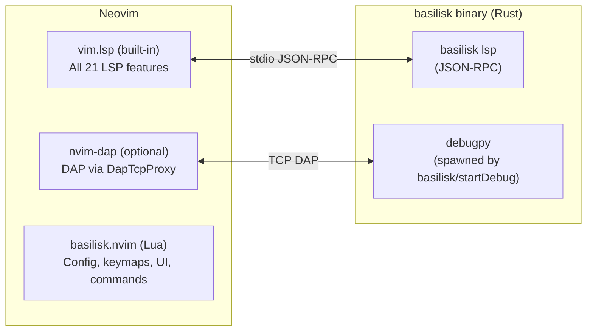

# Basilisk Neovim Extension (`basilisk.nvim`)

## Goal {#NEOVIM-GOAL}

A first-class Neovim plugin that connects to the same `basilisk lsp` binary as the VS Code and Zed extensions. One LSP, three editors. Feature parity across all of them.

**CRITICAL: AIMING FOR FEATURE PARITY BETWEEN NEOVIM, VS CODE, AND ZED EXTENSIONS**

All LSP features, DAP integration, custom commands, configuration settings, and binary resolution are defined in **`LSP-ARCHITECTURE-SPEC.md`** — the single source of truth. This spec only documents **Neovim-specific implementation details**.

## Critical Docs

### Neovim Core
- [Neovim LSP Client](https://neovim.io/doc/user/lsp.html) — Built-in LSP client API (`vim.lsp.config`, `vim.lsp.enable`, `vim.lsp.buf.*`)
- [Neovim API (Extensibility/Scripting/Plugins)](https://neovim.io/doc/user/#_api-%28extensibility%2fscripting%2fplugins%29) — Full API reference
- [Neovim API Reference](https://neovim.io/doc/user/api.html) — `nvim_buf_*`, `nvim_create_autocmd`, `nvim_create_user_command`, extmarks
- [Neovim Lua Guide](https://neovim.io/doc/user/lua.html) — Lua 5.1 runtime, `vim.*` namespace, module system
- [Neovim Lua Plugin Guide](https://neovim.io/doc/user/lua-plugin.html) — Plugin structure, `plugin/`, `ftplugin/`, `after/`
- [Neovim Diagnostic API](https://neovim.io/doc/user/diagnostic.html) — `vim.diagnostic.*` for rendering diagnostics
- [Neovim 0.11 LSP Changes](https://gpanders.com/blog/whats-new-in-neovim-0-11/) — Modern `vim.lsp.config()` + `vim.lsp.enable()` pattern

### Neovim Ecosystem
- [nvim-lspconfig](https://github.com/neovim/nvim-lspconfig) — Community LSP server configurations (submit PR for basic support)
- [nvim-dap](https://github.com/mfussenegger/nvim-dap) — Debug Adapter Protocol client
- [nvim-dap-ui](https://github.com/rcarriga/nvim-dap-ui) — Debug UI (variables, watches, call stack, breakpoints, console)
- [nvim-dap-virtual-text](https://github.com/theHamsta/nvim-dap-virtual-text) — Inline variable display during debugging
- [neotest](https://github.com/nvim-neotest/neotest) — Test runner framework (alternative to custom test explorer)
- [lazy.nvim](https://github.com/folke/lazy.nvim) — Primary plugin manager
- [lualine.nvim](https://github.com/nvim-lualine/lualine.nvim) — Status line (provide component)
- [plenary.nvim](https://github.com/nvim-lua/plenary.nvim) — Test framework for Neovim plugins

### Architecture Reference (Gold Standard)
- [rustaceanvim](https://github.com/mrcjkb/rustaceanvim) — Rust-analyzer Neovim plugin (our architectural model)
- [nvim-best-practices](https://github.com/nvim-neorocks/nvim-best-practices) — Plugin development best practices

---

## Architecture {#NEOVIM-ARCH}



---

## Plugin Structure {#NEOVIM-STRUCTURE}

```
basilisk.nvim/
├── plugin/
│   └── basilisk.lua              # Auto-loaded entry: guard, user commands, autocmds
├── lua/
│   └── basilisk/
│       ├── init.lua              # setup() entry, config merge, module orchestration
│       ├── config.lua            # Defaults + LuaCATS type annotations + validation
│       ├── binary.lua            # Binary resolution (see LSP-ARCHITECTURE-SPEC.md for cascade)
│       ├── lsp.lua               # LSP client config, lifecycle, error recovery
│       ├── dap.lua               # nvim-dap adapter, configs, DapTcpProxy
│       ├── commands.lua          # :Basilisk* user commands
│       ├── profiling.lua         # Profiling commands (see LSP-ARCHITECTURE-SPEC.md for LSP commands)
│       ├── memory.lua            # Memory commands (see LSP-ARCHITECTURE-SPEC.md for LSP commands)
│       ├── testing.lua           # Test discovery, tree UI, run/debug
│       ├── statusline.lua        # Status line component (lualine compat)
│       ├── health.lua            # :checkhealth basilisk
│       └── log.lua               # Logger (vim.notify + optional file)
├── ftplugin/
│   └── python.lua                # Auto-loaded for Python: keymaps, inlay hints, code lens
├── after/
│   └── lsp/
│       └── basilisk.lua          # Neovim 0.11+ native LSP config (fallback for non-setup users)
├── doc/
│   └── basilisk.txt              # Vim help file
└── tests/
    ├── minimal_init.lua          # Isolated test init
    └── basilisk/
        ├── binary_spec.lua
        ├── config_spec.lua
        └── lsp_spec.lua
```

---

## LSP Client Configuration {#NEOVIM-LSP}

Uses modern Neovim 0.10+ API (NOT nvim-lspconfig as a hard dependency):

```lua
-- lua/basilisk/lsp.lua
vim.lsp.config('basilisk', {
  cmd = { resolved_binary_path, 'lsp' },
  filetypes = { 'python' },
  root_markers = { 'pyproject.toml', 'setup.py', 'setup.cfg', '.git' },
  settings = {
    basilisk = {
      -- All settings from LSP-ARCHITECTURE-SPEC.md "Shared Configuration Settings"
      python = config.python,
      analysisMode = config.analysis_mode,
      inlayHints = {
        parameterNames = config.inlay_hints.parameter_names,
        variableTypes = config.inlay_hints.variable_types,
      },
      ruff = {
        enabled = config.ruff.enabled,
        executablePath = config.ruff.executable_path,
      },
    }
  }
})

vim.lsp.enable('basilisk')
```

### Neovim API Mappings {#NEOVIM-LSP-MAP}

All 21 core LSP features (defined in LSP-ARCHITECTURE-SPEC.md) are native in Neovim 0.10+ — zero custom implementation needed:

| LSP Feature | Neovim API |
|------------|------------|
| Diagnostics | `vim.diagnostic.*` (automatic) |
| Hover | `vim.lsp.buf.hover()` |
| Go to Definition/Declaration/Type | `vim.lsp.buf.definition()` / `declaration()` / `type_definition()` |
| References | `vim.lsp.buf.references()` |
| Rename | `vim.lsp.buf.rename()` |
| Completions | `vim.lsp.buf.completion()` / nvim-cmp integration |
| Signature Help | `vim.lsp.buf.signature_help()` |
| Document/Workspace Symbols | `vim.lsp.buf.document_symbol()` / `workspace_symbol()` |
| Inlay Hints | `vim.lsp.inlay_hint.enable()` |
| Semantic Tokens | Automatic via LSP client |
| Code Actions | `vim.lsp.buf.code_action()` |
| Formatting | `vim.lsp.buf.format()` |
| Code Lens | `vim.lsp.codelens.refresh()` / `run()` |
| Call/Type Hierarchy | `vim.lsp.buf.incoming_calls()` / `outgoing_calls()` / `typehierarchy()` |
| Document Highlight | `vim.lsp.buf.document_highlight()` |
| Folding/Selection Ranges | Automatic via LSP client |

### Custom LSP Command Registration {#NEOVIM-LSP-CMDS}

> **Command Registration Rule**: See `LSP-ARCHITECTURE-SPEC.md` § Command Registration Rule. The plugin MUST NOT register commands that the LSP server advertises via `executeCommandProvider`. The server is the single source of truth.

Register handlers for custom commands (defined in LSP-ARCHITECTURE-SPEC.md):

```lua
vim.lsp.commands['basilisk.organizeImports'] = function(cmd, ctx)
  -- Handle organize imports response
end
```

### Error Recovery {#NEOVIM-RECOVERY}

- Track restart count, auto-restart up to 3 times
- Exponential backoff: 1s, 2s, 4s
- After max restarts: `vim.notify` error + status line shows "error" state
- `:BasiliskRestart` resets counter and forces restart

---

## DAP Integration {#NEOVIM-DAP}

> See LSP-ARCHITECTURE-SPEC.md for DAP features, launch configurations, and DapTcpProxy specification.

Detects `nvim-dap` at runtime via `pcall(require, 'dap')`. Degrades gracefully if absent.

### Adapter Registration {#NEOVIM-DAP-ADAPTER}

```lua
dap.adapters.basilisk = function(callback, config)
  -- 1. Send basilisk/startDebugSession to running LSP
  -- 2. Receive {host, port, sessionId}
  -- 3. Start DapTcpProxy on random local port (vim.uv.new_tcp)
  -- 4. Return server adapter pointing to proxy port
  callback({ type = 'server', host = '127.0.0.1', port = proxy_port })
end
```

### DapTcpProxy {#NEOVIM-DAP-PROXY}

Port of VS Code's `dap-proxy.ts` using `vim.uv` (libuv bindings). See LSP-ARCHITECTURE-SPEC.md for the full proxy specification. Implementation uses:

- `vim.uv.new_tcp()` — TCP socket creation
- Content-Length header framing for DAP messages
- All interception rules from LSP-ARCHITECTURE-SPEC.md

### Default Configurations {#NEOVIM-DAP-CONFIG}

```lua
dap.configurations.python = {
  {
    type = 'basilisk',
    request = 'launch',
    name = 'Python: Current File (Basilisk)',
    program = '${file}',
    justMyCode = true,
    redirectOutput = true,
    console = 'integratedTerminal',
  },
  {
    type = 'basilisk',
    request = 'attach',
    name = 'Python: Attach (Basilisk)',
    connect = { host = '127.0.0.1', port = 5678 },
  },
}
```

### Optional Integrations {#NEOVIM-DAP-OPT}

- **nvim-dap-ui**: auto-open on `event_initialized`, auto-close on `event_terminated`
- **nvim-dap-virtual-text**: enable for type-aware inline variable display

---

## User Commands {#NEOVIM-CMDS}

All profiling/memory/test LSP commands (defined in LSP-ARCHITECTURE-SPEC.md) surface as Neovim user commands:

| Neovim Command | LSP Command (from LSP-ARCHITECTURE-SPEC.md) | UI |
|---------------|-------------------------------|-----|
| `:BasiliskRestart` | — (client-side) | Restart LSP server |
| `:BasiliskInfo` | — (client-side) | Show server status |
| `:BasiliskOrganizeImports` | `basilisk.organizeImports` | — |
| `:BasiliskProfile [pid]` | `basilisk/profiler/start` | — |
| `:BasiliskProfileStop` | `basilisk/profiler/stop` | Floating window + quickfix |
| `:BasiliskProfileSnapshot` | `basilisk/profiler/snapshot` | — |
| `:BasiliskMemLeak` | `basilisk/memory/start` | — |
| `:BasiliskMemStop` | `basilisk/memory/stop` | Floating window |
| `:BasiliskMemRefs <Type>` | `basilisk/memory/refs` | Floating window (with completion) |
| `:BasiliskTestDiscover` | — (runs pytest) | Refresh test tree |
| `:BasiliskTestRun [id]` | — (runs pytest) | Run test(s) |
| `:BasiliskTestDebug [id]` | — (triggers DAP) | Debug test |
| `:BasiliskTestToggle` | — (client-side) | Toggle test explorer panel |
| `:BasiliskDebugFile` | `basilisk/startDebugSession` | Start debugging current file |

### Profiling UI

- Heat map: `nvim_buf_set_extmark()` with virtual text on hot lines
- Flamegraph: export to speedscope JSON, open browser via `vim.ui.open()`
- Hot function list: quickfix list or floating window

### Memory UI

- Leak report: floating window with formatted output
- Retention paths: floating window with confidence scores
- Completion for `:BasiliskMemRefs`: common types (DataFrame, dict, list, set, ndarray, Tensor) + workspace types

---

## Test Explorer {#NEOVIM-TESTS}

> See `LSP-TEST-INTEGRATION-SPEC.md` for full test explorer architecture, data model, configuration, and features.
> Neovim-specific wiring (tree UI, keymaps, nvim-dap integration) is documented in the Neovim section of that spec.

---

## Status Line {#NEOVIM-STATUSLINE}

Provides a component for any status line plugin (lualine, heirline, etc.):

```lua
-- Usage in lualine:
sections = {
  lualine_x = { require('basilisk.statusline').lualine_component },
}
```

States (matching VS Code/Zed behavior):

| State | Display | Color |
|-------|---------|-------|
| Starting | `⟳ Basilisk` | Yellow |
| Ready (no errors) | `✓ Basilisk` | Green |
| Ready (with errors) | `⚠ Basilisk (3E 2W)` | Orange |
| Error | `✗ Basilisk` | Red |
| Stopped | `⊘ Basilisk` | Grey |

---

## Default Keymaps {#NEOVIM-KEYMAPS}

Set via `LspAttach` autocmd in `ftplugin/python.lua`. All configurable, can be disabled.

### Standard LSP (no prefix)

| Key | Action |
|-----|--------|
| `gd` | Go to definition |
| `gD` | Go to declaration |
| `gy` | Go to type definition |
| `gr` | Find references |
| `K` | Hover |
| `<C-k>` | Signature help |
| `<leader>rn` | Rename |
| `<leader>ca` | Code action |

### Basilisk-specific (`<leader>b` prefix, configurable)

| Key | Action |
|-----|--------|
| `<leader>br` | Restart server |
| `<leader>bo` | Organize imports |
| `<leader>bp` | Start profiling |
| `<leader>bP` | Stop profiling |
| `<leader>bm` | Start memory tracking |
| `<leader>bM` | Stop memory tracking |
| `<leader>bt` | Toggle test explorer |
| `<leader>bd` | Debug current file |
| `<leader>bR` | Run test at cursor |
| `<leader>bD` | Debug test at cursor |

---

## Neovim-Only Configuration {#NEOVIM-CONFIG}

These settings are Neovim-specific (not in LSP-ARCHITECTURE-SPEC.md):

| Setting | Default | Description |
|---------|---------|-------------|
| `keymaps.enabled` | `true` | Set default keymaps |
| `keymaps.prefix` | `"<leader>b"` | Basilisk-specific keymap prefix |
| `statusline.enabled` | `true` | Enable status line component |
| `test_explorer.position` | `"right"` | Test panel position |
| `test_explorer.width` | `40` | Test panel width |
| `log_level` | `"info"` | Logging verbosity |

All shared settings are defined in LSP-ARCHITECTURE-SPEC.md and passed through to the LSP server.

---

## Health Check {#NEOVIM-HEALTH}

`:checkhealth basilisk` reports:

- Neovim version >= 0.10 (required)
- `basilisk` binary found + version
- Python interpreter found + version
- `debugpy` installed (optional, for DAP)
- `nvim-dap` available (optional, for debugging)
- `nvim-dap-ui` available (optional, for debug UI)
- `ruff` available (optional, for formatting)

---

## Distribution {#NEOVIM-DIST}

### Primary: Standalone Plugin

```lua
-- lazy.nvim
{ 'basilisk-lang/basilisk.nvim', ft = 'python',
  dependencies = { 'mfussenegger/nvim-dap' } }  -- optional

-- Usage
require('basilisk').setup({})  -- zero-config, works out of the box
```

### Secondary: nvim-lspconfig PR

Submit `lsp/basilisk.lua` to nvim-lspconfig for users who just want basic LSP:

```lua
-- Minimal nvim-lspconfig setup (no DAP, no test explorer, no profiling)
require('lspconfig').basilisk.setup({})
```

### CI

GitHub Actions: run plenary.nvim tests on Neovim 0.10, 0.11, nightly.
