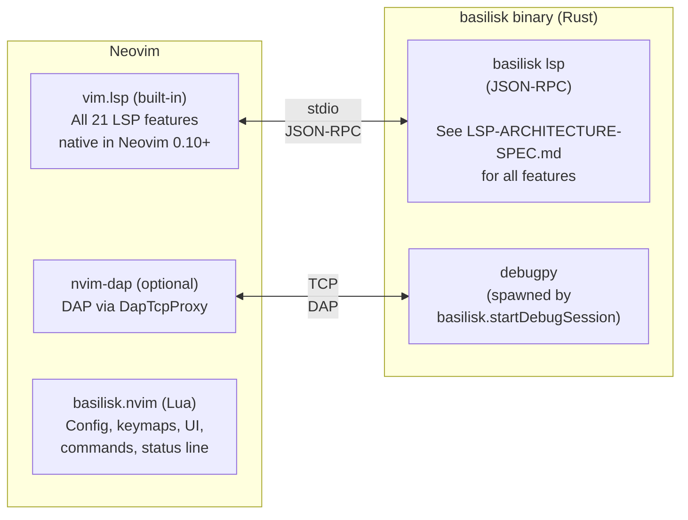

# Basilisk Neovim Extension (`basilisk.nvim`) {#NVIM}

Neovim plugin connecting to the same `basilisk lsp` binary as the VS Code and Zed extensions. All LSP features, DAP integration, custom commands, configuration, and binary resolution are defined in **`LSP-ARCHITECTURE-SPEC.md`** (single source of truth); this spec documents only **Neovim-specific details**. Targets the built-in Neovim 0.10+ LSP client (`vim.lsp.config` / `vim.lsp.enable`).

---

## Architecture {#NVIM-ARCHITECTURE}



---

## Plugin Structure {#NVIM-PLUGIN-STRUCTURE}

```
basilisk.nvim/
├── plugin/
│   └── basilisk.lua              # Auto-loaded entry: guard, user commands, autocmds
├── lua/
│   └── basilisk/
│       ├── init.lua              # setup() entry, config merge, module orchestration
│       ├── config.lua            # Defaults + LuaCATS type annotations + validation
│       ├── binary.lua            # Binary resolution (see LSP-ARCHITECTURE-SPEC.md for cascade)
│       ├── update.lua            # :BasiliskUpdate / :BasiliskInstall flows [NVIM-BINARY-UPGRADE]
│       ├── lsp.lua               # LSP client config, lifecycle, error recovery
│       ├── dap.lua               # nvim-dap adapter, configs, DapTcpProxy
│       ├── commands.lua          # :Basilisk* user commands
│       ├── profiling.lua         # Profiling commands (see LSP-ARCHITECTURE-SPEC.md for LSP commands)
│       ├── memory.lua            # Memory commands (see LSP-ARCHITECTURE-SPEC.md for LSP commands)
│       ├── testing.lua           # Test discovery, tree UI, run/debug
│       ├── statusline.lua        # Status line component (lualine compat)
│       ├── health.lua            # :checkhealth basilisk
│       └── log.lua               # Logger (vim.notify + optional file)
├── ftplugin/
│   └── python.lua                # Auto-loaded for Python: keymaps, inlay hints, code lens
├── after/
│   └── lsp/
│       └── basilisk.lua          # Neovim 0.11+ native LSP config (fallback for non-setup users)
├── doc/
│   └── basilisk.txt              # Vim help file
└── tests/
    ├── minimal_init.lua          # Isolated test init
    └── basilisk/
        ├── binary_spec.lua
        ├── config_spec.lua
        └── lsp_spec.lua
```

---

## LSP Client Configuration {#NVIM-LSP-CLIENT-CONFIGURATION}

Uses the Neovim 0.10+ API (nvim-lspconfig is NOT a hard dependency):

```lua
-- lua/basilisk/lsp.lua
vim.lsp.config('basilisk', {
  cmd = { resolved_binary_path, 'lsp' },
  filetypes = { 'python' },
  root_markers = { 'pyproject.toml', 'setup.py', 'setup.cfg', '.git' },
  settings = {
    basilisk = {
      -- All settings from LSP-ARCHITECTURE-SPEC.md "Shared Configuration Settings"
      python = config.python,
      analysisMode = config.analysis_mode,
      inlayHints = {
        parameterNames = config.inlay_hints.parameter_names,
        variableTypes = config.inlay_hints.variable_types,
      },
      -- Formatter engine: "ruff" (Ruff formatter embedded in the Basilisk
      -- binary, in-process — no external ruff binary) or "none". [LSPFMT-CONFIG]
      formatter = config.formatter,
    }
  }
})

vim.lsp.enable('basilisk')
```

### Neovim API Mappings for LSP Features {#NVIM-LSP-CLIENT-CONFIGURATION-API-MAPPINGS}

All 21 LSP features (LSP-ARCHITECTURE-SPEC.md) are native in Neovim 0.10+ — zero custom implementation:

| LSP Feature | Neovim API |
|------------|------------|
| Diagnostics | `vim.diagnostic.*` (automatic) |
| Hover | `vim.lsp.buf.hover()` |
| Go to Definition/Declaration/Type | `vim.lsp.buf.definition()` / `declaration()` / `type_definition()` |
| References | `vim.lsp.buf.references()` |
| Rename | `vim.lsp.buf.rename()` |
| Completions | `vim.lsp.buf.completion()` / nvim-cmp integration |
| Signature Help | `vim.lsp.buf.signature_help()` |
| Document/Workspace Symbols | `vim.lsp.buf.document_symbol()` / `workspace_symbol()` |
| Inlay Hints | `vim.lsp.inlay_hint.enable()` |
| Semantic Tokens | Automatic via LSP client |
| Code Actions | `vim.lsp.buf.code_action()` |
| Formatting | `vim.lsp.buf.format()` |
| Code Lens | `vim.lsp.codelens.enable()` (0.12+) / `refresh()` (0.10–0.11 fallback) / `run()` |
| Call/Type Hierarchy | `vim.lsp.buf.incoming_calls()` / `outgoing_calls()` / `typehierarchy()` |
| Document Highlight | `vim.lsp.buf.document_highlight()` |
| Folding/Selection Ranges | Automatic via LSP client |

### Custom LSP Command Registration {#NVIM-LSP-CLIENT-CONFIGURATION-CUSTOM-COMMANDS}

> **Command Registration Rule**: See `LSP-ARCHITECTURE-SPEC.md` § Command Registration Rule. The plugin MUST NOT register commands the LSP server advertises via `executeCommandProvider`; the server is the single source of truth.

Register handlers for custom commands (defined in LSP-ARCHITECTURE-SPEC.md):

```lua
vim.lsp.commands['basilisk.organizeImports'] = function(cmd, ctx)
  -- Handle organize imports response
end
```

### Error Recovery {#NVIM-LSP-CLIENT-CONFIGURATION-ERROR-RECOVERY}

- Track restart count, auto-restart up to 3 times
- Exponential backoff: 1s, 2s, 4s
- After max restarts: `vim.notify` error + status line shows "error" state
- `:BasiliskRestart` resets counter and forces restart

---

## DAP Integration {#NVIM-DAP-INTEGRATION}

> See LSP-ARCHITECTURE-SPEC.md for DAP features, launch configurations, and the DapTcpProxy spec.

Detects `nvim-dap` at runtime via `pcall(require, 'dap')`; degrades gracefully if absent.

### Adapter Registration {#NVIM-DAP-INTEGRATION-ADAPTER-REGISTRATION}

```lua
dap.adapters.basilisk = function(callback, config)
  -- 1. Send basilisk.startDebugSession to running LSP
  -- 2. Receive {host, port, sessionId}
  -- 3. Start DapTcpProxy on random local port (vim.uv.new_tcp)
  -- 4. Return server adapter pointing to proxy port
  callback({ type = 'server', host = '127.0.0.1', port = proxy_port })
end
```

### DapTcpProxy (Lua/libuv) {#NVIM-DAP-INTEGRATION-DAP-TCP-PROXY}

Port of VS Code's `dap-proxy.ts` using `vim.uv` (libuv bindings); see LSP-ARCHITECTURE-SPEC.md for the full proxy spec. Uses:

- `vim.uv.new_tcp()` — TCP socket creation
- Content-Length header framing for DAP messages
- All interception rules from LSP-ARCHITECTURE-SPEC.md

### Default Configurations {#NVIM-DAP-INTEGRATION-DEFAULT-CONFIGURATIONS}

```lua
dap.configurations.python = {
  {
    type = 'basilisk',
    request = 'launch',
    name = 'Python: Current File (Basilisk)',
    program = '${file}',
    justMyCode = true,
    redirectOutput = true,
    console = 'integratedTerminal',
  },
  {
    type = 'basilisk',
    request = 'attach',
    name = 'Python: Attach (Basilisk)',
    connect = { host = '127.0.0.1', port = 5678 },
  },
}
```

### Optional Integrations {#NVIM-DAP-INTEGRATION-OPTIONAL-INTEGRATIONS}

- **nvim-dap-ui**: auto-open on `event_initialized`, auto-close on `event_terminated`
- **nvim-dap-virtual-text**: enable for type-aware inline variable display

---

## Neovim User Commands {#NVIM-USER-COMMANDS}

All profiling/memory/test LSP commands (LSP-ARCHITECTURE-SPEC.md) surface as Neovim user commands:

| Neovim Command | LSP Command (from LSP-ARCHITECTURE-SPEC.md) | UI |
|---------------|-------------------------------|-----|
| `:BasiliskRestart` | — (client-side) | Restart LSP server |
| `:BasiliskInfo` | — (client-side) | Show server status |
| `:BasiliskUpdate` | — (client-side) | Upgrade the binary to the latest release ([NVIM-BINARY-UPGRADE]) |
| `:BasiliskInstall` | — (client-side) | First-use binary bootstrap ([NVIM-BINARY-UPGRADE-INSTALL]) |
| `:BasiliskOrganizeImports` | `basilisk.organizeImports` | — |
| `:BasiliskProfile [pid]` | `basilisk.profiler.start` | — |
| `:BasiliskProfileStop` | `basilisk.profiler.stop` | Floating window + quickfix |
| `:BasiliskProfileSnapshot` | `basilisk.profiler.snapshot` | — |
| `:BasiliskMemLeak` | `basilisk.memory.start` | — |
| `:BasiliskMemStop` | `basilisk.memory.diff` | Floating window |
| `:BasiliskMemRefs <Type>` | `basilisk.memory.references` | Floating window (with completion) |
| `:BasiliskTestDiscover` | — (runs pytest) | Refresh test tree |
| `:BasiliskTestRun [id]` | — (runs pytest) | Run test(s) |
| `:BasiliskTestDebug [id]` | — (triggers DAP) | Debug test |
| `:BasiliskTestToggle` | — (client-side) | Toggle test explorer panel |
| `:BasiliskDebugFile` | `basilisk.startDebugSession` | Start debugging current file |

### Profiling UI {#NVIM-USER-COMMANDS-PROFILING-UI}

- Heat map: `nvim_buf_set_extmark()` with virtual text on hot lines
- Flamegraph: export to speedscope JSON, open browser via `vim.ui.open()`
- Hot function list: quickfix list or floating window

### Memory UI {#NVIM-USER-COMMANDS-MEMORY-UI}

- Leak report: floating window with formatted output
- Retention paths: floating window with confidence scores
- Completion for `:BasiliskMemRefs`: common types (DataFrame, dict, list, set, ndarray, Tensor) + workspace types

---

## Test Explorer {#NVIM-TEST-EXPLORER}

> See `LSP-TEST-INTEGRATION-SPEC.md` for full test explorer architecture, data model, configuration, and features.
> Neovim-specific wiring (tree UI, keymaps, nvim-dap integration) is documented in the Neovim section of that spec.

---

## Status Line {#NVIM-STATUS-LINE}

A component for any status line plugin (lualine, heirline, etc.):

```lua
-- Usage in lualine:
sections = {
  lualine_x = { require('basilisk.statusline').lualine_component },
}
```

States (matching VS Code/Zed behavior):

| State | Display | Color |
|-------|---------|-------|
| Starting | `⟳ Basilisk` | Yellow |
| Ready (no errors) | `✓ Basilisk` | Green |
| Ready (with errors) | `⚠ Basilisk (3E 2W)` | Orange |
| Error | `✗ Basilisk` | Red |
| Stopped | `⊘ Basilisk` | Grey |

---

## Default Keymaps {#NVIM-DEFAULT-KEYMAPS}

Set via `LspAttach` autocmd in `ftplugin/python.lua`. All configurable, can be disabled.

### Standard LSP (no prefix) {#NVIM-DEFAULT-KEYMAPS-STANDARD-LSP}

| Key | Action |
|-----|--------|
| `gd` | Go to definition |
| `gD` | Go to declaration |
| `gy` | Go to type definition |
| `gr` | Find references |
| `K` | Hover |
| `<C-k>` | Signature help |
| `<leader>rn` | Rename |
| `<leader>ca` | Code action |

### Basilisk-specific (`<leader>b` prefix, configurable) {#NVIM-DEFAULT-KEYMAPS-BASILISK-SPECIFIC}

| Key | Action |
|-----|--------|
| `<leader>br` | Restart server |
| `<leader>bo` | Organize imports |
| `<leader>bp` | Start profiling |
| `<leader>bP` | Stop profiling |
| `<leader>bm` | Start memory tracking |
| `<leader>bM` | Stop memory tracking |
| `<leader>bt` | Toggle test explorer |
| `<leader>bd` | Debug current file |
| `<leader>bR` | Run test at cursor |
| `<leader>bD` | Debug test at cursor |

---

## Neovim-Only Configuration {#NVIM-NEOVIM-ONLY-CONFIGURATION}

Neovim-specific settings (not in LSP-ARCHITECTURE-SPEC.md):

| Setting | Default | Description |
|---------|---------|-------------|
| `keymaps.enabled` | `true` | Set default keymaps |
| `keymaps.prefix` | `"<leader>b"` | Basilisk-specific keymap prefix |
| `statusline.enabled` | `true` | Enable status line component |
| `test_explorer.position` | `"right"` | Test panel position |
| `test_explorer.width` | `40` | Test panel width |
| `log_level` | `"info"` | Logging verbosity |

All shared settings are defined in LSP-ARCHITECTURE-SPEC.md and passed through to the LSP server.

---

## Binary Install & Upgrade {#NVIM-BINARY-UPGRADE}

The plugin owns the full lifecycle of the binary it downloads: detect → notify → confirm → install → restart. There is no dead end — every "update available" notice names the exact action that performs the upgrade.

### Release Assets {#NVIM-BINARY-UPGRADE-ASSETS}

`binary.platform_asset_name()` must byte-match the `archive:` entries published by `release.yml`:

| Platform | Asset | Layout |
|---|---|---|
| Linux x86_64 / aarch64 | `basilisk-<arch>-unknown-linux-gnu.tar.gz` | `basilisk` at archive root |
| macOS aarch64 (only) | `basilisk-aarch64-apple-darwin.zip` | `basilisk-darwin/{basilisk, basilisk-profiler-helper}` — extraction must flatten (`unzip -j`) and chmod both |
| Windows x86_64 / aarch64 | `basilisk-<arch>-pc-windows-msvc.zip` | `basilisk.exe` at archive root |

No `x86_64-apple-darwin` build is published; on Intel macs `platform_asset_name()` returns `nil` and the flows fall back to advising `cargo install basilisk-cli`. Any drift between this table and `release.yml` makes `download()` silently find no asset — the binary_spec contract test pins the exact names.

### Install Sources & Refusal {#NVIM-BINARY-UPGRADE-SOURCES}

`binary.install_source(path)` classifies where a resolved binary came from, and `:BasiliskUpdate` only replaces installs the plugin may own:

| Source | Detection | `:BasiliskUpdate` behavior |
|---|---|---|
| `managed` | under `stdpath("data")/basilisk/` | upgrade in place (new versioned dir) |
| `manual` | anything unclassified | upgrade — installs into the managed cache, original file untouched |
| `homebrew` | `/opt/homebrew/`, `/Cellar/`, `/linuxbrew/` | refuse → `brew upgrade basilisk` |
| `scoop` | path contains `/scoop/` | refuse → `scoop update basilisk` |
| `cargo` | `~/.cargo/bin/` | refuse → `cargo install basilisk-cli` |
| `dev` | `--version` reports `0.0.0` (placeholder) | refuse → rebuild the checkout; never nagged by the update notice |

### Update Notice {#NVIM-BINARY-UPGRADE-NOTICE}

`binary.check_for_updates()` (async, on setup) compares the resolved binary's version to the latest GitHub release and notifies with the **owning** upgrade action via `binary.upgrade_hint(source)`: `:BasiliskUpdate` for managed/manual installs, the package manager's own command otherwise, and silence for dev builds.

### Confirmation {#NVIM-BINARY-UPGRADE-CONFIRM}

`:BasiliskUpdate` / `:BasiliskInstall` never touch the network without an accept step: `vim.ui.select({"Update now", "Later"})` (respectively `Install now`), with the version — and for installs the asset name — in the prompt. On accept, `update.lua` reuses `binary.download()` (the `resolve()` step-7 engine — never a second downloader), rewires `config.binary_path`, and force-restarts the LSP client.

### First-Use Install {#NVIM-BINARY-UPGRADE-INSTALL}

`:BasiliskInstall` bootstraps when nothing is resolvable: `binary.locate()` (cascade steps 1–6, download-free) finds nothing → confirm → download → start. If a binary already exists it reports the path/version and points at `:BasiliskUpdate`. `:BasiliskUpdate` with no install falls through to this flow.

---

## Health Check {#NVIM-HEALTH-CHECK}

`:checkhealth basilisk` reports:

- Neovim version >= 0.10 (required)
- `basilisk` binary found + version (when missing, the advice names `:BasiliskInstall` first — [NVIM-BINARY-UPGRADE-INSTALL])
- Python interpreter found + version
- `debugpy` installed (optional, for DAP)
- `nvim-dap` available (optional, for debugging)
- `nvim-dap-ui` available (optional, for debug UI)
- `ruff` available (optional, for formatting)

---

## Distribution {#NVIM-DISTRIBUTION}

### Primary: Standalone Plugin {#NVIM-DISTRIBUTION-PRIMARY-STANDALONE}

```lua
-- lazy.nvim
{ 'Nimblesite/basilisk.nvim', ft = 'python',
  dependencies = { 'mfussenegger/nvim-dap' } }  -- optional

-- vim.pack (built-in, Neovim 0.12+) — no third-party plugin manager
vim.pack.add({
  { src = 'https://github.com/Nimblesite/basilisk.nvim',
    version = vim.version.range('*') },  -- latest stable tag; or pin 'v0.5.0'
})

-- Usage
require('basilisk').setup({})  -- zero-config, works out of the box
```

### Secondary: nvim-lspconfig PR {#NVIM-DISTRIBUTION-SECONDARY-LSPCONFIG-PR}

Submit `lsp/basilisk.lua` to nvim-lspconfig for users wanting basic LSP only:

```lua
-- Minimal nvim-lspconfig setup (no DAP, no test explorer, no profiling)
require('lspconfig').basilisk.setup({})
```

### CI {#NVIM-DISTRIBUTION-CI}

GitHub Actions: run plenary.nvim tests on Neovim 0.10, 0.11, nightly.

### Release & Versioning {#NVIM-DISTRIBUTION-RELEASE}

`basilisk.nvim/` is canonical in the `Nimblesite/Basilisk` monorepo, but plugin managers (and `vim.pack`) install only a repo whose root *is* the plugin — none install from a subdirectory. On each `vX.Y.Z` tag, the `publish-nvim` job in `release.yml` mirrors the `basilisk.nvim/` tree to the standalone repo **`Nimblesite/basilisk.nvim`** (the repo users install), using the same convention as `publish-homebrew` / `publish-scoop`: clone the sibling repo with the shared `BREW_SCOOP_PAT` via `x-access-token`, replace its content with the plugin tree, commit as `github-actions[bot]` (`basilisk ${VERSION}`), and push.

The mirror is tagged with the identical `vX.Y.Z`, so the plugin version matches the binary that `binary.lua` auto-downloads from `Nimblesite/Basilisk` releases and that version-pinned installs (`vim.pack` / lazy.nvim) resolve. Versioning is **tag-only** — no embedded version string; `:BasiliskInfo` and `:checkhealth basilisk` report the binary version, which equals the tag.

See `docs/plans/NEOVIM-RELEASE-PLAN.md` for the full rollout, secrets, and the LuaRocks / nvim-lspconfig secondary channels.
