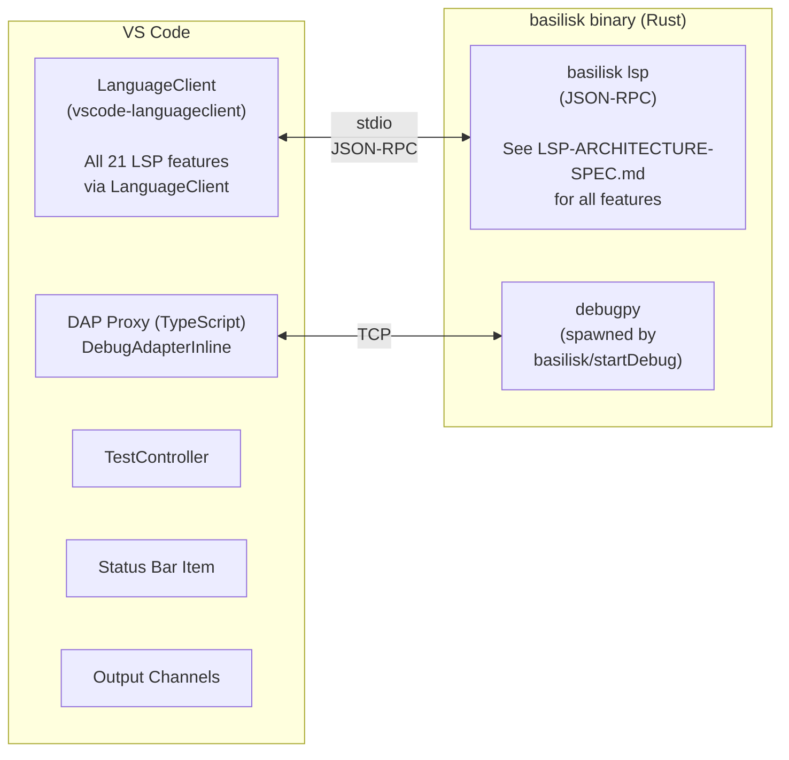
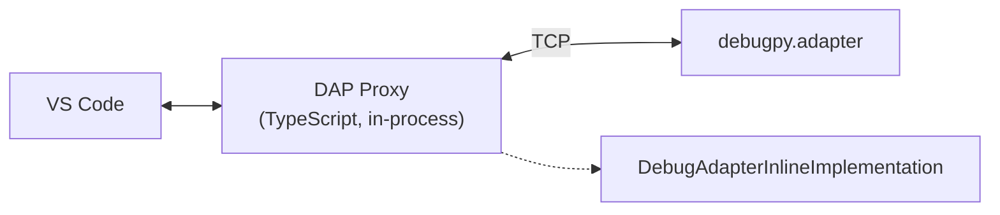

# Basilisk VS Code Extension {#VSIX}

VS Code extension connecting to the `basilisk lsp` binary. All LSP features, DAP integration, custom commands, configuration, and binary resolution are defined in **`LSP-ARCHITECTURE-SPEC.md`** (single source of truth). This spec documents only **VS Code-specific details**, kept at feature parity with the Zed and Neovim extensions.

## Architecture {#VSIX-ARCHITECTURE}



- VSIX bundles a pre-compiled LSP server binary per platform
- No Node.js dependency for the server; the activation layer uses VS Code's extension API
- Configuration exposed via VS Code settings with JSON schema validation

---

## Extension Structure {#VSIX-EXTENSION-STRUCTURE}

`src/` is flat and file-per-concern (63 `.ts` files); the groups below are naming
prefixes, not directories. Files carry an `// Implements [ID]` header pointing at
the spec section they realise.

```
vscode-extension/
├── src/
│   ├── extension.ts                  # Activation entry: wires every group below
│   ├── lsp-client.ts, lsp-document-selector.ts,  # Client construction, selector,
│   │   lsp-trace.ts, subprocess-mode.ts          #   trace channel, CLI fallback
│   ├── store*.ts, reactive-refresh.ts  # THE single Signals state container
│   ├── logger.ts                     # Output channel + log file [VSIX-OUTPUT-CHANNELS]
│   ├── result.ts, timeouts.ts, progress-ops.ts, shipwright-runtime.ts
│   ├── configuration-editor*.ts      # Config editor [VSIX-CONFIGURATION-EDITOR-FILES]
│   ├── dap-proxy.ts, dap-evaluate.ts, dap-output.ts, debug-adapter.ts
│   ├── profiler*.ts, profile-server.ts  # CPU profiler: webview, flamegraph, decorations
│   ├── memory-*.ts                   # Memory profiler: dashboard, ref graph, autopilot
│   ├── process-*.ts, processes-state.ts,  # Process Explorer, Module Explorer,
│   │   module-explorer*.ts, info-panel.ts #   sidebar info panel [EXTACT-INFO]
│   ├── test-explorer.ts,             # TestController [VSIX-TEST-EXPLORER-INTEGRATION]
│   │   coverage-decorations.ts       #   + coverage gutter decorations
│   └── test/                         # runTest.ts, suite/*.test.ts, fixtures/, real-world/
├── package.json                      # Commands, settings, keybindings, views, debuggers
├── tsconfig.json, eslint.config.mjs, eslint-rules.cjs, .vscode-test.mjs
├── shipwright.json                   # Release manifest (scripts/sync-shipwright-manifest.mjs)
└── scripts/, resources/, images/     # Build/staging helpers, activity-bar icon, art
```

---

## LSP Client Configuration {#VSIX-LSP-CLIENT-CONFIGURATION}

> See `LSP-ARCHITECTURE-SPEC.md` for all LSP features, custom commands, and shared configuration settings.

```typescript
const serverOptions: ServerOptions = {
  command: resolvedBinaryPath,  // resolved via binary resolution cascade (LSP-ARCHITECTURE-SPEC.md)
  args: ["lsp"],
};

const clientOptions: LanguageClientOptions = {
  documentSelector: [
    { scheme: "file", language: "python" },
    { scheme: "file", pattern: "**/pyproject.toml" },
  ],
  synchronize: { configurationSection: "basilisk" },
  initializationOptions: readBasiliskSettings(),
};

client = new LanguageClient("basilisk", "Basilisk Type Checker", serverOptions, clientOptions);
client.start();
```

---

## Commands {#VSIX-COMMANDS}

> **Command Registration Rule**: See `LSP-ARCHITECTURE-SPEC.md` § Command Registration Rule. The extension MUST NOT call `registerCommand()` for any command the LSP server advertises — `vscode-languageclient` auto-registers those from the server's `executeCommandProvider` capabilities. Client-side UI (input prompts, toasts) belongs in the `executeCommand` middleware.

### `package.json` contribution {#VSIX-COMMANDS-PACKAGE-JSON-CONTRIBUTION}

`contributes.commands` holds the **client-side** commands only — every entry
carries `"category": "Basilisk"`. Server-advertised commands — `basilisk.runTests`,
`basilisk.runTestFile`, `basilisk.debugTest`, `basilisk.runTestsCoverage` and the
rest declared in `crates/basilisk-common/src/lib.rs` — are deliberately **absent**:
`vscode-languageclient` registers them from `executeCommandProvider`, per the rule
above.

| Group | Commands (`basilisk.` prefix elided) |
|---|---|
| Server & status | `restartServer`, `showOutput`, `statusMenu`, `openWalkthrough` |
| Configuration editor | `openConfigurationEditor`, `editConfig` |
| Fixes & adoption | `organizeImports`, `fixFile`, `fixFileAll`, `fixWorkspace`, `fixWorkspaceAll`, `adoptFile`, `adoptWorkspace`, `unadoptFile` |
| uv | `uv.sync`, `uv.add`, `uv.addDev`, `uv.remove`, `uv.lock`, `uv.createEnv` |
| Module Explorer | `refreshModuleExplorer`, `sortModuleExplorer`, `toggleModuleExplorerView`, `filterModuleExplorer`, `copyImportPath`, `copyQualifiedName` |
| CPU profiler | `profileStart`, `profileStop`, `profileSnapshot`, `profileAttachToDebug`, `profileShowResults`, `profileCurrentFileCpu`, `profileProcess` |
| Memory profiler | `memoryMenu`, `memoryStart`, `memorySnapshot`, `memoryStop`, `memoryDiff`, `memoryGcCollect`, `memoryReferences`, `trackMemoryCurrentFile`, `memoryTrackProcess` |
| Process Explorer | `refreshProcesses`, `sortProcesses`, `groupProcesses`, `filterProcesses`, `copyProcessPid`, `revealProcessScript` |
| Info panel | `info.runAction` |

Palette visibility is narrowed in `contributes.menus.commandPalette`:

- `openConfigurationEditor` appears only under `basilisk.configurationEditorSupported` (the same context key gates its `enablement`, as it does `editConfig`'s);
- `editConfig`, `info.runAction`, `profileProcess`, `memoryTrackProcess`, `copyProcessPid` and `revealProcessScript` are `"when": false` — context-menu / view-title actions only;
- the seven in-session memory commands — `memoryMenu`, `memoryStart`,
  `memorySnapshot`, `memoryDiff`, `memoryGcCollect`, `memoryReferences`,
  `memoryStop` — are gated on `basilisk.debugging`, so the palette offers them
  only while a debug session is live. `trackMemoryCurrentFile` is deliberately
  ungated: it *starts* the tracked session, so gating it on `basilisk.debugging`
  would make it unreachable. (`memoryTrackProcess` is `"when": false`, above.)

---

## Configuration Editor {#VSIX-CONFIGURATION-EDITOR}

The VSIX is the first visual client for
[CONFIGEDITOR](LSP-CONFIGURATION-EDITOR-SPEC.md#CONFIGEDITOR). It contributes
the client-only command **Basilisk: Open Configuration Editor**
(`basilisk.openConfigurationEditor`), a settings-gear action in the Basilisk
activity view, and an **Edit Config** item (`basilisk.editConfig`, hidden from
the palette) at the top of the file-explorer context menu on `pyproject.toml`
(`explorer/context`, group `navigation@1`), which opens the editor for the
workspace folder that owns the clicked file. The command opens one full-width
editor-tab webview; it does not take over `pyproject.toml` as a custom editor
and does not put the full rule catalog into the narrow sidebar.

The command is exposed only when the server advertises
`capabilities.experimental.basilisk.configurationEditor` — pure presence, no
version negotiation: the editor ships with the server. Opening
the tab, revealing raw config, and navigating to an occurrence are VS Code UI
actions. Configuration changes use the shared
snapshot/preview/apply/occurrence methods in
[LSPARCH-CONFIG-EDITOR-PROTOCOL](LSP-ARCHITECTURE-SPEC.md#LSPARCH-CONFIG-EDITOR-PROTOCOL).

### Thin-shell boundary {#VSIX-CONFIGURATION-EDITOR-THIN-SHELL}

The webview posts user intent only: select a tag/rule, stage a severity entry
or an entry removal, request/apply a preview, or open docs/location. The
extension host runtime-decodes the message and forwards server-owned intent. It
MUST NOT:

- ship a rule or tag list;
- parse TOML or calculate effective severity;
- expand a bulk selector;
- write configuration files;
- infer that a rule is enabled from VS Code settings.

The VSIX contributes no `basilisk.rules.*`, strictness, or suppression policy
settings. Those values live only in the project's config files and are accessed
through the LSP snapshot/transaction API.

Snapshot/loading/error/revision state lives in the extension's single Signals
store (`src/store.ts`), with explicit actions; no mutable state lives in the
panel host or hidden DOM. On reveal, the panel refetches authoritative LSP state
instead of retaining a stale background document. While visible, it refreshes on
the server's `basilisk/configurationChanged` push — the server watches every
configuration source itself and pushes after every change (editor apply,
open-buffer edit, external disk edit), so the panel never polls and is never
left stale ([LSPARCH-CONFIG](LSP-ARCHITECTURE-SPEC.md#LSPARCH-CONFIG)).

### Hosting and visual contract {#VSIX-CONFIGURATION-EDITOR-HOST}

Reuse the lifecycle and security primitives in `src/profiler-webview.ts`
(singleton host, once-bound message handler, nonce, safe JSON embedding), but
use a stricter document policy: default-deny CSP, local nonce-gated scripts,
no remote resources, `localResourceRoots: []`, and no
`retainContextWhenHidden`. Data is sent with `webview.postMessage` only after a
ready handshake, never interpolated into executable HTML.

The editor renders the tag-first Rules view defined by
[CONFIGEDITOR-VSIX-EXPERIENCE](LSP-CONFIGURATION-EDITOR-SPEC.md#CONFIGEDITOR-VSIX-EXPERIENCE).
It uses native VS Code fonts/theme tokens plus restrained Basilisk orange/sky
accents. All controls are semantic, text-labelled, keyboard-operable, high-
contrast safe, usable at 200% zoom, and reduced-motion aware. Apply/conflict
status uses an `aria-live` region and refreshes preserve focus.

Rules are virtualized and organized by the server's Sources, PEP categories,
and Policy tags. Tag groups expose the tag-entry control; rows expose
per-rule entry controls — Error, Warning, Info, and remove-entry, plus
Disabled only on analyze rows: PEP rules have no disable control because no
disable exists for them
([CHKARCH-CONFIG-MODEL](CHECKER-ARCHITECTURE-SPEC.md#CHKARCH-CONFIG-MODEL)).
Occurrences load in cursor pages and navigation is restricted to the selected
workspace root. Every change is previewed, and the preview's diagnostic
impact makes the consequence visible before apply.

### Implementation files and tests {#VSIX-CONFIGURATION-EDITOR-FILES}

Implementation lives in `vscode-extension/src/`, split into focused files each
kept under the repository's 500-LOC ceiling:

- `configuration-editor.ts` — panel lifecycle and intent routing;
- `configuration-editor-transport.ts` — the LSP seam: capability probe, the
  `ConfigurationEditorTransport` request wrapper, and workspace-root selection
  (re-exported from `configuration-editor.ts`, so callers still import the
  editor's public surface from one module);
- `configuration-editor-registration.ts` — capability-gated command registration
  (`basilisk.openConfigurationEditor` / `basilisk.editConfig` + context key);
- `configuration-editor-document.ts` — CSP HTML document;
- `configuration-editor-model.ts` — generated wire DTOs/projections;
- `configuration-editor-state.ts` — store actions and immutable state;
- `configuration-editor-intents.ts` — runtime decoder for untrusted messages;
- `configuration-editor-errors.ts` — structured error routing, including
  revision-conflict classification;
- `configuration-editor-typeshed.ts` — native typeshed controls and the
  read-only license document provider
  ([LSPCFGED-TYPESHED](LSP-CONFIGURATION-EDITOR-SPEC.md#LSPCFGED-TYPESHED));
- `configuration-editor-styles.ts` and `configuration-editor-script*.ts`
  (`-core`, `-events`, `-render`, `-typeshed`, assembled by
  `configuration-editor-script.ts`) — dependency-free visual/runtime fragments.

Focused VSIX tests exercise all four persisted severities plus entry removal,
tag/all selectors, exact preview/apply identity, paged
occurrences, revision conflicts, capability gating, once-bound handlers,
CSP/data isolation, semantic labels, theme/responsive/reduced-motion styles,
and stale async result rejection. A headed screenshot scenario opens the real
webview against the real LSP and waits for a snapshot. Manual screen-reader,
200% zoom, cross-theme, and injection evidence plus the committed screenshot
remain release gates; see
[CONFIGEDITOR-PLAN-VSIX](../plans/LSP-CONFIGURATION-EDITOR-PLAN.md#CONFIGEDITOR-PLAN-VSIX).

Per repository policy tests do not use `getCommands(true)` or
`whenCommandReady` as command-existence tests.

---

## Configuration Settings (`package.json` contribution) {#VSIX-CONFIGURATION-SETTINGS}

> Shared settings (sent to the LSP server) are defined in `LSP-ARCHITECTURE-SPEC.md` § Shared Configuration Settings. Below is their `package.json` schema plus VS Code-only settings.

```json
{
    "basilisk.executablePath": {
        "type": "string", "default": "",
        "description": "Path to the basilisk binary. Leave empty to auto-detect."
    },
    "basilisk.python": {
        "type": "string", "default": "",
        "description": "Path to the Python interpreter. Leave empty to auto-detect."
    },
    "basilisk.enabled": {
        "type": "boolean", "default": true,
        "description": "Enable/disable the Basilisk type checker."
    },
    "basilisk.useLsp": {
        "type": "boolean", "default": true,
        "description": "Use LSP mode (true) or subprocess mode (false)."
    },
    "basilisk.analysisMode": {
        "type": "string",
        "enum": ["openFilesOnly", "wholeModule", "crossModule"],
        "default": "wholeModule",
        "description": "Analysis scope."
    },
    "basilisk.inlayHints.parameterNames": {
        "type": "boolean", "default": true,
        "description": "Show parameter name hints at call sites."
    },
    "basilisk.inlayHints.variableTypes": {
        "type": "boolean", "default": true,
        "description": "Show inferred type hints for unannotated variables."
    },
    "basilisk.formatter": {
        "type": "string", "enum": ["ruff", "none"], "default": "ruff",
        "description": "Formatter engine: 'ruff' (embedded Ruff formatter, in-process, no separate install) or 'none'. Replaces basilisk.ruff.* — see LSP-FORMATTING-SPEC.md#LSPFMT-CONFIG."
    },
    "basilisk.trace.server": {
        "type": "string",
        "enum": ["off", "messages", "verbose"],
        "default": "off",
        "description": "Trace LSP communication."
    },
    "basilisk.testExplorer.enabled": {
        "type": "boolean", "default": true,
        "description": "Enable Python test discovery and execution in Test Explorer."
    },
    "basilisk.testExplorer.framework": {
        "type": "string",
        "enum": ["pytest", "unittest", "auto"],
        "default": "auto",
        "description": "Test framework to use. 'auto' detects from project config."
    },
    "basilisk.testExplorer.pytestPath": {
        "type": "string", "default": "pytest",
        "description": "Path to the pytest executable."
    },
    "basilisk.testExplorer.args": {
        "type": "array",
        "items": { "type": "string" },
        "default": [],
        "description": "Additional arguments passed to the test runner."
    },
    "basilisk.testExplorer.autoDiscoverOnSave": {
        "type": "boolean", "default": true,
        "description": "Re-discover tests when test files are saved."
    },
    "basilisk.debugger.enabled": {
        "type": "boolean", "default": true,
        "description": "Enable Basilisk Python debugger."
    },
    "basilisk.debugger.typeChecking": {
        "type": "boolean", "default": false,
        "description": "Enable type assertion breakpoints during debugging."
    },
    "basilisk.debugger.debugpyPath": {
        "type": "string", "default": "debugpy",
        "description": "Path to the debugpy module."
    }
}
```

### VS Code-Only Settings {#VSIX-CONFIGURATION-SETTINGS-VS-CODE-ONLY}

| Setting | Default | Description |
|---------|---------|-------------|
| `basilisk.useLsp` | `true` | Use LSP mode vs subprocess fallback |
| `basilisk.trace.server` | `"off"` | LSP communication trace level |

All other settings are shared across editors (see `LSP-ARCHITECTURE-SPEC.md`).

---

## Status Bar {#VSIX-STATUS-BAR}

Persistent item showing server state and diagnostic count:
- `$(check) Basilisk` — green, server running, no errors
- `$(warning) Basilisk (3)` — errors in current file
- `$(error) Basilisk` — server failed/not running
- `$(sync~spin) Basilisk` — analyzing

Clicking the item runs `basilisk.statusMenu`, a quick-pick whose first entry is **Open Configuration Editor** (then Show Output, Restart Language Server) so configuration is reachable from anywhere — the item is always visible even when the sidebar is collapsed. The same settings-gear also appears in the title bar of every Basilisk sidebar view (Modules, Python Processes, Basilisk info), not just the info panel.

Future indicators: type completeness (`"87% typed"`), migration dashboard ([EXTENSION-ACTIVITY-PANEL-SPEC.md](EXTENSION-ACTIVITY-PANEL-SPEC.md)), ownership gutter icons (borrowed/owned/inout).

---

## Error Recovery {#VSIX-ERROR-RECOVERY}

- `errorHandler` on `LanguageClient` for auto-restart (max 3 attempts, exponential backoff)
- User-visible error message when server fails to start
- `basilisk.restartServer` command for manual recovery
- Subprocess fallback mode when `basilisk.useLsp` is `false`

---

## Test Explorer Integration {#VSIX-TEST-EXPLORER-INTEGRATION}

> See `LSP-TEST-INTEGRATION-SPEC.md` for full test explorer architecture, data model, configuration, and features.
> VS Code-specific wiring (TestController API, TestRunProfile) is documented in the VS Code section of that spec.

---

## Python Debugger (DAP) {#VSIX-PYTHON-DEBUGGER-DAP}

> See `LSP-ARCHITECTURE-SPEC.md` § Custom LSP Commands for `basilisk/startDebugSession` and `basilisk/stopDebugSession`.
> See `LSP-ARCHITECTURE-SPEC.md` § DapTcpProxy for the shared proxy specification that all editors implement.

### VS Code-Specific DAP Architecture {#VSIX-PYTHON-DEBUGGER-DAP-ARCHITECTURE}



The LSP server spawns `debugpy.adapter --port <free-port>` via `basilisk/startDebugSession`. The proxy connects to that port and relays DAP messages bidirectionally, intercepting specific patterns.

### Starting a session (zero-config) {#VSIX-PYTHON-DEBUGGER-START}

The `basilisk-debug` debugger is **factory-based** (no `program`/`runtime` in the manifest), so the extension owns both activation and config provisioning:

- **Activation:** `activationEvents` includes `onDebug`, `onDebugResolve:basilisk-debug`, and `onDebugDynamicConfigurations:basilisk-debug`, so the adapter/tracker register whenever debugging starts — not only after a Python file is opened.
- **Config provider:** `createBasiliskDebugConfigProvider` (`debug-adapter.ts`), registered for `basilisk-debug` (Dynamic + default), makes **"Run and Debug" / F5 work with no `launch.json`**: `provideDebugConfigurations` offers a "Python: Current File (Basilisk)" entry, and `resolveDebugConfiguration` (pure `applyDebugConfigDefaults`) fills an empty/partial config to launch the active file (`program: ${file}`). Without it, an empty-state workspace shows no Basilisk debug option.

### Tracker capture {#VSIX-PYTHON-DEBUGGER-DAP-TRACKER}

`BasiliskDebugAdapterTracker` is the single observability point for debugpy → VS Code traffic. It captures the debuggee's `process` event (`systemProcessId`, used by the CPU profiler — see [LSP-PROFILING-SPEC.md] `#PROFILE-SAME-PROCESS`) and `output` events (the `__BASILISK_MEM*__` payloads the memory round-trip recovers, since debugpy delivers `print()` output here, not in `evaluate`).

### Debug Adapter Proxy (VS Code Implementation) {#VSIX-PYTHON-DEBUGGER-DAP-PROXY}

The proxy (`vscode-extension/src/dap-proxy.ts`) implements `vscode.DebugAdapter` via `DebugAdapterInlineImplementation`, fixing five debugpy quirks:

**Quirk 1 — stepOut lands before assignment**: after `stepOut`, debugpy stops at the call-site line *before* the return value is assigned. The proxy detects the `stepOut` response → first `stopped` event sequence and injects an automatic `next`, swallowing the intermediate stop.

**Quirk 2 — structural line stops during stepOver**: debugpy stops on `try:` lines during `next`. The proxy requests a `stackTrace`, reads the source, and if the stopped line matches `/^\s*(try\s*:)\s*(#.*)?$/`, injects another `next`. `except:` and `finally:` are NOT skipped.

**Quirk 3 — single-connection slot protection**: `debugpy.adapter --port` accepts exactly one TCP connection. The proxy's bind-based `isPortAlive` check (attempt to bind, `EADDRINUSE` = alive) is non-destructive. In attach mode, if the port is dead, the factory respawns debugpy via the LSP.

**Quirk 4 — session termination timing**: VS Code's `activeDebugSession` may not be cleared when `onDidTerminateDebugSession` fires. The proxy sends `exited` before `terminated`, with a minimal delay.

**Quirk 5 — dropped `terminate` response**: when the debuggee exits as a result of a `terminate` request, debugpy can emit `exited`/`terminated` and close the socket without ever answering the request — VS Code then rejects `stopDebugging()` with "Canceled". The proxy tracks the pending `terminate`, answers it itself once the debuggee is provably gone (the `terminated` event, or socket death), and swallows debugpy's late duplicate — the same guarantee the disconnect/attach shims provide.

### DAP Features {#VSIX-PYTHON-DEBUGGER-DAP-FEATURES}

> See `LSP-ARCHITECTURE-SPEC.md` § DapTcpProxy for the full shared feature list.

| Feature | Description |
|---------|-------------|
| Launch & Attach | Launch Python scripts or attach to running processes |
| Breakpoints | Line, conditional, logpoint, function, exception breakpoints |
| Step execution | Step in, step over, step out, continue, pause |
| Variable inspection | View locals, globals, closures with full type info from Basilisk |
| Watch expressions | Evaluate expressions in the current scope |
| Call stack | Full call stack with source navigation |
| Type-aware hover | Hover shows both runtime value AND static type (from LSP) |
| Type assertions | Break when a runtime type doesn't match the static annotation |

**Type-aware debugging** (Basilisk-specific):
- **Type mismatch breakpoints**: break when a variable's runtime type doesn't match its annotation
- **Annotation overlay**: debug hover shows `(static: str, runtime: str)` side-by-side
- **Type narrowing visualization**: show which branch of a union is active at a breakpoint
- **Parameter contract verification**: warn when an argument violates its annotation at runtime

### Launch Configurations {#VSIX-PYTHON-DEBUGGER-DAP-LAUNCH-CONFIGURATIONS}

```json
{
    "type": "basilisk",
    "request": "launch",
    "name": "Basilisk: Run Current File",
    "program": "${file}",
    "python": "${command:python.interpreterPath}",
    "args": [],
    "env": {},
    "console": "integratedTerminal",
    "typeChecking": true
}
```

```json
{
    "type": "basilisk",
    "request": "attach",
    "name": "Basilisk: Attach to Process",
    "connect": { "host": "localhost", "port": 5678 },
    "typeChecking": true
}
```

---

## Binary Resolution {#VSIX-BINARY-RESOLUTION}

See [`LSP-ARCHITECTURE-SPEC.md` § LSPARCH-BINRES](LSP-ARCHITECTURE-SPEC.md#LSPARCH-BINRES)
— single source of truth for all binary resolution.

---

## Output Channels {#VSIX-OUTPUT-CHANNELS}

- `"Basilisk"` — main output channel for server messages
- `"Basilisk LSP Trace"` — LSP communication trace (when `basilisk.trace.server` is enabled)
- File log sink: `/tmp/basilisk-debug-trace.log` for debug-level logging

`basilisk.trace.server` is the one documented trace switch, so the trace
channel is a config-driven adapter (`src/lsp-trace.ts`): vscode-languageclient
10 only traces while the trace channel's own `logLevel` is `Trace` — a hidden
per-channel VS Code gesture — so the adapter derives its `logLevel` from the
setting and fires `onDidChangeLogLevel` on changes. A plain `LogOutputChannel`
here left the channel permanently blank (GitHub #201).

---

## Binary Distribution {#VSIX-BINARY-DISTRIBUTION}

The VSIX bundles pre-compiled `basilisk` binaries per platform:
- `basilisk-x86_64-apple-darwin`
- `basilisk-aarch64-apple-darwin`
- `basilisk-x86_64-unknown-linux-gnu`
- `basilisk-aarch64-unknown-linux-gnu`
- `basilisk-x86_64-pc-windows-msvc`

## Build & Packaging Parity {#VSIX-PACKAGING-PARITY}

The shipped VSIX and the tested VSIX **must be the same artifact**. A single recipe owns packaging; every path routes through it:

| Path | Entry point | Purpose |
|---|---|---|
| Release | `.github/workflows/release.yml` `vsix` job | builds & publishes the per-platform VSIX |
| Local install | `make reinstall-vsix` / `make reinstall-vsix-macos` | clean rebuild + install the exact release VSIX |
| E2E gate | `make _test_vsix` (→ `_release_vsix`) | runs the e2e suite against the staged release bundle |

Invariants:

- **One packaging recipe.** `_release_vsix` (Makefile) mirrors the release `vsix` job step for step: `cargo build --release --target <triple>` for every bundled binary, `stage-runtime.mjs` to stage the manifest-declared binaries into `bin/<platform>/`, `vendor-debugpy.mjs`, then `vsce package --target <platform> --ignore-other-target-folders`.
- **One staging helper.** `stage-runtime.mjs` is the only code deciding which binaries enter the bundle — used by the release workflow, `_release_vsix`, and `_test_vsix` — so contents are manifest-driven everywhere and cannot drift between tested and shipped packages.
- **Tests run the shipped bytes.** `_test_vsix` builds via `_release_vsix` and runs the e2e suite against that staged directory — the exact tree `vsce package` zips.
- **`reinstall-vsix-macos`** pins `darwin-arm64` (the only macOS target shipped) and rebuilds from a clean tree (`cargo clean`), so a local install is byte-for-byte the published macOS VSIX.
- **Intentional difference:** local builds keep `0.0.0-PLACEHOLDER`; `release.yml` runs `stamp-version.sh` first. Structure and binaries are identical; only the embedded version string differs, staying internally consistent (manifest and binary agree).

`verify-shipwright.mjs vsix` enforces the bundle matches the manifest on every path (rejecting missing, unmanifested, or wrong-platform binaries), so drift fails the build rather than shipping.

## Cross-Platform CI Coverage {#VSIX-CI-PLATFORM-COVERAGE}

The VSIX ships `win32-x64` and `win32-arm64` binaries (`shipwright.json`), so **Windows is a supported target and must be tested as one**. Testing only on Linux lets win32-only defects — a missing `.exe` suffix, a `/` vs `\` separator, a per-platform bundle path that never resolves — reach users untested; that is precisely how a Windows install can report a missing binary while every CI job is green.

| Job (`.github/workflows/ci.yml`) | Runner | What it runs |
|---|---|---|
| `test-vscode` | `ubuntu-24.04` | `make _test_vsix` — packaged release VSIX, `workspace-suite` + the real-world corpus, coverage ratchet |
| `test-vscode-windows` | `windows-latest` | the same `workspace-suite` (all of `src/test/suite`, including the DAP debugger and CPU/memory profiler suites) natively on Windows |

Invariants:

- **Same tests, not a Windows-only subset.** The Windows job runs the `workspace-suite` label from `.vscode-test.mjs` — the identical test files the Linux job runs. There is no separate Windows test list to drift, and no `BSK_TEST_GREP` filter narrowing it.
- **Same staging path.** The Windows job stages its bundle through `stage-runtime.mjs` and `vendor-debugpy.mjs` ([VSIX-PACKAGING-PARITY]), so it exercises the real `bin/win32-x64/basilisk.exe` layout a user installs, not an ad-hoc one.
- **It gates the merge.** `test-vscode-windows` is in the `build` gate's `needs`, so a Windows regression blocks the PR exactly like a Linux one.
- **Single-ownership of the ratchets.** The Windows job deliberately skips VSIX packaging, ESLint, and the coverage threshold — the Linux job owns those, and duplicating them would double the failure surface without adding platform signal.
- **This job does NOT bail; everywhere else still does.** `.vscode-test.mjs` fails fast by default, and the Windows job alone sets `BSK_TEST_BAIL=0`. Fail-fast saves time when a run is cheap to repeat, but this suite's ~30s of test time sits behind a ~20min cold `cargo build`: stopping at the first failure saves half a minute and buys a full rebuild to discover the next defect. The first two Windows runs demonstrated it — each surfaced exactly one win32 defect and hid the following one behind it. Reporting every failure per run is the cheaper reading of the same fail-fast intent, not an exception to it.
