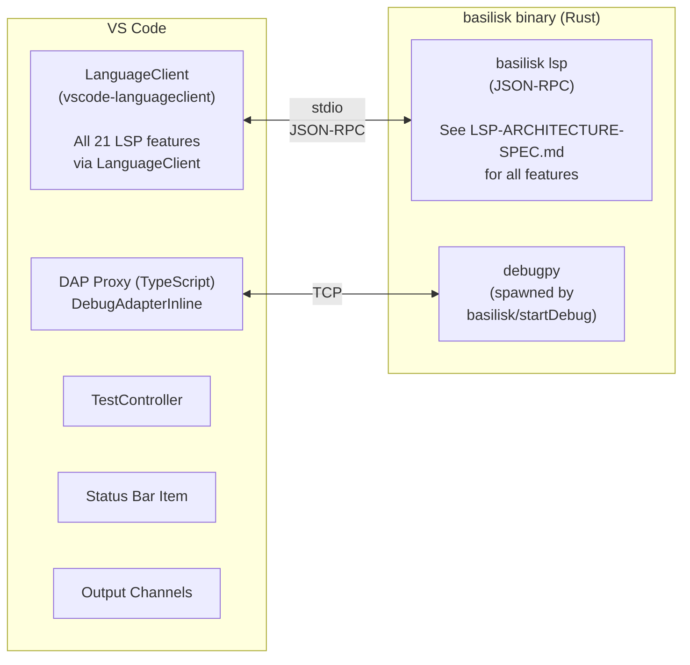
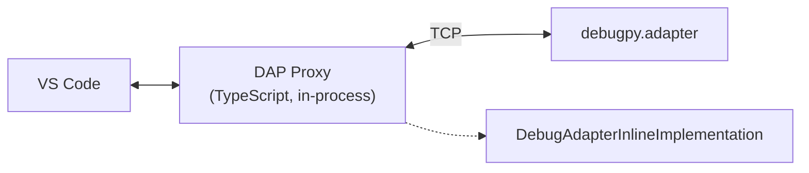

# Basilisk VS Code Extension {#VSIX}

VS Code extension connecting to the `basilisk lsp` binary. All LSP features, DAP integration, custom commands, configuration, and binary resolution are defined in **`LSP-ARCHITECTURE-SPEC.md`** (single source of truth). This spec documents only **VS Code-specific details**, kept at feature parity with the Zed and Neovim extensions.

## Architecture {#VSIX-ARCHITECTURE}



- VSIX bundles a pre-compiled LSP server binary per platform
- No Node.js dependency for the server; the activation layer uses VS Code's extension API
- Configuration exposed via VS Code settings with JSON schema validation

---

## Extension Structure {#VSIX-EXTENSION-STRUCTURE}

```
vscode-extension/
├── src/
│   ├── extension.ts        # Activation, LanguageClient setup, command registration
│   └── dap-proxy.ts        # DebugAdapterProxy (TypeScript, in-process)
├── package.json            # Commands, settings, keybindings, debugger contribution
├── tsconfig.json
└── .vscode-test.mjs
```

---

## LSP Client Configuration {#VSIX-LSP-CLIENT-CONFIGURATION}

> See `LSP-ARCHITECTURE-SPEC.md` for all LSP features, custom commands, and shared configuration settings.

```typescript
const serverOptions: ServerOptions = {
  command: resolvedBinaryPath,  // resolved via binary resolution cascade (LSP-ARCHITECTURE-SPEC.md)
  args: ["lsp"],
};

const clientOptions: LanguageClientOptions = {
  documentSelector: [{ scheme: "file", language: "python" }],
  synchronize: { configurationSection: "basilisk" },
  initializationOptions: readBasiliskSettings(),
};

client = new LanguageClient("basilisk", "Basilisk Type Checker", serverOptions, clientOptions);
client.start();
```

---

## Commands {#VSIX-COMMANDS}

> **Command Registration Rule**: See `LSP-ARCHITECTURE-SPEC.md` § Command Registration Rule. The extension MUST NOT call `registerCommand()` for any command the LSP server advertises — `vscode-languageclient` auto-registers those from the server's `executeCommandProvider` capabilities. Client-side UI (input prompts, toasts) belongs in the `executeCommand` middleware.

### `package.json` contribution {#VSIX-COMMANDS-PACKAGE-JSON-CONTRIBUTION}

```json
"commands": [
    { "command": "basilisk.restartServer", "title": "Basilisk: Restart Language Server" },
    { "command": "basilisk.showOutput", "title": "Basilisk: Show Output" },
    { "command": "basilisk.organizeImports", "title": "Basilisk: Organize Imports" },
    { "command": "basilisk.runTests", "title": "Basilisk: Run Tests" },
    { "command": "basilisk.runTestFile", "title": "Basilisk: Run Tests in Current File" },
    { "command": "basilisk.debugTest", "title": "Basilisk: Debug Test" },
    { "command": "basilisk.debugFile", "title": "Basilisk: Debug Current File" },
    { "command": "basilisk.toggleTypeBreakpoints", "title": "Basilisk: Toggle Type Mismatch Breakpoints" }
]
```

---

## Configuration Settings (`package.json` contribution) {#VSIX-CONFIGURATION-SETTINGS}

> Shared settings (sent to the LSP server) are defined in `LSP-ARCHITECTURE-SPEC.md` § Shared Configuration Settings. Below is their `package.json` schema plus VS Code-only settings.

```json
{
    "basilisk.executablePath": {
        "type": "string", "default": "",
        "description": "Path to the basilisk binary. Leave empty to auto-detect."
    },
    "basilisk.python": {
        "type": "string", "default": "",
        "description": "Path to the Python interpreter. Leave empty to auto-detect."
    },
    "basilisk.enabled": {
        "type": "boolean", "default": true,
        "description": "Enable/disable the Basilisk type checker."
    },
    "basilisk.useLsp": {
        "type": "boolean", "default": true,
        "description": "Use LSP mode (true) or subprocess mode (false)."
    },
    "basilisk.analysisMode": {
        "type": "string",
        "enum": ["openFilesOnly", "wholeModule", "crossModule"],
        "default": "wholeModule",
        "description": "Analysis scope."
    },
    "basilisk.inlayHints.parameterNames": {
        "type": "boolean", "default": true,
        "description": "Show parameter name hints at call sites."
    },
    "basilisk.inlayHints.variableTypes": {
        "type": "boolean", "default": true,
        "description": "Show inferred type hints for unannotated variables."
    },
    "basilisk.formatter": {
        "type": "string", "enum": ["ruff", "none"], "default": "ruff",
        "description": "Formatter engine: 'ruff' (embedded Ruff formatter, in-process, no separate install) or 'none'. Replaces basilisk.ruff.* — see LSP-FORMATTING-SPEC.md#LSPFMT-CONFIG."
    },
    "basilisk.trace.server": {
        "type": "string",
        "enum": ["off", "messages", "verbose"],
        "default": "off",
        "description": "Trace LSP communication."
    },
    "basilisk.testExplorer.enabled": {
        "type": "boolean", "default": true,
        "description": "Enable Python test discovery and execution in Test Explorer."
    },
    "basilisk.testExplorer.framework": {
        "type": "string",
        "enum": ["pytest", "unittest", "auto"],
        "default": "auto",
        "description": "Test framework to use. 'auto' detects from project config."
    },
    "basilisk.testExplorer.pytestPath": {
        "type": "string", "default": "pytest",
        "description": "Path to the pytest executable."
    },
    "basilisk.testExplorer.args": {
        "type": "array",
        "items": { "type": "string" },
        "default": [],
        "description": "Additional arguments passed to the test runner."
    },
    "basilisk.testExplorer.autoDiscoverOnSave": {
        "type": "boolean", "default": true,
        "description": "Re-discover tests when test files are saved."
    },
    "basilisk.debugger.enabled": {
        "type": "boolean", "default": true,
        "description": "Enable Basilisk Python debugger."
    },
    "basilisk.debugger.typeChecking": {
        "type": "boolean", "default": false,
        "description": "Enable type assertion breakpoints during debugging."
    },
    "basilisk.debugger.debugpyPath": {
        "type": "string", "default": "debugpy",
        "description": "Path to the debugpy module."
    }
}
```

### VS Code-Only Settings {#VSIX-CONFIGURATION-SETTINGS-VS-CODE-ONLY}

| Setting | Default | Description |
|---------|---------|-------------|
| `basilisk.useLsp` | `true` | Use LSP mode vs subprocess fallback |
| `basilisk.trace.server` | `"off"` | LSP communication trace level |

All other settings are shared across editors (see `LSP-ARCHITECTURE-SPEC.md`).

---

## Status Bar {#VSIX-STATUS-BAR}

Persistent item showing server state and diagnostic count:
- `$(check) Basilisk` — green, server running, no errors
- `$(warning) Basilisk (3)` — errors in current file
- `$(error) Basilisk` — server failed/not running
- `$(sync~spin) Basilisk` — analyzing

Future indicators: type completeness (`"87% typed"`), migration dashboard ([EXTENSION-ACTIVITY-PANEL-SPEC.md](EXTENSION-ACTIVITY-PANEL-SPEC.md)), ownership gutter icons (borrowed/owned/inout).

---

## Error Recovery {#VSIX-ERROR-RECOVERY}

- `errorHandler` on `LanguageClient` for auto-restart (max 3 attempts, exponential backoff)
- User-visible error message when server fails to start
- `basilisk.restartServer` command for manual recovery
- Subprocess fallback mode when `basilisk.useLsp` is `false`

---

## Test Explorer Integration {#VSIX-TEST-EXPLORER-INTEGRATION}

> See `LSP-TEST-INTEGRATION-SPEC.md` for full test explorer architecture, data model, configuration, and features.
> VS Code-specific wiring (TestController API, TestRunProfile) is documented in the VS Code section of that spec.

---

## Python Debugger (DAP) {#VSIX-PYTHON-DEBUGGER-DAP}

> See `LSP-ARCHITECTURE-SPEC.md` § Custom LSP Commands for `basilisk/startDebugSession` and `basilisk/stopDebugSession`.
> See `LSP-ARCHITECTURE-SPEC.md` § DapTcpProxy for the shared proxy specification that all editors implement.

### VS Code-Specific DAP Architecture {#VSIX-PYTHON-DEBUGGER-DAP-ARCHITECTURE}



The LSP server spawns `debugpy.adapter --port <free-port>` via `basilisk/startDebugSession`. The proxy connects to that port and relays DAP messages bidirectionally, intercepting specific patterns.

### Starting a session (zero-config) {#VSIX-PYTHON-DEBUGGER-START}

The `basilisk-debug` debugger is **factory-based** (no `program`/`runtime` in the manifest), so the extension owns both activation and config provisioning:

- **Activation:** `activationEvents` includes `onDebug`, `onDebugResolve:basilisk-debug`, and `onDebugDynamicConfigurations:basilisk-debug`, so the adapter/tracker register whenever debugging starts — not only after a Python file is opened.
- **Config provider:** `createBasiliskDebugConfigProvider` (`debug-adapter.ts`), registered for `basilisk-debug` (Dynamic + default), makes **"Run and Debug" / F5 work with no `launch.json`**: `provideDebugConfigurations` offers a "Python: Current File (Basilisk)" entry, and `resolveDebugConfiguration` (pure `applyDebugConfigDefaults`) fills an empty/partial config to launch the active file (`program: ${file}`). Without it, an empty-state workspace shows no Basilisk debug option.

### Tracker capture {#VSIX-PYTHON-DEBUGGER-DAP-TRACKER}

`BasiliskDebugAdapterTracker` is the single observability point for debugpy → VS Code traffic. It captures the debuggee's `process` event (`systemProcessId`, used by the CPU profiler — see [LSP-PROFILING-SPEC.md] `#PROFILE-SAME-PROCESS`) and `output` events (the `__BASILISK_MEM*__` payloads the memory round-trip recovers, since debugpy delivers `print()` output here, not in `evaluate`).

### Debug Adapter Proxy (VS Code Implementation) {#VSIX-PYTHON-DEBUGGER-DAP-PROXY}

The proxy (`vscode-extension/src/dap-proxy.ts`) implements `vscode.DebugAdapter` via `DebugAdapterInlineImplementation`, fixing four debugpy quirks:

**Quirk 1 — stepOut lands before assignment**: after `stepOut`, debugpy stops at the call-site line *before* the return value is assigned. The proxy detects the `stepOut` response → first `stopped` event sequence and injects an automatic `next`, swallowing the intermediate stop.

**Quirk 2 — structural line stops during stepOver**: debugpy stops on `try:` lines during `next`. The proxy requests a `stackTrace`, reads the source, and if the stopped line matches `/^\s*(try\s*:)\s*(#.*)?$/`, injects another `next`. `except:` and `finally:` are NOT skipped.

**Quirk 3 — single-connection slot protection**: `debugpy.adapter --port` accepts exactly one TCP connection. The proxy's bind-based `isPortAlive` check (attempt to bind, `EADDRINUSE` = alive) is non-destructive. In attach mode, if the port is dead, the factory respawns debugpy via the LSP.

**Quirk 4 — session termination timing**: VS Code's `activeDebugSession` may not be cleared when `onDidTerminateDebugSession` fires. The proxy sends `exited` before `terminated`, with a minimal delay.

### DAP Features {#VSIX-PYTHON-DEBUGGER-DAP-FEATURES}

> See `LSP-ARCHITECTURE-SPEC.md` § DapTcpProxy for the full shared feature list.

| Feature | Description |
|---------|-------------|
| Launch & Attach | Launch Python scripts or attach to running processes |
| Breakpoints | Line, conditional, logpoint, function, exception breakpoints |
| Step execution | Step in, step over, step out, continue, pause |
| Variable inspection | View locals, globals, closures with full type info from Basilisk |
| Watch expressions | Evaluate expressions in the current scope |
| Call stack | Full call stack with source navigation |
| Type-aware hover | Hover shows both runtime value AND static type (from LSP) |
| Type assertions | Break when a runtime type doesn't match the static annotation |

**Type-aware debugging** (Basilisk-specific):
- **Type mismatch breakpoints**: break when a variable's runtime type doesn't match its annotation
- **Annotation overlay**: debug hover shows `(static: str, runtime: str)` side-by-side
- **Type narrowing visualization**: show which branch of a union is active at a breakpoint
- **Parameter contract verification**: warn when an argument violates its annotation at runtime

### Launch Configurations {#VSIX-PYTHON-DEBUGGER-DAP-LAUNCH-CONFIGURATIONS}

```json
{
    "type": "basilisk",
    "request": "launch",
    "name": "Basilisk: Run Current File",
    "program": "${file}",
    "python": "${command:python.interpreterPath}",
    "args": [],
    "env": {},
    "console": "integratedTerminal",
    "typeChecking": true
}
```

```json
{
    "type": "basilisk",
    "request": "attach",
    "name": "Basilisk: Attach to Process",
    "connect": { "host": "localhost", "port": 5678 },
    "typeChecking": true
}
```

---

## Binary Resolution {#VSIX-BINARY-RESOLUTION}

See [`LSP-ARCHITECTURE-SPEC.md` § LSPARCH-BINRES](LSP-ARCHITECTURE-SPEC.md#LSPARCH-BINRES)
— single source of truth for all binary resolution.

---

## Output Channels {#VSIX-OUTPUT-CHANNELS}

- `"Basilisk"` — main output channel for server messages
- `"Basilisk LSP Trace"` — LSP communication trace (when `basilisk.trace.server` is enabled)
- File log sink: `/tmp/basilisk-debug-trace.log` for debug-level logging

---

## Binary Distribution {#VSIX-BINARY-DISTRIBUTION}

The VSIX bundles pre-compiled `basilisk` binaries per platform:
- `basilisk-x86_64-apple-darwin`
- `basilisk-aarch64-apple-darwin`
- `basilisk-x86_64-unknown-linux-gnu`
- `basilisk-aarch64-unknown-linux-gnu`
- `basilisk-x86_64-pc-windows-msvc`

## Build & Packaging Parity {#VSIX-PACKAGING-PARITY}

The shipped VSIX and the tested VSIX **must be the same artifact**. A single recipe owns packaging; every path routes through it:

| Path | Entry point | Purpose |
|---|---|---|
| Release | `.github/workflows/release.yml` `vsix` job | builds & publishes the per-platform VSIX |
| Local install | `make reinstall-vsix` / `make reinstall-vsix-macos` | clean rebuild + install the exact release VSIX |
| E2E gate | `make _test_vsix` (→ `_release_vsix`) | runs the e2e suite against the staged release bundle |

Invariants:

- **One packaging recipe.** `_release_vsix` (Makefile) mirrors the release `vsix` job step for step: `cargo build --release --target <triple>` for every bundled binary, `stage-runtime.mjs` to stage the manifest-declared binaries into `bin/<platform>/`, `vendor-debugpy.mjs`, then `vsce package --target <platform> --ignore-other-target-folders`.
- **One staging helper.** `stage-runtime.mjs` is the only code deciding which binaries enter the bundle — used by the release workflow, `_release_vsix`, and `_test_vsix` — so contents are manifest-driven everywhere and cannot drift between tested and shipped packages.
- **Tests run the shipped bytes.** `_test_vsix` builds via `_release_vsix` and runs the e2e suite against that staged directory — the exact tree `vsce package` zips.
- **`reinstall-vsix-macos`** pins `darwin-arm64` (the only macOS target shipped) and rebuilds from a clean tree (`cargo clean`), so a local install is byte-for-byte the published macOS VSIX.
- **Intentional difference:** local builds keep `0.0.0-PLACEHOLDER`; `release.yml` runs `stamp-version.sh` first. Structure and binaries are identical; only the embedded version string differs, staying internally consistent (manifest and binary agree).

`verify-shipwright.mjs vsix` enforces the bundle matches the manifest on every path (rejecting missing, unmanifested, or wrong-platform binaries), so drift fails the build rather than shipping.
