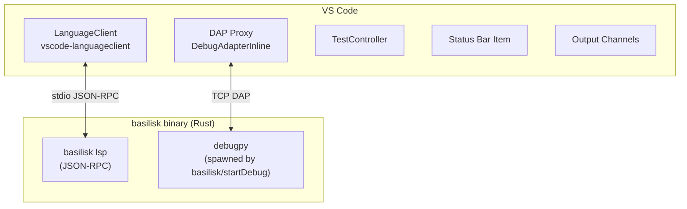

# Basilisk VS Code Extension

## Goal {#VSIX-GOAL}

A first-class VS Code extension that connects to the `basilisk lsp` binary. The primary integration. Open source. No Microsoft proprietary dependencies.

**CRITICAL: AIMING FOR FEATURE PARITY BETWEEN VS CODE, ZED, AND NEOVIM EXTENSIONS**

All LSP features, DAP integration, custom commands, configuration settings, and binary resolution are defined in **`LSP-ARCHITECTURE-SPEC.md`** — the single source of truth. This spec only documents **VS Code-specific implementation details**.

## Critical Docs

- [VS Code Extension API](https://code.visualstudio.com/api)
- [VS Code Language Extensions](https://code.visualstudio.com/api/language-extensions/overview)
- [VS Code Testing API](https://code.visualstudio.com/api/extension-guides/testing)
- [VS Code Debug Adapter Protocol](https://code.visualstudio.com/api/extension-guides/debugger-extension)
- [Debug Adapter Protocol Specification](https://microsoft.github.io/debug-adapter-protocol/)

---

## Architecture {#VSIX-ARCH}



- VSIX bundles a pre-compiled LSP server binary per platform
- No Node.js dependency for the server (the extension activation layer uses VS Code's extension API)
- Configuration exposed via VS Code settings with JSON schema validation

---

## Extension Structure {#VSIX-STRUCTURE}

```
vscode-extension/
├── src/
│   ├── extension.ts        # Activation, LanguageClient setup, command registration
│   └── dap-proxy.ts        # DebugAdapterProxy (TypeScript, in-process)
├── package.json            # Commands, settings, keybindings, debugger contribution
├── tsconfig.json
└── .vscode-test.mjs
```

---

## LSP Client Configuration {#VSIX-LSP}

> See `LSP-ARCHITECTURE-SPEC.md` for all LSP features, custom commands, and shared configuration settings.

```typescript
const serverOptions: ServerOptions = {
  command: resolvedBinaryPath,  // resolved via binary resolution cascade (LSP-ARCHITECTURE-SPEC.md)
  args: ["lsp"],
};

const clientOptions: LanguageClientOptions = {
  documentSelector: [{ scheme: "file", language: "python" }],
  synchronize: { configurationSection: "basilisk" },
  initializationOptions: readBasiliskSettings(),
};

client = new LanguageClient("basilisk", "Basilisk Type Checker", serverOptions, clientOptions);
client.start();
```

---

## Commands {#VSIX-CMDS}

> **Command Registration Rule**: See `LSP-ARCHITECTURE-SPEC.md` § Command Registration Rule. The extension MUST NOT call `registerCommand()` for any command the LSP server advertises. Server commands are auto-registered by `vscode-languageclient` from the server's `executeCommandProvider` capabilities. Client-side UI (input prompts, toasts) belongs in the `executeCommand` middleware.

### `package.json` contribution

```json
"commands": [
    { "command": "basilisk.restartServer", "title": "Basilisk: Restart Language Server" },
    { "command": "basilisk.showOutput", "title": "Basilisk: Show Output" },
    { "command": "basilisk.organizeImports", "title": "Basilisk: Organize Imports" },
    { "command": "basilisk.runTests", "title": "Basilisk: Run Tests" },
    { "command": "basilisk.runTestFile", "title": "Basilisk: Run Tests in Current File" },
    { "command": "basilisk.debugTest", "title": "Basilisk: Debug Test" },
    { "command": "basilisk.debugFile", "title": "Basilisk: Debug Current File" },
    { "command": "basilisk.toggleTypeBreakpoints", "title": "Basilisk: Toggle Type Mismatch Breakpoints" }
]
```

---

## Configuration Settings {#VSIX-CONFIG}

> All shared settings are defined in [LSP-ARCHITECTURE-SPEC.md §LSPARCH-CONFIG](LSP-ARCHITECTURE-SPEC.md#LSPARCH-CONFIG). The `package.json` schema mirrors those settings under the `basilisk.*` namespace. Only VS Code-specific additions are documented below.

### VS Code-Only Settings {#VSIX-CONFIG-LOCAL}

| Setting | Default | Description |
|---------|---------|-------------|
| `basilisk.useLsp` | `true` | Use LSP mode vs subprocess fallback |
| `basilisk.trace.server` | `"off"` | LSP communication trace level |

All other settings are shared across editors (see `LSP-ARCHITECTURE-SPEC.md`).

---

## Status Bar {#VSIX-STATUSBAR}

Persistent item showing server state and diagnostic count:
- `$(check) Basilisk` — green, server running, no errors
- `$(warning) Basilisk (3)` — errors in current file
- `$(error) Basilisk` — server failed/not running
- `$(sync~spin) Basilisk` — analyzing

Additional indicators (future):
- Type completeness indicator: `"87% typed"`
- Migration dashboard — see [EXTENSION-ACTIVITY-PANEL-SPEC.md](EXTENSION-ACTIVITY-PANEL-SPEC.md)
- Ownership visualization (gutter icons: borrowed/owned/inout)

---

## Error Recovery {#VSIX-RECOVERY}

- `errorHandler` on `LanguageClient` for auto-restart (max 3 attempts, exponential backoff)
- User-visible error message when server fails to start
- `basilisk.restartServer` command for manual recovery
- Subprocess fallback mode when `basilisk.useLsp` is `false`

---

## Test Explorer Integration {#VSIX-TESTS}

> See `LSP-TEST-INTEGRATION-SPEC.md` for full test explorer architecture, data model, configuration, and features.
> VS Code-specific wiring (TestController API, TestRunProfile) is documented in the VS Code section of that spec.

---

## Python Debugger (DAP) {#VSIX-DAP}

> See `LSP-ARCHITECTURE-SPEC.md` § Custom LSP Commands for `basilisk/startDebugSession` and `basilisk/stopDebugSession`.
> See `LSP-ARCHITECTURE-SPEC.md` § DapTcpProxy for the shared proxy specification that all editors implement.

### VS Code-Specific DAP Architecture {#VSIX-DAP-ARCH}

```
VS Code  <-->  DAP Proxy (TypeScript, in-process)  <-->  debugpy.adapter (TCP)
                   |
          DebugAdapterInlineImplementation
```

The LSP server spawns `debugpy.adapter --port <free-port>` via `basilisk/startDebugSession`. The proxy connects to that port and relays DAP messages bidirectionally, intercepting specific message patterns.

### Debug Adapter Proxy {#VSIX-DAP-PROXY}

The proxy (`vscode-extension/src/dap-proxy.ts`) implements `vscode.DebugAdapter` via `DebugAdapterInlineImplementation`. It fixes four debugpy quirks:

**Quirk 1 -- stepOut lands before assignment**:
After `stepOut`, debugpy stops at the call-site line *before* the return value is assigned. The proxy detects the `stepOut` response -> first `stopped` event sequence and injects an automatic `next` request, swallowing the intermediate stop.

**Quirk 2 -- Structural line stops during stepOver**:
debugpy stops on `try:` lines during `next` (stepOver). The proxy inspects each post-step stop by requesting a `stackTrace`, reading the source, and checking if the stopped line matches `/^\s*(try\s*:)\s*(#.*)?$/`. If so, it injects another `next`. `except:` and `finally:` lines are NOT skipped.

**Quirk 3 -- Single-connection slot protection**:
`debugpy.adapter --port` accepts exactly one TCP connection. The proxy's bind-based `isPortAlive` check (attempt to bind, `EADDRINUSE` = alive) is non-destructive. In attach mode, if the port is dead, the factory respawns debugpy via the LSP.

**Quirk 4 -- Session termination timing**:
VS Code's `activeDebugSession` may not be cleared when `onDidTerminateDebugSession` fires. The proxy ensures the `exited` event is sent before `terminated`, with a minimal delay.

### DAP Features {#VSIX-DAP-FEATURES}

> See `LSP-ARCHITECTURE-SPEC.md` § DapTcpProxy for the full shared feature list.

| Feature | Description |
|---------|-------------|
| Launch & Attach | Launch Python scripts or attach to running processes |
| Breakpoints | Line, conditional, logpoint, function, exception breakpoints |
| Step execution | Step in, step over, step out, continue, pause |
| Variable inspection | View locals, globals, closures with full type info from Basilisk |
| Watch expressions | Evaluate expressions in the current scope |
| Call stack | Full call stack with source navigation |
| Type-aware hover | Hover shows both runtime value AND static type (from LSP) |
| Type assertions | Break when a runtime type doesn't match the static annotation |

**Type-aware debugging** (unique to Basilisk):
- **Type mismatch breakpoints**: automatically break when a variable's runtime type doesn't match its annotation
- **Annotation overlay**: debug hover shows `(static: str, runtime: str)` side-by-side
- **Type narrowing visualization**: show which branch of a union type is active at a breakpoint
- **Parameter contract verification**: warn when a function receives a value that violates its annotation at runtime

### Launch Configurations {#VSIX-DAP-LAUNCH}

```json
{
    "type": "basilisk",
    "request": "launch",
    "name": "Basilisk: Run Current File",
    "program": "${file}",
    "python": "${command:python.interpreterPath}",
    "args": [],
    "env": {},
    "console": "integratedTerminal",
    "typeChecking": true
}
```

```json
{
    "type": "basilisk",
    "request": "attach",
    "name": "Basilisk: Attach to Process",
    "connect": { "host": "localhost", "port": 5678 },
    "typeChecking": true
}
```

---

## Binary Resolution {#VSIX-BINRES}

> See `LSP-ARCHITECTURE-SPEC.md` § Binary Resolution Order for the shared cascade.

VS Code-specific resolution order:
1. VS Code setting: `basilisk.executablePath`
2. Environment variable: `BASILISK_EXECUTABLE_PATH`
3. Well-known locations: `~/.cargo/bin/basilisk`, `/usr/local/bin/basilisk`, `/opt/homebrew/bin/basilisk`
4. Fall back to bare `"basilisk"` on PATH

---

## Output Channels {#VSIX-OUTPUT}

- `"Basilisk"` — main output channel for server messages
- `"Basilisk LSP Trace"` — LSP communication trace (when `basilisk.trace.server` is enabled)
- File log sink: `/tmp/basilisk-debug-trace.log` for debug-level logging

---

## Binary Distribution {#VSIX-DIST}

The VSIX bundles pre-compiled `basilisk` binaries per platform:
- `basilisk-x86_64-apple-darwin`
- `basilisk-aarch64-apple-darwin`
- `basilisk-x86_64-unknown-linux-gnu`
- `basilisk-aarch64-unknown-linux-gnu`
- `basilisk-x86_64-pc-windows-msvc`
