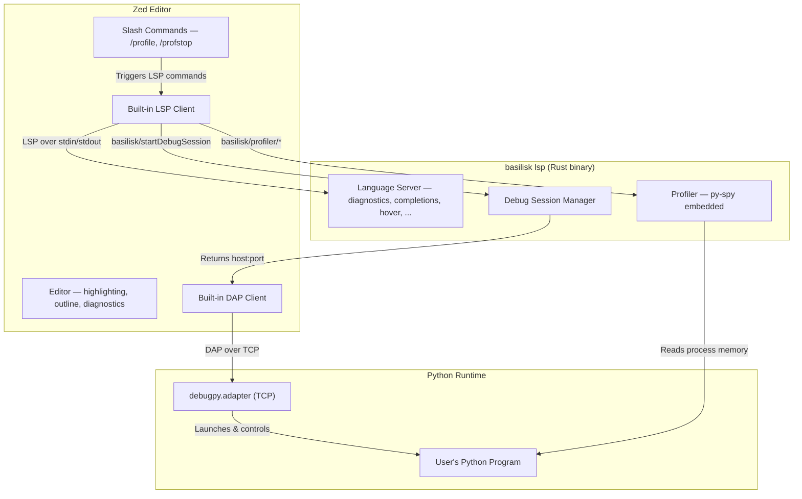

# Basilisk Zed Extension

## Goal

A first-class Zed extension that connects to the same `basilisk lsp` binary as the VS Code and Neovim extensions. One LSP, three editors. The Zed extension provides language intelligence, debugging, and profiling — reusing 100% of the Rust backend.

MAX CODE SHARING BETWEEN RUST COMPONENTS!!!
Share code between the Zed extension and the other crates AMAP - even if just sharing at file level!

**CRITICAL: AIMING FOR FEATURE PARITY BETWEEN ZED, VS CODE, AND NEOVIM EXTENSIONS**

All LSP features, DAP integration, custom commands, configuration settings, and binary resolution are defined in **`LSP-ARCHITECTURE-SPEC.md`** — the single source of truth. This spec only documents **Zed-specific implementation details**.

CRITICAL: We only target Wasm 64 bit. We don't need to support 32 bit wasm for now

## Critical Docs

- [Zed Extension Development](https://zed.dev/docs/extensions/developing-extensions)
- [Zed Python Language Support](https://zed.dev/docs/languages/python)

## What Zed Extensions Can Do

Zed extensions are Rust compiled to WASM. The API surface is deliberately narrow:

| Capability | Available | Mechanism |
|---|---|---|
| LSP integration | Yes | `language_server_command()` on Extension trait |
| Tree-sitter grammars | Yes | `languages/` directory with `.scm` queries |
| DAP debugging | Yes | `get_dap_binary()` on Extension trait |
| Slash commands | Yes | `run_slash_command()` on Extension trait |
| Themes | Yes | `themes/` directory |
| Custom UI / webviews | **No** | Not supported (open issue #21208) |
| Inline decorations | **No** | Not available via extension API |
| Gutter decorations | **No** | Not available via extension API |
| Custom commands | **No** | Only slash commands in AI context |
| Status bar items | **No** | Not available |
| Custom settings schema | **No** | Read-only access to Zed settings |
| File watchers | **No** | Not available |
| Terminal control | **No** | Not available |

This means: **all intelligence flows through LSP and DAP.** No client-side tricks. The LSP must be the source of everything.

## Architecture



## Extension Structure

```
basilisk-zed/
  extension.toml
  Cargo.toml
  src/lib.rs
  languages/
    python/
      config.toml
      highlights.scm        # tree-sitter-python queries
      brackets.scm
      outline.scm
      indents.scm
      injections.scm
      textobjects.scm
      runnables.scm
  debug_adapter_schemas/
    basilisk-debug.json
```

### `extension.toml`

```toml
id = "basilisk"
name = "Basilisk"
version = "0.1.0"
schema_version = 1
authors = ["Basilisk Contributors"]
description = "Strict-by-default Python type checker with debugging and profiling"
repository = "https://github.com/basilisk-lang/basilisk"

[grammars.python]
repository = "https://github.com/tree-sitter/tree-sitter-python"
rev = "latest-stable-sha"

[language_servers.basilisk]
name = "Basilisk"
languages = ["Python"]

[language_servers.basilisk.language_ids]
"Python" = "python"

[debug_adapters.basilisk-debug]
schema_path = "debug_adapter_schemas/basilisk-debug.json"
```

### `Cargo.toml`

```toml
[package]
name = "basilisk-zed"
version = "0.1.0"
edition = "2021"

[lib]
crate-type = ["cdylib"]

[dependencies]
zed_extension_api = "0.7.0"
```

### `src/lib.rs`

```rust
use zed_extension_api::{self as zed, Result};

struct BasiliskExtension;

impl zed::Extension for BasiliskExtension {
    fn language_server_command(
        &mut self,
        language_server_id: &zed::LanguageServerId,
        worktree: &zed::Worktree,
    ) -> Result<zed::Command> {
        // 1. Check for user-configured path in Zed settings
        // 2. Try well-known locations (~/.cargo/bin/basilisk, /usr/local/bin/basilisk, etc.)
        // 3. Download from GitHub release if not found
        let binary_path = self.resolve_binary(worktree)?;

        Ok(zed::Command {
            command: binary_path,
            args: vec!["lsp".into()],
            env: Default::default(),
        })
    }

    fn language_server_initialization_options(
        &mut self,
        _language_server_id: &zed::LanguageServerId,
        worktree: &zed::Worktree,
    ) -> Result<Option<zed::serde_json::Value>> {
        // Pass workspace root so LSP can find .venv, pyproject.toml, etc.
        Ok(Some(zed::serde_json::json!({
            "workspaceRoot": worktree.root_path(),
        })))
    }

    fn language_server_workspace_configuration(
        &mut self,
        _language_server_id: &zed::LanguageServerId,
        _worktree: &zed::Worktree,
    ) -> Result<Option<zed::serde_json::Value>> {
        // Read Zed settings and map to Basilisk config
        Ok(Some(zed::serde_json::json!({
            "basilisk": {
                "inlayHints": {
                    "parameterNames": true,
                    "variableTypes": true
                },
                "ruff": {
                    "enabled": true
                }
            }
        })))
    }

    fn get_dap_binary(
        &mut self,
        config: zed::DebugConfig,
    ) -> Result<zed::DebugAdapterBinary> {
        // Debug sessions use the same basilisk binary
        // The LSP spawns debugpy; the DAP client connects to it
        let binary_path = self.resolve_binary_from_config(&config)?;

        Ok(zed::DebugAdapterBinary {
            command: binary_path,
            args: vec!["debug-adapter".into()],
            envs: Default::default(),
            cwd: config.cwd.clone(),
            connection: None,
        })
    }

    fn run_slash_command(
        &mut self,
        command: zed::SlashCommand,
        args: Vec<String>,
        worktree: Option<&zed::Worktree>,
    ) -> Result<zed::SlashCommandOutput> {
        match command.name.as_str() {
            "profile" => self.handle_profile_command(args, worktree),
            "profstop" => self.handle_profstop_command(worktree),
            _ => Err("Unknown command".into()),
        }
    }
}

zed::register_extension!(BasiliskExtension);
```

## Features

### Language Intelligence (via LSP)

> All 21 LSP features are defined in `LSP-ARCHITECTURE-SPEC.md` § LSP Features. Zed supports all of them natively via its built-in LSP client. Zero work needed in the Zed extension — the LSP protocol handles everything.

**Zed-specific note**: Semantic tokens require `"semantic_tokens": "combined"` in Zed settings.

### Debugging (via DAP)

> See `LSP-ARCHITECTURE-SPEC.md` § Custom LSP Commands for `basilisk/startDebugSession` and § DapTcpProxy for the shared proxy specification.

Zed has native DAP support. The debug flow:

1. User triggers debug (F5 or debug button)
2. Zed extension's `get_dap_binary()` returns the basilisk binary
3. Basilisk spawns debugpy on a free TCP port via `basilisk/startDebugSession`
4. Zed's DAP client connects directly to debugpy over TCP
5. Full debugging: breakpoints, stepping, variables, call stack, watch expressions

The `debug_adapter_schemas/basilisk-debug.json` schema defines the Zed-specific launch/attach configuration:

```json
{
  "$schema": "http://json-schema.org/draft-07/schema#",
  "type": "object",
  "properties": {
    "program": { "type": "string", "description": "Python file to debug" },
    "args": { "type": "array", "items": { "type": "string" } },
    "cwd": { "type": "string" },
    "python": { "type": "string", "description": "Python interpreter path" },
    "justMyCode": { "type": "boolean", "default": true },
    "stopOnEntry": { "type": "boolean", "default": false },
    "console": {
      "type": "string",
      "enum": ["integratedTerminal", "internalConsole"],
      "default": "integratedTerminal"
    }
  },
  "required": ["program"]
}
```

### Profiling

> See `LSP-ARCHITECTURE-SPEC.md` § Custom LSP Commands for the profiling and memory command specifications shared across all editors.

Zed has no webview support, so profiling visualization works differently than VS Code:

| Visualization | VS Code | Zed |
|---|---|---|
| Flamegraph | Webview panel | External browser (speedscope.app) |
| Inline heat map | Text decorations API | LSP diagnostics with severity hints |
| Hot function list | TreeView panel | Slash command output in AI panel |
| Live updates | Custom notifications | LSP diagnostics refresh |

**Profiling in Zed uses three mechanisms:**

1. **LSP Diagnostics** — The profiler emits hotspot diagnostics (hint severity) with per-line timing data.
2. **Slash Commands** — `/profile` and `/profstop` trigger profiling via the AI assistant panel.
3. **External Viewer** — The LSP generates a speedscope JSON file and opens it in the browser.

### Tree-sitter Queries

The extension ships tree-sitter-python queries for:

- **highlights.scm** — Full Python syntax highlighting (keywords, builtins, decorators, f-strings, type annotations)
- **brackets.scm** — `()`, `[]`, `{}`, string quotes
- **outline.scm** — Functions, classes, methods for the outline panel
- **indents.scm** — Python's indentation-based structure
- **injections.scm** — SQL in strings, regex patterns, docstring formatting
- **textobjects.scm** — Vim motions for functions, classes, arguments, comments
- **runnables.scm** — Detect `if __name__ == "__main__"` and pytest functions for run buttons

Note: Zed already has built-in Python support via tree-sitter-python. The Basilisk extension can either augment the built-in queries or rely on them entirely, only providing the LSP and DAP integration.

## Binary Distribution

The extension downloads the `basilisk` binary from GitHub Releases on first activation:

```rust
fn resolve_binary(&self, worktree: &zed::Worktree) -> Result<String> {
    // 1. Check if basilisk is already on PATH
    // 2. Check ~/.cargo/bin/basilisk
    // 3. Check extension's data directory for cached download
    // 4. Download from GitHub releases:
    let (os, arch) = zed::current_platform();
    let release = zed::latest_github_release(
        "basilisk-lang/basilisk",
        zed::GithubReleaseOptions {
            require_assets: true,
            pre_release: false,
        },
    )?;
    // Match platform to asset name, download, make executable
}
```

Target assets:
- `basilisk-x86_64-apple-darwin.tar.gz`
- `basilisk-aarch64-apple-darwin.tar.gz`
- `basilisk-x86_64-unknown-linux-gnu.tar.gz`
- `basilisk-aarch64-unknown-linux-gnu.tar.gz`
- `basilisk-x86_64-pc-windows-msvc.zip`

## Zed Settings

> Shared configuration settings are defined in `LSP-ARCHITECTURE-SPEC.md` § Shared Configuration Settings. Below shows how to map them into Zed's `settings.json` structure.

```json
{
  "lsp": {
    "basilisk": {
      "binary": {
        "path": "/path/to/basilisk"
      },
      "initialization_options": {
        "python": "/path/to/python3"
      },
      "settings": {
        // All keys from LSP-ARCHITECTURE-SPEC.md "Shared Configuration Settings"
        // nested under the "basilisk" key
        "inlayHints": {
          "parameterNames": true,
          "variableTypes": true
        },
        "ruff": {
          "enabled": true,
          "executablePath": "/path/to/ruff"
        }
      }
    }
  },
  "languages": {
    "Python": {
      "language_servers": ["basilisk", "..."],
      "semantic_tokens": "combined"
    }
  }
}
```

## What We Cannot Do in Zed (Yet)

These features exist in the VS Code extension but have no Zed equivalent:

| Feature | VS Code | Zed | Workaround |
|---|---|---|---|
| Status bar diagnostics | Status bar item | Not available | Diagnostics panel shows counts |
| "Install debugpy" button | Notification action | Not available | Error message tells user to `pip install debugpy` |
| Webview flamegraph | WebviewPanel | Not available | Open speedscope in browser |
| Inline profiling heat map | TextEditorDecorationType | Not available | LSP hint diagnostics |
| Custom settings UI | contributes.configuration | Not available | Manual settings.json |
| Auto-restart on crash | Client-side logic | Not available | Zed handles LSP restart natively |

As Zed's extension API matures (webviews are in discussion), these gaps will close. The LSP already produces all the data — it's only the visualization that differs.

## Shared Code Budget

| Component | Shared? | Where It Lives |
|---|---|---|
| Type checker | 100% shared | `basilisk-checker` crate |
| LSP server | 100% shared | `basilisk-lsp` crate |
| Debug session manager | 100% shared | `basilisk-lsp/src/debug.rs` |
| Profiler engine | 100% shared | `basilisk-lsp/src/profiler.rs` |
| Speedscope export | 100% shared | `basilisk-lsp/src/profiler.rs` |
| Binary resolution | Per-editor | `vscode-extension/src/extension.ts` / `basilisk-zed/src/lib.rs` |
| Debug config UI | Per-editor | `package.json` / `basilisk-debug.json` |
| Flamegraph rendering | Per-editor | VS Code webview / browser fallback |
| Tree-sitter queries | Zed-only | `basilisk-zed/languages/python/` |

The entire backend is shared. Only thin editor-specific glue differs.

---

## TODO List

See [ZED-PLAN.md](../plans/ZED-PLAN.md) for the full implementation plan with phasing.

### Extension Scaffolding
- [x] Create `basilisk-zed/` directory with `extension.toml`, `Cargo.toml`, `src/lib.rs`
- [x] Implement `zed::Extension` trait with `language_server_command()`
- [x] Implement binary resolution (PATH, ~/.cargo/bin, BASILISK_PATH env var)
- [x] Implement GitHub release download fallback via `zed::latest_github_release()`
- [x] Implement `language_server_initialization_options()` — pass workspace root
- [x] Implement `language_server_workspace_configuration()` — read Zed settings
- [x] Register extension with `zed::register_extension!(BasiliskExtension)`
- [x] Version check: warn user when newer basilisk release is available

### LSP Verification
- [x] Diagnostics appear on Python files
- [x] Completions (dot-triggered and symbol)
- [x] Hover shows type info
- [x] Go to definition / declaration / type definition
- [x] Find references
- [x] Rename symbol
- [x] Inlay hints (parameter names, variable types)
- [x] Code actions (add annotations, organize imports)
- [x] Semantic tokens with `"semantic_tokens": "combined"`
- [x] Formatting via Ruff
- [x] Document symbols in outline panel
- [x] Code lens (reference counts)
- [x] Call hierarchy
- [x] Signature help

### Tree-sitter Queries
- [x] Add `[grammars.python]` to `extension.toml`
- [x] Create `languages/python/config.toml`
- [x] Create `highlights.scm` — keywords, builtins, decorators, f-strings, type annotations
- [x] Create `brackets.scm` — `()`, `[]`, `{}`
- [x] Create `outline.scm` — functions, classes, methods
- [x] Create `indents.scm` — Python indentation rules
- [x] Create `injections.scm` — SQL in strings, regex, docstrings
- [x] Create `textobjects.scm` — Vim motions for functions, classes, arguments
- [x] Create `runnables.scm` — `if __name__ == "__main__"`, pytest functions

### Debugging (DAP)
- [x] Implement `get_dap_binary()` — resolve basilisk binary
- [x] Create `debug_adapter_schemas/basilisk-debug.json` (launch + attach schema)
- [x] Implement `dap_request_kind()` — launch vs attach
- [x] Implement `dap_config_to_scenario()`
- [ ] Test: breakpoints, stepping, variables, debug console (manual — no Zed test framework)

### Slash Commands (Profiling & Memory)
- [x] Register `/profile`, `/profstop`, `/profsnapshot` slash commands
- [x] Register `/memleak`, `/memstop`, `/memrefs` slash commands
- [x] Implement `run_slash_command()` dispatch with markdown output
- [x] `/profile [pid]` — start profiling, return session info
- [x] `/profstop` — stop profiling, format hot functions/lines as markdown
- [x] `/profsnapshot` — snapshot without stopping
- [x] `/memleak` — start memory tracking via debug session
- [x] `/memstop` — snapshot + diff, format leak report
- [x] `/memrefs <TypeName>` — walk reference graph, format retention paths
- [x] Implement argument completion (PIDs for /profile, type names for /memrefs)
- [ ] Wire to actual LSP profiler/memory commands (blocked on profiling engine)

### Testing
- [x] Extract testable pure logic into `logic.rs` (33 unit tests)
- [x] LSP E2E tests in `zed_extension_e2e_tests.rs` / `zed_extension_e2e_advanced.rs`
- [x] Set up CI: build WASM (`wasm32-wasip2`), run unit tests, clippy
- [x] Cross-platform CI: macOS aarch64, Linux x86_64

### Polish & Publishing
- [x] Create Basilisk dark theme (`themes/basilisk-dark.json`)
- [ ] Publish to Zed extension registry
