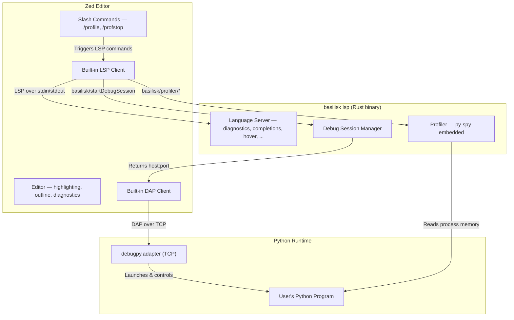

# Basilisk Zed Extension {#ZED}

> **The feature sections of this spec are superseded and kept only as a record.**
> Basilisk is unlisted and the `basilisk` binary is inert
> ([WITHDRAWAL](DOCS-WITHDRAWAL-MESSAGING-SPEC.md#WITHDRAWAL)). The extension no
> longer launches a language server, downloads a binary, registers a debug
> adapter, or ships a theme. What it does now is [ZED-NOW](#ZED-NOW); everything
> from [ZED-FEATURES](#ZED-FEATURES) onwards describes what was built and does
> not run.

Target: **wasm32 (64-bit) only**.

Reference: [Zed Extension Development](https://zed.dev/docs/extensions/developing-extensions), [Zed Python Language Support](https://zed.dev/docs/languages/python).

## What the extension is now {#ZED-NOW}

One slash command, `/basilisk`, which prints the approved statement into the
assistant panel. Nothing else. The extension declares no `[language_servers.*]`
table (there is no server to launch — the binary is inert and starts none), no
`[debug_adapters.*]` table, no grammars, and no themes; it depends on
`zed_extension_api` and nothing else, and it reads no settings.

The statement is not written here. `basilisk-zed/src/withdrawal_notice.txt` is
generated from
[WITHDRAWAL-INERT-TEXT](DOCS-WITHDRAWAL-MESSAGING-SPEC.md#WITHDRAWAL-INERT-TEXT)
by `scripts/gen_withdrawal_copy.py` and `include_str!`d, so this extension
prints the same bytes as the CLI, the VS Code extension, and the Neovim plugin
([WITHDRAWAL-SURFACES](DOCS-WITHDRAWAL-MESSAGING-SPEC.md#WITHDRAWAL-SURFACES)).

`basilisk-zed/src/logic_tests.rs` enforces this against the shipped
`extension.toml`: no language server, no debug adapter, no grammar, exactly one
slash command, the approved one-line description, and no call to
`latest_github_release`/`download_file` anywhere in the glue. It is the Zed
equivalent of `scripts/verify-vsix-inert.sh`.

## Zed Extension Capabilities {#ZED-CAPS}

Zed extensions are Rust compiled to WASM with a deliberately narrow API:

| Capability | Available | Mechanism |
|---|---|---|
| LSP integration | Yes | `language_server_command()` on Extension trait |
| Tree-sitter grammars | Yes, but unused | A `languages/` dir would *replace* Zed's built-in Python, not extend it — see [ZED-TREESITTER](#ZED-TREESITTER) |
| DAP debugging | Yes | `get_dap_binary()` on Extension trait |
| Slash commands | Yes | `run_slash_command()` on Extension trait |
| Themes | Yes | `themes/` directory |
| Custom UI / webviews | **No** | Not supported ([zed-industries/zed#21208](https://github.com/zed-industries/zed/issues/21208)) |
| Inline decorations | **No** | Not available via extension API |
| Gutter decorations | **No** | Not available via extension API |
| Custom commands | **No** | Only slash commands in AI context |
| Status bar items | **No** | Not available |
| Custom settings schema | **No** | Read-only access to Zed settings |
| File watchers | **No** | Not available — config watching is server-owned ([LSPARCH-CONFIG](LSP-ARCHITECTURE-SPEC.md#LSPARCH-CONFIG)) |
| Terminal control | **No** | Not available |

This table describes Zed's API, not Basilisk's use of it: of the capabilities marked available, the extension now uses only slash commands, and only to print the statement ([ZED-NOW](#ZED-NOW)).

## Extension Structure {#ZED-STRUCTURE}

```
basilisk-zed/
  extension.toml
  Cargo.toml
  src/
    lib.rs                  # Thin zed_extension_api glue — the WASM entry points
    logic.rs                # Pure logic, zero zed_extension_api imports (host-testable)
    logic_tests.rs          # Unit tests for logic.rs; #[path]-included as `mod tests`
    withdrawal_notice.txt   # GENERATED from the messaging spec — the statement
```

No `languages/`, `themes/`, or `debug_adapter_schemas/` directory: the extension
registers no language, no theme, and no debug adapter.

### `extension.toml` {#ZED-EXTTOML}

The manifest ships exactly this shape — the description is the approved one-line
copy ([WITHDRAWAL-COPY-LINE](DOCS-WITHDRAWAL-MESSAGING-SPEC.md#WITHDRAWAL-COPY-LINE)),
and the only table below the package metadata is the one slash command:

```toml
id = "basilisk"
name = "Basilisk"
version = "0.0.0-PLACEHOLDER"   # stamped in CI — see [ZED-MIRROR]
schema_version = 1
authors = ["Basilisk Contributors"]
description = "Basilisk's type checker produced incorrect results. Basilisk is unlisted and is being rebuilt from the ground up as a new product."
repository = "https://github.com/Nimblesite/Basilisk"

[slash_commands.basilisk]
description = "Why is Basilisk unlisted?"
requires_argument = false
```

### `Cargo.toml` {#ZED-CARGOTOML}

```toml
[package]
name = "basilisk-zed"
version = "0.0.0-PLACEHOLDER"
edition = "2021"

[lib]
crate-type = ["cdylib"]

[dependencies]
zed_extension_api = "0.7.0"
```

One dependency. The extension shares no constants with the language server —
there is no server to share them with — and serialises nothing, so neither
`basilisk-common` nor `serde_json` is linked in. That is also why the mirror
render no longer vendors a workspace crate ([ZED-MIRROR](#ZED-MIRROR)).

### `src/lib.rs` {#ZED-LIBRS}

One trait method is overridden. Every other method of `zed::Extension` keeps its
default, and the defaults answer "not implemented" — the honest answer for a
server, adapter, or command this extension no longer provides.

```rust
use zed_extension_api::{self as zed, Result};

struct BasiliskExtension;

impl zed::Extension for BasiliskExtension {
    fn new() -> Self { Self }

    /// `/basilisk` — print the approved statement into the assistant panel.
    fn run_slash_command(
        &self,
        _command: zed::SlashCommand,
        _args: Vec<String>,
        _worktree: Option<&zed::Worktree>,
    ) -> Result<zed::SlashCommandOutput> {
        let (label, text) = logic::notice_output();
        Ok(zed::SlashCommandOutput {
            sections: vec![zed::SlashCommandOutputSection {
                range: (0..text.len()).into(),
                label,
            }],
            text,
        })
    }
}

zed::register_extension!(BasiliskExtension);
```

## Registry Publishing {#ZED-MIRROR}

Zed has no upload API. Extensions are listed in [`zed-industries/extensions`](https://github.com/zed-industries/extensions) as **git submodules**; that repo's CI compiles each to WASM from the pinned commit and publishes on merge. Two properties of the in-repo `basilisk-zed/` crate make it unpublishable as-is, so the release pipeline renders a self-contained mirror:

1. **Placeholder version.** Every monorepo commit carries `0.0.0-PLACEHOLDER` in `Cargo.toml` + `extension.toml`; real versions are stamped only in CI (see [ZED-CARGOTOML](#ZED-CARGOTOML)). The registry pins a commit, so it cannot point at `main`.
2. **Workspace `[lints]` inheritance.** `[lints] workspace = true` does not resolve when the registry builds the submodule standalone, with no parent workspace above it.

`scripts/render-zed-mirror.sh` resolves both: it stamps the release version, makes the mirror its own workspace root, and drops the workspace-only `[lints]` inheritance (lint strictness is enforced by the monorepo `zed` CI job, not by the distribution render). It vendors nothing — the extension's only dependency is `zed_extension_api`, from crates.io. The `publish-zed` job in `release.yml` renders the tree, **gates the push on a real `cargo build --release --target wasm32-wasip2`**, then pushes to [`Nimblesite/basilisk-zed`](https://github.com/Nimblesite/basilisk-zed) and tags it with the monorepo tag — same clone-replace-commit-push convention as `publish-nvim`, using the `BREW_SCOOP_PAT` org secret.

The mirror version equals the monorepo tag (`v1.2.3` → `1.2.3`).

**Basilisk was never listed on Zed, so there is no listing to update or remove.** `zed-industries/extensions` has no `[basilisk]` block in `extensions.toml`, no `extensions/basilisk` submodule, and no commit in its history mentions Basilisk; the only related PR is [#4871](https://github.com/zed-industries/extensions/pull/4871), for a differently-named extension, closed unmerged. The `publish-zed` job was removed from `release.yml` after its registry step failed the v0.41.0 release, and the listing had not landed before that. Opening a listing PR now would **add** Basilisk to a registry it was never in, in the middle of unlisting it — so `scripts/publish_zed_registry.py` and its test are deleted rather than kept as dead code, and `delist/06-unlist-zed.sh` opens no removal PR.

**The mirror is therefore the whole Zed surface.** [`Nimblesite/basilisk-zed`](https://github.com/Nimblesite/basilisk-zed) is public, and Zed installs a dev extension straight from a clone of exactly that layout — so what it serves is what a Zed user gets. `delist/00-publish-zed-final.sh` replaces its contents with the notice-only extension (gated on a real standalone wasm build and on the rendered manifest declaring no server, adapter or grammar), and `delist/06-unlist-zed.sh` archives it afterwards, read-only rather than deleted. Both scripts re-check the registry first and refuse to run if a `[basilisk]` entry has appeared, because that would make every assumption in this section false.

## Record of what was built {#ZED-FEATURES}

Everything below this line is history. None of it runs: the manifest registers
no server, adapter, or grammar, and the binary it describes is inert. It is kept
because it is the account of what existed, not because it is a current contract
— and nothing here authorises rebuilding what it describes.

## Architecture {#ZED-ARCH}



### Language Intelligence {#ZED-LSP}

> All 21 LSP features ([LSP-ARCHITECTURE-SPEC.md §LSPARCH-FEATURES](LSP-ARCHITECTURE-SPEC.md#LSPARCH-FEATURES)) are native via Zed's built-in LSP client — zero extension work.

Semantic tokens require `"semantic_tokens": "combined"` in Zed settings.

### Debugging {#ZED-DAP}

> See [LSP-ARCHITECTURE-SPEC.md §LSPARCH-CMDS](LSP-ARCHITECTURE-SPEC.md#LSPARCH-CMDS) for `basilisk/startDebugSession` and [§LSPARCH-DAPPROXY](LSP-ARCHITECTURE-SPEC.md#LSPARCH-DAPPROXY) for the shared proxy.

Zed has native DAP. Debug flow:

1. User triggers debug (F5 or debug button).
2. `get_dap_binary()` returns the basilisk binary.
3. Basilisk spawns debugpy on a free TCP port via `basilisk/startDebugSession`.
4. Zed's DAP client connects directly to debugpy over TCP.
5. Full debugging: breakpoints, stepping, variables, call stack, watch expressions.

`debug_adapter_schemas/basilisk-debug.json` defines the Zed launch/attach config:

```json
{
  "$schema": "http://json-schema.org/draft-07/schema#",
  "type": "object",
  "properties": {
    "program": { "type": "string", "description": "Python file to debug" },
    "args": { "type": "array", "items": { "type": "string" } },
    "cwd": { "type": "string" },
    "python": { "type": "string", "description": "Python interpreter path" },
    "justMyCode": { "type": "boolean", "default": true },
    "stopOnEntry": { "type": "boolean", "default": false },
    "console": {
      "type": "string",
      "enum": ["integratedTerminal", "internalConsole"],
      "default": "integratedTerminal"
    }
  },
  "required": ["program"]
}
```

### Profiling {#ZED-PROFILE}

> See [LSP-ARCHITECTURE-SPEC.md §LSPARCH-CMDS](LSP-ARCHITECTURE-SPEC.md#LSPARCH-CMDS) for the shared profiling and memory commands.

Zed has no webviews, so visualization differs from VS Code:

| Visualization | VS Code | Zed |
|---|---|---|
| Flamegraph | Webview panel | External browser (speedscope.app) |
| Inline heat map | Text decorations API | LSP diagnostics with severity hints |
| Hot function list | TreeView panel | Slash command output in AI panel |
| Live updates | Custom notifications | LSP diagnostics refresh |

Three mechanisms:

1. **LSP Diagnostics** — hotspot diagnostics (hint severity) with per-line timing.
2. **Slash Commands** — `/profile` and `/profstop` via the AI assistant panel.
3. **External Viewer** — LSP generates speedscope JSON and opens it in the browser.

### Language Reuse {#ZED-TREESITTER}

The extension ships **no** `languages/` directory and **no** tree-sitter queries. Syntax highlighting, brackets, outline, indents, injections, textobjects, and runnables all come from Zed's built-in Python language, untouched.

This is not a gap — it is the only correct shape. Zed keys languages by name, and `LanguageRegistry::register_language` → [`AvailableLanguages::register`](https://github.com/zed-industries/zed/blob/main/crates/language/src/available_languages.rs) **overwrites** an existing entry's `grammar`, `matcher`, and `load` on a name collision rather than merging with it. Extensions load after the built-ins, so a `languages/python/config.toml` declaring `name = "Python"` does not augment Zed's Python — it *replaces* it wholesale, and everything the extension's config omits is simply lost: bracket auto-close, the f-/b-/r-/t-string and triple-quote pairs, `block_comment`, `autoclose_before`, `first_line_pattern` shebang detection, `modeline_aliases`, `increase_indent_pattern` / `decrease_indent_patterns` (`elif`/`else`/`except`/`finally` auto-dedent), and `debuggers = ["Debugpy"]` — plus a downgrade from Zed's 376-line `highlights.scm` and 108-line `runnables.scm` to whatever the extension bundles.

Every Python language-server extension in the registry — [`ty`](https://github.com/zed-extensions/ty), [`pyrefly`](https://github.com/zed-extensions/pyrefly), [`pylsp`](https://github.com/rgbkrk/python-lsp-zed-extension) — ships manifest and `src/` only, for this reason. Basilisk matches them.

### Grammar Reuse {#ZED-GRAMMAR}

`extension.toml` omits `[grammars.python]` and declares only `[language_servers.basilisk] languages = ["Python"]`, which binds the server to Zed's **built-in** Python language and its tree-sitter-python grammar by name.

Bundling `[grammars.python]` would force Zed to compile the grammar from source on install, requiring the multi-hundred-megabyte [`wasi-sdk`](https://github.com/WebAssembly/wasi-sdk/releases) toolchain — an extraction that can fail on a constrained disk (`No space left on device`) and surface as the misleading `failed to compile grammar 'python'`. Binding by name removes the compile step. Implemented in `basilisk-zed/extension.toml` (absence of `[grammars.*]` and of `languages/`).

## Binary Distribution {#ZED-DIST}

> **Superseded.** The extension downloads nothing. `resolve_binary`, `download_binary` and `check_for_updates` are deleted, and `basilisk-zed/src/logic_tests.rs` fails the build if `latest_github_release` or `download_file` reappears in the glue. The rest of this section is the record of how it worked.

Installing the extension is enough — no separate binary install. Per the Shipwright contract, the binary ships with every release (`.github/workflows/release.yml`); the extension downloads the matching asset on first activation, caches it in its data directory, and reuses it until a newer release appears. There is **no filesystem default** (no `~/.cargo/bin`, no PATH guess) — a missing override means "download", never "guess".

Resolution order (`basilisk-zed/src/lib.rs::resolve_binary`):

```rust
fn resolve_binary(&mut self, worktree: &zed::Worktree) -> Result<String> {
    // 1. Explicit override — `binary.path` in the Zed LSP settings
    // 2. Explicit override — the `BASILISK_PATH` environment variable
    // 3. Default — download the matching binary from the latest GitHub release
    let release = zed::latest_github_release(
        release::GITHUB_REPO, // "Nimblesite/Basilisk" — see basilisk_common::release
        zed::GithubReleaseOptions {
            require_assets: true,
            pre_release: false,
        },
    )?;
    // asset_name() / is_zip_archive() / extracted_binary_path() pick the asset,
    // archive kind, and in-archive path — one source of truth shared with release.yml.
}
```

The two overrides exist only for development (locally built binary) and for a system install (Homebrew/Scoop); never required for a normal install.

Target assets (must match `release.yml` — see `basilisk_common::release::asset_name`):
- `basilisk-aarch64-apple-darwin.zip` — macOS **zip** (`ditto`), nested under `basilisk-darwin/`, carrying `basilisk` and `basilisk-profiler-helper`
- `basilisk-x86_64-unknown-linux-gnu.tar.gz`
- `basilisk-aarch64-unknown-linux-gnu.tar.gz`
- `basilisk-x86_64-pc-windows-msvc.zip`
- `basilisk-aarch64-pc-windows-msvc.zip`

Archive kind and in-archive binary path are platform-specific (macOS zip nested; Linux `tar.gz` and Windows zip flat), derived from `basilisk_common::release::{is_zip_archive, extracted_binary_path}` so the downloader cannot drift from the release pipeline.

## Zed Settings {#ZED-CONFIG}

> Shared settings are defined in [LSP-ARCHITECTURE-SPEC.md §LSPARCH-CONFIG](LSP-ARCHITECTURE-SPEC.md#LSPARCH-CONFIG); mapped into Zed's `settings.json` below.

```json
{
  "lsp": {
    "basilisk": {
      "binary": {
        "path": "/path/to/basilisk"
      },
      "initialization_options": {
        "python": "/path/to/python3"
      },
      "settings": {
        // All keys from LSP-ARCHITECTURE-SPEC.md §LSPARCH-CONFIG
        // nested under the "basilisk" key
        "inlayHints": {
          "parameterNames": true,
          "variableTypes": true
        },
        // Formatter engine: "ruff" (embedded Ruff formatter, in-process — no
        // external ruff binary) or "none". [LSPFMT-CONFIG]
        "formatter": "ruff"
      }
    }
  },
  "languages": {
    "Python": {
      "language_servers": ["basilisk", "..."],
      "semantic_tokens": "combined"
    }
  }
}
```

## Limitations {#ZED-LIMITS}

VS Code features with no Zed equivalent:

| Feature | VS Code | Zed | Workaround |
|---|---|---|---|
| Status bar diagnostics | Status bar item | Not available | Diagnostics panel shows counts |
| "Install debugpy" button | Notification action | Not available | Error message tells user to `pip install debugpy` |
| Webview flamegraph | WebviewPanel | Not available | Open speedscope in browser |
| Inline profiling heat map | TextEditorDecorationType | Not available | LSP hint diagnostics |
| Custom settings UI (editor settings) | contributes.configuration | Not available | Manual settings.json |
| Configuration editor (project rules) | Webview ([LSPARCH-CONFIG-EDITOR](LSP-ARCHITECTURE-SPEC.md#LSPARCH-CONFIG-EDITOR)) | Not available (no webviews) | Edit `pyproject.toml` `[tool.basilisk]` directly — the server-owned watcher applies it live: recheck, republish, `basilisk/configurationChanged`, no restart ([LSPARCH-CONFIG](LSP-ARCHITECTURE-SPEC.md#LSPARCH-CONFIG)) |
| Auto-restart on crash | Client-side logic | Not available | Zed handles LSP restart natively |

The LSP produces all underlying data; only visualization differs.

## Shared Code Budget {#ZED-SHARED}

| Component | Shared? | Where It Lives |
|---|---|---|
| Type checker | 100% shared | `basilisk-checker` crate |
| LSP server | 100% shared | `basilisk-lsp` crate |
| Debug session manager | 100% shared | `basilisk-lsp/src/debug.rs` |
| Profiler engine | 100% shared | `basilisk-lsp/src/profiler.rs` |
| Speedscope export | 100% shared | `basilisk-lsp/src/profiler.rs` |
| Binary resolution | Per-editor | `vscode-extension/src/extension.ts` / `basilisk-zed/src/lib.rs` |
| Debug config UI | Per-editor | `package.json` / `basilisk-debug.json` |
| Flamegraph rendering | Per-editor | VS Code webview / browser fallback |
| Tree-sitter queries | Neither — Zed's built-in Python owns them ([ZED-TREESITTER](#ZED-TREESITTER)) | — |

The entire backend is shared; only thin editor-specific glue differs. Remaining cross-editor work is tracked in the [roadmap](../plans/ROADMAP-NEXT-STEPS-PLAN.md).
