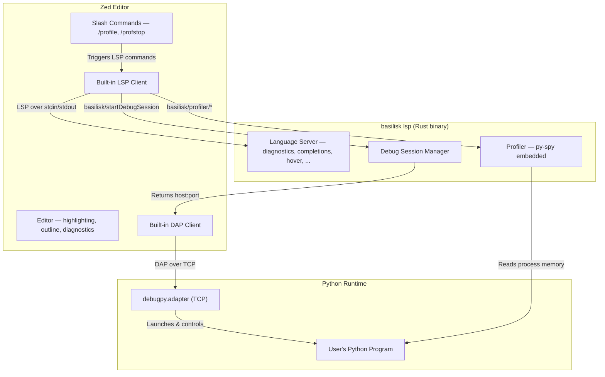

# Basilisk Zed Extension {#ZED}

Zed extension connecting to the same `basilisk lsp` binary as the VS Code and Neovim extensions. All LSP features, DAP integration, custom commands, configuration, and binary resolution live in **[LSP-ARCHITECTURE-SPEC.md](LSP-ARCHITECTURE-SPEC.md)** (single source of truth); this spec documents only **Zed-specific details**.

Target: **wasm32 (64-bit) only**.

Reference: [Zed Extension Development](https://zed.dev/docs/extensions/developing-extensions), [Zed Python Language Support](https://zed.dev/docs/languages/python).

## Zed Extension Capabilities {#ZED-CAPS}

Zed extensions are Rust compiled to WASM with a deliberately narrow API:

| Capability | Available | Mechanism |
|---|---|---|
| LSP integration | Yes | `language_server_command()` on Extension trait |
| Tree-sitter grammars | Yes | `languages/` directory with `.scm` queries |
| DAP debugging | Yes | `get_dap_binary()` on Extension trait |
| Slash commands | Yes | `run_slash_command()` on Extension trait |
| Themes | Yes | `themes/` directory |
| Custom UI / webviews | **No** | Not supported ([zed-industries/zed#21208](https://github.com/zed-industries/zed/issues/21208)) |
| Inline decorations | **No** | Not available via extension API |
| Gutter decorations | **No** | Not available via extension API |
| Custom commands | **No** | Only slash commands in AI context |
| Status bar items | **No** | Not available |
| Custom settings schema | **No** | Read-only access to Zed settings |
| File watchers | **No** | Not available |
| Terminal control | **No** | Not available |

All intelligence flows through LSP and DAP — no client-side tricks. See [LSPARCH-CMDREG](LSP-ARCHITECTURE-SPEC.md#LSPARCH-CMDREG): the server advertises all commands, clients never pre-register them.

## Architecture {#ZED-ARCH}



## Extension Structure {#ZED-STRUCTURE}

```
basilisk-zed/
  extension.toml
  Cargo.toml
  src/lib.rs
  languages/
    python/
      config.toml
      highlights.scm        # tree-sitter-python queries
      brackets.scm
      outline.scm
      indents.scm
      injections.scm
      textobjects.scm
      runnables.scm
  debug_adapter_schemas/
    basilisk-debug.json
```

### `extension.toml` {#ZED-EXTTOML}

```toml
id = "basilisk"
name = "Basilisk"
version = "0.1.0"
schema_version = 1
authors = ["Basilisk Contributors"]
description = "Strict-by-default Python type checker with debugging and profiling"
repository = "https://github.com/Nimblesite/Basilisk"

# No [grammars.python] block — reuses Zed's built-in tree-sitter-python grammar. See [ZED-GRAMMAR].

[language_servers.basilisk]
name = "Basilisk"
languages = ["Python"]

[language_servers.basilisk.language_ids]
"Python" = "python"

[debug_adapters.basilisk-debug]
schema_path = "debug_adapter_schemas/basilisk-debug.json"
```

### `Cargo.toml` {#ZED-CARGOTOML}

```toml
[package]
name = "basilisk-zed"
version = "0.1.0"
edition = "2021"

[lib]
crate-type = ["cdylib"]

[dependencies]
zed_extension_api = "0.7.0"
```

### `src/lib.rs` {#ZED-LIBRS}

```rust
use zed_extension_api::{self as zed, Result};

struct BasiliskExtension;

impl zed::Extension for BasiliskExtension {
    fn language_server_command(
        &mut self,
        language_server_id: &zed::LanguageServerId,
        worktree: &zed::Worktree,
    ) -> Result<zed::Command> {
        // 1. Check for user-configured path in Zed settings
        // 2. Try well-known locations (~/.cargo/bin/basilisk, /usr/local/bin/basilisk, etc.)
        // 3. Download from GitHub release if not found
        let binary_path = self.resolve_binary(worktree)?;

        Ok(zed::Command {
            command: binary_path,
            args: vec!["lsp".into()],
            env: Default::default(),
        })
    }

    fn language_server_initialization_options(
        &mut self,
        _language_server_id: &zed::LanguageServerId,
        worktree: &zed::Worktree,
    ) -> Result<Option<zed::serde_json::Value>> {
        // Pass workspace root so LSP can find .venv, pyproject.toml, etc.
        Ok(Some(zed::serde_json::json!({
            "workspaceRoot": worktree.root_path(),
        })))
    }

    fn language_server_workspace_configuration(
        &mut self,
        _language_server_id: &zed::LanguageServerId,
        _worktree: &zed::Worktree,
    ) -> Result<Option<zed::serde_json::Value>> {
        // Read Zed settings and map to Basilisk config
        Ok(Some(zed::serde_json::json!({
            "basilisk": {
                "inlayHints": {
                    "parameterNames": true,
                    "variableTypes": true
                },
                // Formatter engine: "ruff" (Ruff formatter embedded in the
                // Basilisk binary, in-process — no external ruff binary) or
                // "none". [LSPFMT-CONFIG]
                "formatter": "ruff"
            }
        })))
    }

    fn get_dap_binary(
        &mut self,
        config: zed::DebugConfig,
    ) -> Result<zed::DebugAdapterBinary> {
        // Debug sessions use the same basilisk binary
        // The LSP spawns debugpy; the DAP client connects to it
        let binary_path = self.resolve_binary_from_config(&config)?;

        Ok(zed::DebugAdapterBinary {
            command: binary_path,
            args: vec!["debug-adapter".into()],
            envs: Default::default(),
            cwd: config.cwd.clone(),
            connection: None,
        })
    }

    fn run_slash_command(
        &mut self,
        command: zed::SlashCommand,
        args: Vec<String>,
        worktree: Option<&zed::Worktree>,
    ) -> Result<zed::SlashCommandOutput> {
        match command.name.as_str() {
            "profile" => self.handle_profile_command(args, worktree),
            "profstop" => self.handle_profstop_command(worktree),
            _ => Err("Unknown command".into()),
        }
    }
}

zed::register_extension!(BasiliskExtension);
```

## Features {#ZED-FEATURES}

### Language Intelligence {#ZED-LSP}

> All 21 LSP features ([LSP-ARCHITECTURE-SPEC.md §LSPARCH-FEATURES](LSP-ARCHITECTURE-SPEC.md#LSPARCH-FEATURES)) are native via Zed's built-in LSP client — zero extension work.

Semantic tokens require `"semantic_tokens": "combined"` in Zed settings.

### Debugging {#ZED-DAP}

> See [LSP-ARCHITECTURE-SPEC.md §LSPARCH-CMDS](LSP-ARCHITECTURE-SPEC.md#LSPARCH-CMDS) for `basilisk/startDebugSession` and [§LSPARCH-DAPPROXY](LSP-ARCHITECTURE-SPEC.md#LSPARCH-DAPPROXY) for the shared proxy.

Zed has native DAP. Debug flow:

1. User triggers debug (F5 or debug button).
2. `get_dap_binary()` returns the basilisk binary.
3. Basilisk spawns debugpy on a free TCP port via `basilisk/startDebugSession`.
4. Zed's DAP client connects directly to debugpy over TCP.
5. Full debugging: breakpoints, stepping, variables, call stack, watch expressions.

`debug_adapter_schemas/basilisk-debug.json` defines the Zed launch/attach config:

```json
{
  "$schema": "http://json-schema.org/draft-07/schema#",
  "type": "object",
  "properties": {
    "program": { "type": "string", "description": "Python file to debug" },
    "args": { "type": "array", "items": { "type": "string" } },
    "cwd": { "type": "string" },
    "python": { "type": "string", "description": "Python interpreter path" },
    "justMyCode": { "type": "boolean", "default": true },
    "stopOnEntry": { "type": "boolean", "default": false },
    "console": {
      "type": "string",
      "enum": ["integratedTerminal", "internalConsole"],
      "default": "integratedTerminal"
    }
  },
  "required": ["program"]
}
```

### Profiling {#ZED-PROFILE}

> See [LSP-ARCHITECTURE-SPEC.md §LSPARCH-CMDS](LSP-ARCHITECTURE-SPEC.md#LSPARCH-CMDS) for the shared profiling and memory commands.

Zed has no webviews, so visualization differs from VS Code:

| Visualization | VS Code | Zed |
|---|---|---|
| Flamegraph | Webview panel | External browser (speedscope.app) |
| Inline heat map | Text decorations API | LSP diagnostics with severity hints |
| Hot function list | TreeView panel | Slash command output in AI panel |
| Live updates | Custom notifications | LSP diagnostics refresh |

Three mechanisms:

1. **LSP Diagnostics** — hotspot diagnostics (hint severity) with per-line timing.
2. **Slash Commands** — `/profile` and `/profstop` via the AI assistant panel.
3. **External Viewer** — LSP generates speedscope JSON and opens it in the browser.

### Tree-sitter Queries {#ZED-TREESITTER}

The extension ships tree-sitter-python queries:

- **highlights.scm** — syntax highlighting (keywords, builtins, decorators, f-strings, type annotations)
- **brackets.scm** — `()`, `[]`, `{}`, string quotes
- **outline.scm** — functions, classes, methods for the outline panel
- **indents.scm** — indentation-based structure
- **injections.scm** — SQL in strings, regex, docstring formatting
- **textobjects.scm** — Vim motions for functions, classes, arguments, comments
- **runnables.scm** — detect `if __name__ == "__main__"` and pytest functions for run buttons

Zed already ships built-in Python support; these queries augment it (or the extension can rely on the built-in queries entirely and provide only LSP/DAP).

### Grammar Reuse {#ZED-GRAMMAR}

`extension.toml` omits `[grammars.python]`; `languages/python/config.toml` declares `grammar = "python"`, which Zed resolves to its **built-in** tree-sitter-python grammar that the query files above augment.

Bundling `[grammars.python]` would force Zed to compile the grammar from source on install, requiring the multi-hundred-megabyte [`wasi-sdk`](https://github.com/WebAssembly/wasi-sdk/releases) toolchain — an extraction that can fail on a constrained disk (`No space left on device`) and surface as the misleading `failed to compile grammar 'python'`. Reusing the built-in grammar removes the compile step. Implemented in `basilisk-zed/extension.toml` (absence of `[grammars.*]`).

## Binary Distribution {#ZED-DIST}

Installing the extension is enough — no separate binary install. Per the Shipwright contract, the binary ships with every release (`.github/workflows/release.yml`); the extension downloads the matching asset on first activation, caches it in its data directory, and reuses it until a newer release appears. There is **no filesystem default** (no `~/.cargo/bin`, no PATH guess) — a missing override means "download", never "guess".

Resolution order (`basilisk-zed/src/lib.rs::resolve_binary`):

```rust
fn resolve_binary(&mut self, worktree: &zed::Worktree) -> Result<String> {
    // 1. Explicit override — `binary.path` in the Zed LSP settings
    // 2. Explicit override — the `BASILISK_PATH` environment variable
    // 3. Default — download the matching binary from the latest GitHub release
    let release = zed::latest_github_release(
        release::GITHUB_REPO, // "Nimblesite/Basilisk" — see basilisk_common::release
        zed::GithubReleaseOptions {
            require_assets: true,
            pre_release: false,
        },
    )?;
    // asset_name() / is_zip_archive() / extracted_binary_path() pick the asset,
    // archive kind, and in-archive path — one source of truth shared with release.yml.
}
```

The two overrides exist only for development (locally built binary) and for a system install (Homebrew/Scoop); never required for a normal install.

Target assets (must match `release.yml` — see `basilisk_common::release::asset_name`):
- `basilisk-aarch64-apple-darwin.zip` — macOS **zip** (`ditto`), nested under `basilisk-darwin/`, carrying `basilisk` and `basilisk-profiler-helper`
- `basilisk-x86_64-unknown-linux-gnu.tar.gz`
- `basilisk-aarch64-unknown-linux-gnu.tar.gz`
- `basilisk-x86_64-pc-windows-msvc.zip`
- `basilisk-aarch64-pc-windows-msvc.zip`

Archive kind and in-archive binary path are platform-specific (macOS zip nested; Linux `tar.gz` and Windows zip flat), derived from `basilisk_common::release::{is_zip_archive, extracted_binary_path}` so the downloader cannot drift from the release pipeline.

## Registry Publishing {#ZED-MIRROR}

Zed has no upload API. Extensions are listed in [`zed-industries/extensions`](https://github.com/zed-industries/extensions) as **git submodules**; that repo's CI compiles each to WASM from the pinned commit and publishes on merge. Two properties of the in-repo `basilisk-zed/` crate make it unpublishable as-is, so the release pipeline renders a self-contained mirror:

1. **Placeholder version.** Every monorepo commit carries `0.0.0-PLACEHOLDER` in `Cargo.toml` + `extension.toml`; real versions are stamped only in CI (see [ZED-CARGOTOML](#ZED-CARGOTOML)). The registry pins a commit, so it cannot point at `main`.
2. **Workspace path dependency.** The crate depends on `basilisk-common` via `{ path = "../crates/basilisk-common" }`, which does not resolve when the registry builds the submodule standalone.

`scripts/render-zed-mirror.sh` resolves both: vendors `basilisk-common` (zero-dependency, WASM-safe) under `vendor/basilisk-common`, rewrites the path dependency, stamps the release version, makes the mirror its own workspace root, and drops the workspace-only `[lints]` inheritance. The `publish-zed` job in `release.yml` renders the tree, **gates the push on a real `cargo build --release --target wasm32-wasip2`**, then pushes to [`Nimblesite/basilisk-zed`](https://github.com/Nimblesite/basilisk-zed) and tags it with the monorepo tag — same clone-replace-commit-push convention as `publish-nvim`, using the `BREW_SCOOP_PAT` org secret.

The mirror version equals the monorepo tag (`v1.2.3` → `1.2.3`); the binary [ZED-DIST](#ZED-DIST) updates independently at runtime. The first listing is a one-time human-reviewed PR adding the submodule to `zed-industries/extensions`; subsequent bumps amend that pointer.

## Zed Settings {#ZED-CONFIG}

> Shared settings are defined in [LSP-ARCHITECTURE-SPEC.md §LSPARCH-CONFIG](LSP-ARCHITECTURE-SPEC.md#LSPARCH-CONFIG); mapped into Zed's `settings.json` below.

```json
{
  "lsp": {
    "basilisk": {
      "binary": {
        "path": "/path/to/basilisk"
      },
      "initialization_options": {
        "python": "/path/to/python3"
      },
      "settings": {
        // All keys from LSP-ARCHITECTURE-SPEC.md §LSPARCH-CONFIG
        // nested under the "basilisk" key
        "inlayHints": {
          "parameterNames": true,
          "variableTypes": true
        },
        // Formatter engine: "ruff" (embedded Ruff formatter, in-process — no
        // external ruff binary) or "none". [LSPFMT-CONFIG]
        "formatter": "ruff"
      }
    }
  },
  "languages": {
    "Python": {
      "language_servers": ["basilisk", "..."],
      "semantic_tokens": "combined"
    }
  }
}
```

## Limitations {#ZED-LIMITS}

VS Code features with no Zed equivalent:

| Feature | VS Code | Zed | Workaround |
|---|---|---|---|
| Status bar diagnostics | Status bar item | Not available | Diagnostics panel shows counts |
| "Install debugpy" button | Notification action | Not available | Error message tells user to `pip install debugpy` |
| Webview flamegraph | WebviewPanel | Not available | Open speedscope in browser |
| Inline profiling heat map | TextEditorDecorationType | Not available | LSP hint diagnostics |
| Custom settings UI | contributes.configuration | Not available | Manual settings.json |
| Auto-restart on crash | Client-side logic | Not available | Zed handles LSP restart natively |

The LSP produces all underlying data; only visualization differs.

## Shared Code Budget {#ZED-SHARED}

| Component | Shared? | Where It Lives |
|---|---|---|
| Type checker | 100% shared | `basilisk-checker` crate |
| LSP server | 100% shared | `basilisk-lsp` crate |
| Debug session manager | 100% shared | `basilisk-lsp/src/debug.rs` |
| Profiler engine | 100% shared | `basilisk-lsp/src/profiler.rs` |
| Speedscope export | 100% shared | `basilisk-lsp/src/profiler.rs` |
| Binary resolution | Per-editor | `vscode-extension/src/extension.ts` / `basilisk-zed/src/lib.rs` |
| Debug config UI | Per-editor | `package.json` / `basilisk-debug.json` |
| Flamegraph rendering | Per-editor | VS Code webview / browser fallback |
| Tree-sitter queries | Zed-only | `basilisk-zed/languages/python/` |

The entire backend is shared; only thin editor-specific glue differs. Remaining cross-editor work is tracked in the [roadmap](../plans/ROADMAP-NEXT-STEPS-PLAN.md).
